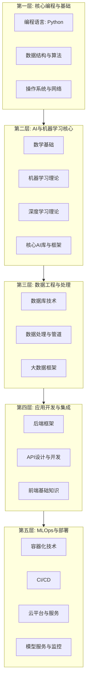

# AI应用开发岗位技术清单

**Export Time:** 2025/9/9 23:47:08
**Conversation ID:** jexzgQp2-bcJ43wLZYsDI
**Message Count:** 8
**Model:** models/gemini-2.5-pro
**Provider:** gemini

---

## 👤 用户 (2025/9/9 23:02:09)

请为我生成一份应聘AI应用开发岗位需要掌握的详细技术清单
---

## 🤖 助手 (2025/9/9 23:02:09)

### 🤔 思考过程

```
**Refining User Intent**

I'm focusing on "AI Application Developer" as the core of the user's request. This suggests a need for technologies and skills specific to building AI-powered applications. I'm starting to deconstruct the role's requirements to guide the tech stack list.


**Outlining Core Competencies**

I've been thinking about the core competencies needed. Besides the fundamental programming skills, the AI/ML section has emerged as a key area. I'm focusing on breaking down the AI toolkit to be specific, not just general terms. The application part requires DevOps, MLOps, and relevant soft skills.


**Expanding Key Areas**

I'm now focusing on fleshing out each section of the checklist. The goal is to be specific. My current focus is "AI/ML Fundamentals." I'm identifying core concepts: supervised, unsupervised, and reinforcement learning. I'm moving toward the "AI Toolkit" and considering libraries like TensorFlow and PyTorch. Breaking down the core programming skills, I've got Python and its libraries. Next up is "Data Engineering."


**Defining Core AI Knowledge**

I'm now thinking specifically about *neural networks* within the AI/ML section. Delving deeper into core concepts, I'm noting the importance of supervised, unsupervised, and reinforcement learning. I'm focusing on providing context by including a range of commonly used algorithms and their uses. Deep Learning will require its own section.


**Deepening Core Concepts**

I'm now thinking specifically about how the theory relates to practice. I'm expanding on the sections I started with, and diving deeper. For Python, I'm noting specific libraries like NumPy, Pandas, and Matplotlib. I'm focusing on the integration of AI/ML concepts with building user-facing features. I'm also planning a section on evaluating models.


**Deepening Practical Skills**

I'm now integrating how the theory works in the real world. I'm expanding each section with more specific examples. Within the AI Toolkit, I'm noting key tools and libraries within TensorFlow and PyTorch for model building, training, and deployment. The section on model evaluation is growing to include metrics and strategies for preventing overfitting. I'm focusing on key libraries.


**Defining Key Technologies**

I'm now integrating the user's request with the proposed checklist structure. I'm noting specific Python libraries: NumPy, Pandas, Matplotlib, Scikit-learn, TensorFlow, and PyTorch. I'm focusing on "application development," breaking it down into web frameworks, APIs, and front-end interaction. I'm aiming to provide more specific examples.


**Expanding Core Concepts**

I'm now integrating the user's request with a solid checklist structure. I'm noting specific Python libraries: NumPy, Pandas, Matplotlib, Scikit-learn, TensorFlow, and PyTorch. I'm focusing on "application development," breaking it down into web frameworks, APIs, and front-end interaction. I'm aiming to provide more specific examples to illustrate the use of these technologies.


**Organizing Core Sections**

I'm now thinking about how to best organize the structure. I'm focusing on creating logical sections to categorize key technologies and concepts. My current goal is a comprehensive, well-organized guide. Each section requires a succinct title, and I will be working on a flowchart.


```

好的，作为一名高级软件工程师，我非常乐意为你梳理一份详尽的、针对**AI应用开发岗位**的技术清单。

这份清单会遵循“finish step by step”的原则，从最基础的编程能力到专业的AI理论，再到将AI模型落地为实际应用的工程能力，层层递进。这不仅仅是一个技能列表，更是一个可行的学习和准备路径。

### AI应用开发技术栈总览

首先，我们要明白“AI应用开发”这个角色的核心职责：**他不仅仅是算法工程师，更是将AI模型（无论是自研还是第三方API）集成到软件产品中，并确保其稳定、高效运行的软件工程师。** 因此，技术栈要求是“软件工程”+“AI知识”的结合体。

下面是技术栈的架构图，让你有一个整体的认识：



---

### Step 1: 核心编程与计算机基础 (The Foundation)

这是成为一名合格软件工程师的基石，无论是否从事AI方向。

*   **1.1 编程语言：精通 Python**
    *   **核心语法与特性**: 熟练掌握Python的函数、类、装饰器、生成器、多线程/多进程等。
    *   **面向对象编程 (OOP)**: 深刻理解封装、继承、多态。
    *   **数据结构**: 精通列表(list)、字典(dict)、集合(set)、元组(tuple)及其高效用法。
    *   **包管理**: 熟练使用 `pip` 和 `conda`，理解 `requirements.txt` 和 `environment.yml`。
    *   **编码规范**: 遵循 PEP 8 规范，编写可读性高、易于维护的代码。

*   **1.2 数据结构与算法**
    *   **常用数据结构**: 数组、链表、栈、队列、哈希表、树（二叉树、平衡树）、图。
    *   **核心算法**: 排序（快排、归并）、搜索（二分查找、DFS、BFS）、动态规划、贪心算法。
    *   **复杂度分析**: 能够准确分析算法的时间复杂度和空间复杂度（Big O notation）。

*   **1.3 计算机基础**
    *   **操作系统**: 理解进程、线程、内存管理、文件系统等基本概念。熟悉Linux/Unix命令行操作。
    *   **计算机网络**: 理解TCP/IP协议栈，HTTP/HTTPS协议，了解WebSocket。知道RESTful API的基本原理。
    *   **版本控制**: 精通 Git，熟练使用 GitHub/GitLab 进行团队协作。

### Step 2: AI与机器学习核心 (The Core AI Skills)

这是AI应用开发者的专业领域知识。

*   **2.1 数学基础 (理解即可，不要求推导)**
    *   **线性代数**: 向量、矩阵、张量、矩阵运算、特征值/特征向量。
    *   **微积分**: 导数、偏导数、梯度、链式法则。
    *   **概率论与统计**: 概率分布、条件概率、贝叶斯定理、期望、方差。

*   **2.2 经典机器学习理论**
    *   **监督学习**: 线性回归、逻辑回归、支持向量机(SVM)、决策树、随机森林、梯度提升树(GBDT, XGBoost)。
    *   **无监督学习**: K-Means聚类、PCA主成分分析。
    *   **模型评估**: 了解准确率、精确率、召回率、F1分数、ROC曲线、AUC等评估指标，理解过拟合与欠拟合。

*   **2.3 深度学习理论**
    *   **神经网络基础**: 神经元、激活函数(Sigmoid, ReLU)、损失函数、反向传播、梯度下降。
    *   **核心网络架构**:
        *   **CNN (卷积神经网络)**: 主要用于图像识别、目标检测。
        *   **RNN (循环神经网络) / LSTM / GRU**: 主要用于序列数据，如文本、时间序列。
        *   **Transformer**: 当前NLP领域（及CV领域）的绝对核心，必须深刻理解其自注意力机制。

*   **2.4 核心AI库与框架**
    *   **数据科学三件套**:
        *   `NumPy`: 用于科学计算，尤其是多维数组操作。
        *   `Pandas`: 用于数据处理和分析，核心是DataFrame。
        *   `Matplotlib` / `Seaborn`: 用于数据可视化。
    *   **机器学习框架**:
        *   `Scikit-learn`: 用于实现经典的机器学习算法，数据预处理和模型评估。
    *   **深度学习框架 (至少精通一个)**:
        *   `PyTorch`: 目前在学术界和工业界都非常流行，语法灵活。
        *   `TensorFlow`: Google出品，生态完善，部署工具强大。
    *   **NLP/LLM 生态**:
        *   `Hugging Face Transformers`: 提供海量预训练模型（如BERT, GPT系列）和便捷的调用接口。
        *   `LangChain` / `LlamaIndex`: 用于构建基于大语言模型（LLM）的应用，尤其是RAG（检索增强生成）应用。
    *   **计算机视觉库**:
        *   `OpenCV`: 图像处理和计算机视觉任务的事实标准。

### Step 3: 数据工程与处理 (Handling the Fuel)

AI模型的燃料是数据，处理数据的能力至关重要。

*   **3.1 数据库技术**
    *   **关系型数据库 (SQL)**: 至少精通一种，如 `PostgreSQL` 或 `MySQL`，熟练编写复杂的SQL查询。
    *   **NoSQL数据库**: 了解至少一种，如 `MongoDB` (文档型)、`Redis` (键值型)。
    *   **向量数据库**: 在LLM应用中至关重要，了解 `Milvus`, `Pinecone`, `ChromaDB` 等，并理解其在相似性搜索中的作用。

*   **3.2 大数据与流处理**
    *   **大数据框架**: 了解 `Apache Spark` 的基本原理和使用，特别是`PySpark`。
    *   **数据管道工具**: 了解 `Apache Airflow` 等工具如何用于构建和调度ETL/ELT流程。

### Step 4: 应用开发与集成 (Building the Vehicle)

将AI能力封装成服务，供用户或其他系统调用。

*   **4.1 后端框架 (至少精通一个)**
    *   `FastAPI`: 现代化、高性能的Python Web框架，非常适合构建AI服务的API，自带文档，支持异步。**（强烈推荐）**
    *   `Flask`: 轻量级、灵活，上手快，适合快速搭建小型服务。
    *   `Django`: 功能全面的大型框架，适合构建复杂的Web应用。

*   **4.2 API 设计与开发**
    *   **RESTful API**: 设计清晰、规范的API接口。
    *   **API 文档**: 使用 `Swagger/OpenAPI` 自动生成和维护API文档。
    *   **身份验证与授权**: 了解 `OAuth2`, `JWT` 等认证机制。

*   **4.3 前端基础知识 (了解即可)**
    *   了解 `HTML`, `CSS`, `JavaScript` 的基本工作原理。
    *   了解 `React`, `Vue` 等现代前端框架如何与后端API进行交互。

### Step 5: MLOps 与部署 (Hitting the Road)

将开发好的AI应用部署到生产环境，并持续维护。

*   **5.1 容器化与编排**
    *   `Docker`: 必须熟练掌握，能够将Python应用和模型打包成Docker镜像。
    *   `Docker Compose`: 用于在本地编排多个容器。
    *   `Kubernetes (K8s)`: 了解其基本概念（Pod, Service, Deployment），是容器编排的事实标准。

*   **5.2 持续集成与持续部署 (CI/CD)**
    *   了解CI/CD的理念。
    *   熟练使用 `GitHub Actions` 或 `GitLab CI` 来自动化测试、构建和部署流程。

*   **5.3 云计算平台 (至少熟悉一个)**
    *   **AWS**: Amazon Web Services (EC2, S3, SageMaker, Lambda)
    *   **Azure**: Microsoft Azure (Virtual Machines, Blob Storage, Azure Machine Learning)
    *   **GCP**: Google Cloud Platform (Compute Engine, Cloud Storage, Vertex AI)
    *   需要掌握如何在云平台上部署容器化应用，使用对象存储，并了解其提供的AI/ML服务。

*   **5.4 模型服务与监控**
    *   **模型服务工具**: 了解 `NVIDIA Triton Inference Server`, `BentoML` 等专门用于高性能模型推理的工具。
    *   **监控与日志**: 学习使用 `Prometheus`, `Grafana` 进行服务性能监控，使用 `ELK Stack` (Elasticsearch, Logstash, Kibana) 或类似方案进行日志管理。

### 总结与建议

*   **不要被清单吓到**：没有人能精通所有这些技术。这份清单是一个全面的“地图”，你应该根据目标岗位的具体要求，有选择地深入学习。
*   **T型人才模型**：广度上，你应该对整个技术栈都有所了解；深度上，选择1-2个领域作为你的核心专长（例如，可以是“基于LLM的应用开发”或“计算机视觉模型的服务化部署”）。
*   **实践是关键**：动手做项目！尝试复现一篇论文，或者用开源模型构建一个有趣的Web应用。从数据处理到模型训练，再到API开发和Docker部署，完整地走一遍流程。
*   **持续学习**：AI领域日新月异，保持对新技术（如新的模型架构、新的开发框架）的好奇心和学习能力至关重要。

祝你求职顺利！

---

## 👤 用户 (2025/9/9 23:09:06)

请从零逐步指导我学习和掌握PyTorch
---

## 🤖 助手 (2025/9/9 23:09:06)

### 🤔 思考过程

```
**Formulating the Outline**

I'm currently fleshing out the structure of this PyTorch guide. I've considered the user's specific request for a step-by-step approach catering to a senior software engineer. My focus now is on creating a logical flow, starting with the very basics and moving towards practical applications. I'm aiming for a structure that is both comprehensive and easy to navigate for someone with experience in software engineering.


**Developing the Framework**

I've been examining the user's request, focusing on the "step-by-step" and "senior software engineer" aspects. My current approach involves a structured progression through core PyTorch concepts. The learning path is taking shape: environment setup, core concepts (tensors, autograd), building neural networks (nn.Module, layers), training loops, and finally, advanced applications.


**Mapping the Structure**

I've been refining the structure of the guide to cater to a senior software engineer. The addition of preparation and concrete projects ensures actionable steps. Now, I'm integrating environment setup details, Anaconda/Miniconda recommendations, and exact commands for clarity. This ensures a comprehensive foundation and caters to a 'do it' approach, starting with the very basics.


**Expanding the Scope**

I've incorporated detailed, actionable steps in the environmental setup phase, including `conda` commands and pointing the user to the PyTorch website for hardware-specific installation instructions. My thought process now emphasizes providing practical, hands-on instructions for the senior software engineer. I'm focusing on "show, don't tell," using code snippets and clear explanations.


**Outlining the Structure**

My current focus is on translating the user's request into a structured learning path. I'm prioritizing clarity and directness, given the target audience's software engineering background. The plan now incorporates distinct phases: Preparation, Core Concepts, Building Neural Networks, Training Loops, Advanced Skills, and Real-World Projects. This sequential approach ensures a logical and progressive learning experience, moving from fundamentals to practical application.


**Defining the Learning Flow**

I'm now integrating the user's need for actionable steps into my outline. The structure is taking shape, with actionable commands and practical examples throughout the guide. I'll include setup tips and commands, focusing on practical implementation for a senior software engineer. I'll provide a solid foundation.


**Developing a Comprehensive Guide**

I'm now in the process of translating the raw notes into a complete guide, with code examples. My focus is on concise explanations, direct commands, and practical applications that a senior software engineer can immediately grasp and use.


**Crafting a Detailed Guide**

I've been meticulously organizing the information into a comprehensive guide, ensuring it's clear and practical for senior software engineers. I'll focus on the user's need for actionable commands, and will incorporate code examples and clear explanations. My guide will include detailed steps for the whole process.


**Defining the Guide's Structure**

I'm presently arranging the structure of this guide to fit the user's needs. The framework emphasizes a step-by-step approach for a senior software engineer. The outline progresses from fundamental concepts to practical applications, focusing on actionable steps. This strategy ensures comprehensive and easy-to-understand guidance.


```

太棒了！从零开始学习并掌握PyTorch是一个非常明智的选择，它是目前最主流、最灵活的深度学习框架之一。

作为你的技术伙伴，我将为你设计一个“finish step by step”的学习路线。这条路线会从最基础的概念开始，每一步都包含**核心理念**、**关键代码**和**实践目标**，确保你不仅能看懂，更能动手实现。

### PyTorch学习路线图

首先，我们用一个流程图来概览整个学习路径：

```mermaid
graph TD
    subgraph "阶段一: 基础入门"
        A[Step 0: 环境搭建与配置] --> B[Step 1: 核心数据结构 - 张量 (Tensor)]
        B --> C[Step 2: 核心引擎 - 自动求导 (Autograd)]
    end

    subgraph "阶段二: 构建神经网络"
        C --> D[Step 3: 神经网络的基石 - nn.Module]
        D --> E[Step 4: 定义网络层与激活函数]
        E --> F[Step 5: 定义损失函数与优化器]
    end

    subgraph "阶段三: 完整训练与实践"
        F --> G[Step 6: 数据处理 - Dataset & DataLoader]
        G --> H[Step 7: 编写完整的训练循环]
        H --> I[Step 8: GPU加速与模型保存/加载]
    end

    subgraph "阶段四: 进阶与应用"
        I --> J[Step 9: 迁移学习 - 使用预训练模型]
        J --> K[Step 10: 项目实战]
    end
```

---

### Step 0: 环境搭建与配置

**目标**: 创建一个独立的、可复现的Python环境，并安装PyTorch。

**理念**: 专业的开发始于规范的环境管理。使用虚拟环境（如conda）可以避免不同项目间的包冲突。

**操作步骤**:

1.  **安装Miniconda**: 如果你没有安装Anaconda或Miniconda，请先安装它。它是一个轻量级的包和环境管理器。

2.  **创建新的conda环境**:
    ```powershell
    # 创建一个名为 "pytorch_env" 的Python 3.10 环境
    conda create --name pytorch_env python=3.10

    # 激活这个环境
    conda activate pytorch_env
    ```

3.  **安装PyTorch**: **不要**直接 `pip install torch`！最可靠的方式是访问 [PyTorch官网](https://pytorch.org/get-started/locally/)。官网会根据你的操作系统、包管理器和GPU情况（是否有NVIDIA显卡，CUDA版本）生成最适合你的安装命令。

    例如，对于Windows，使用Pip，拥有NVIDIA显卡（CUDA 12.1）的安装命令通常是：
    ```powershell
    pip3 install torch torchvision torchaudio --index-url https://download.pytorch.org/whl/cu121
    ```
    如果只有CPU，命令会是：
    ```powershell
    pip3 install torch torchvision torchaudio
    ```

4.  **验证安装**:
    ```python
    # a_verify_install.py

    import torch

    # 打印PyTorch版本
    print(f"PyTorch Version: {torch.__version__}")

    # 检查GPU是否可用
    is_cuda_available = torch.cuda.is_available()
    print(f"CUDA (GPU) Available: {is_cuda_available}")

    if is_cuda_available:
        # 打印GPU数量
        print(f"Number of GPUs: {torch.cuda.device_count()}")
        # 打印当前GPU设备名称
        print(f"Current GPU Name: {torch.cuda.get_device_name(0)}")
    ```
    在PowerShell中运行 `python a_verify_install.py`，如果能正确输出版本号，说明安装成功。

### Step 1: 核心数据结构 - 张量 (Tensor)

**目标**: 理解Tensor，并熟练进行创建和操作。

**理念**: Tensor是PyTorch中的基本数据单元，类似NumPy的`ndarray`，但增加了GPU加速和自动求导功能。所有的数据和模型参数都以Tensor的形式存在。

**关键代码**:
```python
# b_tensors_demo.py

import torch
import numpy as np

# 1. 创建Tensor
# 从列表创建
data = [[1, 2], [3, 4]]
x_data = torch.tensor(data)
print(f"Tensor from list:\n {x_data}\n")

# 从NumPy数组创建 (共享内存)
np_array = np.array(data)
x_np = torch.from_numpy(np_array)
print(f"Tensor from NumPy:\n {x_np}\n")

# 创建指定形状的全1或随机Tensor
shape = (2, 3,)
ones_tensor = torch.ones(shape)
rand_tensor = torch.rand(shape)
print(f"Ones Tensor:\n {ones_tensor}\n")
print(f"Random Tensor:\n {rand_tensor}\n")

# 2. Tensor的属性
tensor = torch.rand(3, 4)
print(f"Shape of tensor: {tensor.shape}")
print(f"Datatype of tensor: {tensor.dtype}")
print(f"Device tensor is stored on: {tensor.device}\n")

# 3. Tensor操作 (类似NumPy)
# 索引和切片
tensor = torch.ones(4, 4)
tensor[:, 1] = 0 # 将第二列全部置为0
print(f"Sliced Tensor:\n {tensor}\n")

# 矩阵乘法
mat_mul = tensor.matmul(tensor.T) # .T 是转置
print(f"Matrix Multiplication:\n {mat_mul}\n")

# 元素级乘法
elem_mul = tensor.mul(tensor)
# 或者 torch.mul(tensor, tensor)
print(f"Element-wise Multiplication:\n {elem_mul}\n")

# Tensor与标量的运算
added_tensor = tensor.add(5)
print(f"Tensor after adding 5:\n {added_tensor}\n")
```

### Step 2: 核心引擎 - 自动求导 (Autograd)

**目标**: 理解PyTorch如何自动计算梯度，这是训练神经网络的核心。

**理念**: PyTorch会记录在Tensor上的所有操作，形成一个动态计算图。当你对一个标量（通常是损失函数的结果）调用`.backward()`时，PyTorch会沿着这个图反向传播，自动计算出图中每个参数（设置了`requires_grad=True`的Tensor）的梯度。

**关键代码**:
```python
# c_autograd_demo.py

import torch

# 创建一个需要梯度的Tensor，这是模型参数的模拟
# requires_grad=True 告诉PyTorch需要追踪对该Tensor的所有操作
w = torch.tensor(2.0, requires_grad=True)
b = torch.tensor(1.0, requires_grad=True)

# 定义一个简单的线性模型
x = torch.tensor(3.0)
y = w * x + b  # y = 2*3 + 1 = 7

# 假设我们有一个目标值
target = torch.tensor(10.0)

# 计算损失 (这里用简单的平方差)
loss = (target - y)**2 # loss = (10 - 7)^2 = 9

# 执行反向传播，计算梯度
# loss是一个标量，所以可以直接调用.backward()
loss.backward()

# 打印梯度
# d(loss)/dw = d((10 - (w*x+b))^2)/dw = 2 * (10 - (w*x+b)) * (-x) = 2 * 3 * (-3) = -18
print(f"Gradient of w (dw): {w.grad}")

# d(loss)/db = d((10 - (w*x+b))^2)/db = 2 * (10 - (w*x+b)) * (-1) = 2 * 3 * (-1) = -6
print(f"Gradient of b (db): {b.grad}")
```

### Step 3: 神经网络的基石 - `nn.Module`

**目标**: 学习如何使用`nn.Module`来组织和封装自己的神经网络。

**理念**: `torch.nn`是PyTorch专门为神经网络设计的模块。`nn.Module`是所有神经网络模型的基类。我们通过继承它来构建自己的网络。约定俗成的，我们在`__init__`方法中定义网络的层，在`forward`方法中定义数据如何流经这些层。

**关键代码**:
```python
# d_nn_module_demo.py

import torch
from torch import nn

# 定义一个简单的全连接神经网络
class SimpleNet(nn.Module):
    def __init__(self):
        # 必须先调用父类的__init__方法
        super().__init__()
        
        # 定义网络的层次结构
        # nn.Linear(input_features, output_features) 定义一个全连接层
        self.layer1 = nn.Linear(10, 32) # 输入10个特征，输出32个特征
        self.activation1 = nn.ReLU()   # ReLU激活函数
        self.layer2 = nn.Linear(32, 1) # 输入32个特征，输出1个特征 (例如，回归任务)

    def forward(self, x):
        # 定义数据的前向传播路径
        x = self.layer1(x)
        x = self.activation1(x)
        x = self.layer2(x)
        return x

# 实例化模型
model = SimpleNet()
print(model)

# 创建一个假的输入数据 (batch_size=5, features=10)
dummy_input = torch.randn(5, 10)

# 将数据传入模型，得到输出
output = model(dummy_input)

print(f"\nInput shape: {dummy_input.shape}")
print(f"Output shape: {output.shape}")
```

**恭喜你！** 到这里，你已经掌握了PyTorch最核心的三个概念：**Tensor**、**Autograd**和**nn.Module**。有了这些基础，接下来的步骤就是将它们组合起来，完成一个真正的训练任务。

请先消化和练习以上内容。当你准备好后，我们再继续**Step 4-10**，涵盖损失函数、优化器、数据加载、完整训练循环以及项目实战。

---

## 👤 用户 (2025/9/9 23:19:16)

开始下一步讲解，注意使用google的colab作为编码环境
---

## 🤖 助手 (2025/9/9 23:19:16)

### 🤔 思考过程

```
**Proceeding with Colab**

I've acknowledged the user's intent to move forward with the PyTorch tutorial using Google Colab. Currently, the thought process centers around confirming the user's setup and readiness to proceed with the next steps. I am confident that the user is prepared for the following tutorial stage.


**Focusing on Tutorial Structure**

I'm now zeroing in on the tutorial's structure for the next steps, especially how to present it within Google Colab. I intend to group steps 4-7 (Layers, Loss/Optimizer, Data, Training Loop) into a core "training process" block. Step 8 (GPU/Saving) is the practical consideration. I'll emphasize Colab-specific aspects, like enabling GPU usage, presenting self-contained code cells, and navigating the temporary file system.


**Revising Code Structure**

I'm now revising the code structure. Considering the structure of the training process, I've decided to streamline my approach to the key concepts. Specifically, I'm integrating Steps 4-7 into the "training loop" block, with a focus on defining network layers, loss functions, optimizers, and the actual training loop itself. Step 8 will stand separately as a practical consideration, encompassing GPU usage and model saving.


**Streamlining the Core Steps**

Now, I'm focusing on crafting a concise and impactful presentation of the core training components: Layers, Loss/Optimizer, and the actual Training Loop. These are now condensed into a cohesive, runnable code block. I'm keen to make the user understand the interdependencies of these steps. Moreover, I plan to highlight Colab's ease of use, particularly concerning GPU access and the temporary file system.


**Combining Tutorial Steps**

I'm now integrating the data handling, loss calculation, and optimization steps into a single, cohesive training loop in the next phase. This will clarify how everything fits together. I will keep the focus on Colab-specific aspects, highlighting GPU utilization and addressing the temporary file system. I will also make clear how to save and load models, and how to access their results.


**Focusing on Core Components**

My current focus is on organizing steps 4-7, consolidating them into a coherent presentation. I'm prioritizing the presentation of the key components: Defining Network Layers & Activations, Loss Function & Optimizer, Data Handling (Dataset & DataLoader), and the essential Training Loop. My goal is to streamline the learning experience, offering a concise overview of these core components in a runnable format within a Colab environment. I'll maintain emphasis on the essential steps within the training loop.


**Organizing the Tutorial Steps**

I've outlined the tutorial structure in more detail. I'm focusing on providing practical, runnable Colab code, particularly for steps 4-7, to foster hands-on learning, while also emphasizing GPU utilization and model saving within the Colab environment. The aim is to create a seamless, interactive learning experience.


**Consolidating Training Processes**

I'm now integrating the data handling, loss calculation, and optimization components into a unified training loop. This provides a clear, runnable code block within a Colab environment. My focus now is ensuring the user's understanding of the training loop within a Colab setup. I'll include practical considerations such as saving and loading models, and how to access their results.


```

好的，我们继续！Google Colab 是一个绝佳的学习环境，因为它免费提供了GPU，并且预装了所有必需的库。

### **准备工作: 在Google Colab中设置环境**

1.  打开 [Google Colab](https://colab.research.google.com/) 并创建一个新的 Notebook。
2.  **启用GPU**: 为了加速计算，我们需要启用GPU。
    *   点击菜单栏的 `代码执行程序 (Runtime)` -> `更改运行时类型 (Change runtime type)`。
    *   在 `硬件加速器 (Hardware accelerator)` 下拉菜单中，选择 `T4 GPU`。
    *   点击 `保存 (Save)`。
3.  **验证环境**: 在第一个代码单元格中，运行我们在Step 0中用过的验证代码。你会看到Colab已经为你准备好了一切。

```python
# 在Colab单元格中运行
import torch

# 打印PyTorch版本
print(f"PyTorch Version: {torch.__version__}")

# 检查GPU是否可用
# 在Colab中，这应该是True，因为我们已经启用了GPU
is_cuda_available = torch.cuda.is_available()
print(f"CUDA (GPU) Available: {is_cuda_available}")

if is_cuda_available:
    # 打印当前GPU设备名称
    print(f"Current GPU Name: {torch.cuda.get_device_name(0)}")
```

现在，我们接着之前的步骤，开始构建一个完整的神经网络。

---

### Step 4: 定义网络层与激活函数

**目标**: 学习使用`torch.nn`中丰富的预设网络层来构建更复杂的模型。

**理念**: 除了`nn.Linear`，`torch.nn`还提供了卷积层 (`nn.Conv2d`)、循环层 (`nn.LSTM`)、Dropout层 (`nn.Dropout`) 等。`nn.Sequential` 是一个非常有用的容器，可以像管道一样将多个层按顺序打包，简化`forward`函数的书写。

**关键代码**:
我们将构建一个简单的多层感知机（MLP），用于一个回归任务。

```python
# 在Colab单元格中运行

import torch
from torch import nn

# 定义一个更结构化的神经网络
class RegressionNet(nn.Module):
    def __init__(self):
        super().__init__()
        
        # 定义网络的输入、隐藏和输出层的维度
        input_features = 10  # 假设我们的数据有10个特征
        hidden_units_1 = 64
        hidden_units_2 = 32
        output_features = 1   # 回归任务，输出1个值

        # 使用 nn.Sequential 将网络层串联起来
        # 这是一个清晰、模块化的方式来定义模型
        self.layers = nn.Sequential(
            nn.Linear(input_features, hidden_units_1),
            nn.ReLU(),  # 激活函数，引入非线性
            nn.Linear(hidden_units_1, hidden_units_2),
            nn.ReLU(),
            nn.Linear(hidden_units_2, output_features)
        )

    def forward(self, x):
        # 由于使用了nn.Sequential，forward函数变得极其简单
        return self.layers(x)

# 实例化模型
model = RegressionNet()
print("模型结构:")
print(model)

# 创建一个假的输入数据 (batch_size=5, features=10)
dummy_input = torch.randn(5, 10)

# 将数据传入模型，得到输出
output = model(dummy_input)

print(f"\n输入形状: {dummy_input.shape}")
print(f"输出形状: {output.shape}")
```

### Step 5: 定义损失函数与优化器

**目标**: 学习如何为模型选择合适的“评价标准”（损失函数）和“学习方法”（优化器）。

**理念**:
*   **损失函数 (Loss Function)**: 衡量模型预测值与真实值之间的差距。对于回归任务，常用`nn.MSELoss` (均方误差)。对于分类任务，常用`nn.CrossEntropyLoss` (交叉熵损失)。
*   **优化器 (Optimizer)**: 根据损失函数计算出的梯度来更新模型的所有参数（权重和偏置）。最常用的是`torch.optim.Adam`，它是一种自适应学习率的优化算法，通常比传统的`SGD`（随机梯度下降）效果更好、收敛更快。

**关键代码**:
```python
# 在Colab单元格中运行

# 实例化我们在Step 4中定义的模型
model = RegressionNet()

# 1. 定义损失函数
# Mean Squared Error Loss，适用于回归问题
loss_fn = nn.MSELoss()

# 2. 定义优化器
# Adam优化器是一种非常流行的选择
# 第一个参数 model.parameters() 告诉优化器需要更新哪些参数
# lr (learning_rate) 是学习率，控制每次参数更新的步长
optimizer = torch.optim.Adam(params=model.parameters(), lr=0.001)

print(f"损失函数: {loss_fn}")
print(f"优化器: {optimizer}")
```

### Step 6: 数据处理 - `Dataset` & `DataLoader`

**目标**: 学习使用PyTorch的标准工具来高效、便捷地加载和预处理数据。

**理念**:
*   **`Dataset`**: 封装了数据和标签的来源。`TensorDataset`是一个方便的类，可以直接将`torch.Tensor`包装成`Dataset`。
*   **`DataLoader`**: 从`Dataset`中自动提取小批量（mini-batch）数据，并可以进行数据打乱（shuffle），这对于训练过程的稳定性至关重要。

**关键代码**:
我们将创建一些合成数据来模拟一个真实的场景。

```python
# 在Colab单元格中运行

from torch.utils.data import TensorDataset, DataLoader

# 1. 创建合成数据
# 假设我们有1000个样本，每个样本有10个特征
num_samples = 1000
num_features = 10

# X 是我们的特征 (随机生成)
X = torch.randn(num_samples, num_features)

# y 是我们的目标值 (假设是一个简单的线性关系加上一些噪声)
true_weights = torch.tensor([0.5, -0.2, 1.5, -2.0, 0.8, -1.1, 0.3, -0.7, 1.2, -0.9])
true_bias = 2.0
y = X @ true_weights + true_bias + torch.randn(num_samples) * 0.1 # 矩阵乘法 + 偏置 + 噪声
# y需要和模型输出的形状匹配，这里模型输出是(batch_size, 1)，所以我们reshape一下
y = y.view(-1, 1)

print(f"特征数据形状: {X.shape}")
print(f"标签数据形状: {y.shape}\n")

# 2. 创建Dataset
# TensorDataset将我们的特征和标签张量打包在一起
dataset = TensorDataset(X, y)

# 3. 创建DataLoader
# BATCH_SIZE 决定了每次训练模型时使用多少个数据样本
BATCH_SIZE = 32

# shuffle=True 在每个epoch开始时都会打乱数据顺序，这对于训练非常重要
# 它可以防止模型学到数据的特定顺序
data_loader = DataLoader(dataset, batch_size=BATCH_SIZE, shuffle=True)

# 我们可以检查一下DataLoader的工作方式
# 从data_loader中取出一个批次的数据
features_batch, labels_batch = next(iter(data_loader))
print(f"从DataLoader取出的一个批次:")
print(f"  特征批次形状: {features_batch.shape}")
print(f"  标签批次形状: {labels_batch.shape}")
```

### Step 7: 编写完整的训练循环

**目标**: 将前面所有的部分（模型、损失函数、优化器、数据加载器）组合在一起，形成一个完整的训练流程。

**理念**: 训练过程是在数据集上进行多轮（epoch）迭代。在每一轮中，模型会遍历`DataLoader`提供的所有数据批次，并执行以下**“三步舞”**：
1.  **`optimizer.zero_grad()`**: 清除上一轮计算的梯度。
2.  **`loss.backward()`**: 根据当前批次的损失，计算所有参数的梯度。
3.  **`optimizer.step()`**: 使用计算出的梯度来更新参数。

**关键代码**:
```python
# 在Colab单元格中运行

# --- 准备工作 (从前面步骤复制代码) ---
# 1. 模型
model = RegressionNet()
# 2. 损失函数
loss_fn = nn.MSELoss()
# 3. 优化器
optimizer = torch.optim.Adam(model.parameters(), lr=0.001)
# 4. 数据加载器 (假设dataset和data_loader已在上一单元格创建)
# data_loader = DataLoader(dataset, batch_size=BATCH_SIZE, shuffle=True)

# --- 训练循环 ---
# epochs 是我们希望在整个数据集上训练的总轮数
epochs = 10 

print("开始训练...")

# 外层循环遍历每一轮
for epoch in range(epochs):
    # 将模型设置为训练模式
    model.train()
    
    # 内层循环遍历DataLoader中的每一个批次
    for batch, (X_batch, y_batch) in enumerate(data_loader):
        
        # 1. 前向传播：计算预测值
        y_pred = model(X_batch)
        
        # 2. 计算损失
        loss = loss_fn(y_pred, y_batch)
        
        # 3. 优化器三步舞
        # 3.1 清空梯度
        optimizer.zero_grad()
        # 3.2 反向传播：计算梯度
        loss.backward()
        # 3.3 更新权重
        optimizer.step()

    # 在每轮训练结束后，打印损失信息
    # 我们可以在评估模式下计算损失，这会关闭Dropout等层，但对于这个简单模型影响不大
    model.eval()
    with torch.no_grad(): # 在这个块中，不计算梯度，节省计算资源
        y_pred_total = model(X) # 在整个数据集上进行预测
        epoch_loss = loss_fn(y_pred_total, y)
        print(f"Epoch {epoch+1}/{epochs} | Loss: {epoch_loss.item():.4f}")

print("\n训练完成！")
```
当你运行这个单元格时，你会看到损失值（Loss）随着Epoch的增加而**显著下降**，这表明你的模型正在成功学习！

### Step 8: GPU加速与模型保存/加载

**目标**: 利用Colab的GPU资源进行加速，并学习如何保存训练好的模型以备将来使用。

**理念**:
*   **GPU加速**: PyTorch的`.to(device)`方法是实现GPU加速的关键。你需要将**模型**和**每一批数据**都移动到指定的设备（`cuda`代表GPU，`cpu`代表CPU）。
*   **模型持久化**: 保存模型的`state_dict()`（状态字典）是最佳实践。它只保存模型的参数，不保存模型结构，非常轻量和灵活。

**关键代码**:
我们将把Step 7的代码升级为GPU版本，并添加保存和加载的功能。

```python
# 在Colab单元格中运行

# 1. 设置设备
device = "cuda" if torch.cuda.is_available() else "cpu"
print(f"正在使用的设备: {device}\n")

# --- 准备工作 (GPU版本) ---
# 1. 模型
model_gpu = RegressionNet().to(device) # 将模型移动到GPU

# 2. 损失函数 (损失函数通常不需要移动)
loss_fn = nn.MSELoss()

# 3. 优化器 (优化器会自动处理参数所在的设备)
optimizer = torch.optim.Adam(model_gpu.parameters(), lr=0.001)

# 4. 数据 (对于大型数据集，在训练循环中移动数据批次是最高效的)
# X_gpu = X.to(device)
# y_gpu = y.to(device)
# dataset_gpu = TensorDataset(X_gpu, y_gpu)
# data_loader_gpu = DataLoader(dataset_gpu, batch_size=BATCH_SIZE, shuffle=True)

# --- 训练循环 (GPU版本) ---
epochs = 10 
print("开始在GPU上训练...")

for epoch in range(epochs):
    model_gpu.train()
    for X_batch, y_batch in data_loader:
        # !! 关键步骤: 将数据批次移动到GPU !!
        X_batch, y_batch = X_batch.to(device), y_batch.to(device)
        
        y_pred = model_gpu(X_batch)
        loss = loss_fn(y_pred, y_batch)
        optimizer.zero_grad()
        loss.backward()
        optimizer.step()
    
    # 打印损失
    model_gpu.eval()
    with torch.no_grad():
        # 将整个数据集移动到GPU进行评估
        epoch_loss = loss_fn(model_gpu(X.to(device)), y.to(device))
        print(f"Epoch {epoch+1}/{epochs} | Loss: {epoch_loss.item():.4f}")

print("\n训练完成！")


# --- 5. 保存和加载模型 ---

# 定义模型保存路径
MODEL_PATH = "regression_model.pth"

# 保存模型的状态字典
print(f"\n正在保存模型到: {MODEL_PATH}")
torch.save(obj=model_gpu.state_dict(), f=MODEL_PATH)

# 加载模型
# 1. 创建一个新的、未经训练的模型实例
loaded_model = RegressionNet()

# 2. 加载已保存的状态字典
# 注意：加载前，模型需要知道参数应该在哪个设备上
# 我们先加载到CPU，然后再移动到目标设备
loaded_model.load_state_dict(torch.load(f=MODEL_PATH))

# 3. 将加载的模型移动到目标设备
loaded_model.to(device)

# 4. 测试加载的模型
loaded_model.eval()
with torch.no_grad():
    # 使用加载的模型进行预测
    sample_input = torch.randn(1, 10).to(device)
    prediction = loaded_model(sample_input)
    print(f"\n使用加载的模型进行预测:")
    print(f"输入: {sample_input.cpu().numpy()}")
    print(f"预测输出: {prediction.cpu().numpy()}")
```

你已经成功地在GPU上训练了一个完整的神经网络，并学会了如何保存和加载它！这是PyTorch开发中至关重要的一步。

接下来，你可以自由地修改模型结构、调整学习率、增加epoch数量，观察训练结果的变化。当你对这个流程感到熟悉后，我们就可以进入最后的高级阶段了。

---

## 👤 用户 (2025/9/9 23:32:01)

开始下一步讲解
---

## 🤖 助手 (2025/9/9 23:32:01)

### 🤔 思考过程

```
**Considering Next Steps**

I've clarified the user's intent. "Start the next step" signifies a direct continuation. I will now integrate the concepts of "Transfer Learning" and "Project Showcase," as instructed, building upon the established context of a multi-turn dialogue. The plan is to seamlessly incorporate these elements into the ongoing explanation.


**Elaborating Transfer Learning**

I'm now zeroing in on Step 9, "Transfer Learning," and I've identified its primary objective: showing the user how to leverage pre-trained models. This is a game-changer in deep learning, offering a significant advantage in terms of time and resources. I plan to emphasize its practicality and power, explaining how it enables users to build robust models much faster. The user's request for the next step perfectly aligns with introducing this crucial concept in our learning plan.


**Refining the Explanation**

I'm presently dissecting the "Transfer Learning" section. My immediate focus is on making the concept clear and compelling for an expert audience. I aim to distill the core idea of leveraging pre-trained models into a digestible explanation, drawing on analogies and highlighting practical benefits. Furthermore, I'll emphasize how "standing on the shoulders of giants" allows us to accelerate our work significantly. My goal is to make these concepts immediately accessible and useful.


**Formulating the Outline**

I'm solidifying the structure for the "Transfer Learning" section. I'll cover the 'how-to' specifics, like loading the model, freezing base layers, replacing the final layer, and data preparation. I'll weave in explanations of *why* each step is necessary. I plan to use the "ants vs. bees" example, because of its easy setup and applicability. I'll also demonstrate the  `hymenoptera_data` dataset.


**Planning the Demonstration**

I've clarified the intent. I plan to use the "ants vs. bees" dataset with a pre-trained ResNet-18 model to showcase transfer learning. The demonstration will focus on practical code examples, emphasizing key concepts like freezing layers and replacing the final classifier. I'll provide a clear, concise guide for quick implementation and understanding.


**Planning the Demonstration**

I'm now outlining a clear and engaging demonstration of transfer learning. I'll focus on the "ants vs. bees" dataset, leveraging a pre-trained ResNet-18 model. This hands-on approach will showcase core concepts like freezing layers, replacing the classifier, and data preparation. The ultimate goal is to provide a concise guide with practical code examples.


**Initiating the Demonstration**

I'm developing a succinct, effective demonstration of transfer learning, centered around the ants vs. bees dataset. I plan to use a pre-trained ResNet-18 model to highlight practical code examples, emphasizing key aspects like layer freezing and classifier replacement. I'll provide a clear, step-by-step guide for easy understanding.


I've now created a demonstration of "Transfer Learning." I'll present practical code examples focused on the "ants vs. bees" dataset. Key aspects, such as layer freezing and classifier replacement, will be highlighted, providing a clear, concise guide for immediate implementation.


```

好的，我们正式进入PyTorch学习路线的最后阶段：**进阶与应用**。

在这个阶段，你将学习到深度学习中最强大、最实用的技术之一——**迁移学习**，并获得一份项目实践指南，助你将所学知识融会贯通。

---

### Step 9: 迁移学习 - 使用预训练模型

**目标**: 学会加载在大型数据集（如ImageNet）上预训练好的模型，并将其“微调”以适应我们自己的、数据量较小的特定任务。

**理念**: "不要重复造轮子"。训练一个顶级的深度学习模型需要海量的数据和强大的算力。迁移学习让我们能够站在巨人的肩膀上，利用这些已经学会了通用特征（如边缘、纹理、形状）的模型，只需对其进行少量调整，就能在我们的新任务上取得优异的成果，极大地节省了时间和资源。

**场景**: 我们将解决一个经典的图像分类问题：**区分蚂蚁和蜜蜂**。这是一个数据量很小的任务，非常适合用迁移学习来解决。

**关键代码**:
我们将使用`torchvision`库，它提供了许多预训练好的著名模型（如ResNet, VGG, EfficientNet）和处理图像数据的工具。

#### 9.1 数据准备

首先，我们需要下载并准备数据集。下面的代码会自动在你的Colab环境中下载并解压数据。

```python
# 在Colab单元格中运行

import torch
import torch.nn as nn
import torch.optim as optim
from torch.utils.data import DataLoader
from torchvision import datasets, models, transforms
import os
import zipfile
from tqdm import tqdm # 用于显示漂亮的进度条

# 1. 下载数据集
# a wget command to download the dataset
!wget https://download.pytorch.org/tutorial/hymenoptera_data.zip

# 2. 解压数据集
with zipfile.ZipFile("hymenoptera_data.zip", 'r') as zip_ref:
    zip_ref.extractall(".")

# 3. 定义数据路径
data_dir = "hymenoptera_data"
train_dir = os.path.join(data_dir, "train")
val_dir = os.path.join(data_dir, "val")

print(f"训练数据目录: {train_dir}")
print(f"验证数据目录: {val_dir}")
# 你可以看到目录下已经分好了 'ants' 和 'bees' 两个文件夹
print(f"训练集中的类别: {os.listdir(train_dir)}")
```

#### 9.2 数据增强与加载

对于图像数据，我们通常会进行**数据增强（Data Augmentation）**。这指的是在训练时对图像进行随机旋转、裁剪、翻转等操作，这相当于凭空创造了更多样化的训练数据，能有效防止模型过拟合，提高泛化能力。

```python
# 在Colab单元格中运行

# 1. 定义数据预处理和增强
# 对训练集和验证集使用不同的变换
data_transforms = {
    'train': transforms.Compose([
        transforms.RandomResizedCrop(224), # 随机裁剪到224x224
        transforms.RandomHorizontalFlip(), # 随机水平翻转
        transforms.ToTensor(), # 转换为Tensor
        transforms.Normalize([0.485, 0.456, 0.406], [0.229, 0.224, 0.225]) # 标准化
    ]),
    'val': transforms.Compose([
        transforms.Resize(256), # 缩放到256
        transforms.CenterCrop(224), # 中心裁剪到224x224
        transforms.ToTensor(),
        transforms.Normalize([0.485, 0.456, 0.406], [0.229, 0.224, 0.225])
    ]),
}

# 2. 使用 ImageFolder 创建 Datasets
# ImageFolder 是一个神奇的工具，它会自动从文件夹结构中读取图片和标签
image_datasets = {x: datasets.ImageFolder(os.path.join(data_dir, x), data_transforms[x])
                  for x in ['train', 'val']}

# 3. 创建 DataLoaders
dataloaders = {x: DataLoader(image_datasets[x], batch_size=4, shuffle=True, num_workers=2)
               for x in ['train', 'val']}

# 4. 获取数据集大小和类别名称
dataset_sizes = {x: len(image_datasets[x]) for x in ['train', 'val']}
class_names = image_datasets['train'].classes

print(f"数据集大小: {dataset_sizes}")
print(f"类别: {class_names}")
```

#### 9.3 加载预训练模型并修改最后一层

这是迁移学习的核心步骤。

```python
# 在Colab单元格中运行

# 1. 加载预训练的ResNet-18模型
# weights=models.ResNet18_Weights.DEFAULT 是当前推荐的加载最新预训练权重的方法
model_ft = models.resnet18(weights=models.ResNet18_Weights.DEFAULT)

# 2. 冻结所有基础层参数
# 我们不希望在初始训练时破坏预训练模型已经学到的特征
for param in model_ft.parameters():
    param.requires_grad = False

# 3. 修改分类器 (最后一层)
# ResNet-18的最后一层是一个名为 `fc` 的全连接层
num_ftrs = model_ft.fc.in_features # 获取原始最后一层的输入特征数
# 将其替换为一个新的全连接层，输出我们需要的类别数 (蚂蚁 vs 蜜蜂 -> 2)
# 注意：新创建的层的参数默认 requires_grad=True
model_ft.fc = nn.Linear(num_ftrs, len(class_names))

# 4. 将模型移动到GPU
device = "cuda" if torch.cuda.is_available() else "cpu"
model_ft = model_ft.to(device)

print("修改后的模型结构 (只看最后几层):")
print(model_ft)

# 5. 定义损失函数和优化器
criterion = nn.CrossEntropyLoss()
# 只优化我们修改过的分类器层的参数
optimizer_ft = optim.SGD(model_ft.fc.parameters(), lr=0.001, momentum=0.9)
```

#### 9.4 训练和评估

训练循环与我们之前学的类似，但这次我们会在每个epoch后增加一个验证（validation）步骤，以监控模型在未见过的数据上的表现。

```python
# 在Colab单元格中运行

# --- 训练循环 ---
epochs = 15
print("\n开始微调训练...")

for epoch in range(epochs):
    print(f'Epoch {epoch+1}/{epochs}')
    print('-' * 10)

    # 每个epoch都有一个训练和验证阶段
    for phase in ['train', 'val']:
        if phase == 'train':
            model_ft.train()  # 设置模型为训练模式
        else:
            model_ft.eval()   # 设置模型为评估模式

        running_loss = 0.0
        running_corrects = 0

        # 迭代数据
        for inputs, labels in tqdm(dataloaders[phase], desc=phase):
            inputs = inputs.to(device)
            labels = labels.to(device)

            # 梯度清零
            optimizer_ft.zero_grad()

            # 只在训练阶段进行前向传播和反向传播
            with torch.set_grad_enabled(phase == 'train'):
                outputs = model_ft(inputs)
                _, preds = torch.max(outputs, 1)
                loss = criterion(outputs, labels)

                # 如果是训练阶段，则执行反向传播 + 优化
                if phase == 'train':
                    loss.backward()
                    optimizer_ft.step()

            # 统计损失和准确率
            running_loss += loss.item() * inputs.size(0)
            running_corrects += torch.sum(preds == labels.data)

        epoch_loss = running_loss / dataset_sizes[phase]
        epoch_acc = running_corrects.double() / dataset_sizes[phase]

        print(f'{phase} Loss: {epoch_loss:.4f} Acc: {epoch_acc:.4f}\n')

print("微调完成！")
```
当你运行这个训练循环时，你会惊讶地发现，即使只有几百张图片和短短的训练时间，模型的验证准确率（val Acc）也能轻松达到90%以上。这就是迁移学习的威力！

---

### Step 10: 项目实战与未来之路

你已经走完了从零到一的PyTorch学习之路，掌握了从基础Tensor操作到高级迁移学习的完整流程。现在，是时候通过项目来巩固你的技能了。

**理念**: 知识只有在应用中才能真正内化。

#### 10.1 项目创意 showcase

选择一个你感兴趣的方向，动手实践吧！

*   **计算机视觉 (CV)**:
    *   **手写数字识别**: 使用经典的MNIST数据集，自己搭建一个简单的CNN网络，并与全连接网络进行对比。
    *   **猫狗大战**: 从Kaggle下载经典的猫狗数据集，再次实践迁移学习。
    *   **目标检测**: 学习使用预训练的Faster R-CNN或YOLO模型，在图像中框出特定物体的位置。

*   **自然语言处理 (NLP)**:
    *   **情感分析**: 使用IMDb电影评论数据集，加载Hugging Face `transformers`库中的预训练BERT模型，进行情感分类（正面/负面）。这是NLP领域的“迁移学习”。
    *   **文本生成**: 尝试使用预训练的GPT-2模型，构建一个能写诗或续写故事的应用。

*   **生成式AI**:
    *   **GAN入门**: 尝试实现一个简单的DCGAN（深度卷积生成对抗网络），生成MNIST手写数字图片。

#### 10.2 持续学习的资源

AI领域日新月异，持续学习是必备技能。

*   **官方文档与教程**: [PyTorch官方教程](https://pytorch.org/tutorials/) 是你最好的老师，覆盖了从基础到前沿的各种应用。
*   **Kaggle**: 参与 [Kaggle](https://www.kaggle.com/) 竞赛是提升实战能力的最佳途径。这里有真实的数据、明确的目标和全球开发者的交流。
*   **Hugging Face**: 如果你对NLP感兴趣，[Hugging Face](https://huggingface.co/) 是你必须了解的平台，它提供了海量的预训练模型和简单易用的`transformers`库。
*   **论文与代码**: 关注 [Papers with Code](https://paperswithcode.com/)，了解最新的研究成果及其开源实现。

**恭喜你！** 你已经具备了成为一名AI应用开发者的坚实基础。从现在开始，不断实践、不断探索，你会发现用PyTorch创造智能应用的乐趣。祝你在AI的道路上越走越远！

---
