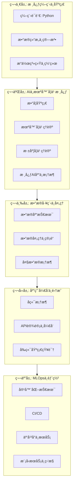

# AI应用开å‘å²—ä½æŠ€æœ¯æ¸…å•

**Export Time:** 2025/9/9 23:47:08
**Conversation ID:** jexzgQp2-bcJ43wLZYsDI
**Message Count:** 8
**Model:** models/gemini-2.5-pro
**Provider:** gemini

---

## 👤 用户 (2025/9/9 23:02:09)

请为我生æˆä¸€ä»½åº”è˜AI应用开å‘å²—ä½éœ€è¦æŒæ¡çš„详细技术清å•
---

## 🤖 助手 (2025/9/9 23:02:09)

### 🤔 æ€è€ƒè¿‡ç¨‹

```
**Refining User Intent**

I'm focusing on "AI Application Developer" as the core of the user's request. This suggests a need for technologies and skills specific to building AI-powered applications. I'm starting to deconstruct the role's requirements to guide the tech stack list.


**Outlining Core Competencies**

I've been thinking about the core competencies needed. Besides the fundamental programming skills, the AI/ML section has emerged as a key area. I'm focusing on breaking down the AI toolkit to be specific, not just general terms. The application part requires DevOps, MLOps, and relevant soft skills.


**Expanding Key Areas**

I'm now focusing on fleshing out each section of the checklist. The goal is to be specific. My current focus is "AI/ML Fundamentals." I'm identifying core concepts: supervised, unsupervised, and reinforcement learning. I'm moving toward the "AI Toolkit" and considering libraries like TensorFlow and PyTorch. Breaking down the core programming skills, I've got Python and its libraries. Next up is "Data Engineering."


**Defining Core AI Knowledge**

I'm now thinking specifically about *neural networks* within the AI/ML section. Delving deeper into core concepts, I'm noting the importance of supervised, unsupervised, and reinforcement learning. I'm focusing on providing context by including a range of commonly used algorithms and their uses. Deep Learning will require its own section.


**Deepening Core Concepts**

I'm now thinking specifically about how the theory relates to practice. I'm expanding on the sections I started with, and diving deeper. For Python, I'm noting specific libraries like NumPy, Pandas, and Matplotlib. I'm focusing on the integration of AI/ML concepts with building user-facing features. I'm also planning a section on evaluating models.


**Deepening Practical Skills**

I'm now integrating how the theory works in the real world. I'm expanding each section with more specific examples. Within the AI Toolkit, I'm noting key tools and libraries within TensorFlow and PyTorch for model building, training, and deployment. The section on model evaluation is growing to include metrics and strategies for preventing overfitting. I'm focusing on key libraries.


**Defining Key Technologies**

I'm now integrating the user's request with the proposed checklist structure. I'm noting specific Python libraries: NumPy, Pandas, Matplotlib, Scikit-learn, TensorFlow, and PyTorch. I'm focusing on "application development," breaking it down into web frameworks, APIs, and front-end interaction. I'm aiming to provide more specific examples.


**Expanding Core Concepts**

I'm now integrating the user's request with a solid checklist structure. I'm noting specific Python libraries: NumPy, Pandas, Matplotlib, Scikit-learn, TensorFlow, and PyTorch. I'm focusing on "application development," breaking it down into web frameworks, APIs, and front-end interaction. I'm aiming to provide more specific examples to illustrate the use of these technologies.


**Organizing Core Sections**

I'm now thinking about how to best organize the structure. I'm focusing on creating logical sections to categorize key technologies and concepts. My current goal is a comprehensive, well-organized guide. Each section requires a succinct title, and I will be working on a flowchart.


```

好的，作为一å高级软件工程师，我é常ä¹æ„为你梳ç†ä¸€ä»½è¯¦å°½çš„ã€é’ˆå¯¹**AI应用开å‘å²—ä½**的技术清å•ã€‚

这份清å•ä¼šéµå¾ªâ€œfinish step by stepâ€çš„åŸåˆ™ï¼Œä»æœ€åŸºç¡€çš„编程能力到专业的AIç†è®ºï¼Œå†åˆ°å°†AI模å‹è½åœ°ä¸ºå®é™…应用的工程能力，层层递进。这ä¸ä»…仅是一个技能列表，更是一个å¯è¡Œçš„学习和准备路径。

### AI应用开å‘技术栈总览

首先，我们è¦æ˜ç™½â€œAI应用开å‘â€è¿™ä¸ªè§’色的核心èŒè´£ï¼š**ä»–ä¸ä»…仅是算法工程师，更是将AI模å‹ï¼ˆæ— è®ºæ˜¯è‡ªç ”还是第三方API）集æˆåˆ°è½¯ä»¶äº§å“中，并确ä¿å…¶ç¨³å®šã€é«˜æ•ˆè¿è¡Œçš„软件工程师。** 因此，技术栈è¦æ±‚是“软件工程â€+“AI知识â€çš„结åˆä½“。

下é¢æ˜¯æŠ€æœ¯æ ˆçš„æ¶æ„图，让你有一个整体的认识：



---

### Step 1: 核心编程ä¸è®¡ç®—机基础 (The Foundation)

这是æˆä¸ºä¸€ååˆæ ¼è½¯ä»¶å·¥ç¨‹å¸ˆçš„基石，无论是å¦ä»äº‹AIæ–¹å‘。

*   **1.1 编程语言：精通 Python**
    *   **核心语法ä¸ç‰¹æ€§**: 熟练æŒæ¡Python的函数ã€ç±»ã€è£…饰器ã€ç”Ÿæˆå™¨ã€å¤šçº¿ç¨‹/多进程等。
    *   **é¢å‘对象编程 (OOP)**: 深刻ç†è§£å°è£…ã€ç»§æ‰¿ã€å¤šæ€ã€‚
    *   **æ•°æ®ç»“æ„**: 精通列表(list)ã€å­—å…¸(dict)ã€é›†åˆ(set)ã€å…ƒç»„(tuple)åŠå…¶é«˜æ•ˆç”¨æ³•ã€‚
    *   **包管ç†**: 熟练使用 `pip` å’Œ `conda`，ç†è§£ `requirements.txt` å’Œ `environment.yml`。
    *   **ç¼–ç è§„范**: éµå¾ª PEP 8 规范，编写å¯è¯»æ€§é«˜ã€æ˜“äºç»´æŠ¤çš„代ç ã€‚

*   **1.2 æ•°æ®ç»“æ„ä¸ç®—法**
    *   **常用数æ®ç»“æ„**: 数组ã€é“¾è¡¨ã€æ ˆã€é˜Ÿåˆ—ã€å“ˆå¸Œè¡¨ã€æ ‘（二å‰æ ‘ã€å¹³è¡¡æ ‘）ã€å›¾ã€‚
    *   **核心算法**: æ’åºï¼ˆå¿«æ’ã€å½’并）ã€æœç´¢ï¼ˆäºŒåˆ†æŸ¥æ‰¾ã€DFSã€BFS）ã€åŠ¨æ€è§„划ã€è´ªå¿ƒç®—法。
    *   **å¤æ‚度分æ**: 能够准确分æ算法的时间å¤æ‚度和空间å¤æ‚度（Big O notation）。

*   **1.3 计算机基础**
    *   **æ“作系统**: ç†è§£è¿›ç¨‹ã€çº¿ç¨‹ã€å†…存管ç†ã€æ–‡ä»¶ç³»ç»Ÿç­‰åŸºæœ¬æ¦‚念。熟悉Linux/Unix命令行æ“作。
    *   **计算机网络**: ç†è§£TCP/IPå议栈，HTTP/HTTPSå议，了解WebSocket。知é“RESTful API的基本åŸç†ã€‚
    *   **版本æ§åˆ¶**: 精通 Git，熟练使用 GitHub/GitLab 进行团队å作。

### Step 2: AIä¸æœºå™¨å­¦ä¹ æ ¸å¿ƒ (The Core AI Skills)

这是AI应用开å‘者的专业领域知识。

*   **2.1 数学基础 (ç†è§£å³å¯ï¼Œä¸è¦æ±‚æ¨å¯¼)**
    *   **线性代数**: å‘é‡ã€çŸ©é˜µã€å¼ é‡ã€çŸ©é˜µè¿ç®—ã€ç‰¹å¾å€¼/特å¾å‘é‡ã€‚
    *   **微积分**: 导数ã€å导数ã€æ¢¯åº¦ã€é“¾å¼æ³•åˆ™ã€‚
    *   **概ç‡è®ºä¸ç»Ÿè®¡**: 概ç‡åˆ†å¸ƒã€æ¡ä»¶æ¦‚ç‡ã€è´å¶æ–¯å®šç†ã€æœŸæœ›ã€æ–¹å·®ã€‚

*   **2.2 ç»å…¸æœºå™¨å­¦ä¹ ç†è®º**
    *   **监ç£å­¦ä¹ **: 线性å›å½’ã€é€»è¾‘å›å½’ã€æ”¯æŒå‘é‡æœº(SVM)ã€å†³ç­–æ ‘ã€éšæœºæ£®æ—ã€æ¢¯åº¦æå‡æ ‘(GBDT, XGBoost)。
    *   **无监ç£å­¦ä¹ **: K-Meansèšç±»ã€PCA主æˆåˆ†åˆ†æ。
    *   **模å‹è¯„ä¼°**: 了解准确ç‡ã€ç²¾ç¡®ç‡ã€å¬å›ç‡ã€F1分数ã€ROC曲线ã€AUC等评估指标，ç†è§£è¿‡æ‹Ÿåˆä¸æ¬ æ‹Ÿåˆã€‚

*   **2.3 深度学习ç†è®º**
    *   **ç¥ç»ç½‘络基础**: ç¥ç»å…ƒã€æ¿€æ´»å‡½æ•°(Sigmoid, ReLU)ã€æŸå¤±å‡½æ•°ã€åå‘ä¼ æ’­ã€æ¢¯åº¦ä¸‹é™ã€‚
    *   **核心网络æ¶æ„**:
        *   **CNN (å·ç§¯ç¥ç»ç½‘络)**: 主è¦ç”¨äºå›¾åƒè¯†åˆ«ã€ç›®æ ‡æ£€æµ‹ã€‚
        *   **RNN (循ç¯ç¥ç»ç½‘络) / LSTM / GRU**: 主è¦ç”¨äºåºåˆ—æ•°æ®ï¼Œå¦‚文本ã€æ—¶é—´åºåˆ—。
        *   **Transformer**: 当å‰NLP领域（åŠCV领域）的ç»å¯¹æ ¸å¿ƒï¼Œå¿…须深刻ç†è§£å…¶è‡ªæ³¨æ„力机制。

*   **2.4 核心AI库ä¸æ¡†æ¶**
    *   **æ•°æ®ç§‘学三件套**:
        *   `NumPy`: 用äºç§‘学计算，尤其是多维数组æ“作。
        *   `Pandas`: 用äºæ•°æ®å¤„ç†å’Œåˆ†æ，核心是DataFrame。
        *   `Matplotlib` / `Seaborn`: 用äºæ•°æ®å¯è§†åŒ–。
    *   **机器学习框æ¶**:
        *   `Scikit-learn`: 用äºå®ç°ç»å…¸çš„机器学习算法，数æ®é¢„处ç†å’Œæ¨¡å‹è¯„估。
    *   **æ·±åº¦å­¦ä¹ æ¡†æ¶ (至少精通一个)**:
        *   `PyTorch`: ç›®å‰åœ¨å­¦æœ¯ç•Œå’Œå·¥ä¸šç•Œéƒ½é常æµè¡Œï¼Œè¯­æ³•çµæ´»ã€‚
        *   `TensorFlow`: Google出å“，生æ€å®Œå–„，部署工具强大。
    *   **NLP/LLM 生æ€**:
        *   `Hugging Face Transformers`: æ供海é‡é¢„训练模å‹ï¼ˆå¦‚BERT, GPT系列）和便æ·çš„调用æ¥å£ã€‚
        *   `LangChain` / `LlamaIndex`: 用äºæ„建基äºå¤§è¯­è¨€æ¨¡å‹ï¼ˆLLM）的应用，尤其是RAG（检索å¢å¼ºç”Ÿæˆï¼‰åº”用。
    *   **计算机视觉库**:
        *   `OpenCV`: 图åƒå¤„ç†å’Œè®¡ç®—机视觉任务的事å®æ ‡å‡†ã€‚

### Step 3: æ•°æ®å·¥ç¨‹ä¸å¤„ç† (Handling the Fuel)

AI模å‹çš„燃料是数æ®ï¼Œå¤„ç†æ•°æ®çš„能力至关é‡è¦ã€‚

*   **3.1 æ•°æ®åº“技术**
    *   **关系å‹æ•°æ®åº“ (SQL)**: 至少精通一ç§ï¼Œå¦‚ `PostgreSQL` 或 `MySQL`，熟练编写å¤æ‚çš„SQL查询。
    *   **NoSQLæ•°æ®åº“**: 了解至少一ç§ï¼Œå¦‚ `MongoDB` (文档å‹)ã€`Redis` (键值å‹)。
    *   **å‘é‡æ•°æ®åº“**: 在LLM应用中至关é‡è¦ï¼Œäº†è§£ `Milvus`, `Pinecone`, `ChromaDB` 等，并ç†è§£å…¶åœ¨ç›¸ä¼¼æ€§æœç´¢ä¸­çš„作用。

*   **3.2 大数æ®ä¸æµå¤„ç†**
    *   **大数æ®æ¡†æ¶**: 了解 `Apache Spark` 的基本åŸç†å’Œä½¿ç”¨ï¼Œç‰¹åˆ«æ˜¯`PySpark`。
    *   **æ•°æ®ç®¡é“工具**: 了解 `Apache Airflow` 等工具如何用äºæ„建和调度ETL/ELTæµç¨‹ã€‚

### Step 4: 应用开å‘ä¸é›†æˆ (Building the Vehicle)

å°†AI能力å°è£…æˆæœåŠ¡ï¼Œä¾›ç”¨æˆ·æˆ–其他系统调用。

*   **4.1 åç«¯æ¡†æ¶ (至少精通一个)**
    *   `FastAPI`: ç°ä»£åŒ–ã€é«˜æ€§èƒ½çš„Python Web框æ¶ï¼Œé常适åˆæ„建AIæœåŠ¡çš„API，自带文档，支æŒå¼‚步。**（强烈æ¨è）**
    *   `Flask`: è½»é‡çº§ã€çµæ´»ï¼Œä¸Šæ‰‹å¿«ï¼Œé€‚åˆå¿«é€Ÿæ­å»ºå°å‹æœåŠ¡ã€‚
    *   `Django`: 功能全é¢çš„大å‹æ¡†æ¶ï¼Œé€‚åˆæ„建å¤æ‚çš„Web应用。

*   **4.2 API 设计ä¸å¼€å‘**
    *   **RESTful API**: 设计清晰ã€è§„范的APIæ¥å£ã€‚
    *   **API 文档**: 使用 `Swagger/OpenAPI` 自动生æˆå’Œç»´æŠ¤API文档。
    *   **身份验è¯ä¸æˆæƒ**: 了解 `OAuth2`, `JWT` 等认è¯æœºåˆ¶ã€‚

*   **4.3 å‰ç«¯åŸºç¡€çŸ¥è¯† (了解å³å¯)**
    *   了解 `HTML`, `CSS`, `JavaScript` 的基本工作åŸç†ã€‚
    *   了解 `React`, `Vue` ç­‰ç°ä»£å‰ç«¯æ¡†æ¶å¦‚何ä¸å端API进行交互。

### Step 5: MLOps ä¸éƒ¨ç½² (Hitting the Road)

将开å‘好的AI应用部署到生产ç¯å¢ƒï¼Œå¹¶æŒç»­ç»´æŠ¤ã€‚

*   **5.1 容器化ä¸ç¼–æ’**
    *   `Docker`: 必须熟练æŒæ¡ï¼Œèƒ½å¤Ÿå°†Python应用和模å‹æ‰“包æˆDockeré•œåƒã€‚
    *   `Docker Compose`: 用äºåœ¨æœ¬åœ°ç¼–æ’多个容器。
    *   `Kubernetes (K8s)`: 了解其基本概念（Pod, Service, Deployment），是容器编æ’的事å®æ ‡å‡†ã€‚

*   **5.2 æŒç»­é›†æˆä¸æŒç»­éƒ¨ç½² (CI/CD)**
    *   了解CI/CDçš„ç†å¿µã€‚
    *   熟练使用 `GitHub Actions` 或 `GitLab CI` æ¥è‡ªåŠ¨åŒ–测试ã€æ„建和部署æµç¨‹ã€‚

*   **5.3 äº‘è®¡ç®—å¹³å° (至少熟悉一个)**
    *   **AWS**: Amazon Web Services (EC2, S3, SageMaker, Lambda)
    *   **Azure**: Microsoft Azure (Virtual Machines, Blob Storage, Azure Machine Learning)
    *   **GCP**: Google Cloud Platform (Compute Engine, Cloud Storage, Vertex AI)
    *   需è¦æŒæ¡å¦‚何在云平å°ä¸Šéƒ¨ç½²å®¹å™¨åŒ–应用，使用对象存储，并了解其æ供的AI/MLæœåŠ¡ã€‚

*   **5.4 模å‹æœåŠ¡ä¸ç›‘æ§**
    *   **模å‹æœåŠ¡å·¥å…·**: 了解 `NVIDIA Triton Inference Server`, `BentoML` 等专门用äºé«˜æ€§èƒ½æ¨¡å‹æ¨ç†çš„工具。
    *   **监æ§ä¸æ—¥å¿—**: 学习使用 `Prometheus`, `Grafana` 进行æœåŠ¡æ€§èƒ½ç›‘æ§ï¼Œä½¿ç”¨ `ELK Stack` (Elasticsearch, Logstash, Kibana) 或类似方案进行日志管ç†ã€‚

### 总结ä¸å»ºè®®

*   **ä¸è¦è¢«æ¸…å•å“到**：没有人能精通所有这些技术。这份清å•æ˜¯ä¸€ä¸ªå…¨é¢çš„“地图â€ï¼Œä½ åº”该根æ®ç›®æ ‡å²—ä½çš„具体è¦æ±‚，有选择地深入学习。
*   **Tå‹äººæ‰æ¨¡å‹**：广度上，你应该对整个技术栈都有所了解；深度上，选择1-2个领域作为你的核心专长（例如，å¯ä»¥æ˜¯â€œåŸºäºLLM的应用开å‘â€æˆ–“计算机视觉模å‹çš„æœåŠ¡åŒ–部署â€ï¼‰ã€‚
*   **å®è·µæ˜¯å…³é”®**：动手åšé¡¹ç›®ï¼å°è¯•å¤ç°ä¸€ç¯‡è®ºæ–‡ï¼Œæˆ–者用开æºæ¨¡å‹æ„建一个有趣的Web应用。ä»æ•°æ®å¤„ç†åˆ°æ¨¡å‹è®­ç»ƒï¼Œå†åˆ°APIå¼€å‘å’ŒDocker部署，完整地走一éæµç¨‹ã€‚
*   **æŒç»­å­¦ä¹ **：AI领域日新月异，ä¿æŒå¯¹æ–°æŠ€æœ¯ï¼ˆå¦‚新的模å‹æ¶æ„ã€æ–°çš„å¼€å‘框æ¶ï¼‰çš„好奇心和学习能力至关é‡è¦ã€‚

ç¥ä½ æ±‚èŒé¡ºåˆ©ï¼

---

## 👤 用户 (2025/9/9 23:09:06)

请ä»é›¶é€æ­¥æŒ‡å¯¼æˆ‘学习和æŒæ¡PyTorch
---

## 🤖 助手 (2025/9/9 23:09:06)

### 🤔 æ€è€ƒè¿‡ç¨‹

```
**Formulating the Outline**

I'm currently fleshing out the structure of this PyTorch guide. I've considered the user's specific request for a step-by-step approach catering to a senior software engineer. My focus now is on creating a logical flow, starting with the very basics and moving towards practical applications. I'm aiming for a structure that is both comprehensive and easy to navigate for someone with experience in software engineering.


**Developing the Framework**

I've been examining the user's request, focusing on the "step-by-step" and "senior software engineer" aspects. My current approach involves a structured progression through core PyTorch concepts. The learning path is taking shape: environment setup, core concepts (tensors, autograd), building neural networks (nn.Module, layers), training loops, and finally, advanced applications.


**Mapping the Structure**

I've been refining the structure of the guide to cater to a senior software engineer. The addition of preparation and concrete projects ensures actionable steps. Now, I'm integrating environment setup details, Anaconda/Miniconda recommendations, and exact commands for clarity. This ensures a comprehensive foundation and caters to a 'do it' approach, starting with the very basics.


**Expanding the Scope**

I've incorporated detailed, actionable steps in the environmental setup phase, including `conda` commands and pointing the user to the PyTorch website for hardware-specific installation instructions. My thought process now emphasizes providing practical, hands-on instructions for the senior software engineer. I'm focusing on "show, don't tell," using code snippets and clear explanations.


**Outlining the Structure**

My current focus is on translating the user's request into a structured learning path. I'm prioritizing clarity and directness, given the target audience's software engineering background. The plan now incorporates distinct phases: Preparation, Core Concepts, Building Neural Networks, Training Loops, Advanced Skills, and Real-World Projects. This sequential approach ensures a logical and progressive learning experience, moving from fundamentals to practical application.


**Defining the Learning Flow**

I'm now integrating the user's need for actionable steps into my outline. The structure is taking shape, with actionable commands and practical examples throughout the guide. I'll include setup tips and commands, focusing on practical implementation for a senior software engineer. I'll provide a solid foundation.


**Developing a Comprehensive Guide**

I'm now in the process of translating the raw notes into a complete guide, with code examples. My focus is on concise explanations, direct commands, and practical applications that a senior software engineer can immediately grasp and use.


**Crafting a Detailed Guide**

I've been meticulously organizing the information into a comprehensive guide, ensuring it's clear and practical for senior software engineers. I'll focus on the user's need for actionable commands, and will incorporate code examples and clear explanations. My guide will include detailed steps for the whole process.


**Defining the Guide's Structure**

I'm presently arranging the structure of this guide to fit the user's needs. The framework emphasizes a step-by-step approach for a senior software engineer. The outline progresses from fundamental concepts to practical applications, focusing on actionable steps. This strategy ensures comprehensive and easy-to-understand guidance.


```

太棒了ï¼ä»é›¶å¼€å§‹å­¦ä¹ å¹¶æŒæ¡PyTorch是一个é常æ˜æ™ºçš„选择，它是目å‰æœ€ä¸»æµã€æœ€çµæ´»çš„深度学习框æ¶ä¹‹ä¸€ã€‚

作为你的技术伙伴，我将为你设计一个“finish step by stepâ€çš„学习路线。这æ¡è·¯çº¿ä¼šä»æœ€åŸºç¡€çš„概念开始，æ¯ä¸€æ­¥éƒ½åŒ…å«**核心ç†å¿µ**ã€**关键代ç **å’Œ**å®è·µç›®æ ‡**，确ä¿ä½ ä¸ä»…能看懂，更能动手å®ç°ã€‚

### PyTorch学习路线图

首先，我们用一个æµç¨‹å›¾æ¥æ¦‚览整个学习路径：

```mermaid
graph TD
    subgraph "阶段一: 基础入门"
        A[Step 0: ç¯å¢ƒæ­å»ºä¸é…ç½®] --> B[Step 1: 核心数æ®ç»“æ„ - å¼ é‡ (Tensor)]
        B --> C[Step 2: æ ¸å¿ƒå¼•æ“ - 自动求导 (Autograd)]
    end

    subgraph "阶段二: æ„建ç¥ç»ç½‘络"
        C --> D[Step 3: ç¥ç»ç½‘络的基石 - nn.Module]
        D --> E[Step 4: 定义网络层ä¸æ¿€æ´»å‡½æ•°]
        E --> F[Step 5: 定义æŸå¤±å‡½æ•°ä¸ä¼˜åŒ–器]
    end

    subgraph "阶段三: 完整训练ä¸å®è·µ"
        F --> G[Step 6: æ•°æ®å¤„ç† - Dataset & DataLoader]
        G --> H[Step 7: 编写完整的训练循ç¯]
        H --> I[Step 8: GPU加速ä¸æ¨¡å‹ä¿å­˜/加载]
    end

    subgraph "阶段四: 进阶ä¸åº”用"
        I --> J[Step 9: è¿ç§»å­¦ä¹  - 使用预训练模å‹]
        J --> K[Step 10: 项目å®æˆ˜]
    end
```

---

### Step 0: ç¯å¢ƒæ­å»ºä¸é…ç½®

**目标**: 创建一个独立的ã€å¯å¤ç°çš„Pythonç¯å¢ƒï¼Œå¹¶å®‰è£…PyTorch。

**ç†å¿µ**: 专业的开å‘始äºè§„范的ç¯å¢ƒç®¡ç†ã€‚使用虚拟ç¯å¢ƒï¼ˆå¦‚conda）å¯ä»¥é¿å…ä¸åŒé¡¹ç›®é—´çš„包冲çªã€‚

**æ“作步骤**:

1.  **安装Miniconda**: 如æœä½ æ²¡æœ‰å®‰è£…Anaconda或Miniconda，请先安装它。它是一个轻é‡çº§çš„包和ç¯å¢ƒç®¡ç†å™¨ã€‚

2.  **创建新的condaç¯å¢ƒ**:
    ```powershell
    # 创建一个å为 "pytorch_env" çš„Python 3.10 ç¯å¢ƒ
    conda create --name pytorch_env python=3.10

    # 激活这个ç¯å¢ƒ
    conda activate pytorch_env
    ```

3.  **安装PyTorch**: **ä¸è¦**ç›´æ¥ `pip install torch`ï¼æœ€å¯é çš„æ–¹å¼æ˜¯è®¿é—® [PyTorch官网](https://pytorch.org/get-started/locally/)。官网会根æ®ä½ çš„æ“作系统ã€åŒ…管ç†å™¨å’ŒGPU情况（是å¦æœ‰NVIDIA显å¡ï¼ŒCUDA版本）生æˆæœ€é€‚åˆä½ çš„安装命令。

    例如，对äºWindows，使用Pip，拥有NVIDIA显å¡ï¼ˆCUDA 12.1）的安装命令通常是：
    ```powershell
    pip3 install torch torchvision torchaudio --index-url https://download.pytorch.org/whl/cu121
    ```
    如æœåªæœ‰CPU，命令会是：
    ```powershell
    pip3 install torch torchvision torchaudio
    ```

4.  **验è¯å®‰è£…**:
    ```python
    # a_verify_install.py

    import torch

    # 打å°PyTorch版本
    print(f"PyTorch Version: {torch.__version__}")

    # 检查GPU是å¦å¯ç”¨
    is_cuda_available = torch.cuda.is_available()
    print(f"CUDA (GPU) Available: {is_cuda_available}")

    if is_cuda_available:
        # 打å°GPUæ•°é‡
        print(f"Number of GPUs: {torch.cuda.device_count()}")
        # 打å°å½“å‰GPU设备å称
        print(f"Current GPU Name: {torch.cuda.get_device_name(0)}")
    ```
    在PowerShell中è¿è¡Œ `python a_verify_install.py`，如æœèƒ½æ­£ç¡®è¾“出版本å·ï¼Œè¯´æ˜å®‰è£…æˆåŠŸã€‚

### Step 1: 核心数æ®ç»“æ„ - å¼ é‡ (Tensor)

**目标**: ç†è§£Tensor，并熟练进行创建和æ“作。

**ç†å¿µ**: Tensor是PyTorch中的基本数æ®å•å…ƒï¼Œç±»ä¼¼NumPyçš„`ndarray`，但å¢åŠ äº†GPU加速和自动求导功能。所有的数æ®å’Œæ¨¡å‹å‚数都以Tensorçš„å½¢å¼å­˜åœ¨ã€‚

**关键代ç **:
```python
# b_tensors_demo.py

import torch
import numpy as np

# 1. 创建Tensor
# ä»åˆ—表创建
data = [[1, 2], [3, 4]]
x_data = torch.tensor(data)
print(f"Tensor from list:\n {x_data}\n")

# ä»NumPy数组创建 (共享内存)
np_array = np.array(data)
x_np = torch.from_numpy(np_array)
print(f"Tensor from NumPy:\n {x_np}\n")

# 创建指定形状的全1或éšæœºTensor
shape = (2, 3,)
ones_tensor = torch.ones(shape)
rand_tensor = torch.rand(shape)
print(f"Ones Tensor:\n {ones_tensor}\n")
print(f"Random Tensor:\n {rand_tensor}\n")

# 2. Tensorçš„å±æ€§
tensor = torch.rand(3, 4)
print(f"Shape of tensor: {tensor.shape}")
print(f"Datatype of tensor: {tensor.dtype}")
print(f"Device tensor is stored on: {tensor.device}\n")

# 3. Tensoræ“作 (类似NumPy)
# 索引和切片
tensor = torch.ones(4, 4)
tensor[:, 1] = 0 # 将第二列全部置为0
print(f"Sliced Tensor:\n {tensor}\n")

# 矩阵乘法
mat_mul = tensor.matmul(tensor.T) # .T 是转置
print(f"Matrix Multiplication:\n {mat_mul}\n")

# 元素级乘法
elem_mul = tensor.mul(tensor)
# 或者 torch.mul(tensor, tensor)
print(f"Element-wise Multiplication:\n {elem_mul}\n")

# Tensorä¸æ ‡é‡çš„è¿ç®—
added_tensor = tensor.add(5)
print(f"Tensor after adding 5:\n {added_tensor}\n")
```

### Step 2: æ ¸å¿ƒå¼•æ“ - 自动求导 (Autograd)

**目标**: ç†è§£PyTorch如何自动计算梯度，这是训练ç¥ç»ç½‘络的核心。

**ç†å¿µ**: PyTorch会记录在Tensor上的所有æ“作，形æˆä¸€ä¸ªåŠ¨æ€è®¡ç®—图。当你对一个标é‡ï¼ˆé€šå¸¸æ˜¯æŸå¤±å‡½æ•°çš„结æœï¼‰è°ƒç”¨`.backward()`时，PyTorch会沿ç€è¿™ä¸ªå›¾åå‘传播，自动计算出图中æ¯ä¸ªå‚数（设置了`requires_grad=True`çš„Tensor）的梯度。

**关键代ç **:
```python
# c_autograd_demo.py

import torch

# 创建一个需è¦æ¢¯åº¦çš„Tensor，这是模å‹å‚数的模拟
# requires_grad=True 告诉PyTorch需è¦è¿½è¸ªå¯¹è¯¥Tensor的所有æ“作
w = torch.tensor(2.0, requires_grad=True)
b = torch.tensor(1.0, requires_grad=True)

# 定义一个简å•çš„线性模å‹
x = torch.tensor(3.0)
y = w * x + b  # y = 2*3 + 1 = 7

# å‡è®¾æˆ‘们有一个目标值
target = torch.tensor(10.0)

# 计算æŸå¤± (这里用简å•çš„平方差)
loss = (target - y)**2 # loss = (10 - 7)^2 = 9

# 执行åå‘传播，计算梯度
# loss是一个标é‡ï¼Œæ‰€ä»¥å¯ä»¥ç›´æ¥è°ƒç”¨.backward()
loss.backward()

# 打å°æ¢¯åº¦
# d(loss)/dw = d((10 - (w*x+b))^2)/dw = 2 * (10 - (w*x+b)) * (-x) = 2 * 3 * (-3) = -18
print(f"Gradient of w (dw): {w.grad}")

# d(loss)/db = d((10 - (w*x+b))^2)/db = 2 * (10 - (w*x+b)) * (-1) = 2 * 3 * (-1) = -6
print(f"Gradient of b (db): {b.grad}")
```

### Step 3: ç¥ç»ç½‘络的基石 - `nn.Module`

**目标**: 学习如何使用`nn.Module`æ¥ç»„织和å°è£…自己的ç¥ç»ç½‘络。

**ç†å¿µ**: `torch.nn`是PyTorch专门为ç¥ç»ç½‘络设计的模å—。`nn.Module`是所有ç¥ç»ç½‘络模å‹çš„基类。我们通过继承它æ¥æ„建自己的网络。约定俗æˆçš„，我们在`__init__`方法中定义网络的层，在`forward`方法中定义数æ®å¦‚何æµç»è¿™äº›å±‚。

**关键代ç **:
```python
# d_nn_module_demo.py

import torch
from torch import nn

# 定义一个简å•çš„å…¨è¿æ¥ç¥ç»ç½‘络
class SimpleNet(nn.Module):
    def __init__(self):
        # 必须先调用父类的__init__方法
        super().__init__()
        
        # 定义网络的层次结æ„
        # nn.Linear(input_features, output_features) 定义一个全è¿æ¥å±‚
        self.layer1 = nn.Linear(10, 32) # 输入10个特å¾ï¼Œè¾“出32个特å¾
        self.activation1 = nn.ReLU()   # ReLU激活函数
        self.layer2 = nn.Linear(32, 1) # 输入32个特å¾ï¼Œè¾“出1ä¸ªç‰¹å¾ (例如，å›å½’任务)

    def forward(self, x):
        # 定义数æ®çš„å‰å‘传播路径
        x = self.layer1(x)
        x = self.activation1(x)
        x = self.layer2(x)
        return x

# å®ä¾‹åŒ–模å‹
model = SimpleNet()
print(model)

# 创建一个å‡çš„è¾“å…¥æ•°æ® (batch_size=5, features=10)
dummy_input = torch.randn(5, 10)

# 将数æ®ä¼ å…¥æ¨¡å‹ï¼Œå¾—到输出
output = model(dummy_input)

print(f"\nInput shape: {dummy_input.shape}")
print(f"Output shape: {output.shape}")
```

**æ­å–œä½ ï¼** 到这里，你已ç»æŒæ¡äº†PyTorch最核心的三个概念：**Tensor**ã€**Autograd**å’Œ**nn.Module**。有了这些基础，æ¥ä¸‹æ¥çš„步骤就是将它们组åˆèµ·æ¥ï¼Œå®Œæˆä¸€ä¸ªçœŸæ­£çš„训练任务。

请先消化和练习以上内容。当你准备好å，我们å†ç»§ç»­**Step 4-10**，涵盖æŸå¤±å‡½æ•°ã€ä¼˜åŒ–器ã€æ•°æ®åŠ è½½ã€å®Œæ•´è®­ç»ƒå¾ªç¯ä»¥åŠé¡¹ç›®å®æˆ˜ã€‚

---

## 👤 用户 (2025/9/9 23:19:16)

开始下一步讲解，注æ„使用googleçš„colab作为编ç ç¯å¢ƒ
---

## 🤖 助手 (2025/9/9 23:19:16)

### 🤔 æ€è€ƒè¿‡ç¨‹

```
**Proceeding with Colab**

I've acknowledged the user's intent to move forward with the PyTorch tutorial using Google Colab. Currently, the thought process centers around confirming the user's setup and readiness to proceed with the next steps. I am confident that the user is prepared for the following tutorial stage.


**Focusing on Tutorial Structure**

I'm now zeroing in on the tutorial's structure for the next steps, especially how to present it within Google Colab. I intend to group steps 4-7 (Layers, Loss/Optimizer, Data, Training Loop) into a core "training process" block. Step 8 (GPU/Saving) is the practical consideration. I'll emphasize Colab-specific aspects, like enabling GPU usage, presenting self-contained code cells, and navigating the temporary file system.


**Revising Code Structure**

I'm now revising the code structure. Considering the structure of the training process, I've decided to streamline my approach to the key concepts. Specifically, I'm integrating Steps 4-7 into the "training loop" block, with a focus on defining network layers, loss functions, optimizers, and the actual training loop itself. Step 8 will stand separately as a practical consideration, encompassing GPU usage and model saving.


**Streamlining the Core Steps**

Now, I'm focusing on crafting a concise and impactful presentation of the core training components: Layers, Loss/Optimizer, and the actual Training Loop. These are now condensed into a cohesive, runnable code block. I'm keen to make the user understand the interdependencies of these steps. Moreover, I plan to highlight Colab's ease of use, particularly concerning GPU access and the temporary file system.


**Combining Tutorial Steps**

I'm now integrating the data handling, loss calculation, and optimization steps into a single, cohesive training loop in the next phase. This will clarify how everything fits together. I will keep the focus on Colab-specific aspects, highlighting GPU utilization and addressing the temporary file system. I will also make clear how to save and load models, and how to access their results.


**Focusing on Core Components**

My current focus is on organizing steps 4-7, consolidating them into a coherent presentation. I'm prioritizing the presentation of the key components: Defining Network Layers & Activations, Loss Function & Optimizer, Data Handling (Dataset & DataLoader), and the essential Training Loop. My goal is to streamline the learning experience, offering a concise overview of these core components in a runnable format within a Colab environment. I'll maintain emphasis on the essential steps within the training loop.


**Organizing the Tutorial Steps**

I've outlined the tutorial structure in more detail. I'm focusing on providing practical, runnable Colab code, particularly for steps 4-7, to foster hands-on learning, while also emphasizing GPU utilization and model saving within the Colab environment. The aim is to create a seamless, interactive learning experience.


**Consolidating Training Processes**

I'm now integrating the data handling, loss calculation, and optimization components into a unified training loop. This provides a clear, runnable code block within a Colab environment. My focus now is ensuring the user's understanding of the training loop within a Colab setup. I'll include practical considerations such as saving and loading models, and how to access their results.


```

好的，我们继续ï¼Google Colab 是一个ç»ä½³çš„学习ç¯å¢ƒï¼Œå› ä¸ºå®ƒå…è´¹æ供了GPU，并且预装了所有必需的库。

### **准备工作: 在Google Colab中设置ç¯å¢ƒ**

1.  打开 [Google Colab](https://colab.research.google.com/) 并创建一个新的 Notebook。
2.  **å¯ç”¨GPU**: 为了加速计算，我们需è¦å¯ç”¨GPU。
    *   点击èœå•æ çš„ `代ç æ‰§è¡Œç¨‹åº (Runtime)` -> `更改è¿è¡Œæ—¶ç±»å‹ (Change runtime type)`。
    *   在 `硬件加速器 (Hardware accelerator)` 下拉èœå•ä¸­ï¼Œé€‰æ‹© `T4 GPU`。
    *   点击 `ä¿å­˜ (Save)`。
3.  **验è¯ç¯å¢ƒ**: 在第一个代ç å•å…ƒæ ¼ä¸­ï¼Œè¿è¡Œæˆ‘们在Step 0中用过的验è¯ä»£ç ã€‚你会看到Colabå·²ç»ä¸ºä½ å‡†å¤‡å¥½äº†ä¸€åˆ‡ã€‚

```python
# 在Colabå•å…ƒæ ¼ä¸­è¿è¡Œ
import torch

# 打å°PyTorch版本
print(f"PyTorch Version: {torch.__version__}")

# 检查GPU是å¦å¯ç”¨
# 在Colab中，这应该是True，因为我们已ç»å¯ç”¨äº†GPU
is_cuda_available = torch.cuda.is_available()
print(f"CUDA (GPU) Available: {is_cuda_available}")

if is_cuda_available:
    # 打å°å½“å‰GPU设备å称
    print(f"Current GPU Name: {torch.cuda.get_device_name(0)}")
```

ç°åœ¨ï¼Œæˆ‘们æ¥ç€ä¹‹å‰çš„步骤，开始æ„建一个完整的ç¥ç»ç½‘络。

---

### Step 4: 定义网络层ä¸æ¿€æ´»å‡½æ•°

**目标**: 学习使用`torch.nn`中丰富的预设网络层æ¥æ„建更å¤æ‚的模å‹ã€‚

**ç†å¿µ**: 除了`nn.Linear`，`torch.nn`还æ供了å·ç§¯å±‚ (`nn.Conv2d`)ã€å¾ªç¯å±‚ (`nn.LSTM`)ã€Dropout层 (`nn.Dropout`) 等。`nn.Sequential` 是一个é常有用的容器，å¯ä»¥åƒç®¡é“一样将多个层按顺åºæ‰“包，简化`forward`函数的书写。

**关键代ç **:
我们将æ„建一个简å•çš„多层感知机（MLP），用äºä¸€ä¸ªå›å½’任务。

```python
# 在Colabå•å…ƒæ ¼ä¸­è¿è¡Œ

import torch
from torch import nn

# 定义一个更结æ„化的ç¥ç»ç½‘络
class RegressionNet(nn.Module):
    def __init__(self):
        super().__init__()
        
        # 定义网络的输入ã€éšè—和输出层的维度
        input_features = 10  # å‡è®¾æˆ‘们的数æ®æœ‰10个特å¾
        hidden_units_1 = 64
        hidden_units_2 = 32
        output_features = 1   # å›å½’任务，输出1个值

        # 使用 nn.Sequential 将网络层串è”èµ·æ¥
        # 这是一个清晰ã€æ¨¡å—化的方å¼æ¥å®šä¹‰æ¨¡å‹
        self.layers = nn.Sequential(
            nn.Linear(input_features, hidden_units_1),
            nn.ReLU(),  # 激活函数，引入é线性
            nn.Linear(hidden_units_1, hidden_units_2),
            nn.ReLU(),
            nn.Linear(hidden_units_2, output_features)
        )

    def forward(self, x):
        # ç”±äºä½¿ç”¨äº†nn.Sequential，forward函数å˜å¾—æ其简å•
        return self.layers(x)

# å®ä¾‹åŒ–模å‹
model = RegressionNet()
print("模å‹ç»“æ„:")
print(model)

# 创建一个å‡çš„è¾“å…¥æ•°æ® (batch_size=5, features=10)
dummy_input = torch.randn(5, 10)

# 将数æ®ä¼ å…¥æ¨¡å‹ï¼Œå¾—到输出
output = model(dummy_input)

print(f"\n输入形状: {dummy_input.shape}")
print(f"输出形状: {output.shape}")
```

### Step 5: 定义æŸå¤±å‡½æ•°ä¸ä¼˜åŒ–器

**目标**: 学习如何为模å‹é€‰æ‹©åˆé€‚的“评价标准â€ï¼ˆæŸå¤±å‡½æ•°ï¼‰å’Œâ€œå­¦ä¹ æ–¹æ³•â€ï¼ˆä¼˜åŒ–器）。

**ç†å¿µ**:
*   **æŸå¤±å‡½æ•° (Loss Function)**: è¡¡é‡æ¨¡å‹é¢„测值ä¸çœŸå®å€¼ä¹‹é—´çš„å·®è·ã€‚对äºå›å½’任务，常用`nn.MSELoss` (å‡æ–¹è¯¯å·®)。对äºåˆ†ç±»ä»»åŠ¡ï¼Œå¸¸ç”¨`nn.CrossEntropyLoss` (交å‰ç†µæŸå¤±)。
*   **优化器 (Optimizer)**: æ ¹æ®æŸå¤±å‡½æ•°è®¡ç®—出的梯度æ¥æ›´æ–°æ¨¡å‹çš„所有å‚数（æƒé‡å’Œå置）。最常用的是`torch.optim.Adam`，它是一ç§è‡ªé€‚应学习ç‡çš„优化算法，通常比传统的`SGD`（éšæœºæ¢¯åº¦ä¸‹é™ï¼‰æ•ˆæœæ›´å¥½ã€æ”¶æ•›æ›´å¿«ã€‚

**关键代ç **:
```python
# 在Colabå•å…ƒæ ¼ä¸­è¿è¡Œ

# å®ä¾‹åŒ–我们在Step 4中定义的模å‹
model = RegressionNet()

# 1. 定义æŸå¤±å‡½æ•°
# Mean Squared Error Loss，适用äºå›å½’问题
loss_fn = nn.MSELoss()

# 2. 定义优化器
# Adam优化器是一ç§é常æµè¡Œçš„选择
# 第一个å‚æ•° model.parameters() 告诉优化器需è¦æ›´æ–°å“ªäº›å‚æ•°
# lr (learning_rate) 是学习ç‡ï¼Œæ§åˆ¶æ¯æ¬¡å‚数更新的步长
optimizer = torch.optim.Adam(params=model.parameters(), lr=0.001)

print(f"æŸå¤±å‡½æ•°: {loss_fn}")
print(f"优化器: {optimizer}")
```

### Step 6: æ•°æ®å¤„ç† - `Dataset` & `DataLoader`

**目标**: 学习使用PyTorch的标准工具æ¥é«˜æ•ˆã€ä¾¿æ·åœ°åŠ è½½å’Œé¢„处ç†æ•°æ®ã€‚

**ç†å¿µ**:
*   **`Dataset`**: å°è£…了数æ®å’Œæ ‡ç­¾çš„æ¥æºã€‚`TensorDataset`是一个方便的类，å¯ä»¥ç›´æ¥å°†`torch.Tensor`包装æˆ`Dataset`。
*   **`DataLoader`**: ä»`Dataset`中自动æå–å°æ‰¹é‡ï¼ˆmini-batch）数æ®ï¼Œå¹¶å¯ä»¥è¿›è¡Œæ•°æ®æ‰“乱（shuffle），这对äºè®­ç»ƒè¿‡ç¨‹çš„稳定性至关é‡è¦ã€‚

**关键代ç **:
我们将创建一些åˆæˆæ•°æ®æ¥æ¨¡æ‹Ÿä¸€ä¸ªçœŸå®çš„场景。

```python
# 在Colabå•å…ƒæ ¼ä¸­è¿è¡Œ

from torch.utils.data import TensorDataset, DataLoader

# 1. 创建åˆæˆæ•°æ®
# å‡è®¾æˆ‘们有1000个样本，æ¯ä¸ªæ ·æœ¬æœ‰10个特å¾
num_samples = 1000
num_features = 10

# X æ˜¯æˆ‘ä»¬çš„ç‰¹å¾ (éšæœºç”Ÿæˆ)
X = torch.randn(num_samples, num_features)

# y 是我们的目标值 (å‡è®¾æ˜¯ä¸€ä¸ªç®€å•çš„线性关系加上一些噪声)
true_weights = torch.tensor([0.5, -0.2, 1.5, -2.0, 0.8, -1.1, 0.3, -0.7, 1.2, -0.9])
true_bias = 2.0
y = X @ true_weights + true_bias + torch.randn(num_samples) * 0.1 # 矩阵乘法 + åç½® + 噪声
# y需è¦å’Œæ¨¡å‹è¾“出的形状匹é…，这里模å‹è¾“出是(batch_size, 1)，所以我们reshape一下
y = y.view(-1, 1)

print(f"特å¾æ•°æ®å½¢çŠ¶: {X.shape}")
print(f"标签数æ®å½¢çŠ¶: {y.shape}\n")

# 2. 创建Dataset
# TensorDataset将我们的特å¾å’Œæ ‡ç­¾å¼ é‡æ‰“包在一起
dataset = TensorDataset(X, y)

# 3. 创建DataLoader
# BATCH_SIZE 决定了æ¯æ¬¡è®­ç»ƒæ¨¡å‹æ—¶ä½¿ç”¨å¤šå°‘个数æ®æ ·æœ¬
BATCH_SIZE = 32

# shuffle=True 在æ¯ä¸ªepoch开始时都会打乱数æ®é¡ºåºï¼Œè¿™å¯¹äºè®­ç»ƒé常é‡è¦
# 它å¯ä»¥é˜²æ­¢æ¨¡å‹å­¦åˆ°æ•°æ®çš„特定顺åº
data_loader = DataLoader(dataset, batch_size=BATCH_SIZE, shuffle=True)

# 我们å¯ä»¥æ£€æŸ¥ä¸€ä¸‹DataLoader的工作方å¼
# ä»data_loader中å–出一个批次的数æ®
features_batch, labels_batch = next(iter(data_loader))
print(f"ä»DataLoaderå–出的一个批次:")
print(f"  特å¾æ‰¹æ¬¡å½¢çŠ¶: {features_batch.shape}")
print(f"  标签批次形状: {labels_batch.shape}")
```

### Step 7: 编写完整的训练循ç¯

**目标**: å°†å‰é¢æ‰€æœ‰çš„部分（模å‹ã€æŸå¤±å‡½æ•°ã€ä¼˜åŒ–器ã€æ•°æ®åŠ è½½å™¨ï¼‰ç»„åˆåœ¨ä¸€èµ·ï¼Œå½¢æˆä¸€ä¸ªå®Œæ•´çš„训练æµç¨‹ã€‚

**ç†å¿µ**: 训练过程是在数æ®é›†ä¸Šè¿›è¡Œå¤šè½®ï¼ˆepoch）迭代。在æ¯ä¸€è½®ä¸­ï¼Œæ¨¡å‹ä¼šéå†`DataLoader`æ供的所有数æ®æ‰¹æ¬¡ï¼Œå¹¶æ‰§è¡Œä»¥ä¸‹**“三步èˆâ€**：
1.  **`optimizer.zero_grad()`**: 清除上一轮计算的梯度。
2.  **`loss.backward()`**: æ ¹æ®å½“å‰æ‰¹æ¬¡çš„æŸå¤±ï¼Œè®¡ç®—所有å‚数的梯度。
3.  **`optimizer.step()`**: 使用计算出的梯度æ¥æ›´æ–°å‚数。

**关键代ç **:
```python
# 在Colabå•å…ƒæ ¼ä¸­è¿è¡Œ

# --- 准备工作 (ä»å‰é¢æ­¥éª¤å¤åˆ¶ä»£ç ) ---
# 1. 模å‹
model = RegressionNet()
# 2. æŸå¤±å‡½æ•°
loss_fn = nn.MSELoss()
# 3. 优化器
optimizer = torch.optim.Adam(model.parameters(), lr=0.001)
# 4. æ•°æ®åŠ è½½å™¨ (å‡è®¾datasetå’Œdata_loader已在上一å•å…ƒæ ¼åˆ›å»º)
# data_loader = DataLoader(dataset, batch_size=BATCH_SIZE, shuffle=True)

# --- è®­ç»ƒå¾ªç¯ ---
# epochs 是我们希望在整个数æ®é›†ä¸Šè®­ç»ƒçš„总轮数
epochs = 10 

print("开始训练...")

# 外层循ç¯éå†æ¯ä¸€è½®
for epoch in range(epochs):
    # 将模å‹è®¾ç½®ä¸ºè®­ç»ƒæ¨¡å¼
    model.train()
    
    # 内层循ç¯éå†DataLoader中的æ¯ä¸€ä¸ªæ‰¹æ¬¡
    for batch, (X_batch, y_batch) in enumerate(data_loader):
        
        # 1. å‰å‘传播：计算预测值
        y_pred = model(X_batch)
        
        # 2. 计算æŸå¤±
        loss = loss_fn(y_pred, y_batch)
        
        # 3. 优化器三步èˆ
        # 3.1 清空梯度
        optimizer.zero_grad()
        # 3.2 åå‘传播：计算梯度
        loss.backward()
        # 3.3 æ›´æ–°æƒé‡
        optimizer.step()

    # 在æ¯è½®è®­ç»ƒç»“æŸå，打å°æŸå¤±ä¿¡æ¯
    # 我们å¯ä»¥åœ¨è¯„估模å¼ä¸‹è®¡ç®—æŸå¤±ï¼Œè¿™ä¼šå…³é—­Dropout等层，但对äºè¿™ä¸ªç®€å•æ¨¡å‹å½±å“ä¸å¤§
    model.eval()
    with torch.no_grad(): # 在这个å—中，ä¸è®¡ç®—梯度，节çœè®¡ç®—资æº
        y_pred_total = model(X) # 在整个数æ®é›†ä¸Šè¿›è¡Œé¢„测
        epoch_loss = loss_fn(y_pred_total, y)
        print(f"Epoch {epoch+1}/{epochs} | Loss: {epoch_loss.item():.4f}")

print("\n训练完æˆï¼")
```
当你è¿è¡Œè¿™ä¸ªå•å…ƒæ ¼æ—¶ï¼Œä½ ä¼šçœ‹åˆ°æŸå¤±å€¼ï¼ˆLoss）éšç€Epochçš„å¢åŠ è€Œ**显著下é™**，这表æ˜ä½ çš„模å‹æ­£åœ¨æˆåŠŸå­¦ä¹ ï¼

### Step 8: GPU加速ä¸æ¨¡å‹ä¿å­˜/加载

**目标**: 利用Colabçš„GPU资æºè¿›è¡ŒåŠ é€Ÿï¼Œå¹¶å­¦ä¹ å¦‚何ä¿å­˜è®­ç»ƒå¥½çš„模å‹ä»¥å¤‡å°†æ¥ä½¿ç”¨ã€‚

**ç†å¿µ**:
*   **GPU加速**: PyTorchçš„`.to(device)`方法是å®ç°GPU加速的关键。你需è¦å°†**模å‹**å’Œ**æ¯ä¸€æ‰¹æ•°æ®**都移动到指定的设备（`cuda`代表GPU，`cpu`代表CPU）。
*   **模å‹æŒä¹…化**: ä¿å­˜æ¨¡å‹çš„`state_dict()`（状æ€å­—典）是最佳å®è·µã€‚它åªä¿å­˜æ¨¡å‹çš„å‚数，ä¸ä¿å­˜æ¨¡å‹ç»“æ„，é常轻é‡å’Œçµæ´»ã€‚

**关键代ç **:
我们将把Step 7的代ç å‡çº§ä¸ºGPU版本，并添加ä¿å­˜å’ŒåŠ è½½çš„功能。

```python
# 在Colabå•å…ƒæ ¼ä¸­è¿è¡Œ

# 1. 设置设备
device = "cuda" if torch.cuda.is_available() else "cpu"
print(f"正在使用的设备: {device}\n")

# --- 准备工作 (GPU版本) ---
# 1. 模å‹
model_gpu = RegressionNet().to(device) # 将模å‹ç§»åŠ¨åˆ°GPU

# 2. æŸå¤±å‡½æ•° (æŸå¤±å‡½æ•°é€šå¸¸ä¸éœ€è¦ç§»åŠ¨)
loss_fn = nn.MSELoss()

# 3. 优化器 (优化器会自动处ç†å‚数所在的设备)
optimizer = torch.optim.Adam(model_gpu.parameters(), lr=0.001)

# 4. æ•°æ® (对äºå¤§å‹æ•°æ®é›†ï¼Œåœ¨è®­ç»ƒå¾ªç¯ä¸­ç§»åŠ¨æ•°æ®æ‰¹æ¬¡æ˜¯æœ€é«˜æ•ˆçš„)
# X_gpu = X.to(device)
# y_gpu = y.to(device)
# dataset_gpu = TensorDataset(X_gpu, y_gpu)
# data_loader_gpu = DataLoader(dataset_gpu, batch_size=BATCH_SIZE, shuffle=True)

# --- è®­ç»ƒå¾ªç¯ (GPU版本) ---
epochs = 10 
print("开始在GPU上训练...")

for epoch in range(epochs):
    model_gpu.train()
    for X_batch, y_batch in data_loader:
        # !! 关键步骤: 将数æ®æ‰¹æ¬¡ç§»åŠ¨åˆ°GPU !!
        X_batch, y_batch = X_batch.to(device), y_batch.to(device)
        
        y_pred = model_gpu(X_batch)
        loss = loss_fn(y_pred, y_batch)
        optimizer.zero_grad()
        loss.backward()
        optimizer.step()
    
    # 打å°æŸå¤±
    model_gpu.eval()
    with torch.no_grad():
        # 将整个数æ®é›†ç§»åŠ¨åˆ°GPU进行评估
        epoch_loss = loss_fn(model_gpu(X.to(device)), y.to(device))
        print(f"Epoch {epoch+1}/{epochs} | Loss: {epoch_loss.item():.4f}")

print("\n训练完æˆï¼")


# --- 5. ä¿å­˜å’ŒåŠ è½½æ¨¡å‹ ---

# 定义模å‹ä¿å­˜è·¯å¾„
MODEL_PATH = "regression_model.pth"

# ä¿å­˜æ¨¡å‹çš„状æ€å­—å…¸
print(f"\n正在ä¿å­˜æ¨¡å‹åˆ°: {MODEL_PATH}")
torch.save(obj=model_gpu.state_dict(), f=MODEL_PATH)

# 加载模å‹
# 1. 创建一个新的ã€æœªç»è®­ç»ƒçš„模å‹å®ä¾‹
loaded_model = RegressionNet()

# 2. 加载已ä¿å­˜çš„状æ€å­—å…¸
# 注æ„：加载å‰ï¼Œæ¨¡å‹éœ€è¦çŸ¥é“å‚数应该在哪个设备上
# 我们先加载到CPU，然åå†ç§»åŠ¨åˆ°ç›®æ ‡è®¾å¤‡
loaded_model.load_state_dict(torch.load(f=MODEL_PATH))

# 3. 将加载的模å‹ç§»åŠ¨åˆ°ç›®æ ‡è®¾å¤‡
loaded_model.to(device)

# 4. 测试加载的模å‹
loaded_model.eval()
with torch.no_grad():
    # 使用加载的模å‹è¿›è¡Œé¢„测
    sample_input = torch.randn(1, 10).to(device)
    prediction = loaded_model(sample_input)
    print(f"\n使用加载的模å‹è¿›è¡Œé¢„测:")
    print(f"输入: {sample_input.cpu().numpy()}")
    print(f"预测输出: {prediction.cpu().numpy()}")
```

ä½ å·²ç»æˆåŠŸåœ°åœ¨GPU上训练了一个完整的ç¥ç»ç½‘络，并学会了如何ä¿å­˜å’ŒåŠ è½½å®ƒï¼è¿™æ˜¯PyTorchå¼€å‘中至关é‡è¦çš„一步。

æ¥ä¸‹æ¥ï¼Œä½ å¯ä»¥è‡ªç”±åœ°ä¿®æ”¹æ¨¡å‹ç»“æ„ã€è°ƒæ•´å­¦ä¹ ç‡ã€å¢åŠ epochæ•°é‡ï¼Œè§‚察训练结æœçš„å˜åŒ–。当你对这个æµç¨‹æ„Ÿåˆ°ç†Ÿæ‚‰å，我们就å¯ä»¥è¿›å…¥æœ€å的高级阶段了。

---

## 👤 用户 (2025/9/9 23:32:01)

开始下一步讲解
---

## 🤖 助手 (2025/9/9 23:32:01)

### 🤔 æ€è€ƒè¿‡ç¨‹

```
**Considering Next Steps**

I've clarified the user's intent. "Start the next step" signifies a direct continuation. I will now integrate the concepts of "Transfer Learning" and "Project Showcase," as instructed, building upon the established context of a multi-turn dialogue. The plan is to seamlessly incorporate these elements into the ongoing explanation.


**Elaborating Transfer Learning**

I'm now zeroing in on Step 9, "Transfer Learning," and I've identified its primary objective: showing the user how to leverage pre-trained models. This is a game-changer in deep learning, offering a significant advantage in terms of time and resources. I plan to emphasize its practicality and power, explaining how it enables users to build robust models much faster. The user's request for the next step perfectly aligns with introducing this crucial concept in our learning plan.


**Refining the Explanation**

I'm presently dissecting the "Transfer Learning" section. My immediate focus is on making the concept clear and compelling for an expert audience. I aim to distill the core idea of leveraging pre-trained models into a digestible explanation, drawing on analogies and highlighting practical benefits. Furthermore, I'll emphasize how "standing on the shoulders of giants" allows us to accelerate our work significantly. My goal is to make these concepts immediately accessible and useful.


**Formulating the Outline**

I'm solidifying the structure for the "Transfer Learning" section. I'll cover the 'how-to' specifics, like loading the model, freezing base layers, replacing the final layer, and data preparation. I'll weave in explanations of *why* each step is necessary. I plan to use the "ants vs. bees" example, because of its easy setup and applicability. I'll also demonstrate the  `hymenoptera_data` dataset.


**Planning the Demonstration**

I've clarified the intent. I plan to use the "ants vs. bees" dataset with a pre-trained ResNet-18 model to showcase transfer learning. The demonstration will focus on practical code examples, emphasizing key concepts like freezing layers and replacing the final classifier. I'll provide a clear, concise guide for quick implementation and understanding.


**Planning the Demonstration**

I'm now outlining a clear and engaging demonstration of transfer learning. I'll focus on the "ants vs. bees" dataset, leveraging a pre-trained ResNet-18 model. This hands-on approach will showcase core concepts like freezing layers, replacing the classifier, and data preparation. The ultimate goal is to provide a concise guide with practical code examples.


**Initiating the Demonstration**

I'm developing a succinct, effective demonstration of transfer learning, centered around the ants vs. bees dataset. I plan to use a pre-trained ResNet-18 model to highlight practical code examples, emphasizing key aspects like layer freezing and classifier replacement. I'll provide a clear, step-by-step guide for easy understanding.


I've now created a demonstration of "Transfer Learning." I'll present practical code examples focused on the "ants vs. bees" dataset. Key aspects, such as layer freezing and classifier replacement, will be highlighted, providing a clear, concise guide for immediate implementation.


```

好的，我们正å¼è¿›å…¥PyTorch学习路线的最å阶段：**进阶ä¸åº”用**。

在这个阶段，你将学习到深度学习中最强大ã€æœ€å®ç”¨çš„技术之一——**è¿ç§»å­¦ä¹ **，并è·å¾—一份项目å®è·µæŒ‡å—，助你将所学知识è会贯通。

---

### Step 9: è¿ç§»å­¦ä¹  - 使用预训练模å‹

**目标**: 学会加载在大å‹æ•°æ®é›†ï¼ˆå¦‚ImageNet）上预训练好的模å‹ï¼Œå¹¶å°†å…¶â€œå¾®è°ƒâ€ä»¥é€‚应我们自己的ã€æ•°æ®é‡è¾ƒå°çš„特定任务。

**ç†å¿µ**: "ä¸è¦é‡å¤é€ è½®å­"。训练一个顶级的深度学习模å‹éœ€è¦æµ·é‡çš„æ•°æ®å’Œå¼ºå¤§çš„算力。è¿ç§»å­¦ä¹ è®©æˆ‘们能够站在巨人的肩膀上，利用这些已ç»å­¦ä¼šäº†é€šç”¨ç‰¹å¾ï¼ˆå¦‚边缘ã€çº¹ç†ã€å½¢çŠ¶ï¼‰çš„模å‹ï¼Œåªéœ€å¯¹å…¶è¿›è¡Œå°‘é‡è°ƒæ•´ï¼Œå°±èƒ½åœ¨æˆ‘们的新任务上å–得优异的æˆæœï¼Œæ大地节çœäº†æ—¶é—´å’Œèµ„æºã€‚

**场景**: 我们将解决一个ç»å…¸çš„图åƒåˆ†ç±»é—®é¢˜ï¼š**区分蚂èšå’Œèœœèœ‚**。这是一个数æ®é‡å¾ˆå°çš„任务，é常适åˆç”¨è¿ç§»å­¦ä¹ æ¥è§£å†³ã€‚

**关键代ç **:
我们将使用`torchvision`库，它æ供了许多预训练好的著å模å‹ï¼ˆå¦‚ResNet, VGG, EfficientNet）和处ç†å›¾åƒæ•°æ®çš„工具。

#### 9.1 æ•°æ®å‡†å¤‡

首先，我们需è¦ä¸‹è½½å¹¶å‡†å¤‡æ•°æ®é›†ã€‚下é¢çš„代ç ä¼šè‡ªåŠ¨åœ¨ä½ çš„Colabç¯å¢ƒä¸­ä¸‹è½½å¹¶è§£å‹æ•°æ®ã€‚

```python
# 在Colabå•å…ƒæ ¼ä¸­è¿è¡Œ

import torch
import torch.nn as nn
import torch.optim as optim
from torch.utils.data import DataLoader
from torchvision import datasets, models, transforms
import os
import zipfile
from tqdm import tqdm # 用äºæ˜¾ç¤ºæ¼‚亮的进度æ¡

# 1. 下载数æ®é›†
# a wget command to download the dataset
!wget https://download.pytorch.org/tutorial/hymenoptera_data.zip

# 2. 解å‹æ•°æ®é›†
with zipfile.ZipFile("hymenoptera_data.zip", 'r') as zip_ref:
    zip_ref.extractall(".")

# 3. 定义数æ®è·¯å¾„
data_dir = "hymenoptera_data"
train_dir = os.path.join(data_dir, "train")
val_dir = os.path.join(data_dir, "val")

print(f"训练数æ®ç›®å½•: {train_dir}")
print(f"验è¯æ•°æ®ç›®å½•: {val_dir}")
# ä½ å¯ä»¥çœ‹åˆ°ç›®å½•ä¸‹å·²ç»åˆ†å¥½äº† 'ants' å’Œ 'bees' 两个文件夹
print(f"训练集中的类别: {os.listdir(train_dir)}")
```

#### 9.2 æ•°æ®å¢å¼ºä¸åŠ è½½

对äºå›¾åƒæ•°æ®ï¼Œæˆ‘们通常会进行**æ•°æ®å¢å¼ºï¼ˆData Augmentation）**。这指的是在训练时对图åƒè¿›è¡Œéšæœºæ—‹è½¬ã€è£å‰ªã€ç¿»è½¬ç­‰æ“作，这相当äºå‡­ç©ºåˆ›é€ äº†æ›´å¤šæ ·åŒ–的训练数æ®ï¼Œèƒ½æœ‰æ•ˆé˜²æ­¢æ¨¡å‹è¿‡æ‹Ÿåˆï¼Œæ高泛化能力。

```python
# 在Colabå•å…ƒæ ¼ä¸­è¿è¡Œ

# 1. 定义数æ®é¢„处ç†å’Œå¢å¼º
# 对训练集和验è¯é›†ä½¿ç”¨ä¸åŒçš„å˜æ¢
data_transforms = {
    'train': transforms.Compose([
        transforms.RandomResizedCrop(224), # éšæœºè£å‰ªåˆ°224x224
        transforms.RandomHorizontalFlip(), # éšæœºæ°´å¹³ç¿»è½¬
        transforms.ToTensor(), # 转æ¢ä¸ºTensor
        transforms.Normalize([0.485, 0.456, 0.406], [0.229, 0.224, 0.225]) # 标准化
    ]),
    'val': transforms.Compose([
        transforms.Resize(256), # 缩放到256
        transforms.CenterCrop(224), # 中心è£å‰ªåˆ°224x224
        transforms.ToTensor(),
        transforms.Normalize([0.485, 0.456, 0.406], [0.229, 0.224, 0.225])
    ]),
}

# 2. 使用 ImageFolder 创建 Datasets
# ImageFolder 是一个ç¥å¥‡çš„工具，它会自动ä»æ–‡ä»¶å¤¹ç»“æ„中读å–图片和标签
image_datasets = {x: datasets.ImageFolder(os.path.join(data_dir, x), data_transforms[x])
                  for x in ['train', 'val']}

# 3. 创建 DataLoaders
dataloaders = {x: DataLoader(image_datasets[x], batch_size=4, shuffle=True, num_workers=2)
               for x in ['train', 'val']}

# 4. è·å–æ•°æ®é›†å¤§å°å’Œç±»åˆ«å称
dataset_sizes = {x: len(image_datasets[x]) for x in ['train', 'val']}
class_names = image_datasets['train'].classes

print(f"æ•°æ®é›†å¤§å°: {dataset_sizes}")
print(f"类别: {class_names}")
```

#### 9.3 加载预训练模å‹å¹¶ä¿®æ”¹æœ€å一层

这是è¿ç§»å­¦ä¹ çš„核心步骤。

```python
# 在Colabå•å…ƒæ ¼ä¸­è¿è¡Œ

# 1. 加载预训练的ResNet-18模å‹
# weights=models.ResNet18_Weights.DEFAULT 是当å‰æ¨è的加载最新预训练æƒé‡çš„方法
model_ft = models.resnet18(weights=models.ResNet18_Weights.DEFAULT)

# 2. 冻结所有基础层å‚æ•°
# 我们ä¸å¸Œæœ›åœ¨åˆå§‹è®­ç»ƒæ—¶ç ´å预训练模å‹å·²ç»å­¦åˆ°çš„特å¾
for param in model_ft.parameters():
    param.requires_grad = False

# 3. 修改分类器 (最å一层)
# ResNet-18的最å一层是一个å为 `fc` çš„å…¨è¿æ¥å±‚
num_ftrs = model_ft.fc.in_features # è·å–åŸå§‹æœ€å一层的输入特å¾æ•°
# 将其替æ¢ä¸ºä¸€ä¸ªæ–°çš„å…¨è¿æ¥å±‚，输出我们需è¦çš„类别数 (èš‚èš vs 蜜蜂 -> 2)
# 注æ„：新创建的层的å‚数默认 requires_grad=True
model_ft.fc = nn.Linear(num_ftrs, len(class_names))

# 4. 将模å‹ç§»åŠ¨åˆ°GPU
device = "cuda" if torch.cuda.is_available() else "cpu"
model_ft = model_ft.to(device)

print("修改å的模å‹ç»“æ„ (åªçœ‹æœ€å几层):")
print(model_ft)

# 5. 定义æŸå¤±å‡½æ•°å’Œä¼˜åŒ–器
criterion = nn.CrossEntropyLoss()
# åªä¼˜åŒ–我们修改过的分类器层的å‚æ•°
optimizer_ft = optim.SGD(model_ft.fc.parameters(), lr=0.001, momentum=0.9)
```

#### 9.4 训练和评估

训练循ç¯ä¸æˆ‘们之å‰å­¦çš„类似，但这次我们会在æ¯ä¸ªepochåå¢åŠ ä¸€ä¸ªéªŒè¯ï¼ˆvalidation）步骤，以监æ§æ¨¡å‹åœ¨æœªè§è¿‡çš„æ•°æ®ä¸Šçš„表ç°ã€‚

```python
# 在Colabå•å…ƒæ ¼ä¸­è¿è¡Œ

# --- è®­ç»ƒå¾ªç¯ ---
epochs = 15
print("\n开始微调训练...")

for epoch in range(epochs):
    print(f'Epoch {epoch+1}/{epochs}')
    print('-' * 10)

    # æ¯ä¸ªepoch都有一个训练和验è¯é˜¶æ®µ
    for phase in ['train', 'val']:
        if phase == 'train':
            model_ft.train()  # 设置模å‹ä¸ºè®­ç»ƒæ¨¡å¼
        else:
            model_ft.eval()   # 设置模å‹ä¸ºè¯„估模å¼

        running_loss = 0.0
        running_corrects = 0

        # 迭代数æ®
        for inputs, labels in tqdm(dataloaders[phase], desc=phase):
            inputs = inputs.to(device)
            labels = labels.to(device)

            # 梯度清零
            optimizer_ft.zero_grad()

            # åªåœ¨è®­ç»ƒé˜¶æ®µè¿›è¡Œå‰å‘ä¼ æ’­å’Œåå‘ä¼ æ’­
            with torch.set_grad_enabled(phase == 'train'):
                outputs = model_ft(inputs)
                _, preds = torch.max(outputs, 1)
                loss = criterion(outputs, labels)

                # 如æœæ˜¯è®­ç»ƒé˜¶æ®µï¼Œåˆ™æ‰§è¡Œåå‘ä¼ æ’­ + 优化
                if phase == 'train':
                    loss.backward()
                    optimizer_ft.step()

            # 统计æŸå¤±å’Œå‡†ç¡®ç‡
            running_loss += loss.item() * inputs.size(0)
            running_corrects += torch.sum(preds == labels.data)

        epoch_loss = running_loss / dataset_sizes[phase]
        epoch_acc = running_corrects.double() / dataset_sizes[phase]

        print(f'{phase} Loss: {epoch_loss:.4f} Acc: {epoch_acc:.4f}\n')

print("微调完æˆï¼")
```
当你è¿è¡Œè¿™ä¸ªè®­ç»ƒå¾ªç¯æ—¶ï¼Œä½ ä¼šæƒŠè®¶åœ°å‘ç°ï¼Œå³ä½¿åªæœ‰å‡ ç™¾å¼ å›¾ç‰‡å’ŒçŸ­çŸ­çš„训练时间，模å‹çš„验è¯å‡†ç¡®ç‡ï¼ˆval Acc）也能轻æ¾è¾¾åˆ°90%以上。这就是è¿ç§»å­¦ä¹ çš„å¨åŠ›ï¼

---

### Step 10: 项目å®æˆ˜ä¸æœªæ¥ä¹‹è·¯

ä½ å·²ç»èµ°å®Œäº†ä»é›¶åˆ°ä¸€çš„PyTorch学习之路，æŒæ¡äº†ä»åŸºç¡€Tensoræ“作到高级è¿ç§»å­¦ä¹ çš„完整æµç¨‹ã€‚ç°åœ¨ï¼Œæ˜¯æ—¶å€™é€šè¿‡é¡¹ç›®æ¥å·©å›ºä½ çš„技能了。

**ç†å¿µ**: 知识åªæœ‰åœ¨åº”用中æ‰èƒ½çœŸæ­£å†…化。

#### 10.1 é¡¹ç›®åˆ›æ„ showcase

选择一个你感兴趣的方å‘，动手å®è·µå§ï¼

*   **计算机视觉 (CV)**:
    *   **手写数字识别**: 使用ç»å…¸çš„MNISTæ•°æ®é›†ï¼Œè‡ªå·±æ­å»ºä¸€ä¸ªç®€å•çš„CNN网络，并ä¸å…¨è¿æ¥ç½‘络进行对比。
    *   **猫狗大战**: ä»Kaggle下载ç»å…¸çš„猫狗数æ®é›†ï¼Œå†æ¬¡å®è·µè¿ç§»å­¦ä¹ ã€‚
    *   **目标检测**: 学习使用预训练的Faster R-CNN或YOLO模å‹ï¼Œåœ¨å›¾åƒä¸­æ¡†å‡ºç‰¹å®šç‰©ä½“çš„ä½ç½®ã€‚

*   **è‡ªç„¶è¯­è¨€å¤„ç† (NLP)**:
    *   **情感分æ**: 使用IMDb电影评论数æ®é›†ï¼ŒåŠ è½½Hugging Face `transformers`库中的预训练BERT模å‹ï¼Œè¿›è¡Œæƒ…感分类（正é¢/è´Ÿé¢ï¼‰ã€‚这是NLP领域的“è¿ç§»å­¦ä¹ â€ã€‚
    *   **文本生æˆ**: å°è¯•ä½¿ç”¨é¢„训练的GPT-2模å‹ï¼Œæ„建一个能写诗或续写故事的应用。

*   **生æˆå¼AI**:
    *   **GAN入门**: å°è¯•å®ç°ä¸€ä¸ªç®€å•çš„DCGAN（深度å·ç§¯ç”Ÿæˆå¯¹æŠ—网络），生æˆMNIST手写数字图片。

#### 10.2 æŒç»­å­¦ä¹ çš„资æº

AI领域日新月异，æŒç»­å­¦ä¹ æ˜¯å¿…备技能。

*   **官方文档ä¸æ•™ç¨‹**: [PyTorch官方教程](https://pytorch.org/tutorials/) 是你最好的è€å¸ˆï¼Œè¦†ç›–了ä»åŸºç¡€åˆ°å‰æ²¿çš„å„ç§åº”用。
*   **Kaggle**: å‚ä¸ [Kaggle](https://www.kaggle.com/) ç«èµ›æ˜¯æå‡å®æˆ˜èƒ½åŠ›çš„最佳途径。这里有真å®çš„æ•°æ®ã€æ˜ç¡®çš„目标和全çƒå¼€å‘者的交æµã€‚
*   **Hugging Face**: 如æœä½ å¯¹NLP感兴趣，[Hugging Face](https://huggingface.co/) 是你必须了解的平å°ï¼Œå®ƒæ供了海é‡çš„预训练模å‹å’Œç®€å•æ˜“用的`transformers`库。
*   **论文ä¸ä»£ç **: 关注 [Papers with Code](https://paperswithcode.com/)，了解最新的研究æˆæœåŠå…¶å¼€æºå®ç°ã€‚

**æ­å–œä½ ï¼** ä½ å·²ç»å…·å¤‡äº†æˆä¸ºä¸€åAI应用开å‘者的åšå®åŸºç¡€ã€‚ä»ç°åœ¨å¼€å§‹ï¼Œä¸æ–­å®è·µã€ä¸æ–­æ¢ç´¢ï¼Œä½ ä¼šå‘ç°ç”¨PyTorch创造智能应用的ä¹è¶£ã€‚ç¥ä½ åœ¨AIçš„é“路上越走越远ï¼

---
