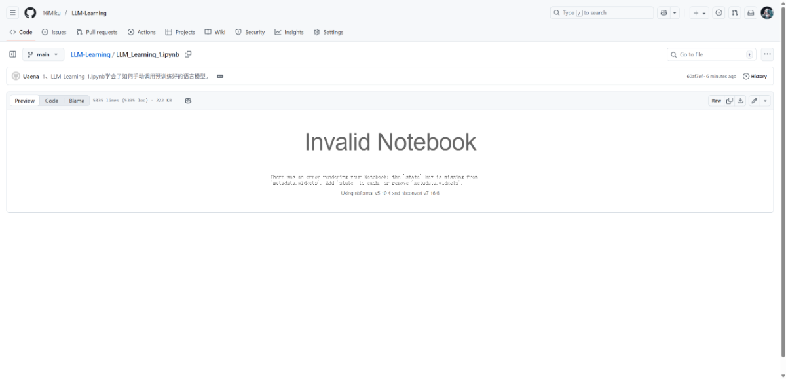

# 分析问题，为什么我的jupyter notebook无法在github查看？





根据您提供的截图和错误信息“Invalid Notebook: There was an error rendering your Notebook: the 'state' key is missing from metadata.widgets. Add 'state' to each, or remove 'metadata.widgets'.”，问题出在您的 Jupyter Notebook 文件（`LLM_Learning_1.ipynb`）的元数据中缺少了交互式部件（widgets）的状态信息。

GitHub 的 Notebook 渲染器在解析 `.ipynb` 文件时，如果检测到 `metadata.widgets` 部分，它会期望其中包含每个部件的有效 `state` 键。如果这个键缺失或格式不正确，渲染器就会报错，导致 Notebook 无法正常显示。

这通常发生在以下几种情况：
1.  您在 Notebook 中使用了交互式部件（如 `ipywidgets`），但在保存 Notebook 时，这些部件的状态没有被正确地保存到元数据中。
2.  您曾经使用了交互式部件，后来删除了它们或清除了所有输出，但 Notebook 文件中残留了不完整的 `metadata.widgets` 信息。

为了解决这个问题，GitHub 给出了两种建议：
1.  为每个部件添加 `state` 键。
2.  移除 `metadata.widgets`。

对于在 GitHub 上查看 Notebook 的场景，通常我们并不需要其交互性，只需要静态渲染结果。因此，最简单、最推荐的解决方案是 **移除 `metadata.widgets`**。

### 解决方案：使用 `nbstripout` 清理 Notebook

`nbstripout` 是一个非常有用的工具，它可以在您提交 Notebook 到 Git 仓库之前，自动清理 Notebook 中的输出、元数据等，包括我们现在遇到的 `metadata.widgets` 问题。这是处理 Jupyter Notebooks 版本控制的最佳实践之一。

**步骤一：安装 `nbstripout`**

如果您还没有安装 `nbstripout`，请在 PowerShell 中运行以下命令进行安装：

```powershell
pip install nbstripout
```

**步骤二：配置 Git 使用 `nbstripout`**

为了让 `nbstripout` 在每次提交 `.ipynb` 文件时自动清理，您需要将其配置为 Git 的过滤器。

1.  **全局配置（推荐，一次配置，所有仓库生效）**：
    ```powershell
    git config --global filter.nbstripout.clean "jupyter nbstripout"
    git config --global filter.nbstripout.smudge cat
    git config --global filter.nbstripout.required true
    ```
    或者 **局部配置（仅当前仓库生效）**：
    ```powershell
    git config filter.nbstripout.clean "jupyter nbstripout"
    git config filter.nbstripout.smudge cat
    git config filter.nbstripout.required true
    ```

2.  **在 `.gitattributes` 文件中指定 Notebook 类型**：
    在您的 Git 仓库根目录下创建一个名为 `.gitattributes` 的文件（如果已存在则编辑它），并添加以下内容：
    ```
    *.ipynb filter=nbstripout
    ```
    这将告诉 Git 对所有 `.ipynb` 文件应用 `nbstripout` 过滤器。

**步骤三：清理并重新提交 Notebook**

完成上述配置后，您需要对现有的 Notebook 文件进行一次清理，并将其重新提交。

1.  **手动清理（可选，但推荐在第一次配置后运行）**：
    虽然 Git 过滤器会在提交时自动运行，但为了确保当前有问题的 Notebook 被清理，您可以手动运行一次：
    ```powershell
    jupyter nbstripout LLM_Learning_1.ipynb
    ```
    此命令会直接修改 `LLM_Learning_1.ipynb` 文件，移除其中的输出和不必要的元数据。

2.  **提交更改**：
    ```powershell
    git add .gitattributes LLM_Learning_1.ipynb
    git commit -m "Fix: Clean Jupyter Notebook metadata for GitHub rendering"
    git push origin main # 或者您的分支名称
    ```

推送完成后，等待 GitHub 重新渲染您的 Notebook，它应该就能正常显示了。

### 替代方案：手动编辑 `.ipynb` 文件 (不推荐，容易出错)

如果您不想安装额外的工具，也可以手动编辑 `.ipynb` 文件。**请在操作前备份您的文件！**

1.  使用文本编辑器（如 VS Code, Notepad++）打开 `LLM_Learning_1.ipynb` 文件。
2.  Notebook 文件本质上是一个 JSON 文件。您需要找到顶层的 `metadata` 对象，并在其中查找 `widgets` 键。
3.  找到类似 ` "widgets": { ... } ` 的部分。
4.  **删除整个 ` "widgets": { ... } ` 键值对**。确保删除后 JSON 格式仍然有效（例如，如果它是 `metadata` 对象的最后一个键，前面不需要逗号；如果它后面还有其他键，则它后面需要逗号）。
5.  保存文件。
6.  提交更改到 Git：
    ```powershell
    git add LLM_Learning_1.ipynb
    git commit -m "Fix: Manually removed widgets metadata from Notebook"
    git push origin main
    ```

**示例（手动编辑前后的 JSON 片段）：**

**编辑前（可能导致问题的部分）：**
```json
{
 "cells": [
  // ... 其他单元格内容 ...
 ],
 "metadata": {
  "kernelspec": {
   "display_name": "Python 3",
   "language": "python",
   "name": "python3"
  },
  "language_info": {
   "codemirror_mode": {
    "name": "ipython",
    "version": 3
   },
   "file_extension": ".py",
   "mimetype": "text/x-python",
   "name": "python",
   "nbconvert_exporter": "python",
   "pygments_lexer": "ipython3",
   "version": "3.9.7"
  },
  "widgets": {  // <--- 找到这里
   "application/vnd.jupyter.widget-state+json": {
    "state": { // <--- 错误提示说这个state键可能缺失或有问题
     // ... 部件状态信息 ...
    }
   }
  }
 },
 "nbformat": 4,
 "nbformat_minor": 4
}
```

**编辑后（删除 `widgets` 部分）：**
```json
{
 "cells": [
  // ... 其他单元格内容 ...
 ],
 "metadata": {
  "kernelspec": {
   "display_name": "Python 3",
   "language": "python",
   "name": "python3"
  },
  "language_info": {
   "codemirror_mode": {
    "name": "ipython",
    "version": 3
   },
   "file_extension": ".py",
   "mimetype": "text/x-python",
   "name": "python",
   "nbconvert_exporter": "python",
   "pygments_lexer": "ipython3",
   "version": "3.9.7"
  }
 },
 "nbformat": 4,
 "nbformat_minor": 4
}
```

我强烈建议您使用 `nbstripout`，因为它是一个自动化且更可靠的解决方案，能够避免将来再次出现类似问题。


# 清理之后，原本的notebook的单元格的执行结果会被删除嘛？


是的，默认情况下，**`nbstripout` 会删除 Jupyter Notebook 中所有单元格的执行结果（输出）**。

这是 `nbstripout` 的主要功能之一，也是它被广泛用于 Git 版本控制的原因：

1.  **减少文件大小**：Notebook 的输出，尤其是图像、大的数据结构或大量的文本输出，会显著增加文件大小，导致 Git 仓库变得臃肿。
2.  **避免版本冲突**：每次运行 Notebook 都会生成新的输出，即使代码没有改变。这会导致不必要的 Git 差异（diffs）和合并冲突，使得版本历史难以追踪。
3.  **专注于代码逻辑**：在版本控制中，我们通常更关心代码本身的变化，而不是每次运行时的具体输出。输出可以通过重新执行 Notebook 来生成。
4.  **解决 GitHub 渲染问题**：正如您遇到的问题，有时不正确的输出元数据（如 `metadata.widgets`）会导致 GitHub 渲染失败。`nbstripout` 通过清理这些元数据来解决此类问题。

### 如果您想保留输出（不推荐用于 Git 仓库）

虽然不推荐将带有输出的 Notebook 提交到 Git 仓库，但如果您有特殊需求，`nbstripout` 也提供了一些选项来控制清理行为。

例如，您可以使用 `--no-strip-output` 选项来防止删除输出，但通常只在需要临时分享或演示时使用，而不是长期提交到 Git 仓库。

```powershell
jupyter nbstripout --no-strip-output your_notebook.ipynb
```
**但是，请注意，即使保留了输出，`nbstripout` 仍然会清理其他不必要的元数据，包括您遇到问题的 `metadata.widgets`。**

**总结：**

对于您在 GitHub 上无法查看 Notebook 的问题，`nbstripout` 的默认行为（删除输出和不必要的元数据）正是我们需要的，因为它能确保 Notebook 文件更“干净”、更适合版本控制和渲染。如果需要查看输出，可以在本地运行 Notebook。


# （给出了在GitHub上一个能渲染和一个不能渲染的notebook文件）请你分析两个文件的区别？


好的，同学，我们来详细分析一下这两个 Jupyter Notebook 文件（JSON 结构）的区别，这能非常清楚地解释为什么一个能在 GitHub 上查看，而另一个不能。

根据你之前提供的错误信息：“Invalid Notebook: There was an error rendering your Notebook: the 'state' key is missing from metadata.widgets. Add 'state' to each, or remove 'metadata.widgets'.”，问题核心就在于 `metadata.widgets` 这个部分。

### 文件一：可以在 GitHub 查看的 Notebook

```json
{
 "cells": [
  // ... 单元格内容 ...
 ],
 "metadata": {
  "kernelspec": {
   "display_name": "Python 3 (ipykernel)",
   "language": "python",
   "name": "python3"
  },
  "language_info": {
   "codemirror_mode": {
    "name": "ipython",
    "version": 3
   },
   "file_extension": ".py",
   "mimetype": "text/x-python",
   "name": "python",
   "nbconvert_exporter": "python",
   "pygments_lexer": "ipython3",
   "version": "3.10.16"
  }
 },
 "nbformat": 4,
 "nbformat_minor": 5
}
```

**分析：**
在这个文件中，`metadata`（元数据）对象中，**完全没有 `widgets` 这个键**。它只包含了 `kernelspec`（内核规格）和 `language_info`（语言信息）等基本信息。

### 文件二：不能在 GitHub 查看的 Notebook

```json
{
  "nbformat": 4,
  "nbformat_minor": 0,
  "metadata": {
    "colab": {
      "provenance": []
    },
    "kernelspec": {
      "name": "python3",
      "display_name": "Python 3"
    },
    "language_info": {
      "name": "python"
    },
    "widgets": { // <--- 看这里！这是关键区别！
      "application/vnd.jupyter.widget-state+json": {
        "052673dfd24d4124b0857a6260a76855": {
          "model_module": "@jupyter-widgets/controls",
          "model_name": "HBoxModel",
          "model_module_version": "1.5.0",
          "state": { // 内部有state键，但可能结构不符或有其他问题
            "_dom_classes": [],
            // ... 大量的部件状态数据 ...
          }
        },
        // ... 更多部件定义 ...
      }
    }
  },
  "cells": [
    // ... 单元格内容 ...
  ]
}
```

**分析：**
在这个文件中，`metadata` 对象中**包含了一个庞大的 `widgets` 键**。这个 `widgets` 键内部存储了大量关于 Jupyter 交互式部件（如 `HBoxModel`, `HTMLModel`, `FloatProgressModel` 等）的状态信息。

从你提供的输出可以看出，这些部件包括了：
*   下载进度条（`config.json: 100%`, `model.safetensors: 100%`, `generation_config.json: 100%` 等）。
*   这些进度条通常是在模型下载或加载时由 `transformers` 库或 Colab 环境自动生成的。

虽然 `widgets` 内部的每个部件定义（例如 `052673dfd24d4124b0857a6260a76855` 这个 ID 对应的对象）确实包含了 `state` 键，但 GitHub 的 Notebook 渲染器对这个 `metadata.widgets` 结构的解析非常严格。

**核心区别和问题原因：**

1.  **存在 `metadata.widgets`：** 不能在 GitHub 查看的 Notebook 包含了 `metadata.widgets` 部分，而可以查看的 Notebook 则没有。
2.  **GitHub 渲染器的严格要求：** GitHub 的 Notebook 渲染器在遇到 `metadata.widgets` 时，会尝试解析其中所有交互式部件的状态。如果这个结构不完全符合其预期（即使是微小的格式不符，或者某个 `state` 键的内容不符合其严格的校验标准），它就会报错，导致整个 Notebook 无法渲染。
3.  **交互式输出的副作用：** 你在 Colab 中运行代码时，像 `pipeline("text-generation")` 这样的操作，在下载模型资源时，会自动生成带有进度条的交互式部件。这些部件的状态，包括它们的 ID、模型类型、当前值等，都会被 Jupyter Notebook 环境自动保存到 `.ipynb` 文件的 `metadata.widgets` 中。

**解决方案的再次确认：**

你之前遇到的错误信息“the 'state' key is missing from metadata.widgets. Add 'state' to each, or remove 'metadata.widgets'”正是指向了这个问题。

*   **“Add 'state' to each”**：这个选项通常很难手动实现，因为 `widgets` 内部的结构非常复杂，而且可能涉及到多个嵌套的 `state`。
*   **“remove 'metadata.widgets'”**：这是最简单、最有效的解决方案。因为在 GitHub 上我们通常不需要 Notebook 的交互式功能，只需要静态的渲染结果。移除这个部分，就能避开 GitHub 渲染器的严格校验。

所以，你之前的 `nbstripout` 工具或者手动删除 `metadata.widgets` 的方法，正是解决这个问题的正确途径。它移除了那些在 GitHub 静态渲染时不需要，却又可能导致解析失败的复杂交互式部件状态信息。


# 手动删除 metadata.widgets后，对我notebook的代码和后续的使用有影响嘛？


这是一个非常好的问题，体现了你在思考操作的深层影响。

简而言之，**手动删除 `metadata.widgets` 对你 Notebook 的代码执行和后续学习流程基本没有负面影响，甚至是有益的。**

我们来详细分析一下：

### 1. 对 Notebook 代码的影响

*   **无影响**：`metadata.widgets` 存储的是 Jupyter Notebook 中交互式部件（widgets）的**状态信息**，而不是你的 Python 代码本身。你的 Python 代码是写在 `cells` 列表中的 `source` 字段里的。删除 `metadata.widgets` 不会修改、删除或以任何方式影响你的任何代码行。当你重新运行 Notebook 时，所有的代码都会像以前一样正常执行。

### 2. 对后续使用的影响

这需要区分两种情况：

#### a. 在本地或 Colab 等交互式环境中重新打开 Notebook

*   **交互式部件的状态会丢失**：如果你在 Notebook 中使用了 `ipywidgets` 这样的交互式部件（例如滑块、按钮、进度条等），并且这些部件在保存 Notebook 时有特定的状态（比如进度条显示 50%，或者一个滑块被拖动到了某个值），那么删除 `metadata.widgets` 后，这些**保存的部件状态会丢失**。当你重新打开 Notebook 时，这些部件会回到它们的默认初始状态，或者如果它们只在某个单元格运行后才显示，那么在运行该单元格之前它们将不可见。
*   **部件功能不受影响**：尽管保存的状态丢失了，但如果你重新运行创建和使用这些交互式部件的单元格，它们会**重新被创建并正常工作**。
*   **对你当前学习进度的影响微乎其微**：在你的案例中，`metadata.widgets` 很可能是由于 `transformers` 库在下载模型时自动生成的进度条部件所导致的。这些进度条通常是临时的，在下载完成后就不再需要其状态。因此，删除这部分元数据对你后续学习和实践几乎没有影响。你并不会因为丢失了某个下载进度条的“50%已完成”状态而无法继续学习。

#### b. 在 GitHub 上查看 Notebook

*   **积极影响**：删除 `metadata.widgets` 后，GitHub 的渲染器将不再遇到它无法解析的部件状态信息，从而**能够正常渲染你的 Notebook**。这是我们删除它的主要目的。

### 总结

*   **代码安全性**：删除 `metadata.widgets` 是安全的，不会破坏你的 Python 代码。
*   **功能损失**：唯一的“损失”是交互式部件的**上次保存的状态**。对于大多数学习和实践的 Notebook 来说，这通常不是一个关键的问题。如果你确实需要持久化复杂交互式部件的状态，那么可能需要更高级的策略（例如将部件状态单独保存到其他文件中，或者在代码中重新初始化）。
*   **GitHub 可视性**：这是解决 GitHub 渲染问题的**关键步骤**。

所以，请放心删除 `metadata.widgets`。对于你的学习LLM的旅程，专注于代码逻辑和模型输出的理解是更重要的，而那些临时的交互式部件状态，在版本控制和分享时往往是需要被清理掉的“噪音”。


