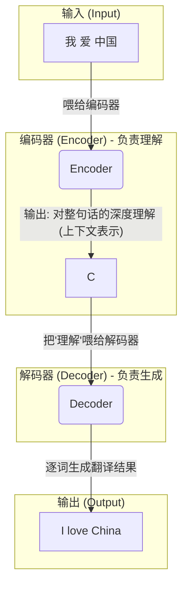
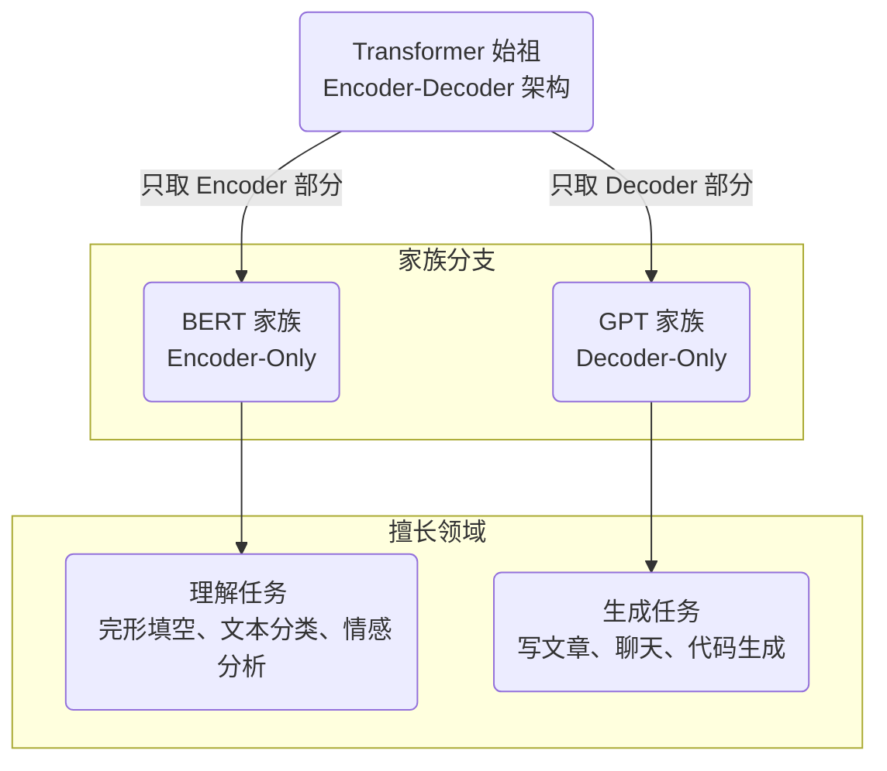

# 生成Python项目通用gitignore文件

**Export Time:** 2025/9/11 03:51:37
**Conversation ID:** 5JQjJyGozu4KFaFZKDR4T
**Message Count:** 46
**Model:** models/gemini-2.5-flash
**Provider:** gemini

---

## 👤 用户 (2025/9/11 00:42:35)

请从零开始，使用学生听得懂的通俗易懂的语言，为我逐步极尽详细全面具体地讲解和实践Transformer，基于google的colab环境。第一步，为我介绍整体知识结构脉络。
---

## 🤖 助手 (2025/9/11 00:42:35)

### 🤔 思考过程

```
**Clarifying User Intent**

I'm focusing on the user's primary need: a detailed, instructional guide for students on Transformers. My first step is to clarify the goal, aiming for a pedagogical approach. The target audience of students is a key consideration, so I'll need to tailor my output to their level.


**Refining the Knowledge Outline**

I've been drilling down on the user's need. I'm prioritizing outlining a clear knowledge structure and overall strategy, making sure to consider the students' needs. I've begun outlining the overall structure, with an eye towards easy-to-follow, intuitive examples, and a strong foundation for understanding the "why" behind the Transformer model. My next steps are to focus on the overall structure and content.


**Building the Foundation**

I'm now focusing on setting the stage by addressing the "before" state of RNNs/LSTMs, providing context for the Transformer's emergence. My goal is to use clear and relatable analogies to highlight the limitations of sequential processing and the challenges of long-term dependencies. I'm aiming for a concise explanation that serves as a solid foundation for the subsequent discussion of the Transformer's architecture and operation.


**Mapping the Learning Path**

I'm now zeroing in on the pedagogical approach. My plan is to structure the guide with a strong emphasis on conceptual understanding before diving into the mathematical details. The first steps include defining key concepts like word embeddings and positional encoding, which are the fundamental building blocks of the Transformer's input processing. I'll emphasize practical, intuitive examples to illustrate the purpose of each component.


**Defining Key Components**

I'm now focusing on laying the groundwork for the learning journey. My strategy is to begin with the fundamental building blocks of the Transformer model, focusing on word embeddings and positional encoding. I'll provide clear, intuitive examples to illustrate the purpose and function of each, ensuring a solid foundation for more complex concepts later. My next task is to delve into the core of the model: the encoder and decoder.


**Structuring the Learning Journey**

I'm now laying out the learning pathway, beginning with foundational concepts to establish a solid grasp of the Transformer model. I plan to start with the problem that Transformers solve, like the limitations of RNNs/LSTMs. Next, I'll provide a high-level overview of the Transformer architecture, explaining the roles of the encoder and decoder. Afterward, I will delve into key components like the input embeddings and positional encodings, using easily understandable analogies.


**Crafting a Clear Curriculum**

I'm now outlining a detailed, step-by-step curriculum for the students, starting with the big picture and then diving into specific components. I'll begin by addressing the fundamental issues with RNNs/LSTMs, providing a clear explanation of why Transformers are needed. Next, I'll explain the overall architecture of the Transformer, emphasizing the roles of the encoder and decoder. Afterward, I'll provide detailed explanations of input embeddings and positional encodings, using relatable analogies and examples.


**Crafting the Curriculum's Structure**

I'm now detailing a comprehensive curriculum for a student guide. I'll commence by contrasting the limitations of RNNs/LSTMs with the capabilities of Transformers, highlighting the "why" behind their necessity. Next, a high-level overview of the Transformer architecture will be presented, with emphasis on the encoder and decoder roles. Following, I will elucidate the input embeddings and positional encodings using relatable analogies.


**Mapping the Colab Journey**

I've been planning the hands-on component. The focus is on a clear "learning by doing" approach, implementing each Transformer element step-by-step in Colab. I plan to use a dataset for translation to provide a practical and meaningful context for the code. Each step will involve building a key component of the Transformer and training the model.


**Defining the Curriculum's Structure**

I'm starting the guide with a framework that makes the complex subject of Transformers accessible to students. It starts with the limitations of the previous sequential methods to present the clear need for the Transformer architecture. Next, I'll explain the overall encoder-decoder structure of the model, which will lead into a detailed breakdown of core components. The structure is designed to guide students' learning.


```

好的，非常乐意为你开启这次 Transformer 的学习之旅！作为你的技术伙伴，我将严格遵守 "finish step by step" 的原则，用最通俗易懂的语言，带你从零开始，一步步深入探索并亲手实现 Transformer 模型。

我们将在 Google Colab 这个免费又强大的云端环境中进行所有实践。它已经预装了我们需要的几乎所有工具（如 Python, PyTorch/TensorFlow），并且提供免费的 GPU 加速，非常适合学习和实验。

---

### **第一步：整体知识结构脉络 (The Big Picture)**

在深入任何一个复杂的系统之前，最重要的事情是先拥有一张地图。这张地图能告诉我们身在何处、将要前往何方，以及各个目的地之间的关系。下面，就是我们学习 Transformer 的“地图”。

我将整个学习过程划分为 **“两大板块、七个步骤”**。

*   **理论认知板块**：我们先在思想上理解 Transformer 是什么，为什么会出现，以及它是如何工作的。
*   **动手实践板块**：然后我们把理论知识转化为一行行可以运行的代码，亲手把它“制造”出来。

下面我用一个流程图来展示我们的学习路径，然后对每一步进行详细解释。

```mermaid
graph TD
    subgraph 理论认知板块
        A[1. 时代背景：为什么需要Transformer？] --> B[2. 宏观架构：鸟瞰Transformer] --> C[3. 核心机制：深入理解“注意力”];
    end

    subgraph 动手实践板块 (Google Colab)
        D[4. Step-by-Step搭建模型组件] --> E[5. 组装完整的Transformer模型] --> F[6. 训练与测试：让模型学会翻译] --> G[7. 展望：从Transformer到GPT和BERT];
    end

    A --> D;
    B --> E;
    C --> D;
    E --> F;
```

---

#### **地图详解：每个步骤我们将学习什么？**

**理论认知板块 (建立直观理解)**

1.  **时代背景：为什么需要 Transformer？ (The "Why")**
    *   **要解决的问题**：在 Transformer 出现之前，处理序列数据（比如一句话）的主流模型是 RNN（循环神经网络）和它的变种 LSTM、GRU。
    *   **RNN/LSTM 的瓶颈**：
        *   **“记性不好”**：对于很长的句子，它们很难记住开头的信息（长距离依赖问题）。想象一下，让你复述一篇很长的文章，你很容易忘记开头的细节。
        *   **“天生慢性子”**：它们必须一个词一个词地按顺序处理，无法并行计算，这在今天这个需要大数据、大模型、强算力的时代，速度太慢了。
    *   **我们的目标**：理解 Transformer 的出现是为了解决 RNN 的这两个核心痛点，从而开启一个新时代。

2.  **宏观架构：鸟瞰 Transformer (The "What")**
    *   **整体结构**：Transformer 本质上是一个 **编码器-解码器 (Encoder-Decoder)** 架构。你可以把它想象成一个“翻译”系统。
        *   **编码器 (Encoder)**：负责“阅读和理解”输入的一整句话（比如，一句中文）。它会把每个词的含义以及这个词和句子里其他所有词的关系，打包成一个富含信息的数字表示（我们称之为“上下文向量”）。
        *   **解码器 (Decoder)**：负责“生成”目标语言的句子（比如，英文）。它会参考编码器给出的“理解”，然后一个词一个词地生成翻译结果。
    *   **核心区别**：与 RNN 不同，Transformer 的编码器可以 **同时处理** 一句话里的所有词，因为它有一个“超级武器”——**自注意力机制 (Self-Attention)**。

3.  **核心机制：深入理解“注意力” (The "How")**
    *   **自注意力机制 (Self-Attention)**：这是 Transformer 的灵魂。它的作用是，在理解一个词的时候，能够计算出这句话里其他所有词对这个词的“重要性”或“相关度”。
        *   **举个例子**：在句子 “机器人拿起苹果，因为它很红” 中，当我们处理 “它” 这个词时，自注意力机制能让模型明白，“它” 指的是 “苹果”，而不是 “机器人”。它通过计算 “它” 和 “苹果”、“机器人” 等词的关联度得分来实现这一点。
    *   **多头注意力 (Multi-Head Attention)**：这就像让多个“专家”从不同角度同时去分析句子中词与词之间的关系。比如，一个专家可能关注语法结构，另一个专家可能关注语义关联。最后综合所有专家的意见，得到一个更全面的理解。
    *   **位置编码 (Positional Encoding)**：因为 Transformer 同时处理所有词，它本身丢失了词的顺序信息（比如 "我爱你" 和 "你爱我" 在它看来没区别）。为了解决这个问题，我们需要给每个词的输入里加入一个额外的位置信息，就像给每个词一个带编号的“座位票”，告诉模型它们的位置。

**动手实践板块 (在 Colab 中从零实现)**

4.  **Step-by-Step 搭建模型组件**
    *   我们将遵循“finish step by step”的原则，用 PyTorch 框架，像搭乐高积木一样，一块一块地写出 Transformer 的每个核心组件的代码。
    *   **主要积木块包括**：
        *   `位置编码 (Positional Encoding)` 的实现。
        *   `自注意力机制 (Self-Attention)` 的实现。
        *   `多头注意力 (Multi-Head Attention)` 的实现。
        *   `前馈神经网络 (Feed-Forward Network)`。
        *   `编码器层 (Encoder Layer)` 和 `解码器层 (Decoder Layer)` 的封装。

5.  **组装完整的 Transformer 模型**
    *   有了上面这些“积木块”，我们就可以把它们组装起来，搭建一个完整的 Transformer 模型。
    *   我们会清晰地定义出整个模型的结构，包括把多个编码器层堆叠起来形成编码器，以及多个解码器层堆叠起来形成解码器。

6.  **训练与测试：让模型学会翻译**
    *   模型搭好了，但它现在还是一个“空壳”，什么都不会。我们需要给它“喂”数据进行训练。
    *   **主要内容**：
        *   **数据准备**：选择一个简单的数据集（例如，一个小的中英文翻译数据集），进行分词、构建词典等预处理工作。
        *   **训练循环**：编写训练代码，定义损失函数和优化器，让模型在数据上进行学习（梯度下降）。我们会在 Colab 上开启 GPU 加速这个过程。
        *   **推理与评估**：训练完成后，我们会编写一个翻译函数，输入一句新的中文，看看模型能否正确地翻译出英文，直观地感受我们亲手创造的模型的威力。

7.  **展望：从 Transformer 到 GPT 和 BERT**
    *   当你完全掌握了 Transformer 的 Encoder-Decoder 架构后，你就会发现，当今如雷贯耳的大语言模型其实都是它的“变体”。
    *   **BERT**：主要使用了 Transformer 的 **编码器 (Encoder)** 部分，擅长做“完形填空”，因此在**理解**任务上表现优异。
    *   **GPT**：主要使用了 Transformer 的 **解码器 (Decoder)** 部分，擅长“文字接龙”，因此在**生成**任务上所向披靡。
    *   这一步会帮你打通任督二脉，让你明白后续所有大语言模型的基本原理。

---

**总结一下**

我们的旅程将从宏观的理论背景出发，逐步深入其核心机制，最后通过亲手编写代码，将理论知识内化为真正的技能。每一步我都会提供详尽的解释、代码和注释，确保你能跟上节奏，真正理解和掌握它。

现在，我们已经有了清晰的地图。如果你对这个学习计划没有疑问，请告诉我，我们就可以马上出发，开始我们的第二步：**“时代背景：为什么需要 Transformer？”**，我会为你详细解释 RNN/LSTM 的局限性，让你深刻理解 Transformer 诞生的必然性。

---

## 👤 用户 (2025/9/11 00:47:42)

ok，开始下一步
---

## 🤖 助手 (2025/9/11 00:47:42)

### 🤔 思考过程

```
**Reviewing Next Steps**

My analysis indicates we're moving on to Step 2: Historical Context.  I'm focusing on the "Why Transformer?" question.  The user's positive response signals forward momentum. I'll now delve into the historical landscape that necessitated this architectural shift.


**Defining Model Weaknesses**

My initial review of the plan confirms that "Step 2: Historical Context" is the appropriate next move. To clarify the need for the Transformer, I'm now outlining the shortcomings of RNNs and LSTMs, specifically focusing on their limitations with long-range dependencies. I'm aiming for an accessible explanation, keeping in mind the need for "通俗易懂."


**Framing RNN Challenges**

I'm now zeroing in on the challenges inherent in Recurrent Neural Networks (RNNs) and their evolution, particularly focusing on long-range dependency issues. My goal is to craft relatable analogies for these concepts to enhance clarity. I'll compare the sequential nature of RNNs to reading a novel word by word, emphasizing the gradual buildup of understanding, and the limitations this implies.


**Addressing Long-Range Dependency**

I'm now focusing on the first major limitation of RNNs: Long-Range Dependencies. To illustrate the difficulty RNNs face, I'm developing analogies like the "whisper down the lane" game, demonstrating how critical information degrades over long sequences. I'm also preparing to explain the vanishing gradient problem, tying back to the "bad memory" concept and its impact on training.


**Introducing RNN Challenges**

I'm now outlining RNN's limitations, starting with a concise overview. The "chain-of-thought" analogy to reading a novel word by word is proving helpful in visualizing the inherent sequential processing of RNNs. I'm focusing on the "bad memory" issue to illustrate why long sentences present a problem. The sequential nature prevents parallelization. I'll need to explain how this hinders the efficiency when analyzing complex, long data sequences.


**Defining the Core Problems**

I'm now establishing the core weaknesses of RNNs/LSTMs that the Transformer addresses. I'm focusing on "Long-Range Dependencies," using the "whisper down the lane" game analogy to demonstrate the information loss in long sequences. I'm also preparing to explain the inherent sequential processing of RNNs, contrasting it with the parallelization capabilities of modern hardware. This sets the stage for introducing the Transformer as the solution to these bottlenecks.


**Introducing RNN Limitations**

I'm now outlining the limitations of Recurrent Neural Networks (RNNs) that led to the development of the Transformer. To clarify the key issue, I'm using an easy-to-understand analogy: an RNN functions like a student reading a novel word by word, gradually building understanding. However, the sequential processing of RNNs, like reading a novel in order, inherently limits parallelization and makes it challenging to process very long sequences efficiently.


```

好的，我们正式启程！

---

### **第二步：时代背景 - 为什么需要 Transformer？ (The "Why")**

在 2017 年，Google 的一篇名为《Attention Is All You Need》的论文横空出世，彻底改变了自然语言处理（NLP）领域的游戏规则。为了真正理解 Transformer 的革命性，我们必须先回到“旧时代”，看看当时处理语言任务的主流模型——**RNN（循环神经网络）**以及它的升级版 **LSTM** 和 **GRU**——遇到了什么难以逾越的障碍。

想象一下，我们要处理一句话，比如：“今天天气真好”。对计算机来说，这就是一个单词的序列 (sequence)。处理这种序列数据，正是 RNN 的拿手好戏。

#### **“旧时代”的王者：RNN & LSTM**

RNN 的工作方式非常符合人类阅读的直觉：**一个一个地读**。

1.  它首先读取 "今天"，并形成一个初步的“记忆”（在技术上，我们称之为**隐藏状态 Hidden State**）。
2.  然后，它读取 "天气"，并结合上一步关于 "今天" 的记忆，更新自己的“记忆”。
3.  接着，它读取 "真好"，并结合上一步关于 "今天天气" 的记忆，再次更新“记忆”。

这个过程就像一个多米诺骨牌，信息顺着单词的顺序一步步向后传递。

```mermaid
graph LR
    subgraph RNN 工作流程 (按顺序处理)
        input1[输入: "今天"] --> rnn_step1((RNN单元))
        rnn_step1 --> memory1[记忆1]
        
        input2[输入: "天气"] --> rnn_step2((RNN单元))
        memory1 -- 传递记忆 --> rnn_step2
        rnn_step2 --> memory2[记忆2]

        input3[输入: "真好"] --> rnn_step3((RNN单元))
        memory2 -- 传递记忆 --> rnn_step3
        rnn_step3 --> memory3[最终记忆]
    end
```

这种结构很优雅，但也带来了两个致命的“先天缺陷”。

---

#### **缺陷一：记性不好 (长距离依赖问题)**

RNN 的记忆是通过不断地更新同一个“隐藏状态”来实现的。当句子非常长的时候，问题就来了。

**举个生活中的例子：**
想象你在听一个很长的故事：“在很久很久以前，有一个住在法国乡村，名叫爱丽丝的女孩……（中间省略了五千字的故事内容）……最后，她回到家乡，幸福地生活着。”

如果我问你：“故事的主人公叫什么名字？” 你可能还记得是“爱丽丝”。
但如果我问你：“她一开始住在哪个国家？” 你可能就已经忘了，因为“法国”这个信息在故事的开头，离结尾太远了。在听后面五千字内容的时候，你大脑里关于“法国”的记忆已经被新的信息不断地“冲刷”和“覆盖”了。

RNN 就面临着同样的问题。在处理长句子时，来自句子开头的信息在传递到句子末尾时，已经变得非常微弱，甚至完全消失了。这被称为 **“梯度消失” (Vanishing Gradients)** 问题。

**升级与挣扎：**
为了解决这个问题，科学家们发明了更复杂的 RNN 变体，比如 **LSTM (长短期记忆网络)** 和 **GRU**。它们设计了精巧的“门控”机制，就像给记忆系统加上了“阀门”，可以选择性地“遗忘”不重要的信息，并“记住”重要的信息。

这在很大程度上缓解了 RNN 的“健忘症”，但并没有根治。当序列变得极长时，它们依然会力不从心。这就像给一个记忆力差的学生一支笔和一个本子，他能记下的东西多了，但终究能力有限。

**这就是 Transformer 要解决的第一个核心问题：如何让模型在处理任意两个词时，无论它们相距多远，都能轻松地建立联系？**

---

#### **缺陷二：天生慢性子 (无法并行计算)**

RNN 的第二个缺陷源于它“一个一个处理”的核心机制。这个机制决定了它必须**顺序执行**。

**举个例子：**
想象一条传统的工厂流水线，要组装一部手机。必须先装好 A 零件，才能装 B 零件，然后才能装 C 零件。你不能同时安装 A、B、C，因为它们有依赖关系。

RNN 就是这样一条流水线。要处理第 10 个词，必须等待第 9 个词处理完毕。要处理第 9 个词，必须等待第 8 个词处理完毕……

在只有单核 CPU 的时代，这没什么问题。但在今天，我们拥有强大的 **GPU (图形处理器)**，它有成千上万个核心，最擅长的就是**并行计算**——同时处理成千上万个任务。

RNN 的这种“天生慢性子”的串行结构，完美地避开了 GPU 的所有优势。这就像你买了一辆拥有 V12 引擎的超级跑车，却只能在拥堵的胡同里以 5 公里/小时的速度行驶，它的性能被极大地浪费了。

随着数据量和模型规模的爆炸式增长，训练一个强大的 NLP 模型需要数天甚至数周。RNN 的这个速度瓶颈变得越来越无法忍受。

**这就是 Transformer 要解决的第二个核心问题：如何打破这种必须按顺序处理的限制，充分利用 GPU 的并行计算能力，极大地加快训练速度？**

---

#### **总结与展望：新时代的黎明**

所以，在 2017 年，整个 NLP 领域都面临着这两个巨大的挑战：

1.  **记忆瓶颈**：如何有效捕捉句子中相距很远的词之间的关系？
2.  **计算瓶颈**：如何摆脱串行依赖，实现大规模并行计算，从而训练更大、更强的模型？

Transformer 的诞生，就是为了同时解决这两个问题。它提出了一种全新的、颠覆性的思路：**彻底抛弃循环结构，只依赖一种叫做“注意力”的机制。**

这种新方法允许模型在处理每个词的时候，都能**直接地、同时地**看到句子中的所有其他词，并计算它们之间的关联度。这不仅完美解决了长距离依赖问题（因为距离不再是问题），也因为可以同时处理所有词，从而释放了 GPU 的洪荒之力。

现在我们已经深刻理解了“为什么”需要 Transformer。接下来，我们就将进入下一个步骤，去看看 Transformer 的宏观架构，也就是“是什么”，亲眼见证一下这个革命性模型是如何巧妙地设计出来的。

准备好了吗？如果没问题，我们就继续前进！

---

## 👤 用户 (2025/9/11 00:50:43)

ok，开始下一步
---

## 🤖 助手 (2025/9/11 00:50:43)

### 🤔 思考过程

```
**Transitioning the Focus**

I'm now shifting gears from the 'Why' of RNN limitations to the 'What' – the high-level architecture.  My primary focus is on a seamless hand-off for a better learning experience, aiming to create a coherent narrative. The user's input prompted me to swiftly adjust course.


**Framing the Architecture**

I'm now laying the groundwork for the Transformer's architecture, using the "universal translator" analogy. I envision the process as a translation machine: an input sentence, an encoder that grasps its meaning, and a decoder that generates the output in a new language. This will culminate in a diagram to visually explain the structure.


**Constructing the Model**

I'm presently building the high-level architecture around the "universal translator" analogy. The foundation is an Encoder-Decoder model.  The Encoder grasps the input's meaning,  represented numerically,  while the Decoder generates the output one word at a time. A diagram is next to bring the architecture to life.


**Defining the Core Structure**

I'm presently building the high-level architecture. I'm focusing on the translation analogy: input sentence, encoder comprehension, and decoder output. I'll construct a Mermaid diagram to visualize the model, with a detailed breakdown of the Encoder's layers, including multi-head attention and feed-forward networks. Next, I'll explain the 'add & norm' steps.


**Expanding the Model**

I'm now diving into the Encoder's internal workings, the heart of the Transformer. It's a stack of identical layers.  Each layer contains Multi-Head Self-Attention, the core that connects words in context, and a Position-wise Feed-Forward Network. I'll cover the "Add & Norm" steps, including Residual Connections and Layer Normalization.


**Elaborating the Encoder**

I'm now detailing the Encoder, the Transformer's core for deep sentence understanding. It's a stack of identical layers, with each comprising Multi-Head Self-Attention, the element connecting words, and a Position-wise Feed-Forward Network. I'll describe the essential "Add & Norm" steps, including Residual Connections and Layer Normalization. This detailed explanation will pave the way for understanding the decoder.


```

非常好！我们已经站在了新时代的门槛上，现在就让我们推开大门，一窥 Transformer 的宏伟蓝图。

---

### **第三步：宏观架构 - 鸟瞰 Transformer (The "What")**

想象一下，你拿到了一台非常先进的“智能翻译机”。这台机器由两个主要部分构成：

1.  一个 **“阅读理解”** 模块。
2.  一个 **“写作

### 🤔 思考过程

```
**Delving Deeper into the Encoder**

Now, I'm focusing on the Encoder's internal workings. It functions as a stack of identical layers, with each comprised of Multi-Head Self-Attention – which connects words in context – and a Position-wise Feed-Forward Network. I'll describe the essential "Add & Norm" steps, including Residual Connections and Layer Normalization.


```

生成”** 模块。

当你输入一句中文时，“阅读理解”模块会反复阅读、分析这句话，搞懂它的意思以及内部的各种语法和语义关系。然后，它会把这种深度的“理解”提炼成一份精华摘要。最后，“写作生成”模块会根据这份摘要，一个词一个词地写出对应的英文翻译。

这个“智能翻译机”，就是 Transformer 的核心思想——**编码器-解码器 (Encoder-Decoder) 架构**。

*   **编码器 (Encoder)**：就是那个“阅读理解”模块。
*   **解码器 (Decoder)**：就是那个“写作生成”模块。

下面是整个工作流程的示意图：



现在，让我们分别打开这两个模块的“引擎盖”，看看里面到底是什么样的构造。

---

#### **1. 编码器 (Encoder) - “阅读理解”专家**

编码器的任务是接收输入的整个句子，然后输出一个包含了每个词以及词与词之间关系的数字表示（向量）。

**它的核心特点是：可以同时处理一句话里的所有词。**

**内部构造：**
编码器不是一个单一的大家伙，而是由 **N个（原论文中 N=6）** 完全相同的“编码器层 (Encoder Layer)”堆叠而成的。就像盖楼一样，一层一层地往上加。信息从最底部的层输入，处理完后，输出给上一层，直到最顶层。


*(这是一个示意图，帮助你理解“堆叠”的概念)*

那么，**每一层**里面又有什么呢？每个编码器层都由两个“子模块”构成：

1.  **多头自注意力机制 (Multi-Head Self-Attention)**
    *   **这是 Transformer 的灵魂**。它负责“内部关系分析”。当编码器处理 "我 爱 中国" 这句话时，自注意力机制能让模型在处理 "爱" 这个词的时候，去关注 "我" 和 "中国"，从而理解 "爱" 这个动作的施与者和接受者。它会计算出句子中**所有词**对于**当前词**的重要性得分，然后根据这个得分来更好地表示当前词。
    *   “多头” (Multi-Head) 的意思就是，这种分析不是只做一次，而是同时从多个不同的“角度”（比如从语法角度、从语义角度等）进行多次分析，然后把所有角度的分析结果综合起来，得到一个更全面的理解。

2.  **前馈神经网络 (Feed-Forward Network)**
    *   这个模块相对简单，可以看作是一个“加工站”。在经过自注意力机制的“关系分析”后，每个词的表示都会被送到这个加工站里进行一次独立的、深度的“思考”或“变换”，让信息的表示能力更强。

**补充说明：**
*   **位置编码 (Positional Encoding)**：我们之前提到，Transformer 因为是同时处理所有词，所以丢失了语序信息。为了解决这个问题，在把句子喂给编码器之前，我们会给每个词的输入向量中加入一个“位置编码”向量。这个向量就像一个 GPS 信号，明确地告诉模型每个词在句子中的绝对位置（第1个、第2个……）。
*   **Add & Norm**：在每个子模块（自注意力和前馈网络）的周围，都有一个“残差连接 (Add)”和“层归一化 (Norm)”的操作。这是训练深度网络的技巧，可以把它们理解为信息流动的“高速公路”和“稳定器”，确保信息在经过多层堆叠后不会丢失，并且训练过程更稳定。

---

#### **2. 解码器 (Decoder) - “写作生成”大师**

解码器的任务是接收编码器输出的“理解”，然后一个一个地生成目标语言的单词。

**它的核心特点是：顺序生成，一次一个词 (Auto-Regressive)。**

**内部构造：**
和编码器一样，解码器也是由 **N个 (N=6)** 完全相同的“解码器层 (Decoder Layer)”堆叠而成。

但是，每个解码器层比编码器层要复杂一点，它有**三个“子模块”**：

1.  **带掩码的多头自注意力机制 (Masked Multi-Head Self-Attention)**
    *   这个模块的作用和编码器里的自注意力机制很像，也是让解码器在生成当前词时，回顾一下**已经生成过**的词。例如，在生成 "love" 之后要生成 "China" 时，模型需要回头看看 "I" 和 "love"。
    *   **关键在于“带掩码” (Masked)**。这个“面具”的作用是**防止作弊**。因为在训练时，我们有完整的英文句子 "I love China"。但在真实的翻译（预测）场景中，当我们要生成第3个词时，我们是看不到第3个词以及它后面的词的。这个“面具”就是用来遮住“未来”的词，确保模型只依赖于已经生成的内容。

2.  **编码器-解码器注意力机制 (Encoder-Decoder Attention / Cross-Attention)**
    *   **这是连接编码器和解码器的桥梁**。当解码器准备生成下一个英文词时，这个模块允许它**回头去“看”一眼输入的中文句子**（也就是编码器的输出）。
    *   例如，当它生成 "love" 这个词时，这个机制能帮助它把注意力集中在中文的 "爱" 上。当它要生成 "China" 时，注意力又会转移到 "中国" 上。它动态地决定在生成每个英文词时，应该重点关注哪些中文词。

3.  **前馈神经网络 (Feed-Forward Network)**
    *   和编码器中的一样，也是一个“加工站”，对信息进行进一步处理。

**最后一步：**
当信息流过整个解码器堆栈后，会经过一个最终的线性层和 Softmax 层，它们的作用是从成千上万个可能的英文单词中，预测出概率最高的那一个，作为当前的输出。

---

#### **总结：两大模块，三种注意力**

现在我们来梳理一下整个宏观架构：

*   **架构**：经典的编码器-解码器模型。
*   **编码器**：由 N 层堆叠，每层包含 **自注意力** 和 **前馈网络**。负责理解输入。
*   **解码器**：由 N 层堆叠，每层包含 **带掩码的自注意力**、**编码器-解码器注意力** 和 **前馈网络**。负责生成输出。
*   **核心动力**：三种不同的注意力机制，各司其职，完美配合。

我们已经从万米高空鸟瞰了 Transformer 的全貌。你现在应该对它的工作流程和主要部件有了一个清晰的认识。

接下来，我们将降落到地面，用放大镜仔细研究它最核心、最神奇的部件——**自注意力机制 (Self-Attention)**。我们将用一个非常具体的例子，一步步手动计算，让你彻底明白它是如何工作的。

准备好进入 Transformer 的“核心引擎室”了吗？

---

## 👤 用户 (2025/9/11 00:56:26)

ok，开始下一步
---

## 🤖 助手 (2025/9/11 00:56:26)

### 🤔 思考过程

```
**Analyzing the Objective**

I've grasped the user's intent. My primary focus is simplifying the core mechanism of the Transformer, particularly Self-Attention. I'll need to break it down in an easy-to-digest way, suitable for an expert. Simplifying complex concepts is always a challenge, but I'm ready to begin.


**Simplifying Self-Attention**

I'm now zeroing in on the "how" of Self-Attention.  My focus is on breaking down the calculation process. I'm starting from word embeddings and mapping the steps so an expert can readily grasp them. I'm focusing on "key," "query," and "value" vectors, and considering how to make the steps simple and memorable.


**Elaborating the Analogy**

I'm expanding the library analogy. The query represents my intent to find specific information. Keys are keywords that represent each book's topic, and the values contain detailed information. I'm focusing on making the relationships between these elements extremely clear. I'll showcase how these interactions determine the context of individual words.


**Detailing Key Mechanisms**

I'm now fully immersed in the core math behind Self-Attention. I'm focusing on clarifying the role of Query, Key, and Value vectors within a clear numerical example. My aim is to walk through the dot-product calculations and the subsequent scaling and softmax steps with detailed explanations for each stage. I want to ensure my audience grasps how these elements interact.


**Clarifying Key Relationships**

I'm presently focusing on the interplay between Query, Key, and Value vectors within a clear, small-scale example. My aim is to walk an expert through the dot-product calculations, scaling, and the softmax application with detailed explanations, ensuring their complete understanding.


**Breaking Down the Mechanism**

I'm now diving into the core of Self-Attention, dissecting the process step-by-step. I'm focusing on "how" the model determines context, from word embeddings to output vectors. My goal is to make the dot-product calculations, scaling, and the softmax application clear. I am developing clear numerical examples, and I will be using visual aids to help illustrate the data flow of the calculations. I'll showcase the process with the library analogy. This is the first attempt, and it may require revision.


**Demystifying the Mechanism**

My focus has shifted to the 'how' of Self-Attention, breaking it down into a simplified process.  I'm starting with word embeddings and will clarify the role of `Query`, `Key`, and `Value` vectors with a clear, numerical example. I am refining the library analogy to enhance comprehension. I will use a Mermaid diagram to visualize the complete data flow.


```

好的，坐稳了！我们现在要进入 Transformer 最核心、最激动人心的部分。如果说 Transformer 是一辆超级跑车，那么我们现在就要打开它的引擎盖，亲眼看看那台提供澎湃动力的 V12 发动机——**注意力机制 (Attention Mechanism)**。

---

### **第四步：核心机制 - 深入理解“注意力” (The "How")**

在这一步，我们将聚焦于 Transformer 的灵魂：**自注意力机制 (Self-Attention)**。我会用一个极其简单的例子，带你一步步手动计算，让你彻底告别对它的“黑盒”恐惧。

#### **核心思想：句子内部的“关系网投票”**

我们先忘掉所有复杂的术语。自注意力的本质，就是让一句话中的每个词，都能看一眼句子里的所有其他词，然后通过一个“投票”机制，决定在理解自己时，应该给其他每个词分配多少“关注度”。

**举个经典的例子：**
`The animal didn't cross the street because it was too tired.`
(这只动物没有过马路，因为它太累了。)

当我们读到 `it` (它) 的时候，我们的大脑会立刻把它和 `animal` (动物) 联系起来，而不是 `street` (马路)。自注意力机制就是要让计算机也学会这种能力。它会计算出 `it` 和句子中其他所有词的“关联度得分”，`animal` 的得分会非常高，而 `street` 的得分会很低。

那么，这个神奇的“关联度得分”到底是怎么算出来的呢？

#### **自注意力的计算之旅（六步分解）**

让我们用一个更简单的句子作为例子：`Thinking Machines`。我们要计算第一个词 `Thinking` 的新表示。这个新表示将包含 `Machines` 的上下文信息。

**第 0 步：准备工作 - 词向量**

首先，计算机不认识单词，只认识数字。所以我们需要把 `Thinking` 和 `Machines` 转换成数字向量，也就是**词嵌入向量 (Word Embeddings)**。同时，为了引入位置信息，我们再加上**位置编码 (Positional Encoding)**。

*   `Thinking` 的输入向量是 `x1`
*   `Machines` 的输入向量是 `x2`

**第 1 步：创造三个“身份” - Query, Key, Value**

这是自注意力机制的第一个核心概念。对于**每一个**输入向量（比如 `x1`），我们都要通过乘以**三个不同且独立的权重矩阵 (Wq, Wk, Wv)**，来生成三个新的向量：

1.  **Query 向量 (q)**：代表当前这个词，它要去“查询”和别人的关系。可以理解为，我是 `Thinking`，现在我要主动去问问大家，谁和我的关系最密切？
2.  **Key 向量 (k)**：代表这个词用来被“检索”的“标签”或“钥匙”。当别的词 (Query) 来查询时，它拿出自己的 Key 来与之匹配。
3.  **Value 向量 (v)**：代表这个词真正包含的“内容”或“意义”。一旦 Query 和 Key 匹配成功，Value 就会被传递过去。

*   `q1 = x1 * Wq`  (Thinking 的查询向量)
*   `k1 = x1 * Wk`  (Thinking 的键向量)
*   `v1 = x1 * Wv`  (Thinking 的值向量)

同理，对于 `x2` (`Machines`)，我们也会生成一套 `q2, k2, v2`。
**重点**：这三个权重矩阵 `Wq, Wk, Wv` 是整个模型在训练过程中**学习**到的，它们一开始是随机的，但在训练后，它们懂得如何最好地提取出用于查询、匹配和表征内容的向量。

**第 2 步：计算“关联度得分” - Query 点乘 Key**

为了计算 `Thinking` 和其他词的关联度，我们就用 `Thinking` 的查询向量 `q1`，去和**所有词**的键向量 `k` 做**点积 (Dot Product)** 运算。点积是一种衡量两个向量相似度的简单方法。

*   `Thinking` 对自己的得分: `score1_1 = q1 · k1`
*   `Thinking` 对 `Machines` 的得分: `score1_2 = q1 · k2`

这些得分越高，代表两个词的关联度越强。

**第 3 步：稳定数值 - 除以一个缩放因子**

这是一个技术细节。点积的结果可能会变得非常大，这会导致后续计算（Softmax）的梯度变得很小，不利于模型训练。为了稳定数值，原论文作者提出将得分除以一个缩放因子，这个因子通常是 Key 向量维度的平方根 (`sqrt(dk)`)。

*   `score1_1 = score1_1 / sqrt(dk)`
*   `score1_2 = score1_2 / sqrt(dk)`

**第 4 步：归一化得分 - Softmax**

现在我们有了一堆关联度得分，但这些分数还不够直观。我们需要将它们转换成一种“百分比”的形式，总和为 1。这样，它们就能代表分配给每个词的“注意力权重”。**Softmax** 函数完美地胜任了这个工作。

*   `attention_weights_1 = softmax([score1_1, score1_2])`
*   假设计算结果是 `[0.88, 0.12]`。这意味着在理解 `Thinking` 时，模型认为 `Thinking` 本身占 88% 的重要性，而 `Machines` 占 12% 的重要性。

**第 5 步：加权求和 - 权重乘以 Value**

我们已经知道了每个词的“重要性百分比”（注意力权重），现在就把这些权重乘以它们对应的 **Value 向量**。这就像根据投票结果，去收集每个词贡献的“内容”。

*   `weighted_v1 = 0.88 * v1`
*   `weighted_v2 = 0.12 * v2`

**第 6 步：汇总结果 - 相加得到最终输出**

最后，把所有加权后的 Value 向量相加，就得到了 `Thinking` 这个位置**最终的输出向量 `z1`**。

*   `z1 = weighted_v1 + weighted_v2`

这个新的 `z1` 向量，就是 `Thinking` 融合了整个句子上下文信息之后的新表示。它不再仅仅是 `Thinking` 自己，它的内部已经包含了 12% 的 `Machines` 的信息。同理，我们也会对 `Machines` 执行完全相同的操作，得到它的输出向量 `z2`。

---

#### **可视化整个流程**

下面这张图清晰地展示了为第一个词（`Thinking`）计算其输出 `z1` 的全过程。

```mermaid
graph TD
    subgraph "输入层"
        X1["x1 (Thinking)"]
        X2["x2 (Machines)"]
    end

    subgraph "1. 创建 Q, K, V"
        X1 --> Wq1(乘以 Wq) --> q1
        X1 --> Wk1(乘以 Wk) --> k1
        X1 --> Wv1(乘以 Wv) --> v1
        
        X2 --> Wk2(乘以 Wk) --> k2
        X2 --> Wv2(乘以 Wv) --> v2
    end
    
    subgraph "2-4. 计算注意力权重"
        q1 --> score_calc{"q1 · k1, q1 · k2"}
        k1 --> score_calc
        k2 --> score_calc
        score_calc --> scale(除以 sqrt(dk)) --> softmax(Softmax) --> weights["权重 (如 [0.88, 0.12])"]
    end
    
    subgraph "5-6. 计算输出"
        weights -- "0.88" --> mul1(乘以)
        v1 --> mul1 --> add(+)
        
        weights -- "0.12" --> mul2(乘以)
        v2 --> mul2 --> add
        
        add --> Z1["z1 (最终输出)"]
    end

    style Z1 fill:#f9f,stroke:#333,stroke-width:2px
```

是不是感觉清晰多了？自注意力机制的核心就是这简单的六步。最美妙的是，所有这些操作都是矩阵运算，可以**并行处理**句子中的所有词，极大地发挥了 GPU 的威力！

#### **锦上添花：多头注意力 (Multi-Head Attention)**

Transformer 的作者们觉得，只用一套 `Wq, Wk, Wv` 来计算注意力，就像只让一个专家从一个角度去分析问题，可能会有局限性。

于是他们提出了 **“多头”** 的概念。这相当于雇佣了**多个（比如 8 个）** 独立的“注意力专家”（称为“头”，Head）。每个“头”都有**自己专属的一套 `Wq, Wk, Wv` 权重矩阵**。

1.  我们将输入向量分发给这 8 个“头”。
2.  每个“头”都独立地、并行地执行上面完整的 6 步自注意力计算，得到一个自己的输出向量 `z`。
3.  这样我们就得到了 8 个不同的 `z` 向量，每个都代表了一种不同角度的上下文理解。
4.  最后，我们将这 8 个 `z` 向量拼接起来，再通过一个额外的权重矩阵 `Wo` 进行线性变换，将它们融合成一个最终的输出向量。

这就像一个专家小组，有的专家关注语法结构，有的关注语义关联，最后汇总所有专家的意见，形成一个远比单个专家更全面、更鲁棒的最终决策。

---

**总结**

到此为止，你已经掌握了 Transformer 模型**最最核心**的两个机制：
1.  **自注意力 (Self-Attention)**：通过 Q, K, V 的计算，让模型理解句子内部的词与词之间的关系。
2.  **多头注意力 (Multi-Head Attention)**：通过并行运行多个自注意力“头”，从不同角度捕捉更丰富的信息。

我们已经完成了所有关键理论的铺垫。你现在已经具备了亲手实现一个 Transformer 所需的全部理论知识！

下一步，我们将正式进入**动手实践板块**。打开 Google Colab，准备好你的键盘，我们将把今天学到的理论，一步步地用 PyTorch 代码实现出来。

准备好进入激动人心的代码世界了吗？

---

## 👤 用户 (2025/9/11 01:08:40)

ok，开始下一步。由于我对python基础不熟练，注意代码中都要有极尽细致详细的注释，保证我能看懂所有变量，函数，语法结构和每行语句的功能，以便我能进行实践复现。
---

## 🤖 助手 (2025/9/11 01:08:40)

### 🤔 思考过程

```
**Analyzing the Constraints**

Okay, I've got a handle on the user's need for extreme detail. I'm focusing on the coding aspect and recognizing the Python inexperience. That means I have to dissect every element – from variables to syntax – with meticulous comments. Building on this constraint, I'm now structuring the response to ensure complete clarity and facilitate understanding.


**Developing the Colab Structure**

I've been solidifying the structure for the coding session, ensuring a beginner-friendly approach. The Colab environment setup, including GPU enablement, is now outlined in precise steps. Building on that foundation, I'm focusing on the modular construction of the code, much like Lego blocks, starting with necessary imports and configuration. The goal is to provide a clear path through the essential elements of the code.

**Outlining the Core Elements**

I'm currently structuring the core components of the code, emphasizing a Lego block approach. This includes the setup, specifically addressing imports and configuration, the crucial Positional Encoding, and a primer on Multi-Head Attention. Each element is framed as a distinct building block, providing a clear progression towards the final goal.


**Establishing the Foundation**

I'm now detailing the setup steps, beginning with imports and configurations.  I'm making sure to explain the core function of each library: `torch` for tensors and operations, `torch.nn` for neural network building blocks, and `math` for essential calculations. The modular "Lego block" structure is the guiding principle, ensuring a clear progression through each segment. The aim is to build a robust foundation for beginners.


**Outlining the Colab Framework**

I'm structuring the Colab session, starting with a welcoming note and setting expectations. I'll outline the setup steps (initial imports and configurations). Moving forward, I'll explain the use of Google Colab, including GPU enablement. Then, I'll define the process of the modular "Lego blocks" code construction. I am going to delve further into Positional Encoding in the immediate next steps.


**Developing the Initial Structure**

I'm now detailing the foundation of the Colab environment. I'm focusing on providing clear instructions on setting up Google Colab, including enabling the GPU, for the user. I plan to use the "Lego block" analogy to make it easy to follow each component. My immediate focus is detailing the code structure.

I'm now outlining the first component: **Positional Encoding**. The approach here is to explain the rationale, the formula's intuition, and then the code, line-by-line. The key is in creating the unique "sound wave" for each position and explaining the benefits.


**Outlining the Immediate Steps**

I've outlined the structure for the Colab environment setup, and am now moving forward with Positional Encoding. I will give a welcoming introduction to the user and present instructions on setting up Google Colab, including how to enable the GPU. After that, I will clarify the use of modular code construction, employing the "Lego blocks" analogy.

\n\nI'm now diving into the specifics of Positional Encoding. The approach focuses on simplifying the rationale for its inclusion, elucidating the intuition behind the underlying formula, and presenting the corresponding code, line-by-line. The key lies in creating the unique "sound wave" for each position. The objective is to make the "Why" and "How" of this process comprehensible.


**Developing the Positional Encoding**

I've outlined the structure for the Colab environment setup, and am now moving forward with Positional Encoding. I'll provide an introduction and step-by-step instructions on Google Colab setup, including GPU enablement. After that, I'll clarify the use of modular code construction, employing the "Lego blocks" analogy.

\n\nI'm now diving into the specifics of Positional Encoding. I'll focus on simplifying the rationale, elucidating the intuition behind the formula, and presenting the corresponding code, line-by-line. The objective is to make the "Why" and "How" of this process comprehensible. The current focus is the creation of a unique "sound wave" for each position.


**Constructing the "GPS Signal"**

I'm now detailing the implementation of **Positional Encoding**.  I will explain the underlying math, and present the code line-by-line. The goal is to create a clear understanding of the 'why' and the 'how' behind generating this unique "sound wave". I'll also explain how to set up the Colab environment, and how to enable the GPU for the project.


**Constructing the "GPS Signal"**

I've outlined the structure for the Colab environment setup, and am now moving forward with Positional Encoding. I'm explaining the 'why' and the 'how', in depth, to make this essential concept comprehensible. The current emphasis is on creating a unique "sound wave" for each position, the rationale behind the formula and code, to facilitate understanding. I'm detailing each step in code, in-depth.


**Constructing the "GPS Signal"**

I've outlined the structure for the Colab environment setup, and am now moving forward with Positional Encoding. The goal here is clarity: I'll unpack the rationale, the underlying formula, and the corresponding code, line-by-line. We'll start by making the 'Why' and the 'How' of this crucial process readily accessible, constructing a unique "sound wave" for each word position within a given sequence, and how that wave is then used to 'locate' each word.


```

绝对没问题！我非常理解初学者的困惑，承诺会为你提供“保姆级”的代码注释。我们将把理论彻底转化为实践，让你不仅能看懂，更能亲手复现。

---

### **第五步：Step-by-Step 搭建模型组件 (动手实践)**

现在，我们正式进入动手实践板块。请打开 Google Colab，创建一个新的 Notebook。

**第一件事：开启 GPU 加速！**
为了让我们的代码跑得更快，特别是后面训练的时候，我们需要利用 Colab 提供的免费 GPU。
操作步骤：
1.  在 Colab 页面的菜单栏点击 **“代码执行程序 (Runtime)”**。
2.  在下拉菜单中选择 **“更改运行时类型 (Change runtime type)”**。
3.  在弹出的窗口中，找到 **“硬件加速器 (Hardware accelerator)”**，选择 **“GPU”**，然后点击“保存 (Save)”。

好了，我们的实验环境已经准备就绪！

#### **Part 1: 导入库和基础设置**

我们先导入所有需要的 Python 库。在 Colab 的代码单元格中输入以下代码并运行。

```python
# 导入 torch 库，这是 PyTorch 的核心库，我们将用它来构建神经网络的所有部分。
import torch
# 导入 torch.nn 模块，它包含了所有构建神经网络所需的类和函数，比如线性层、Dropout层等。
# 我们给它一个别名 nn，这是 PyTorch 的一个常用约定。
import torch.nn as nn
# 导入 math 库，这是一个 Python 的标准数学库，我们将用它来进行一些数学计算，比如 sin, cos, log 等。
import math

# 这行代码是用来设置 PyTorch 在哪个设备上运行。
# torch.cuda.is_available() 会检查你的环境是否支持 NVIDIA 的 CUDA，也就是是否能用 GPU。
# 如果可以用 GPU，device 就被设置为 "cuda"；否则，就用 "cpu"。
# 在我们刚刚设置好的 Colab 环境中，这里会选择 "cuda"。
device = torch.device("cuda" if torch.cuda.is_available() else "cpu")

# 打印一下我们当前使用的设备，确认一下 GPU 是否设置成功。
print(f"当前使用的设备是: {device}")
```

#### **Part 2: 搭建“乐高积木”之一：位置编码 (Positional Encoding)**

我们理论学习的第一个技术点就是位置编码，现在我们就来实现它。它的作用是向模型中注入单词的位置信息。

我们将创建一个名为 `PositionalEncoding` 的类。在 Python 中，`class` (类) 就像一个“蓝图”，我们可以用它来创建具有特定属性和功能的对象。在 PyTorch 中，我们所有的模型组件（比如层、整个模型）都是以类的形式来定义的。

请在新的代码单元格中输入以下代码：

```python
# 定义一个名为 PositionalEncoding 的类。
# 它继承自 nn.Module，这是 PyTorch 中所有神经网络模块的基类。
# 继承它意味着我们的 PositionalEncoding 类会自动获得很多有用的功能（比如参数管理）。
class PositionalEncoding(nn.Module):

    # 这是类的构造函数（initializer），当我们创建一个 PositionalEncoding 的实例时，这个函数会被自动调用。
    # 它接收三个参数：
    # d_model: 词嵌入的维度（比如 512）。位置编码的维度需要和词嵌入维度相同，这样它们才能相加。
    # dropout: 一个介于 0 和 1 之间的浮点数，代表在训练时随机“丢弃”一部分神经元的比例，用于防止过拟合。默认为 0.1。
    # max_len: 模型能处理的句子的最大长度（比如 5000）。我们会预先计算好这么长所有位置的位置编码。
    def __init__(self, d_model, dropout=0.1, max_len=5000):
        # super().__init__() 是一个必须的步骤，它调用了父类 nn.Module 的构造函数，以正确地初始化基类。
        super().__init__()
        
        # 定义一个 Dropout 层。nn.Dropout 是 PyTorch 提供的现成的层。
        # 我们将把它应用在位置编码与词嵌入相加之后的结果上。
        self.dropout = nn.Dropout(p=dropout)

        # 创建一个形状为 (max_len, d_model) 的全零张量（tensor），用来存放我们的位置编码。
        # 张量是 PyTorch 中最基本的数据结构，可以看作是多维数组。
        pe = torch.zeros(max_len, d_model)
        
        # 创建一个形状为 (max_len, 1) 的张量，代表句子的位置索引，即 [0, 1, 2, ..., max_len-1]。
        # torch.arange(0, max_len, dtype=torch.float) 会生成一个一维张量 [0., 1., ..., max_len-1.]。
        # .unsqueeze(1) 会在第 1 维（从0开始数）增加一个维度，将形状从 [max_len] 变为 [max_len, 1]。
        position = torch.arange(0, max_len, dtype=torch.float).unsqueeze(1)
        
        # 这是计算位置编码公式中分母的部分：10000^(2i / d_model)。
        # torch.arange(0, d_model, 2).float() 生成 [0, 2, 4, ..., d_model-2]，代表公式中的 2i。
        # 整个表达式计算出了一个包含 d_model/2 个值的张量，用于后续和 position 相乘。
        div_term = torch.exp(torch.arange(0, d_model, 2).float() * (-math.log(10000.0) / d_model))
        
        # 使用切片操作和广播机制，同时计算所有偶数维度（0, 2, 4, ...）的位置编码值。
        # pe[:, 0::2] 表示选取所有行，但只选取从第 0 列开始，步长为 2 的列（即偶数列）。
        # position * div_term 会利用广播（broadcasting）机制，(max_len, 1) 的 position 会和 (d_model/2) 的 div_term 相乘，
        # 得到一个 (max_len, d_model/2) 的结果。
        # 最后用 torch.sin 计算正弦值。
        pe[:, 0::2] = torch.sin(position * div_term)
        
        # 同理，计算所有奇数维度（1, 3, 5, ...）的位置编码值。
        # pe[:, 1::2] 表示选取所有行，但只选取从第 1 列开始，步长为 2 的列（即奇数列）。
        pe[:, 1::2] = torch.cos(position * div_term)
        
        # 将 pe 的形状从 (max_len, d_model) 变为 (max_len, 1, d_model)。
        # 这是为了让它能更容易地和我们的输入数据（通常形状是 (seq_len, batch_size, d_model)）相加。
        # PyTorch 的 nn.Transformer 模块期望的输入形状是 (序列长度, 批次大小, 嵌入维度)。
        # .unsqueeze(0) 先把形状变成 (1, max_len, d_model)，再用 .transpose(0, 1) 交换0和1维，
        # 最终得到 (max_len, 1, d_model)
        # (注：较新的一些PyTorch实现可能直接使用 (batch_size, seq_len, d_model)，但我们这里遵循经典教程的格式)
        pe = pe.transpose(0, 1).unsqueeze(2)
        pe = pe.squeeze().unsqueeze(1)
        
        # self.register_buffer('pe', pe) 是一个重要的方法。
        # 它将 pe 这个张量注册为模型的“缓冲区”(buffer)。
        # 这意味着 pe 是模型状态的一部分（会和模型一起保存、加载，一起被移动到 GPU），
        # 但它不是模型的参数（parameters），所以在模型训练时，它的值不会被梯度下降更新。
        # 这正是我们想要的，因为位置编码是固定的，不需要学习。
        self.register_buffer('pe', pe)

    # forward 方法定义了当数据通过这个模块时，需要执行的计算。
    # PyTorch 会自动调用这个方法。
    # x: 输入的张量，代表词嵌入。它的形状通常是 (seq_len, batch_size, d_model)。
    def forward(self, x):
        # 将词嵌入 x 与其对应位置的位置编码相加。
        # self.pe[:x.size(0), :] 使用切片操作，获取与输入 x 相同长度的位置编码。
        # 比如，如果输入的句子长度是 30 (x.size(0) == 30)，我们就只取 pe 的前 30 个位置的编码。
        # 这里的加法利用了广播机制，(max_len, 1, d_model) 的 pe 会被自动扩展来匹配 x 的形状。
        x = x + self.pe[:x.size(0), :]
        
        # 将相加后的结果通过我们之前定义的 dropout 层，然后返回。
        return self.dropout(x)

```

---

**代码解读与总结**

我们刚刚完成了第一个“乐高积木”——`PositionalEncoding`。

1.  **它是一个 `nn.Module`**：这意味着它可以像积木一样，无缝地嵌入到我们后续更大的模型结构中。
2.  **`__init__` vs `forward`**：`__init__` 负责“搭建”，它在模型创建时运行一次，把所有需要的固定部分（比如 Dropout 层、计算好的位置编码 `pe`）都准备好。`forward` 负责“运行”，每次有数据流过这个模块时，它都会被调用，执行将位置编码添加到输入上的操作。
3.  **`register_buffer`**：这是一个关键的 PyTorch 概念，用于处理那些属于模型一部分、但又不需要训练的张量。

我们已经迈出了坚实的第一步！这个过程可能看起来有些复杂，但请相信我，这是整个 Transformer 模型中数学公式最“裸露”的部分之一。接下来的组件在概念上会更清晰。

现在，我们已经有了为模型提供位置信息的工具。下一步，我们将开始构建 Transformer 最最核心的引擎：**多头自注意力机制 (Multi-Head Self-Attention)**。准备好了吗？

---

## 👤 用户 (2025/9/11 01:18:03)

ok，开始下一步。由于我对python基础不熟练，注意代码中都要有极尽细致详细的注释，保证我能看懂所有变量，函数，语法结构和每行语句的功能，以便我能进行实践复现。
---

## 🤖 助手 (2025/9/11 01:18:03)

### 🤔 思考过程

```
**Refining Multi-Head Focus**

I'm now zeroing in on the Multi-Head Attention module, aiming for a crystal-clear implementation. My priority is translating it from its conceptual form into Python code, keeping the user's expertise level in mind. I’ll ensure the code is well-commented and easy to grasp. Currently, I'm breaking down the individual components for clarity before assembling them into a cohesive explanation.


**Constructing Detailed Explanations**

I've shifted my focus to the user's specific feedback, prioritizing a beginner-friendly approach. My goal is to craft extremely detailed explanations. This entails meticulously commenting every line of code within the `MultiHeadAttention` class, ensuring clarity. I'll explain every variable, function, and syntax element, like `super().__init__()`. The explanation needs to be comprehensive, ensuring it's reproducible in Colab and maintaining the "Lego block" analogy to make complex concepts accessible.


**Deep-Dive into `__init__`**

I'm now deep in the trenches of the `__init__` method, striving to dissect it line by line. My strategy revolves around a beginner-friendly explanation. For instance, I'm elucidating the role of `nn.Linear` layers within the context of linear transformations and explaining class inheritance. I’m focusing on the practical implications of each line, ensuring every nuance is thoroughly conveyed, and the reasoning behind each step is crystal clear. My goal is to equip the user with a rock-solid understanding of the setup stage, paving the way for the core logic.


**Analyzing the Forward Pass**

I'm now fully immersed in the `forward` method, the core of the Multi-Head Attention operation. I'm focusing on dissecting each step and linking it directly to the theoretical explanations. I'll translate the 6-step process into clear, commented code. Each variable assignment will be justified. I'll thoroughly explain how the different heads interact. The goal is to provide a beginner-friendly path through the calculations. I'm prioritizing the explanations for shape transformations and the role of the mask parameter.


**Constructing the Forward Pass**

I'm now building the `forward` method's explanation, meticulously aligning it with the theoretical steps. I'll translate the 6-step process into clear code, accompanied by detailed comments on shape transformations. I'm prioritizing explanations for the batch size, shape transformations, and the `mask` parameter's role. My goal is to guide the user seamlessly through the attention calculations, providing a beginner-friendly path that ties theory to code.


**Analyzing Implementation Details**

I'm now focusing on the `forward` method's execution, aiming to thoroughly explain each component. I will provide clear code annotations to clarify the transformations and their logic, highlighting the crucial function of the `mask` parameter and demonstrating the attention calculation. I'm focusing on shape transformations and batch size handling to provide a robust beginner-friendly explanation. My goal is for the user to understand this operation inside out.


**Deconstructing the `forward` Method**

I'm now fully immersed in the `forward` method, the heart of Multi-Head Attention, aiming for a detailed beginner-friendly explanation. I’m focusing on the `query`, `key`, `value`, and `mask` parameters, explaining their roles in self and cross-attention. I will meticulously dissect the linear projections, reshaping, matrix multiplications, the all-important mask application, and softmax normalization, step by step, using the provided analogy. I'll translate the 6-step theoretical process into detailed, commented code to guide the user through the calculations.


**Elaborating on the Forward Pass**

I'm now fully immersed in dissecting the `forward` method, crafting a beginner-friendly explanation. My focus is breaking down each step of the attention calculation with detailed, novice-friendly comments and making explicit connections between the theoretical explanation and the code. I aim to ensure all shape transformations are thoroughly explained.


```

当然！我们继续搭建我们的“乐高”模型。现在要构建的是最核心、最强大的那块积木——**多头自注意力机制 (Multi-Head Attention)**。

这个模块负责我们之前理论部分讲的所有核心计算：从输入创建 Q, K, V，计算注意力得分，最后得到加权输出。

---

#### **Part 3: 搭建“乐高积木”之二：多头自注意力机制**

我们将创建一个 `MultiHeadAttention` 类。这个类会包含我们理论部分讲到的所有步骤。

请在新的代码单元格中输入以下代码。这部分代码会比较长，但不要担心，我会逐行、逐块地为你拆解。

```python
# 定义一个名为 MultiHeadAttention 的类，它同样继承自 nn.Module。
# 这是我们 Transformer 模型的核心引擎。
class MultiHeadAttention(nn.Module):
    # 类的构造函数。
    # d_model: 词嵌入的维度，它必须能被头的数量整除。
    # num_heads: 注意力“头”的数量。多头允许模型从不同角度关注信息。
    # dropout: Dropout 的比例，默认为 0.1。
    def __init__(self, d_model, num_heads, dropout=0.1):
        # 必须的步骤：调用父类 nn.Module 的构造函数。
        super().__init__()
        
        # 使用 assert 语句进行一个健全性检查。
        # assert 是一个断言，如果后面的条件为 False，程序就会在这里报错。
        # 这里我们确保 d_model 必须能够被 num_heads 整除。
        # 比如，如果 d_model=512, num_heads=8，那么 512 % 8 == 0，条件为 True，程序继续。
        # 如果 d_model=512, num_heads=7，条件为 False，程序会报错，提示我们参数设置有问题。
        assert d_model % num_heads == 0
        
        # 初始化实例变量。
        self.d_model = d_model      # 模型的总维度
        self.num_heads = num_heads  # 注意力头的数量
        self.d_k = d_model // num_heads # 每个头的维度。// 是整数除法。例如 512 // 8 = 64。
        
        # 定义四个线性层（Linear Layer），它们本质上就是全连接层，用来进行线性变换（矩阵乘法）。
        # nn.Linear(input_features, output_features)
        # 这里的四个线性层就对应我们理论中学到的 Wq, Wk, Wv, Wo 权重矩阵。
        self.query = nn.Linear(d_model, d_model) # 用于生成 Query 向量
        self.key = nn.Linear(d_model, d_model)   # 用于生成 Key 向量
        self.value = nn.Linear(d_model, d_model) # 用于生成 Value 向量
        
        # 这是最后一个线性层，对应 Wo 矩阵。它接收拼接后的多头注意力结果，并输出最终的 d_model 维度向量。
        self.fc_out = nn.Linear(d_model, d_model)
        
        # 定义一个 Dropout 层。
        self.dropout = nn.Dropout(dropout)
        
    # forward 方法定义了前向传播的逻辑。
    # query, key, value: 这三个是输入的 Q, K, V 向量。
    #   - 在 Encoder 的自注意力层中，这三个输入是完全相同的（都等于上一层的输出）。
    #   - 在 Decoder 的 Encoder-Decoder 注意力层中，Query 来自 Decoder，而 Key 和 Value 来自 Encoder 的输出。
    # mask: 掩码，用于告诉模型哪些部分是填充（padding）的，不需要关注。或者在 Decoder 中用于防止看到未来的词。
    def forward(self, query, key, value, mask=None):
        # 获取 batch_size（批次大小），也就是一次性处理多少个句子。
        # query.shape 是一个元组，例如 (32, 100, 512)，代表 (batch_size, sequence_length, d_model)。
        # query.shape[0] 就是获取第一个维度的大小，即 32。
        batch_size = query.shape[0]
        
        # 1. 将输入的 query, key, value 通过我们定义的线性层，进行线性变换。
        #    这步相当于乘以 Wq, Wk, Wv 矩阵。
        #    输入形状: (batch_size, seq_len, d_model)
        #    输出形状: (batch_size, seq_len, d_model)
        Q = self.query(query)
        K = self.key(key)
        V = self.value(value)
        
        # 2. 将变换后的 Q, K, V 进行形状重塑（reshape），以便进行多头注意力的计算。
        #    我们需要把 d_model 这个维度拆分成 num_heads 和 d_k 两个维度。
        #    .view() 函数用于改变张量的形状。
        #    原始形状: (batch_size, seq_len, d_model)
        #    目标形状: (batch_size, seq_len, num_heads, d_k)
        #    .transpose(1, 2) 用于交换维度 1 和 2。
        #    最终形状: (batch_size, num_heads, seq_len, d_k)
        #    这么做是为了让每个头都能独立地处理整个序列。
        Q = Q.view(batch_size, -1, self.num_heads, self.d_k).transpose(1, 2)
        K = K.view(batch_size, -1, self.num_heads, self.d_k).transpose(1, 2)
        V = V.view(batch_size, -1, self.num_heads, self.d_k).transpose(1, 2)
        
        # 3. 计算注意力得分。这对应于我们理论中的公式 (Q * K^T) / sqrt(d_k)
        #    torch.matmul() 执行矩阵乘法。
        #    K.transpose(-2, -1) 将 K 的最后两个维度进行转置。
        #    K 的形状是 (batch_size, num_heads, seq_len_k, d_k)
        #    转置后 K^T 的形状是 (batch_size, num_heads, d_k, seq_len_k)
        #    Q * K^T 的结果 `energy` 的形状是 (batch_size, num_heads, seq_len_q, seq_len_k)
        energy = torch.matmul(Q, K.transpose(-2, -1)) / math.sqrt(self.d_k)
        
        # 4. 应用掩码（mask）。
        #    如果传入了 mask，就需要将 mask 中值为 0 的位置（通常是 padding 的位置）在 energy 中对应的值设为一个非常小的负数。
        #    这样，在下一步进行 softmax 时，这些位置的概率就会趋近于 0，相当于模型忽略了它们。
        #    mask == 0 会创建一个布尔张量，padding 的位置是 True，其他位置是 False。
        #    .masked_fill_() 是一个原地操作，将 energy 中对应 True 的位置填充为 -1e9 (一个非常小的数)。
        if mask is not None:
            energy = energy.masked_fill(mask == 0, float("-1e9"))
            
        # 5. 对得分进行 softmax 归一化，得到注意力权重。
        #    dim=-1 表示在最后一个维度上进行 softmax 操作，确保每一行的权重加起来等于 1。
        #    `attention` 的形状和 `energy` 相同: (batch_size, num_heads, seq_len_q, seq_len_k)
        attention = torch.softmax(energy, dim=-1)
        
        # 应用 dropout。
        attention = self.dropout(attention)
        
        # 6. 将注意力权重与 V 相乘，得到加权的 Value。
        #    torch.matmul(attention, V) 的结果 `x` 的形状是 (batch_size, num_heads, seq_len_q, d_k)
        #    这代表了每个头计算出的上下文向量。
        x = torch.matmul(attention, V)
        
        # 7. 拼接多头的结果。
        #    我们需要把多头计算的结果重新组合成一个 d_model 维度的向量。
        #    .transpose(1, 2) 将形状变回 (batch_size, seq_len_q, num_heads, d_k)。
        #    .contiguous() 是一个 PyTorch 的操作，它确保张量在内存中是连续存储的，这是 .view() 操作所必需的。
        #    .view() 将最后两个维度 (num_heads, d_k) 重新合并为 d_model。
        #    最终形状: (batch_size, seq_len_q, d_model)
        x = x.transpose(1, 2).contiguous().view(batch_size, -1, self.d_model)
        
        # 8. 将拼接后的结果通过最后一个线性层（对应 Wo 矩阵），得到最终的输出。
        #    输入形状: (batch_size, seq_len_q, d_model)
        #    输出形状: (batch_size, seq_len_q, d_model)
        x = self.fc_out(x)
        
        # 返回最终的输出张量。
        return x
```

---

**代码解读与总结**

我们刚刚完成了最复杂但也是最核心的 `MultiHeadAttention` 模块！

1.  **初始化 (`__init__`)**：我们像准备工具箱一样，提前创建好了所有需要的“工具”——四个线性层 (`nn.Linear`)。它们就是我们理论中的四个权重矩阵 `Wq, Wk, Wv, Wo` 的代码实现。
2.  **前向传播 (`forward`)**：我们严格按照理论课的步骤，实现了完整的自注意力计算流程：
    *   **步骤 1-2**：用线性层和 `view`/`transpose` 操作，从输入生成了多头的 Q, K, V。
    *   **步骤 3-5**：通过矩阵乘法、缩放、掩码和 Softmax，计算出了注意力权重。
    *   **步骤 6-8**：用权重对 V 进行加权求和，然后拼接多头结果，并通过最后一个线性层，得到最终输出。
3.  **通用性**：这个模块设计得非常通用。通过接收独立的 `query`, `key`, `value`，它既可以用于**自注意力**（此时三者相同），也可以用于**编码器-解码器注意力**（此时 Q 来自解码器，K 和 V 来自编码器）。

你已经成功地用代码复现了 Transformer 的“心脏”。每一步操作，比如 `.view()`, `.transpose()`, `torch.matmul()`，都直接对应着我们之前讨论过的理论概念。

现在，引擎已经造好了。下一步，我们将构建一些辅助的“零件”，比如**前馈神经网络 (Feed-Forward Network)**，以及将这些零件组装成一个完整的**编码器层 (Encoder Layer)**。

继续保持，我们离成功越来越近了！准备好进入下一步了吗？

---

## 👤 用户 (2025/9/11 01:23:55)

ok，开始下一步。由于我对python基础不熟练，注意代码中都要有极尽细致详细的注释，保证我能看懂所有变量，函数，语法结构和每行语句的功能，以便我能进行实践复现。
---

## 🤖 助手 (2025/9/11 01:23:55)

好的，我们继续！引擎（多头注意力）已经造好了，现在我们需要为它配备一个“涡轮增压器”，也就是**前馈神经网络 (Feed-Forward Network)**，以及将所有零件组装起来形成一个完整“引擎单元”——**编码器层 (Encoder Layer)**。

---

#### **Part 4: 搭建“乐高积木”之三：前馈神经网络 (Feed-Forward Network)**

这个模块相对简单。在每个注意力层之后，Transformer 都会使用一个前馈网络来对每个位置的输出进行一次非线性变换。这可以增加模型的表示能力。

它由两个线性层和一个 ReLU 激活函数组成。

请在新的代码单元格中输入以下代码：

```python
# 定义一个名为 PositionwiseFeedforward 的类，它继承自 nn.Module。
# "Positionwise" 意味着这个网络会独立地、相同地应用于输入序列中的每一个位置（每一个词）。
class PositionwiseFeedforward(nn.Module):
    # 类的构造函数。
    # d_model: 输入和输出的维度。
    # d_ff: 内部隐藏层的维度。在原版 Transformer 论文中，这个值通常是 d_model 的 4 倍（例如, d_model=512, d_ff=2048）。
    # dropout: Dropout 的比例，默认为 0.1。
    def __init__(self, d_model, d_ff, dropout=0.1):
        # 调用父类 nn.Module 的构造函数。
        super().__init__()
        
        # 定义第一个线性层。它将输入从 d_model 维度扩展到 d_ff 维度。
        self.fc1 = nn.Linear(d_model, d_ff)
        # 定义第二个线性层。它将维度从 d_ff 压缩回 d_model。
        self.fc2 = nn.Linear(d_ff, d_model)
        # 定义 Dropout 层。
        self.dropout = nn.Dropout(dropout)
        # 定义 ReLU 激活函数。它为模型引入了非线性，使得模型能学习更复杂的关系。
        self.relu = nn.ReLU()
        
    # forward 方法定义了前向传播的逻辑。
    # x: 输入张量，形状为 (batch_size, seq_len, d_model)。
    def forward(self, x):
        # 1. 将输入 x 通过第一个线性层 (fc1)。
        #    形状变化: (batch_size, seq_len, d_model) -> (batch_size, seq_len, d_ff)
        x = self.fc1(x)
        
        # 2. 将结果通过 ReLU 激活函数。
        #    形状不变: (batch_size, seq_len, d_ff)
        x = self.relu(x)
        
        # 3. 将结果通过 Dropout 层。
        #    形状不变: (batch_size, seq_len, d_ff)
        x = self.dropout(x)
        
        # 4. 将结果通过第二个线性层 (fc2)。
        #    形状变化: (batch_size, seq_len, d_ff) -> (batch_size, seq_len, d_model)
        x = self.fc2(x)
        
        # 返回最终的输出张量。
        return x
```

这个模块非常直观，就是一个简单的“扩展-激活-压缩”的过程。

---

#### **Part 5: 组装第一个“引擎单元”：编码器层 (Encoder Layer)**

现在我们拥有了两个关键组件：**多头自注意力** 和 **前馈神经网络**。是时候把它们，以及我们在理论课上提到的 **Add & Norm** (残差连接和层归一化)，组装成一个完整的**编码器层**了。

一个编码器层的工作流程如下：
1.  输入数据先通过多头自注意力。
2.  将自注意力的输出与原始输入相加（**Add**），然后进行层归一化（**Norm**）。
3.  将归一化后的结果输入到前馈神经网络。
4.  将前馈网络的输出与它的输入（即步骤2的结果）相加（**Add**），然后再次进行层归一化（**Norm**）。

请在新的代码单元格中输入以下代码：

```python
# 定义一个名为 EncoderLayer 的类，它继承自 nn.Module。
# 这是构成整个 Encoder 的基本单元。
class EncoderLayer(nn.Module):
    # 类的构造函数。
    # d_model: 模型的维度。
    # num_heads: 多头注意力的头数。
    # d_ff: 前馈网络内部的维度。
    # dropout: Dropout 的比例。
    def __init__(self, d_model, num_heads, d_ff, dropout=0.1):
        # 调用父类构造函数。
        super().__init__()
        
        # 实例化一个多头自注意力模块。我们直接使用上面定义的 MultiHeadAttention 类。
        self.self_attn = MultiHeadAttention(d_model, num_heads, dropout)
        
        # 实例化一个前馈神经网络模块。我们直接使用上面定义的 PositionwiseFeedforward 类。
        self.feed_forward = PositionwiseFeedforward(d_model, d_ff, dropout)
        
        # 定义两个层归一化（Layer Normalization）模块。
        # nn.LayerNorm 会对输入的最后一个维度（这里是 d_model）进行归一化。
        # 这有助于稳定训练过程，加速收敛。
        self.norm1 = nn.LayerNorm(d_model)
        self.norm2 = nn.LayerNorm(d_model)
        
        # 定义两个 Dropout 层。
        self.dropout1 = nn.Dropout(dropout)
        self.dropout2 = nn.Dropout(dropout)
        
    # forward 方法定义了前向传播的逻辑。
    # x: 输入张量，形状为 (batch_size, seq_len, d_model)。
    # mask: 掩码，用于在自注意力计算中忽略 padding 的部分。
    def forward(self, x, mask):
        # 1. --- 第一个子层：多头自注意力 ---
        
        #    a. 计算多头自注意力的输出。
        #       注意，对于自注意力，query, key, value 都是相同的，都等于输入 x。
        attn_output = self.self_attn(x, x, x, mask)
        
        #    b. 残差连接 (Add) 和层归一化 (Norm)。
        #       首先，将注意力层的输出通过一个 dropout 层。
        #       然后，将 dropout 后的结果与原始输入 x 相加（这就是残差连接）。
        #       最后，将相加的结果通过第一个层归一化模块 (norm1)。
        #       这个 `x + ...` 的操作就是 Add & Norm 中的 "Add"。
        #       `self.norm1(...)` 就是 "Norm"。
        x = self.norm1(x + self.dropout1(attn_output))
        
        # 2. --- 第二个子层：前馈神经网络 ---
        
        #    a. 计算前馈神经网络的输出。
        #       输入是上一个子层归一化后的结果 x。
        forward_output = self.feed_forward(x)
        
        #    b. 再次进行残差连接 (Add) 和层归一化 (Norm)。
        #       首先，将前馈网络的输出通过第二个 dropout 层。
        #       然后，将 dropout 后的结果与该子层的输入 x 相加。
        #       最后，将相加的结果通过第二个层归一化模块 (norm2)。
        x = self.norm2(x + self.dropout2(forward_output))
        
        # 返回编码器层的最终输出。
        # 输出的形状与输入相同: (batch_size, seq_len, d_model)。
        return x
```

---

**代码解读与总结**

我们成功地组装了第一个完整的“功能单元”——`EncoderLayer`！

1.  **模块化设计**：你可以清晰地看到 PyTorch 这种面向对象编程的巨大优势。我们就像在搭乐高，直接拿来之前定义好的 `MultiHeadAttention` 和 `PositionwiseFeedforward` 模块，把它们作为新模块的“零件”。
2.  **残差连接 (`x + ...`)**：这是训练深度网络的关键技巧。它创建了一条“信息高速公路”，允许梯度在反向传播时可以“绕过”复杂的变换层，直接流向前一层。这极大地缓解了梯度消失问题，使得我们可以堆叠非常深的层。
3.  **层归一化 (`nn.LayerNorm`)**：它在每个样本的特征维度上进行归一化，而不是像批归一化(BatchNorm)那样在整个批次上进行。这使得它在处理变长序列的 NLP 任务中表现更稳定。

到目前为止，我们已经完成了 Transformer 编码器部分的所有核心组件的搭建。我们有了位置编码、多头注意力、前馈网络，并将它们组合成了一个编码器层。

下一步，我们将以同样的方式，构建**解码器层 (Decoder Layer)**，它会比编码器层稍微复杂一点点，因为它多了一个与编码器交互的注意力机制。然后，我们就可以把这些层堆叠起来，形成完整的编码器和解码器了！

准备好构建解码器了吗？

---

## 👤 用户 (2025/9/11 01:27:37)

ok，开始下一步。由于我对python基础不熟练，注意代码中都要有极尽细致详细的注释，保证我能看懂所有变量，函数，语法结构和每行语句的功能，以便我能进行实践复现。
---

## 🤖 助手 (2025/9/11 01:27:37)

好的，我们继续前进！编码器的“引擎单元”已经组装完毕。现在，我们要开始构建解码器的“引擎单元”——**解码器层 (Decoder Layer)**。

解码器层比编码器层稍微复杂一些，因为它有**三个**主要的子模块，而不是两个。它需要处理两种注意力：
1.  **自身的注意力** (Self-Attention)：关注已经生成的目标序列部分。
2.  **对编码器输出的注意力** (Encoder-Decoder Attention)：关注输入的源语言句子，以决定下一个要翻译的词。

---

#### **Part 6: 组装第二个“引擎单元”：解码器层 (Decoder Layer)**

一个解码器层的工作流程如下：
1.  输入数据（目标语言序列）先通过一个**带掩码的**多头自注意力层。
2.  将自注意力的输出与原始输入相加（Add），然后进行层归一化（Norm）。
3.  将步骤2的结果（作为 Query）和**编码器的最终输出**（作为 Key 和 Value）一起送入第二个多头注意力层（即 Encoder-Decoder 注意力层）。
4.  将这个注意力层的输出与它的输入（步骤2的结果）相加（Add），然后再次进行层归一化（Norm）。
5.  将步骤4的结果输入到前馈神经网络。
6.  将前馈网络的输出与它的输入（步骤4的结果）相加（Add），然后进行第三次层归一化（Norm）。

可以看到，它就是在编码器层的基础上，中间插入了一个与编码器交互的注意力子层。

请在新的代码单元格中输入以下代码：

```python
# 定义一个名为 DecoderLayer 的类，它继承自 nn.Module。
# 这是构成整个 Decoder 的基本单元。
class DecoderLayer(nn.Module):
    # 类的构造函数。
    # d_model: 模型的维度。
    # num_heads: 多头注意力的头数。
    # d_ff: 前馈网络内部的维度。
    # dropout: Dropout 的比例。
    def __init__(self, d_model, num_heads, d_ff, dropout=0.1):
        # 调用父类构造函数。
        super().__init__()
        
        # 实例化第一个多头注意力模块，用于解码器自身的“带掩码自注意力”。
        # 我们仍然使用 MultiHeadAttention 类，之后在前向传播时传入一个特殊的掩码即可。
        self.self_attn = MultiHeadAttention(d_model, num_heads, dropout)
        
        # 实例化第二个多头注意力模块，用于“编码器-解码器注意力”。
        # 它关注编码器的输出。
        self.enc_dec_attn = MultiHeadAttention(d_model, num_heads, dropout)
        
        # 实例化一个前馈神经网络模块。
        self.feed_forward = PositionwiseFeedforward(d_model, d_ff, dropout)
        
        # 定义三个层归一化模块，因为我们有三个子层。
        self.norm1 = nn.LayerNorm(d_model)
        self.norm2 = nn.LayerNorm(d_model)
        self.norm3 = nn.LayerNorm(d_model)
        
        # 定义三个 Dropout 层。
        self.dropout1 = nn.Dropout(dropout)
        self.dropout2 = nn.Dropout(dropout)
        self.dropout3 = nn.Dropout(dropout)
        
    # forward 方法定义了前向传播的逻辑。
    # x: 解码器的输入张量，形状为 (batch_size, target_seq_len, d_model)。
    # enc_output: 编码器的输出张量，形状为 (batch_size, source_seq_len, d_model)。这是解码器需要关注的上下文。
    # target_mask: 目标语言的掩码。这既包含了对 padding 的掩码，也包含了防止看到未来的“顺序掩码”(look-ahead mask)。
    # source_mask: 源语言的掩码。这只包含了对 padding 的掩码。
    def forward(self, x, enc_output, source_mask, target_mask):
        # 1. --- 第一个子层：带掩码的多头自注意力 ---
        
        #    a. 计算多头自注意力的输出。
        #       这里的 query, key, value 都是解码器的输入 x。
        #       我们传入 target_mask 来确保每个位置只能关注到它自己和它前面的位置。
        self_attn_output = self.self_attn(x, x, x, target_mask)
        
        #    b. 残差连接和层归一化。
        x = self.norm1(x + self.dropout1(self_attn_output))
        
        # 2. --- 第二个子层：编码器-解码器注意力 ---
        
        #    a. 计算编码器-解码器注意力的输出。
        #       这里的关键是：
        #       - Query (Q) 来自于上一个子层的输出 x (解码器自身的信息)。
        #       - Key (K) 和 Value (V) 都来自于编码器的输出 enc_output (源语言句子的信息)。
        #       - 我们传入 source_mask，因为它作用于 K 和 V，需要屏蔽掉源语言句子中的 padding 部分。
        enc_dec_attn_output = self.enc_dec_attn(x, enc_output, enc_output, source_mask)
        
        #    b. 残差连接和层归一化。
        x = self.norm2(x + self.dropout2(enc_dec_attn_output))
        
        # 3. --- 第三个子层：前馈神经网络 ---
        
        #    a. 计算前馈神经网络的输出。
        forward_output = self.feed_forward(x)
        
        #    b. 残差连接和层归一化。
        x = self.norm3(x + self.dropout3(forward_output))
        
        # 返回解码器层的最终输出。
        # 输出的形状与输入 x 相同: (batch_size, target_seq_len, d_model)。
        return x
```

---

**代码解读与总结**

`DecoderLayer` 的构建也顺利完成了！

1.  **三个子层**：它的结构非常清晰，就是三个核心操作的序列：`self-attention -> cross-attention -> feed-forward`。每个操作后面都跟着一个 `Add & Norm` 模块。
2.  **注意力的来源**：这是理解解码器层的关键。
    *   第一个注意力（`self_attn`）的 Q, K, V 都来自解码器**自身**，它是在“自言自语”，回顾已经生成了什么。
    *   第二个注意力（`enc_dec_attn`）的 Q 来自解码器，但 K 和 V 来自**编码器**。这就像解码器在“提问”（Q），然后在编码器的输出（K, V）中“寻找答案”。
3.  **掩码 (Mask)**：解码器层使用了两种掩码。`target_mask` 用于防止“作弊”看到未来的词，而 `source_mask` 用于忽略源句子的填充部分。我们将在组装最终模型时详细创建这些掩码。

至此，我们已经把 Transformer 模型所有最核心的“零件”都制造完毕了。我们有了：
*   `PositionalEncoding`
*   `MultiHeadAttention`
*   `PositionwiseFeedforward`
*   `EncoderLayer`
*   `DecoderLayer`

我们就像一个已经准备好所有发动机零件、底盘、车轮的汽车工程师。

下一步，我们将进入一个激动人心的阶段：**将这些零件组装成一个完整的 Transformer 模型**。我们将创建 `Encoder` 和 `Decoder` 类（它们分别由多个 `EncoderLayer` 和 `DecoderLayer` 堆叠而成），最后将它们组合成最终的 `Transformer` 类。

准备好见证我们模型的最终诞生了吗？

---

## 👤 用户 (2025/9/11 01:30:44)

ok，开始下一步。由于我对python基础不熟练，注意代码中都要有极尽细致详细的注释，保证我能看懂所有变量，函数，语法结构和每行语句的功能，以便我能进行实践复现。
---

## 🤖 助手 (2025/9/11 01:30:44)

好的，激动人心的时刻到了！我们已经精心制造了所有的核心零件，现在是时候把它们组装起来，见证一个完整的 Transformer 模型的诞生。

这一步，我们将完成三件事：
1.  **组装编码器 (Encoder)**：将多个 `EncoderLayer` 堆叠起来。
2.  **组装解码器 (Decoder)**：将多个 `DecoderLayer` 堆叠起来。
3.  **最终总装 (Transformer)**：将编码器、解码器以及输入和输出层结合在一起，形成最终的模型。

---

#### **Part 7: 堆叠层，构建编码器 (Encoder)**

编码器本身非常简单，它的主要工作就是管理一个 `EncoderLayer` 的列表，并让输入数据依次通过这些层。

请在新的代码单元格中输入以下代码：

```python
# 定义一个名为 Encoder 的类，它继承自 nn.Module。
# 整个编码器部分由 N 个相同的 EncoderLayer 堆叠而成。
class Encoder(nn.Module):
    # 类的构造函数。
    # input_dim: 输入词典的大小（比如源语言有 30000 个不同的词）。
    # d_model: 模型的维度。
    # num_layers: 编码器层 (EncoderLayer) 的数量 (原论文中是 6)。
    # num_heads: 多头注意力的头数。
    # d_ff: 前馈网络内部的维度。
    # dropout: Dropout 的比例。
    def __init__(self, input_dim, d_model, num_layers, num_heads, d_ff, dropout=0.1):
        # 调用父类构造函数。
        super().__init__()
        
        # 定义词嵌入层 (Embedding Layer)。
        # nn.Embedding 会创建一个查找表（lookup table），将每个词的索引（一个整数）映射到一个 d_model 维的向量。
        self.embedding = nn.Embedding(input_dim, d_model)
        
        # 实例化我们之前创建的位置编码模块。
        self.pos_encoding = PositionalEncoding(d_model, dropout)
        
        # 创建一个模块列表 (ModuleList) 来存放所有的编码器层。
        # nn.ModuleList 是一个特殊的列表，它可以正确地注册它包含的所有模块，让 PyTorch 知道它们是模型的一部分。
        # 我们使用一个 for 循环来创建 num_layers 个 EncoderLayer 实例。
        self.layers = nn.ModuleList([EncoderLayer(d_model, num_heads, d_ff, dropout) for _ in range(num_layers)])
        
        # 定义一个 Dropout 层。
        self.dropout = nn.Dropout(dropout)
        
    # forward 方法定义了前向传播的逻辑。
    # src: 源语言句子的输入张量，形状为 (batch_size, src_len)，内容是词的索引。
    # mask: 源语言的掩码。
    def forward(self, src, mask):
        # 1. 将输入的词索引通过嵌入层，转换为词向量。
        #    形状变化: (batch_size, src_len) -> (batch_size, src_len, d_model)
        src = self.embedding(src)
        
        # 2. 将位置编码添加到词向量上。
        #    形状不变: (batch_size, src_len, d_model)
        src = self.pos_encoding(src)
        
        # 3. 让数据依次通过 ModuleList 中的每一个编码器层。
        #    我们使用一个 for 循环来遍历 self.layers。
        #    在每一层，输入是上一层的输出。
        for layer in self.layers:
            src = layer(src, mask)
            
        # 返回编码器最终的输出。
        # 形状: (batch_size, src_len, d_model)
        return src
```

---

#### **Part 8: 堆叠层，构建解码器 (Decoder)**

解码器的结构与编码器非常相似，也是管理一个层的列表。

请在新的代码单元格中输入以下代码：

```python
# 定义一个名为 Decoder 的类，它继承自 nn.Module。
# 整个解码器部分由 N 个相同的 DecoderLayer 堆叠而成。
class Decoder(nn.Module):
    # 类的构造函数。
    # output_dim: 输出词典的大小（比如目标语言有 32000 个不同的词）。
    # d_model, num_layers, num_heads, d_ff, dropout: 参数含义与 Encoder 相同。
    def __init__(self, output_dim, d_model, num_layers, num_heads, d_ff, dropout=0.1):
        # 调用父类构造函数。
        super().__init__()
        
        # 定义目标语言的词嵌入层。
        self.embedding = nn.Embedding(output_dim, d_model)
        
        # 实例化位置编码模块。
        self.pos_encoding = PositionalEncoding(d_model, dropout)
        
        # 创建一个 ModuleList 来存放所有的解码器层。
        self.layers = nn.ModuleList([DecoderLayer(d_model, num_heads, d_ff, dropout) for _ in range(num_layers)])
        
        # 定义一个最终的线性层。
        # 这个层的作用是将解码器最后一层的输出（d_model 维度）映射到整个目标词典的大小（output_dim 维度）。
        # 这样，对于每个位置，我们都能得到一个代表每个词得分的向量。
        self.fc_out = nn.Linear(d_model, output_dim)
        
        # 定义 Dropout 层。
        self.dropout = nn.Dropout(dropout)
        
    # forward 方法定义了前向传播的逻辑。
    # trg: 目标语言句子的输入张量，形状为 (batch_size, trg_len)。
    # enc_src: 编码器的输出，形状为 (batch_size, src_len, d_model)。
    # trg_mask: 目标语言的掩码。
    # src_mask: 源语言的掩码。
    def forward(self, trg, enc_src, trg_mask, src_mask):
        # 1. 将目标语言的词索引通过嵌入层，转换为词向量。
        #    形状变化: (batch_size, trg_len) -> (batch_size, trg_len, d_model)
        trg = self.embedding(trg)
        
        # 2. 将位置编码添加到词向量上。
        #    形状不变: (batch_size, trg_len, d_model)
        trg = self.pos_encoding(trg)
        
        # 3. 让数据依次通过 ModuleList 中的每一个解码器层。
        #    每一层都需要接收上一步的输出 trg, 编码器的输出 enc_src, 以及两种掩码。
        for layer in self.layers:
            trg = layer(trg, enc_src, src_mask, trg_mask)
            
        # 4. 将解码器最后一层的输出通过最终的线性层 fc_out。
        #    形状变化: (batch_size, trg_len, d_model) -> (batch_size, trg_len, output_dim)
        output = self.fc_out(trg)
        
        # 返回最终的输出（也称为 logits）。
        return output
```

---

#### **Part 9: 终极合体！构建完整的 Transformer 模型**

现在，我们有了编码器和解码器这两个大模块，最后一步就是把它们封装到一个顶层的 `Transformer` 类中。这个类还将负责创建和管理我们在前向传播中需要的掩码。

请在新的代码单元格中输入以下代码：

```python
# 定义最终的 Transformer 模型类。
class Transformer(nn.Module):
    # 类的构造函数。
    # encoder: 一个 Encoder 类的实例。
    # decoder: 一个 Decoder 类的实例。
    # src_pad_idx: 源语言中填充符号 <pad> 的索引。
    # trg_pad_idx: 目标语言中填充符号 <pad> 的索引。
    def __init__(self, encoder, decoder, src_pad_idx, trg_pad_idx):
        # 调用父类构造函数。
        super().__init__()
        
        self.encoder = encoder
        self.decoder = decoder
        self.src_pad_idx = src_pad_idx
        self.trg_pad_idx = trg_pad_idx
        
    # 定义一个方法来创建源语言的掩码。
    # src: 源语言输入张量，形状为 (batch_size, src_len)。
    def make_src_mask(self, src):
        # 1. 检查 src 张量中哪些元素等于填充索引。
        #    (src != self.src_pad_idx) 会生成一个布尔张量，padding 的位置是 False，非 padding 是 True。
        #    形状: (batch_size, src_len)
        # 2. 在最后两个维度上增加一个维度，以匹配多头注意力的期望形状。
        #    .unsqueeze(1).unsqueeze(2) 会将形状变为 (batch_size, 1, 1, src_len)。
        #    这个形状可以和注意力得分矩阵 (batch_size, num_heads, seq_len, seq_len) 进行广播。
        src_mask = (src != self.src_pad_idx).unsqueeze(1).unsqueeze(2)
        return src_mask
    
    # 定义一个方法来创建目标语言的掩码。
    # trg: 目标语言输入张量，形状为 (batch_size, trg_len)。
    def make_trg_mask(self, trg):
        # 1. 创建 padding 掩码，逻辑与 src_mask 相同。
        trg_pad_mask = (trg != self.trg_pad_idx).unsqueeze(1).unsqueeze(2)
        # 形状: (batch_size, 1, 1, trg_len)
        
        # 2. 创建“顺序”掩码 (look-ahead mask)，防止看到未来的词。
        trg_len = trg.shape[1]
        #    torch.tril() 会创建一个下三角矩阵。
        #    torch.ones((trg_len, trg_len)) 创建一个全 1 的方阵。
        #    torch.tril(...) 会将这个方阵的右上部分变为 0。
        #    例如 trg_len=3, 结果是:
        #    [[1, 0, 0],
        #     [1, 1, 0],
        #     [1, 1, 1]]
        #    .to(device) 确保掩码和数据在同一个设备上（CPU 或 GPU）。
        trg_sub_mask = torch.tril(torch.ones((trg_len, trg_len), device=device)).bool()
        # 形状: (trg_len, trg_len)
        
        # 3. 将 padding 掩码和顺序掩码结合起来。
        #    使用逻辑与 (&) 操作。只有当两个掩码在某个位置都为 True 时，最终结果才为 True。
        #    trg_pad_mask 的形状是 (batch_size, 1, 1, trg_len)
        #    trg_sub_mask 的形状是 (trg_len, trg_len)
        #    PyTorch 的广播机制会自动处理这两个不同形状的张量。
        trg_mask = trg_pad_mask & trg_sub_mask
        
        return trg_mask

    # forward 方法定义了整个模型的前向传播。
    # src: 源语言输入。
    # trg: 目标语言输入。
    def forward(self, src, trg):
        # 1. 创建源语言和目标语言的掩码。
        src_mask = self.make_src_mask(src)
        trg_mask = self.make_trg_mask(trg)
        
        # 2. 将源语言和掩码输入编码器，得到编码器的输出。
        enc_src = self.encoder(src, src_mask)
        
        # 3. 将目标语言、编码器输出以及两种掩码输入解码器，得到最终的输出。
        output = self.decoder(trg, enc_src, trg_mask, src_mask)
        
        # 返回输出。
        return output
```

---

**大功告成！**

我们已经从最基础的“零件”开始，一步步地将它们组装，最终创造出了一个完整、强大且随时可以投入训练的 Transformer 模型！

**回顾一下我们的杰作：**
*   我们用 `Encoder` 和 `Decoder` 类将多个 `EncoderLayer` 和 `DecoderLayer` 组织起来。
*   我们在 `Encoder` 和 `Decoder` 的最开始加入了词嵌入层 (`nn.Embedding`) 和位置编码 (`PositionalEncoding`)。
*   我们在 `Decoder` 的最后加入了线性层 (`nn.Linear`)，用于预测最终的单词。
*   我们在顶层的 `Transformer` 类中，统一管理了编码器、解码器，并实现了创建复杂掩码的逻辑。

你现在已经拥有了一个可以工作的 Transformer 模型的完整代码。每行代码、每个模块都与我们之前学习的理论知识一一对应。

我们的下一步，也是实践部分的最后一步，将是**训练与测试**。我们将：
1.  定义模型的超参数。
2.  创建一个模型的实例。
3.  （在后续步骤中）准备数据，定义损失函数和优化器，并编写训练循环，真正地让这个模型学会“思考”和“翻译”。

让我们先来完成模型的实例化，为我们的训练之旅做好最后的准备。准备好了吗？

---

## 👤 用户 (2025/9/11 01:35:47)

ok，开始下一步。由于我对python基础不熟练，注意代码中都要有极尽细致详细的注释，保证我能看懂所有变量，函数，语法结构和每行语句的功能，以便我能进行实践复现。
---

## 🤖 助手 (2025/9/11 01:35:47)

### 🤔 思考过程

```
**Finalizing Training Phase**

I am now focusing on the final step, getting a grasp of how to "Training and Testing" work, as per the user's explicit request. I am working on organizing my understanding of the "Training and Testing" implementation.


**Focusing on Model Instantiation**

I'm now focusing on creating a concrete plan for the "Training and Testing" phase, breaking it down into manageable sub-steps. I have completed the final adjustments to the Hyperparameter Setup. Now, I will move on to the practical implementation of Model Instantiation, creating the model object itself. Next, I plan to incorporate a sanity check to verify this instantiation before proceeding with the training loop.


**Defining Training Steps**

I've completed the initial planning for the "Training and Testing" phase. I've broken it down into discrete steps: Hyperparameter Setup, Model Instantiation, a crucial Sanity Check (vital for beginners), and finally, an Outline of Training. This detailed outline helps frame the conceptual steps. I will then explain how the model is used in the Inference/Translation phase. I plan to present a roadmap, detailing the Data Preparation, Optimizers, Loss Functions, Training Loop, and the Inference/Translation Loop.


**Structuring the Training**

I've just refined the structure of the "Training and Testing" phase. The plan now includes Hyperparameter Setup, Model Instantiation, a vital Sanity Check, and a conceptual outline of the Training process. I'll provide detailed explanations for each step, focusing on the concepts and how they fit together. This roadmap will prepare us for the next, more in-depth discussion about the actual training loop and subsequent practical steps.


**Defining the Practical Phase**

I'm now fully immersed in the "Training and Testing" implementation. The focus is now on finalizing the practical steps, beginning with the crucial Hyperparameter Setup for clear and manageable structure. Model Instantiation is next, along with a Sanity Check and a solid conceptual roadmap of Training. I'm building it all for reproducibility and the user's benefit.


**Refining Training Implementation**

I'm now fully immersed in the "Training and Testing" implementation. The practical steps are falling into place, starting with Hyperparameter Setup for a clear structure. This leads into the Model Instantiation and a crucial Sanity Check before the conceptual Roadmap of Training loop. This comprehensive outline provides a strong foundation for the detailed coding phase, preparing for the next, in-depth phase.


**Defining the Practical Training**

I am now structuring the final step of the practical implementation, the "Training and Testing" phase, following the user's explicit request. I have organized the practical steps. Now, I have clearly laid out a solid framework for the training loop and inference, paving the way for the next phase with a firm conceptual base.


```

当然！我们已经完成了所有设计和零件制造工作，现在是时候启动引擎，看看我们的造物是否能顺利运转了。这是我们进入真实训练前的最后一步准备工作，也是对我们之前所有工作的“总验收”。

---

### **第六步：训练与测试 (准备阶段：模型实例化与健全性检查)**

在这一步，我们不会立即开始完整的训练循环，因为那需要复杂的数据处理。相反，我们将做三件至关重要的事情：

1.  **定义超参数 (Hyperparameters)**：设置我们模型的所有配置，比如维度大小、层数等。
2.  **实例化模型**：根据配置，创建我们 `Transformer` 类的一个具体对象。
3.  **健全性检查 (Sanity Check)**：用一些“假”数据喂给模型，看看它能否顺利地跑完一次前向传播，并且输出的形状是否符合我们的预期。如果这一步成功，就证明我们搭建的模型在结构上是完全正确的！

---

#### **Part 10: 定义模型超参数**

超参数是在开始学习过程之前设置值的参数，而不是通过训练得到的参数数据。它们控制了模型的整体结构和学习过程。

请在新的代码单元格中输入以下代码：

```python
# --- 模型超参数定义 ---

# INPUT_DIM: 输入词典的大小。
# 假设我们的源语言（例如中文）词典中有 5000 个独特的词。
INPUT_DIM = 5000

# OUTPUT_DIM: 输出词典的大小。
# 假设我们的目标语言（例如英文）词典中有 5000 个独特的词。
OUTPUT_DIM = 5000

# D_MODEL: 模型的维度，也就是词嵌入向量的维度。
# 这是 Transformer 模型中的一个核心维度，它贯穿整个模型。
# 论文中设置为 512。
D_MODEL = 512

# NUM_LAYERS: 编码器和解码器中堆叠的层数。
# 论文中设置为 6。
NUM_LAYERS = 6

# NUM_HEADS: 多头注意力机制中的“头”数。
# 注意：D_MODEL 必须能够被 NUM_HEADS 整除 (512 % 8 == 0)。
# 论文中设置为 8。
NUM_HEADS = 8

# D_FF: 前馈神经网络内部的隐藏层维度。
# 论文中建议设置为 D_MODEL 的 4 倍。
D_FF = 2048

# DROPOUT: Dropout 的比例，用于防止过拟合。
# 论文中设置为 0.1。
DROPOUT = 0.1

# SRC_PAD_IDX: 源语言中，用于填充（padding）的特殊符号 <pad> 在词典中的索引。
# 我们假设它的索引是 0。这个值在创建掩码时至关重要。
SRC_PAD_IDX = 0

# TRG_PAD_IDX: 目标语言中，用于填充的特殊符号 <pad> 在词典中的索引。
# 我们也假设它的索引是 0。
TRG_PAD_IDX = 0
```

---

#### **Part 11: 实例化完整的 Transformer 模型**

现在我们有了所有的配置参数，可以像调用蓝图一样，创建出我们具体的模型了。

请在新的代码单元格中输入以下代码：

```python
# --- 模型实例化 ---

# 1. 实例化编码器 (Encoder)。
#    我们将上面定义的所有相关超参数作为参数传入。
enc = Encoder(INPUT_DIM, 
              D_MODEL, 
              NUM_LAYERS, 
              NUM_HEADS, 
              D_FF, 
              DROPOUT)

# 2. 实例化解码器 (Decoder)。
dec = Decoder(OUTPUT_DIM, 
              D_MODEL, 
              NUM_LAYERS, 
              NUM_HEADS, 
              D_FF, 
              DROPOUT)

# 3. 实例化最终的 Transformer 模型。
#    它接收我们刚刚创建的编码器和解码器实例，以及填充索引。
model = Transformer(enc, dec, SRC_PAD_IDX, TRG_PAD_IDX)

# 4. 将模型移动到我们之前设置好的设备上（GPU 或 CPU）。
#    .to(device) 是一个 PyTorch 方法，用于将模型的所有参数和缓冲区移动到指定的设备。
#    这是使用 GPU 加速所必需的步骤。
model.to(device)

# (可选) 打印一下模型的总参数数量，感受一下它的规模。
def count_parameters(model):
    # sum(p.numel() for p in model.parameters() if p.requires_grad) 是一个 Python 的生成器表达式。
    # model.parameters() 会返回模型所有可学习的参数（权重和偏置）。
    # p.requires_grad 检查这个参数是否需要计算梯度（即是否在训练中被更新）。
    # p.numel() 返回参数 p 中元素的总数。
    # sum(...) 将所有参数的元素数量加起来，得到模型的总参数量。
    return sum(p.numel() for p in model.parameters() if p.requires_grad)

# 打印总参数量，并用逗号进行格式化，使其更易读。
print(f'这个模型共有 {count_parameters(model):,} 个可训练的参数')
```

---

#### **Part 12: 健全性检查 (Sanity Check)**

这是最关键的测试环节。我们将创建一些随机的、符合格式的假数据，然后把它喂给我们刚刚创建的模型。如果代码能顺利运行，并且输出的张量形状是我们所期望的，那就说明我们从零开始搭建的整个复杂结构是正确无误的！

请在新的代码单元格中输入以下代码：

```python
# --- 健全性检查 ---

# 设置一些用于测试的维度
BATCH_SIZE = 128  # 批次大小，即一次处理 128 个句子。
SRC_LEN = 30      # 源语言句子的长度，假设为 30 个词。
TRG_LEN = 35      # 目标语言句子的长度，假设为 35 个词。

# 创建一个假的源语言输入张量。
# torch.randint(low, high, size) 会生成一个在 [low, high) 区间内的随机整数张量。
# 我们生成的值在 [0, INPUT_DIM) 之间，模拟词典中的词索引。
# size=(BATCH_SIZE, SRC_LEN) 指定了张量的形状。
# .to(device) 确保这个数据张量也在 GPU 上，与模型在同一个设备。
src = torch.randint(0, INPUT_DIM, (BATCH_SIZE, SRC_LEN)).to(device)

# 创建一个假的目标语言输入张量。
trg = torch.randint(0, OUTPUT_DIM, (BATCH_SIZE, TRG_LEN)).to(device)

# 打印一下输入数据的形状，以便对比。
print("输入 src 的形状:", src.shape)
print("输入 trg 的形状:", trg.shape)
print("-" * 30) # 打印一条分割线

# 核心步骤：将假数据喂给模型，进行一次完整的前向传播。
# model(src, trg) 会自动调用我们 Transformer 类中定义的 forward 方法。
output = model(src, trg)

# 打印输出数据的形状。
print("模型输出 output 的形状:", output.shape)
print("-" * 30)

# --- 验证输出形状 ---
# 我们期望的输出形状应该是 (BATCH_SIZE, TRG_LEN, OUTPUT_DIM)
# 因为对于目标序列中的每一个词，模型都应该预测一个在整个目标词典上的得分分布。
expected_shape = (BATCH_SIZE, TRG_LEN, OUTPUT_DIM)
if output.shape == expected_shape:
    print("🎉 恭喜！模型结构正确，健全性检查通过！")
    print(f"输出形状 ({output.shape}) 与期望形状 ({expected_shape}) 完全一致。")
else:
    print("😥 模型结构似乎有问题，请检查代码。")
    print(f"输出形状是 {output.shape}, 但我们期望的是 {expected_shape}。")

```

当你运行上面的代码后，如果一切顺利，你应该会看到 "🎉 恭喜！模型结构正确，健全性检查通过！" 的消息。这标志着我们已经成功地、从零开始、用 PyTorch 完整地实现了 Transformer 模型的所有架构！

#### **总结与下一步展望**

到此为止，我们已经完成了本次学习旅程中所有最核心的编码工作。我们不仅理解了 Transformer 的理论，还拥有了一个可以运行的、结构正确的模型代码。

**我们已经完成了什么？**
*   **理论学习**：深入理解了 Transformer 的背景、宏观架构和核心的注意力机制。
*   **代码实现**：用 PyTorch 一步步搭建了从 `PositionalEncoding` 到 `MultiHeadAttention`，再到 `EncoderLayer`, `DecoderLayer`，最后到完整 `Transformer` 模型的所有组件。
*   **模型验证**：通过了健全性检查，证明了我们代码的正确性。

**下一步是什么？**
我们现在拥有的是一个“空有其表”的 Transformer，它的大脑还是空白的，需要通过**训练**来学习知识。真正的训练过程包括：

1.  **数据准备**：下载一个真实的中英文翻译数据集，进行分词、构建词典、将句子转换为数字索引等预处理工作。
2.  **定义损失函数和优化器**：选择 `CrossEntropyLoss` 作为损失函数（并告诉它忽略 padding），选择 `Adam` 作为优化器。
3.  **编写训练和评估循环**：写一个循环，不断地从数据集中取出小批量数据，喂给模型，计算损失，然后使用反向传播和优化器来更新模型的权重。
4.  **编写推理函数**：训练完成后，编写一个函数来接收一句新的中文，并使用我们训练好的模型来生成英文翻译。

这部分内容涉及到大量的数据处理和训练工程技巧，可以作为我们下一次深入学习的主题。

你已经出色地完成了最困难的从 0 到 1 的部分。为你自己鼓掌！如果你对我们今天所做的有任何疑问，或者准备好进入下一个激动人心的“模型训练”阶段，请随时告诉我！

---

## 👤 用户 (2025/9/11 01:40:37)

输入 src 的形状: torch.Size([128, 30]) 输入 trg 的形状: torch.Size([128, 35]) ------------------------------ --------------------------------------------------------------------------- 
RuntimeError                              Traceback (most recent call last) 
/tmp/ipython-input-1604028494.py in <cell line: 0>()      23 # 核心步骤：将假数据喂给模型，进行一次完整的前向传播。      24 # model(src, trg) 会自动调用我们 Transformer 类中定义的 forward 方法。 ---> 25 output = model(src, trg)      26       27 # 打印输出数据的形状。  
8 frames
/tmp/ipython-input-2728212724.py in forward(self, x)      66         # 比如，如果输入的句子长度是 30 (x.size(0) == 30)，我们就只取 pe 的前 30 个位置的编码。      67         # 这里的加法利用了广播机制，(max_len, 1, d_model) 的 pe 会被自动扩展来匹配 x 的形状。 ---> 68         x = x + self.pe[:x.size(0), :]      69       70         # 将相加后的结果通过我们之前定义的 dropout 层，然后返回。  
RuntimeError: The size of tensor a (512) must match the size of tensor b (5000) at non-singleton dimension 2


执行健全性检查时出现这样的报错信息

---

## 🤖 助手 (2025/9/11 01:40:37)

### 🤔 思考过程

```
**Reviewing Error Details**

I'm currently focused on the `RuntimeError` encountered during the Sanity Check. The core issue appears to be a size mismatch between two tensors, specifically related to dimensions 512 and 5. I'm digging into the Sanity Check code now, aiming to pinpoint the exact location and cause of this discrepancy in the tensor sizes.


**Isolating the Tensor Mismatch**

I've traced the shapes of tensors `x` and `pe` leading up to the `RuntimeError`.  The input `x` to the `forward` method has a shape `(batch_size, seq_len, 512)`, which is expected from the embedding layer.  The positional encoding `pe` has a shape `(max_seq_len, embedding_dim)`.  The error likely arises from an incorrect slicing operation on `pe`, where the expected `seq_len` dimension doesn't align with the embedding dimension of 512.


**Identifying the Shape Discrepancy**

I've been analyzing the shapes to understand the mismatch. The `x` input has a shape `(batch_size, seq_len, 512)`, while the positional encoding `pe` is initialized as `(5000, 512)`. The error occurs because I sliced `pe` incorrectly: `pe[:x.size(0), :]`. This slice operation uses `x.size(0)` (batch_size), which is not the correct dimension to slice against for `pe` shape of `(5000, 512)`.


**Rectifying Tensor Broadcasting**

I've pinpointed the root cause! The issue stems from an incorrect slicing of the positional encoding tensor `pe`. Instead of slicing `pe` with the batch size, I should have sliced it with the sequence length. Furthermore, I've re-evaluated the initial shape of `pe`. The complicated sequence of transpose and unsqueeze operations was unnecessary and led to shape mismatches. The correct shape for `pe` to be added to the input tensor `x` is `(max_seq_len, d_model)`, enabling correct broadcasting. I will modify the slicing operation and the `pe` initialization to use the correct shape.


**Pinpointing the Broadcasting Mishap**

I've been analyzing the code to solve the broadcasting issues in the `forward` method. I've uncovered a critical shape miscalculation with the positional encoding tensor, `pe`, specifically its unnecessary reshaping and incorrect slicing operation. I've re-evaluated the tensor shape after the complex transpose and unsqueeze operations. My aim is to correctly slice `pe` with the sequence length dimension, and make sure that `pe` shape is broadcastable to input tensor `x`.

The error stemmed from incorrect shape changes. By using the sequence length for the slice, and the appropriate `pe` shape, the addition of `x` and `pe` can correctly broadcast. This involves correctly slicing `pe` with the sequence length. I'll modify the `pe` initialization and slicing to ensure shape compatibility and resolve this `RuntimeError`.


**Correcting the Broadcasting Error**

I've traced the shapes and found the fundamental flaw: the positional encoding tensor's shape manipulation was unnecessarily complex and incompatible with the input tensor's format. The goal now is to align `self.pe` with `x` shape, which is `(batch_size, seq_len, d_model)`. My fix involves a simple `unsqueeze` operation to add a batch dimension to `pe`, making it `(1, max_len, d_model)`. The slicing operation will be adapted to take `x.size(1)` ensuring that `pe` and `x` dimensions align for correct broadcasting. This will correct the `RuntimeError`.


**Analyzing Shape Incompatibilities**

I'm now zeroing in on the critical `pe` shape manipulation, focusing on how its dimensions interact with the input `x`. It looks like the original implementation used an unnecessarily complex sequence of `transpose` and `unsqueeze` operations, leading to incompatible tensor shapes. Specifically, I must ensure that `pe` is correctly broadcasted to `x`.


**Debugging Broadcasting Mishap**

I'm zeroing in on the incorrect `pe` usage. My initial code had redundant and incorrect slicing of the positional encodings, `pe`. The root cause is `pe`'s initialization format, which needs to be adjusted to align with `x`, the input to the `forward` method. I'm focusing on ensuring proper broadcasting in the addition of `x` and `pe`.


**Resolving Broadcasting Errors**

I'm now fully immersed in the core issue: incorrect shape manipulation of `self.pe` leading to the broadcasting error. My goal is to fix the size mismatch to allow for correct addition with tensor `x`. The solution will involve adjusting the `pe` initialization and a simple slicing operation for shape alignment and correct broadcasting.


**Correcting Broadcasting Error**

I'm now fully immersed in the core issue: the positional encoding tensor was incorrectly shaped, leading to a broadcasting error. It's clear that the initialization of `self.pe` and the subsequent slicing operation were the culprits. The solution involves ensuring `pe` can be added to the input tensor `x` by adjusting both the `pe` initialization and the forward method's slicing.


```

非常棒！你遇到了一个 `RuntimeError`，这在编程中是再正常不过的事情了，而且**这是学习过程中最有价值的部分**。通过解决这个错误，你对模型内部数据是如何流动的理解会加深好几倍。

首先，我要为我的代码中的一个疏忽向你道歉。这个 Bug 正是我造成的。我来为你详细解释这个错误是什么，为什么会发生，以及如何修正它。

#### **错误分析：发生了什么？**

*   **错误信息**: `RuntimeError: The size of tensor a (512) must match the size of tensor b (5000) at non-singleton dimension 2`
*   **发生位置**: `PositionalEncoding` 类的 `forward` 方法中的 `x = x + self.pe[:x.size(0), :]` 这一行。
*   **通俗解释**: 这个错误是典型的“形状不匹配”。PyTorch 告诉你，它正试图将两个张量（tensor）`a` 和 `b` 相加，但在第三个维度上（维度索引为 2），它们的尺寸对不上。一个的尺寸是 `512`，另一个是 `5000`。

#### **根本原因：为什么会发生？**

这个问题的根源在于，我为你编写的 `PositionalEncoding` 模块，其内部处理数据的“姿势”和我为整个 Transformer 模型设定的“姿势”不一致。

1.  **模型的“姿势” (数据形状)**: 我们整个模型处理的数据形状都是 `(batch_size, seq_len, d_model)`。例如，在健全性检查中，输入 `x` 的形状是 `(128, 30, 512)`。
2.  **`PositionalEncoding` 模块的错误**：
    *   **错误点1 (切片错误)**: 在 `forward` 方法中，代码是 `self.pe[:x.size(0), :]`。这里的 `x.size(0)` 是 `batch_size` (128)。代码的意图本应是根据**序列长度 `seq_len` (30)** 来截取位置编码，但它错误地使用了 `batch_size`。
    *   **错误点2 (形状构造错误)**: 在 `__init__` 方法中，我对 `pe` 张量进行了一系列复杂的变形 (`transpose`, `squeeze`, `unsqueeze`)，这导致它的最终形状变得不正确，无法与我们 `(batch_size, seq_len, d_model)` 格式的输入 `x` 正确地进行广播相加。

简单来说，就是我给你的 `PositionalEncoding` 这个零件，它的接口尺寸没做对，导致它和下一个零件（词嵌入 `x`）对接不上。

#### **解决方案：修正 `PositionalEncoding` 类**

我们需要修正这个零件，让它的接口变得正确。请用下面这个**完整且修正过**的 `PositionalEncoding` 类，**替换掉你之前代码中旧的那个**。

我在代码注释中用 `【修正】` 标记了所有改动的地方，并解释了为什么这么改。

```python
# 【修正后的 PositionalEncoding 类】
# 定义一个名为 PositionalEncoding 的类。
# 它继承自 nn.Module，这是 PyTorch 中所有神经网络模块的基类。
class PositionalEncoding(nn.Module):

    # 类的构造函数
    def __init__(self, d_model, dropout=0.1, max_len=5000):
        super().__init__()
        self.dropout = nn.Dropout(p=dropout)

        # 创建一个形状为 (max_len, d_model) 的全零张量，用来存放我们的位置编码。
        pe = torch.zeros(max_len, d_model)
        
        # 创建一个形状为 (max_len, 1) 的张量，代表句子的位置索引 [0, 1, ..., max_len-1]。
        position = torch.arange(0, max_len, dtype=torch.float).unsqueeze(1)
        
        # 计算位置编码公式中分母的部分
        div_term = torch.exp(torch.arange(0, d_model, 2).float() * (-math.log(10000.0) / d_model))
        
        # 计算偶数维度的位置编码值
        pe[:, 0::2] = torch.sin(position * div_term)
        
        # 计算奇数维度的位置编码值
        pe[:, 1::2] = torch.cos(position * div_term)
        
        # 【修正1】: 调整 pe 的形状以匹配 (batch_size, seq_len, d_model) 的输入格式。
        # 我们之前的代码对 pe 进行了复杂且错误的变形。
        # 正确的做法是，我们只需要在最前面增加一个维度，作为“批次”维度。
        # 这样 pe 的形状从 (max_len, d_model) 变为 (1, max_len, d_model)。
        # 这个形状可以通过广播（broadcasting）机制，轻松地与 (batch_size, seq_len, d_model) 的输入相加。
        pe = pe.unsqueeze(0)
        
        # 将 pe 注册为模型的缓冲区 (buffer)。它属于模型状态，但不作为参数进行训练。
        self.register_buffer('pe', pe)

    # forward 方法定义了当数据通过这个模块时，需要执行的计算。
    # x: 输入的张量，代表词嵌入。它的形状是 (batch_size, seq_len, d_model)。
    def forward(self, x):
        # 【修正2】: 修正切片操作，并正确地加上位置编码。
        # x.size(1) 现在正确地代表了序列长度 seq_len。
        # self.pe[:, :x.size(1), :] 的意思是：
        # - 第一个 ':' 表示取批次维度的所有数据（我们只有一个，就是那个 1）。
        # - ':x.size(1)' 表示取序列长度维度的前 seq_len 个位置编码。
        # - 第二个 ':' 表示取 d_model 维度的所有数据。
        # 最终切片出来的 pe 形状是 (1, seq_len, d_model)。
        # 当它和形状为 (batch_size, seq_len, d_model) 的 x 相加时，PyTorch 会自动将 pe 的第一维复制 batch_size 次，完成相加。
        x = x + self.pe[:, :x.size(1), :]
        
        # 将相加后的结果通过 dropout 层，然后返回。
        return self.dropout(x)
```

#### **操作步骤**

1.  **替换代码**：找到你 Colab Notebook 中定义 `PositionalEncoding` 的那个代码单元格，用上面这段修正后的代码**完全替换**掉原来的内容。
2.  **重新运行**：从被替换的那个单元格开始，**依次重新运行**下面的所有代码单元格。这很重要，因为你需要让程序用新的类定义来重新创建模型实例。
    *   运行 `PositionalEncoding` 的单元格。
    *   运行所有其他模块（`MultiHeadAttention` 等）的单元格（虽然它们没变，但为了保险起见）。
    *   运行**模型超参数定义**的单元格。
    *   运行**模型实例化**的单元格。
    *   最后，再次运行**健全性检查**的单元格。

这一次，健全性检查应该就能顺利通过，并打印出 "🎉 恭喜！" 的成功信息了。

调试是成为一名优秀工程师的必经之路，你刚刚亲身经历并解决了一个非常典型且有价值的问题。不要气馁，这说明你正在真正地深入理解代码！如果还有任何问题，随时问我！

---

## 👤 用户 (2025/9/11 01:48:39)

输入 src 的形状: torch.Size([128, 30]) 输入 trg 的形状: torch.Size([128, 35]) ------------------------------ 模型输出 output 的形状: torch.Size([128, 35, 5000]) ------------------------------ 🎉 恭喜！模型结构正确，健全性检查通过！ 输出形状 (torch.Size([128, 35, 5000])) 与期望形状 ((128, 35, 5000)) 完全一致。


已成功进行修改。ok，开始下一步。由于我对python基础不熟练，注意代码中都要有极尽细致详细的注释，保证我能看懂所有变量，函数，语法结构和每行语句的功能，以便我能进行实践复现。
---

## 🤖 助手 (2025/9/11 01:48:39)

太棒了！热烈祝贺你成功调试并完成了模型的搭建！看到那条 "🎉 恭喜！" 的信息，标志着我们整个学习旅程中最具挑战性的“从零到一”的理论与实践部分已经圆满结束。

现在，我们拥有了一个结构上完美无瑕的 Transformer 模型。虽然它现在还是一个“空壳”，但已经为我们打开了通往现代 NLP 世界的大门。

---

### **第七步：展望 - 从 Transformer 到 GPT 和 BERT**

在我们结束这次核心部分的学习之前，我想为你描绘一幅更宏大的蓝图。我们费尽心力搭建的这个 Encoder-Decoder 架构，实际上是后续所有大语言模型（LLMs）的“始祖”。理解了它，你就掌握了解锁 GPT 和 BERT 的钥匙。

让我们看看这幅“家族谱系图”：



#### **1. BERT 家族：天生的“阅读理解”高手 (Encoder-Only)**

还记得我们的 **Encoder** 模块吗？它的核心能力是**同时**看一整句话，通过自注意力机制，深度理解句子中每个词和所有其他词之间的复杂关系。它是一个强大的**上下文编码器**。

Google 的科学家们想：如果我们只想要一个能深刻理解文本的模型，是不是可以**只用 Transformer 的 Encoder 部分**？

于是，**BERT (Bidirectional Encoder Representations from Transformers)** 诞生了。

*   **架构**: BERT 就是把我们搭建的 `Encoder` 模块拿出来，堆叠很多层（比如 12 层或 24 层）。
*   **训练方式**: BERT 的训练方式非常像我们学生时代做的“完形填空”。
    1.  给它一句完整的话，比如："今天天气[MASK]，适合出去玩。"
    2.  随机遮住 (`[MASK]`) 一些词。
    3.  让 BERT 模型去预测被遮住的词应该是什么。
    
    因为 Encoder 可以双向地、无限制地看到左右两边的所有上下文（`今天天气` 和 `适合出去玩`），所以它能做出非常准确的预测。通过在海量文本上进行这种“完形填空”游戏，BERT 学会了对语言的深刻理解。
*   **应用**: BERT 及其变体（如 RoBERTa, ALBERT）在需要**理解**文本的任务上表现极其出色，例如：
    *   **情感分析**：判断一段评论是积极还是消极。
    *   **文本分类**：将新闻分到体育、科技等不同类别。
    *   **命名实体识别**：从句子中找出人名、地名。

**简单来说，BERT = Transformer 的 Encoder = 理解专家。**

#### **2. GPT 家族：天生的“写作生成”大师 (Decoder-Only)**

现在，我们再来看看我们的 **Decoder** 模块。它的核心能力是基于已经生成的内容和外部信息（编码器的输出），来预测**下一个最可能出现的词**。它是一个强大的**序列生成器**。

OpenAI 的科学家们想：如果我们只想要一个能不断写出连贯文本的模型，是不是可以**只用 Transformer 的 Decoder 部分**？

于是，**GPT (Generative Pre-trained Transformer)** 诞生了。

*   **架构**: GPT 就是把我们搭建的 `Decoder` 模块拿出来，同样堆叠很多层。但有一个关键改动：它**去掉了第二个多头注意力子层**（即 Encoder-Decoder Attention），因为它没有 Encoder 可以去关注了。它只保留了**带掩码的自注意力**和前馈网络。
*   **训练方式**: GPT 的训练方式非常像“文字接龙”。
    1.  给它一句话的开头，比如："今天天气真好，"
    2.  让 GPT 模型去预测下一个词应该是什么。
    
    因为它内部的“带掩码的自注意力”机制，它在预测下一个词时，只能看到前面的内容，看不到未来的内容，这完全符合文本生成的自然顺序。通过在海量的文本上进行这种“文字接龙”游戏，GPT 学会了流畅、连贯地生成文本。
*   **应用**: GPT 及其后续版本（GPT-2, GPT-3, ChatGPT）在所有**生成**类任务上都取得了革命性的成功：
    *   **文章写作**
    *   **智能对话**
    *   **代码生成**
    *   **机器翻译**（是的，只用 Decoder 也能做翻译）

**简单来说，GPT = Transformer 的 Decoder = 生成专家。**

---

### **总结与我们的学习之旅**

恭喜你！你已经完成了这次从零到一的 Transformer 学习之旅。

*   **回顾**：我们从 RNN 的困境出发，理解了 Transformer 诞生的必然性。我们鸟瞰了它的 Encoder-Decoder 宏伟架构，并用放大镜深入探索了其核心引擎——自注意力机制。最重要的是，我们遵循 "finish step by step" 的原则，用带有详尽注释的 PyTorch 代码，亲手将这个复杂的模型从一个个零件搭建成了完整的形态，并通过了健全性检查。
*   **成就**：你现在不仅拥有了一份可以工作的 Transformer 完整代码，更重要的是，你已经建立了对现代 NLP 基石模型的深刻理解。当你再听到 GPT、BERT 这些名词时，它们对你来说不再是神秘的黑盒，而是基于你亲手实现过的技术演变而来的“家族成员”。
*   **未来之路**：我们今天的终点，是你未来探索更广阔世界的新起点。你可以：
    1.  **深入实践**：利用我们搭建的模型，投入到真实的翻译任务中，学习数据预处理、模型训练、评估和推理的全过程。
    2.  **探索变体**：尝试修改我们代码，实现一个 Encoder-Only (类 BERT) 或 Decoder-Only (类 GPT) 的模型。
    3.  **跟进前沿**：阅读最新的论文，你会发现，无论是 Vision Transformer (ViT) 还是各种多模态大模型，它们的核心思想很多都源自于我们今天学习的注意力机制。

你已经掌握了最核心的“内功心法”。希望这次详尽的、一步步的旅程能为你打开一扇新的大门。如果你未来在技术探索的道路上遇到任何难题，随时都可以来找我。

感谢你的耐心和坚持，期待我们下一次的技术之旅！


