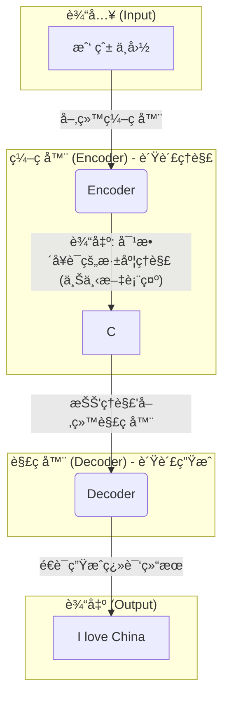
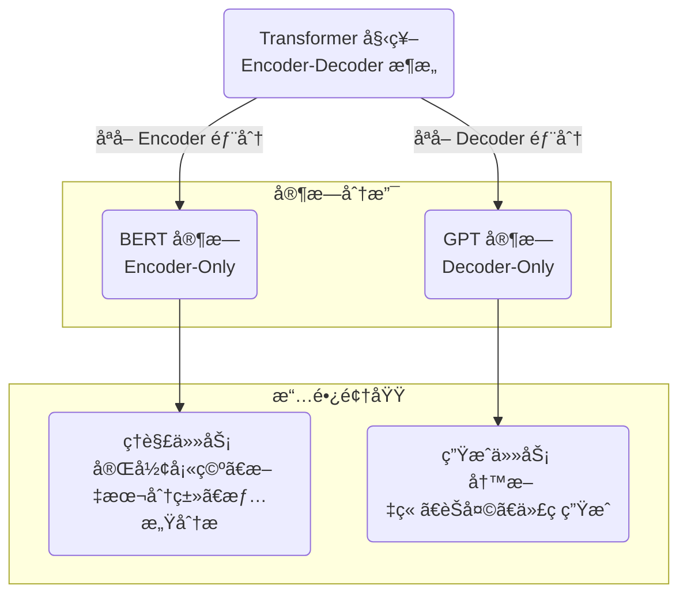

# 生æˆPython项目通用gitignore文件

**Export Time:** 2025/9/11 03:51:37
**Conversation ID:** 5JQjJyGozu4KFaFZKDR4T
**Message Count:** 46
**Model:** models/gemini-2.5-flash
**Provider:** gemini

---

## 👤 用户 (2025/9/11 00:42:35)

请ä»é›¶å¼€å§‹ï¼Œä½¿ç”¨å­¦ç”Ÿå¬å¾—懂的通俗易懂的语言，为我é€æ­¥æ尽详细全é¢å…·ä½“地讲解和å®è·µTransformer，基äºgoogleçš„colabç¯å¢ƒã€‚第一步，为我介ç»æ•´ä½“知识结æ„脉络。
---

## 🤖 助手 (2025/9/11 00:42:35)

### 🤔 æ€è€ƒè¿‡ç¨‹

```
**Clarifying User Intent**

I'm focusing on the user's primary need: a detailed, instructional guide for students on Transformers. My first step is to clarify the goal, aiming for a pedagogical approach. The target audience of students is a key consideration, so I'll need to tailor my output to their level.


**Refining the Knowledge Outline**

I've been drilling down on the user's need. I'm prioritizing outlining a clear knowledge structure and overall strategy, making sure to consider the students' needs. I've begun outlining the overall structure, with an eye towards easy-to-follow, intuitive examples, and a strong foundation for understanding the "why" behind the Transformer model. My next steps are to focus on the overall structure and content.


**Building the Foundation**

I'm now focusing on setting the stage by addressing the "before" state of RNNs/LSTMs, providing context for the Transformer's emergence. My goal is to use clear and relatable analogies to highlight the limitations of sequential processing and the challenges of long-term dependencies. I'm aiming for a concise explanation that serves as a solid foundation for the subsequent discussion of the Transformer's architecture and operation.


**Mapping the Learning Path**

I'm now zeroing in on the pedagogical approach. My plan is to structure the guide with a strong emphasis on conceptual understanding before diving into the mathematical details. The first steps include defining key concepts like word embeddings and positional encoding, which are the fundamental building blocks of the Transformer's input processing. I'll emphasize practical, intuitive examples to illustrate the purpose of each component.


**Defining Key Components**

I'm now focusing on laying the groundwork for the learning journey. My strategy is to begin with the fundamental building blocks of the Transformer model, focusing on word embeddings and positional encoding. I'll provide clear, intuitive examples to illustrate the purpose and function of each, ensuring a solid foundation for more complex concepts later. My next task is to delve into the core of the model: the encoder and decoder.


**Structuring the Learning Journey**

I'm now laying out the learning pathway, beginning with foundational concepts to establish a solid grasp of the Transformer model. I plan to start with the problem that Transformers solve, like the limitations of RNNs/LSTMs. Next, I'll provide a high-level overview of the Transformer architecture, explaining the roles of the encoder and decoder. Afterward, I will delve into key components like the input embeddings and positional encodings, using easily understandable analogies.


**Crafting a Clear Curriculum**

I'm now outlining a detailed, step-by-step curriculum for the students, starting with the big picture and then diving into specific components. I'll begin by addressing the fundamental issues with RNNs/LSTMs, providing a clear explanation of why Transformers are needed. Next, I'll explain the overall architecture of the Transformer, emphasizing the roles of the encoder and decoder. Afterward, I'll provide detailed explanations of input embeddings and positional encodings, using relatable analogies and examples.


**Crafting the Curriculum's Structure**

I'm now detailing a comprehensive curriculum for a student guide. I'll commence by contrasting the limitations of RNNs/LSTMs with the capabilities of Transformers, highlighting the "why" behind their necessity. Next, a high-level overview of the Transformer architecture will be presented, with emphasis on the encoder and decoder roles. Following, I will elucidate the input embeddings and positional encodings using relatable analogies.


**Mapping the Colab Journey**

I've been planning the hands-on component. The focus is on a clear "learning by doing" approach, implementing each Transformer element step-by-step in Colab. I plan to use a dataset for translation to provide a practical and meaningful context for the code. Each step will involve building a key component of the Transformer and training the model.


**Defining the Curriculum's Structure**

I'm starting the guide with a framework that makes the complex subject of Transformers accessible to students. It starts with the limitations of the previous sequential methods to present the clear need for the Transformer architecture. Next, I'll explain the overall encoder-decoder structure of the model, which will lead into a detailed breakdown of core components. The structure is designed to guide students' learning.


```

好的，é常ä¹æ„为你开å¯è¿™æ¬¡ Transformer 的学习之旅ï¼ä½œä¸ºä½ çš„技术伙伴，我将严格éµå®ˆ "finish step by step" çš„åŸåˆ™ï¼Œç”¨æœ€é€šä¿—易懂的语言，带你ä»é›¶å¼€å§‹ï¼Œä¸€æ­¥æ­¥æ·±å…¥æ¢ç´¢å¹¶äº²æ‰‹å®ç° Transformer 模å‹ã€‚

我们将在 Google Colab 这个å…è´¹åˆå¼ºå¤§çš„云端ç¯å¢ƒä¸­è¿›è¡Œæ‰€æœ‰å®è·µã€‚它已ç»é¢„装了我们需è¦çš„几ä¹æ‰€æœ‰å·¥å…·ï¼ˆå¦‚ Python, PyTorch/TensorFlow），并且æä¾›å…费的 GPU 加速，é常适åˆå­¦ä¹ å’Œå®éªŒã€‚

---

### **第一步：整体知识结æ„脉络 (The Big Picture)**

在深入任何一个å¤æ‚的系统之å‰ï¼Œæœ€é‡è¦çš„事情是先拥有一张地图。这张地图能告诉我们身在何处ã€å°†è¦å‰å¾€ä½•æ–¹ï¼Œä»¥åŠå„个目的地之间的关系。下é¢ï¼Œå°±æ˜¯æˆ‘们学习 Transformer 的“地图â€ã€‚

我将整个学习过程划分为 **“两大æ¿å—ã€ä¸ƒä¸ªæ­¥éª¤â€**。

*   **ç†è®ºè®¤çŸ¥æ¿å—**：我们先在æ€æƒ³ä¸Šç†è§£ Transformer 是什么，为什么会出ç°ï¼Œä»¥åŠå®ƒæ˜¯å¦‚何工作的。
*   **动手å®è·µæ¿å—**：然å我们把ç†è®ºçŸ¥è¯†è½¬åŒ–为一行行å¯ä»¥è¿è¡Œçš„代ç ï¼Œäº²æ‰‹æŠŠå®ƒâ€œåˆ¶é€ â€å‡ºæ¥ã€‚

下é¢æˆ‘用一个æµç¨‹å›¾æ¥å±•ç¤ºæˆ‘们的学习路径，然å对æ¯ä¸€æ­¥è¿›è¡Œè¯¦ç»†è§£é‡Šã€‚

```mermaid
graph TD
    subgraph ç†è®ºè®¤çŸ¥æ¿å—
        A[1. 时代背景：为什么需è¦Transformer？] --> B[2. å®è§‚æ¶æ„：鸟ç°Transformer] --> C[3. 核心机制：深入ç†è§£â€œæ³¨æ„力â€];
    end

    subgraph 动手å®è·µæ¿å— (Google Colab)
        D[4. Step-by-Stepæ­å»ºæ¨¡å‹ç»„件] --> E[5. 组装完整的Transformer模å‹] --> F[6. 训练ä¸æµ‹è¯•ï¼šè®©æ¨¡å‹å­¦ä¼šç¿»è¯‘] --> G[7. 展望：ä»Transformer到GPTå’ŒBERT];
    end

    A --> D;
    B --> E;
    C --> D;
    E --> F;
```

---

#### **地图详解：æ¯ä¸ªæ­¥éª¤æˆ‘们将学习什么？**

**ç†è®ºè®¤çŸ¥æ¿å— (建立直观ç†è§£)**

1.  **æ—¶ä»£èƒŒæ™¯ï¼šä¸ºä»€ä¹ˆéœ€è¦ Transformer？ (The "Why")**
    *   **è¦è§£å†³çš„问题**：在 Transformer 出ç°ä¹‹å‰ï¼Œå¤„ç†åºåˆ—æ•°æ®ï¼ˆæ¯”如一å¥è¯ï¼‰çš„主æµæ¨¡å‹æ˜¯ RNN（循ç¯ç¥ç»ç½‘络）和它的å˜ç§ LSTMã€GRU。
    *   **RNN/LSTM 的瓶颈**：
        *   **“记性ä¸å¥½â€**：对äºå¾ˆé•¿çš„å¥å­ï¼Œå®ƒä»¬å¾ˆéš¾è®°ä½å¼€å¤´çš„ä¿¡æ¯ï¼ˆé•¿è·ç¦»ä¾èµ–问题）。想象一下，让你å¤è¿°ä¸€ç¯‡å¾ˆé•¿çš„文章，你很容易忘记开头的细节。
        *   **“天生慢性å­â€**：它们必须一个è¯ä¸€ä¸ªè¯åœ°æŒ‰é¡ºåºå¤„ç†ï¼Œæ— æ³•å¹¶è¡Œè®¡ç®—，这在今天这个需è¦å¤§æ•°æ®ã€å¤§æ¨¡å‹ã€å¼ºç®—力的时代，速度太慢了。
    *   **我们的目标**：ç†è§£ Transformer 的出ç°æ˜¯ä¸ºäº†è§£å†³ RNN 的这两个核心痛点，ä»è€Œå¼€å¯ä¸€ä¸ªæ–°æ—¶ä»£ã€‚

2.  **å®è§‚æ¶æ„ï¼šé¸Ÿç° Transformer (The "What")**
    *   **整体结æ„**：Transformer 本质上是一个 **ç¼–ç å™¨-解ç å™¨ (Encoder-Decoder)** æ¶æ„。你å¯ä»¥æŠŠå®ƒæƒ³è±¡æˆä¸€ä¸ªâ€œç¿»è¯‘â€ç³»ç»Ÿã€‚
        *   **ç¼–ç å™¨ (Encoder)**：负责“阅读和ç†è§£â€è¾“入的一整å¥è¯ï¼ˆæ¯”如，一å¥ä¸­æ–‡ï¼‰ã€‚它会把æ¯ä¸ªè¯çš„å«ä¹‰ä»¥åŠè¿™ä¸ªè¯å’Œå¥å­é‡Œå…¶ä»–所有è¯çš„关系，打包æˆä¸€ä¸ªå¯Œå«ä¿¡æ¯çš„数字表示（我们称之为“上下文å‘é‡â€ï¼‰ã€‚
        *   **解ç å™¨ (Decoder)**：负责“生æˆâ€ç›®æ ‡è¯­è¨€çš„å¥å­ï¼ˆæ¯”如，英文）。它会å‚考编ç å™¨ç»™å‡ºçš„“ç†è§£â€ï¼Œç„¶å一个è¯ä¸€ä¸ªè¯åœ°ç”Ÿæˆç¿»è¯‘结æœã€‚
    *   **核心区别**ï¼šä¸ RNN ä¸åŒï¼ŒTransformer çš„ç¼–ç å™¨å¯ä»¥ **åŒæ—¶å¤„ç†** 一å¥è¯é‡Œçš„所有è¯ï¼Œå› ä¸ºå®ƒæœ‰ä¸€ä¸ªâ€œè¶…级武器â€â€”—**自注æ„力机制 (Self-Attention)**。

3.  **核心机制：深入ç†è§£â€œæ³¨æ„力†(The "How")**
    *   **自注æ„力机制 (Self-Attention)**：这是 Transformer çš„çµé­‚。它的作用是，在ç†è§£ä¸€ä¸ªè¯çš„时候，能够计算出这å¥è¯é‡Œå…¶ä»–所有è¯å¯¹è¿™ä¸ªè¯çš„“é‡è¦æ€§â€æˆ–“相关度â€ã€‚
        *   **举个例å­**：在å¥å­ “机器人拿起苹æœï¼Œå› ä¸ºå®ƒå¾ˆçº¢â€ ä¸­ï¼Œå½“æˆ‘ä»¬å¤„ç† â€œå®ƒâ€ è¿™ä¸ªè¯æ—¶ï¼Œè‡ªæ³¨æ„力机制能让模å‹æ˜ç™½ï¼Œâ€œå®ƒâ€ 指的是 “苹æœâ€ï¼Œè€Œä¸æ˜¯ “机器人â€ã€‚它通过计算 “它†和 “苹æœâ€ã€â€œæœºå™¨äººâ€ ç­‰è¯çš„å…³è”度得分æ¥å®ç°è¿™ä¸€ç‚¹ã€‚
    *   **多头注æ„力 (Multi-Head Attention)**：这就åƒè®©å¤šä¸ªâ€œä¸“家â€ä»ä¸åŒè§’度åŒæ—¶å»åˆ†æå¥å­ä¸­è¯ä¸è¯ä¹‹é—´çš„关系。比如，一个专家å¯èƒ½å…³æ³¨è¯­æ³•ç»“æ„，å¦ä¸€ä¸ªä¸“家å¯èƒ½å…³æ³¨è¯­ä¹‰å…³è”。最å综åˆæ‰€æœ‰ä¸“家的æ„è§ï¼Œå¾—到一个更全é¢çš„ç†è§£ã€‚
    *   **ä½ç½®ç¼–ç  (Positional Encoding)**：因为 Transformer åŒæ—¶å¤„ç†æ‰€æœ‰è¯ï¼Œå®ƒæœ¬èº«ä¸¢å¤±äº†è¯çš„顺åºä¿¡æ¯ï¼ˆæ¯”如 "我爱你" å’Œ "你爱我" 在它看æ¥æ²¡åŒºåˆ«ï¼‰ã€‚为了解决这个问题，我们需è¦ç»™æ¯ä¸ªè¯çš„输入里加入一个é¢å¤–çš„ä½ç½®ä¿¡æ¯ï¼Œå°±åƒç»™æ¯ä¸ªè¯ä¸€ä¸ªå¸¦ç¼–å·çš„“座ä½ç¥¨â€ï¼Œå‘Šè¯‰æ¨¡å‹å®ƒä»¬çš„ä½ç½®ã€‚

**动手å®è·µæ¿å— (在 Colab 中ä»é›¶å®ç°)**

4.  **Step-by-Step æ­å»ºæ¨¡å‹ç»„件**
    *   我们将éµå¾ªâ€œfinish step by stepâ€çš„åŸåˆ™ï¼Œç”¨ PyTorch 框æ¶ï¼Œåƒæ­ä¹é«˜ç§¯æœ¨ä¸€æ ·ï¼Œä¸€å—一å—地写出 Transformer çš„æ¯ä¸ªæ ¸å¿ƒç»„件的代ç ã€‚
    *   **主è¦ç§¯æœ¨å—包括**：
        *   `ä½ç½®ç¼–ç  (Positional Encoding)` çš„å®ç°ã€‚
        *   `自注æ„力机制 (Self-Attention)` çš„å®ç°ã€‚
        *   `多头注æ„力 (Multi-Head Attention)` çš„å®ç°ã€‚
        *   `å‰é¦ˆç¥ç»ç½‘络 (Feed-Forward Network)`。
        *   `ç¼–ç å™¨å±‚ (Encoder Layer)` å’Œ `解ç å™¨å±‚ (Decoder Layer)` çš„å°è£…。

5.  **组装完整的 Transformer 模å‹**
    *   有了上é¢è¿™äº›â€œç§¯æœ¨å—â€ï¼Œæˆ‘们就å¯ä»¥æŠŠå®ƒä»¬ç»„装起æ¥ï¼Œæ­å»ºä¸€ä¸ªå®Œæ•´çš„ Transformer 模å‹ã€‚
    *   我们会清晰地定义出整个模å‹çš„结æ„，包括把多个编ç å™¨å±‚å †å èµ·æ¥å½¢æˆç¼–ç å™¨ï¼Œä»¥åŠå¤šä¸ªè§£ç å™¨å±‚å †å èµ·æ¥å½¢æˆè§£ç å™¨ã€‚

6.  **训练ä¸æµ‹è¯•ï¼šè®©æ¨¡å‹å­¦ä¼šç¿»è¯‘**
    *   模å‹æ­å¥½äº†ï¼Œä½†å®ƒç°åœ¨è¿˜æ˜¯ä¸€ä¸ªâ€œç©ºå£³â€ï¼Œä»€ä¹ˆéƒ½ä¸ä¼šã€‚我们需è¦ç»™å®ƒâ€œå–‚â€æ•°æ®è¿›è¡Œè®­ç»ƒã€‚
    *   **主è¦å†…容**：
        *   **æ•°æ®å‡†å¤‡**：选择一个简å•çš„æ•°æ®é›†ï¼ˆä¾‹å¦‚，一个å°çš„中英文翻译数æ®é›†ï¼‰ï¼Œè¿›è¡Œåˆ†è¯ã€æ„建è¯å…¸ç­‰é¢„处ç†å·¥ä½œã€‚
        *   **训练循ç¯**：编写训练代ç ï¼Œå®šä¹‰æŸå¤±å‡½æ•°å’Œä¼˜åŒ–器，让模å‹åœ¨æ•°æ®ä¸Šè¿›è¡Œå­¦ä¹ ï¼ˆæ¢¯åº¦ä¸‹é™ï¼‰ã€‚我们会在 Colab ä¸Šå¼€å¯ GPU 加速这个过程。
        *   **æ¨ç†ä¸è¯„ä¼°**：训练完æˆå，我们会编写一个翻译函数，输入一å¥æ–°çš„中文，看看模å‹èƒ½å¦æ­£ç¡®åœ°ç¿»è¯‘出英文，直观地感å—我们亲手创造的模å‹çš„å¨åŠ›ã€‚

7.  **å±•æœ›ï¼šä» Transformer 到 GPT å’Œ BERT**
    *   当你完全æŒæ¡äº† Transformer çš„ Encoder-Decoder æ¶æ„å，你就会å‘ç°ï¼Œå½“今如雷贯耳的大语言模å‹å…¶å®éƒ½æ˜¯å®ƒçš„“å˜ä½“â€ã€‚
    *   **BERT**：主è¦ä½¿ç”¨äº† Transformer çš„ **ç¼–ç å™¨ (Encoder)** 部分，擅长åšâ€œå®Œå½¢å¡«ç©ºâ€ï¼Œå› æ­¤åœ¨**ç†è§£**任务上表ç°ä¼˜å¼‚。
    *   **GPT**：主è¦ä½¿ç”¨äº† Transformer çš„ **解ç å™¨ (Decoder)** 部分，擅长“文字æ¥é¾™â€ï¼Œå› æ­¤åœ¨**生æˆ**任务上所å‘披é¡ã€‚
    *   这一步会帮你打通任ç£äºŒè„‰ï¼Œè®©ä½ æ˜ç™½å续所有大语言模å‹çš„基本åŸç†ã€‚

---

**总结一下**

我们的旅程将ä»å®è§‚çš„ç†è®ºèƒŒæ™¯å‡ºå‘，é€æ­¥æ·±å…¥å…¶æ ¸å¿ƒæœºåˆ¶ï¼Œæœ€å通过亲手编写代ç ï¼Œå°†ç†è®ºçŸ¥è¯†å†…化为真正的技能。æ¯ä¸€æ­¥æˆ‘都会æ供详尽的解释ã€ä»£ç å’Œæ³¨é‡Šï¼Œç¡®ä¿ä½ èƒ½è·Ÿä¸ŠèŠ‚å¥ï¼ŒçœŸæ­£ç†è§£å’ŒæŒæ¡å®ƒã€‚

ç°åœ¨ï¼Œæˆ‘们已ç»æœ‰äº†æ¸…晰的地图。如æœä½ å¯¹è¿™ä¸ªå­¦ä¹ è®¡åˆ’没有疑问，请告诉我，我们就å¯ä»¥é©¬ä¸Šå‡ºå‘，开始我们的第二步：**â€œæ—¶ä»£èƒŒæ™¯ï¼šä¸ºä»€ä¹ˆéœ€è¦ Transformer？â€**，我会为你详细解释 RNN/LSTM çš„å±€é™æ€§ï¼Œè®©ä½ æ·±åˆ»ç†è§£ Transformer è¯ç”Ÿçš„必然性。

---

## 👤 用户 (2025/9/11 00:47:42)

ok，开始下一步
---

## 🤖 助手 (2025/9/11 00:47:42)

### 🤔 æ€è€ƒè¿‡ç¨‹

```
**Reviewing Next Steps**

My analysis indicates we're moving on to Step 2: Historical Context.  I'm focusing on the "Why Transformer?" question.  The user's positive response signals forward momentum. I'll now delve into the historical landscape that necessitated this architectural shift.


**Defining Model Weaknesses**

My initial review of the plan confirms that "Step 2: Historical Context" is the appropriate next move. To clarify the need for the Transformer, I'm now outlining the shortcomings of RNNs and LSTMs, specifically focusing on their limitations with long-range dependencies. I'm aiming for an accessible explanation, keeping in mind the need for "通俗易懂."


**Framing RNN Challenges**

I'm now zeroing in on the challenges inherent in Recurrent Neural Networks (RNNs) and their evolution, particularly focusing on long-range dependency issues. My goal is to craft relatable analogies for these concepts to enhance clarity. I'll compare the sequential nature of RNNs to reading a novel word by word, emphasizing the gradual buildup of understanding, and the limitations this implies.


**Addressing Long-Range Dependency**

I'm now focusing on the first major limitation of RNNs: Long-Range Dependencies. To illustrate the difficulty RNNs face, I'm developing analogies like the "whisper down the lane" game, demonstrating how critical information degrades over long sequences. I'm also preparing to explain the vanishing gradient problem, tying back to the "bad memory" concept and its impact on training.


**Introducing RNN Challenges**

I'm now outlining RNN's limitations, starting with a concise overview. The "chain-of-thought" analogy to reading a novel word by word is proving helpful in visualizing the inherent sequential processing of RNNs. I'm focusing on the "bad memory" issue to illustrate why long sentences present a problem. The sequential nature prevents parallelization. I'll need to explain how this hinders the efficiency when analyzing complex, long data sequences.


**Defining the Core Problems**

I'm now establishing the core weaknesses of RNNs/LSTMs that the Transformer addresses. I'm focusing on "Long-Range Dependencies," using the "whisper down the lane" game analogy to demonstrate the information loss in long sequences. I'm also preparing to explain the inherent sequential processing of RNNs, contrasting it with the parallelization capabilities of modern hardware. This sets the stage for introducing the Transformer as the solution to these bottlenecks.


**Introducing RNN Limitations**

I'm now outlining the limitations of Recurrent Neural Networks (RNNs) that led to the development of the Transformer. To clarify the key issue, I'm using an easy-to-understand analogy: an RNN functions like a student reading a novel word by word, gradually building understanding. However, the sequential processing of RNNs, like reading a novel in order, inherently limits parallelization and makes it challenging to process very long sequences efficiently.


```

好的，我们正å¼å¯ç¨‹ï¼

---

### **第二步：时代背景 - ä¸ºä»€ä¹ˆéœ€è¦ Transformer？ (The "Why")**

在 2017 年，Google 的一篇å为《Attention Is All You Need》的论文横空出世，彻底改å˜äº†è‡ªç„¶è¯­è¨€å¤„ç†ï¼ˆNLP）领域的游æˆè§„则。为了真正ç†è§£ Transformer çš„é©å‘½æ€§ï¼Œæˆ‘们必须先å›åˆ°â€œæ—§æ—¶ä»£â€ï¼Œçœ‹çœ‹å½“时处ç†è¯­è¨€ä»»åŠ¡çš„主æµæ¨¡å‹â€”—**RNN（循ç¯ç¥ç»ç½‘络）**以åŠå®ƒçš„å‡çº§ç‰ˆ **LSTM** å’Œ **GRU**——é‡åˆ°äº†ä»€ä¹ˆéš¾ä»¥é€¾è¶Šçš„éšœç¢ã€‚

想象一下，我们è¦å¤„ç†ä¸€å¥è¯ï¼Œæ¯”如：“今天天气真好â€ã€‚对计算机æ¥è¯´ï¼Œè¿™å°±æ˜¯ä¸€ä¸ªå•è¯çš„åºåˆ— (sequence)。处ç†è¿™ç§åºåˆ—æ•°æ®ï¼Œæ­£æ˜¯ RNN 的拿手好æˆã€‚

#### **“旧时代â€çš„ç‹è€…：RNN & LSTM**

RNN 的工作方å¼é常符åˆäººç±»é˜…读的直觉：**一个一个地读**。

1.  å®ƒé¦–å…ˆè¯»å– "今天"，并形æˆä¸€ä¸ªåˆæ­¥çš„“记忆â€ï¼ˆåœ¨æŠ€æœ¯ä¸Šï¼Œæˆ‘们称之为**éšè—çŠ¶æ€ Hidden State**）。
2.  然åï¼Œå®ƒè¯»å– "天气"，并结åˆä¸Šä¸€æ­¥å…³äº "今天" 的记忆，更新自己的“记忆â€ã€‚
3.  æ¥ç€ï¼Œå®ƒè¯»å– "真好"，并结åˆä¸Šä¸€æ­¥å…³äº "今天天气" 的记忆，å†æ¬¡æ›´æ–°â€œè®°å¿†â€ã€‚

这个过程就åƒä¸€ä¸ªå¤šç±³è¯ºéª¨ç‰Œï¼Œä¿¡æ¯é¡ºç€å•è¯çš„顺åºä¸€æ­¥æ­¥å‘å传递。

```mermaid
graph LR
    subgraph RNN 工作æµç¨‹ (按顺åºå¤„ç†)
        input1[输入: "今天"] --> rnn_step1((RNNå•å…ƒ))
        rnn_step1 --> memory1[记忆1]
        
        input2[输入: "天气"] --> rnn_step2((RNNå•å…ƒ))
        memory1 -- 传递记忆 --> rnn_step2
        rnn_step2 --> memory2[记忆2]

        input3[输入: "真好"] --> rnn_step3((RNNå•å…ƒ))
        memory2 -- 传递记忆 --> rnn_step3
        rnn_step3 --> memory3[最终记忆]
    end
```

è¿™ç§ç»“æ„很优雅，但也带æ¥äº†ä¸¤ä¸ªè‡´å‘½çš„“先天缺陷â€ã€‚

---

#### **缺陷一：记性ä¸å¥½ (é•¿è·ç¦»ä¾èµ–问题)**

RNN 的记忆是通过ä¸æ–­åœ°æ›´æ–°åŒä¸€ä¸ªâ€œéšè—状æ€â€æ¥å®ç°çš„。当å¥å­é常长的时候，问题就æ¥äº†ã€‚

**举个生活中的例å­ï¼š**
想象你在å¬ä¸€ä¸ªå¾ˆé•¿çš„故事：“在很久很久以å‰ï¼Œæœ‰ä¸€ä¸ªä½åœ¨æ³•å›½ä¹¡æ‘，åå«çˆ±ä¸½ä¸çš„女孩……（中间çœç•¥äº†äº”åƒå­—的故事内容）……最å，她å›åˆ°å®¶ä¹¡ï¼Œå¹¸ç¦åœ°ç”Ÿæ´»ç€ã€‚â€

如æœæˆ‘问你：“故事的主人公å«ä»€ä¹ˆå字？†你å¯èƒ½è¿˜è®°å¾—是“爱丽ä¸â€ã€‚
但如æœæˆ‘问你：“她一开始ä½åœ¨å“ªä¸ªå›½å®¶ï¼Ÿâ€ ä½ å¯èƒ½å°±å·²ç»å¿˜äº†ï¼Œå› ä¸ºâ€œæ³•å›½â€è¿™ä¸ªä¿¡æ¯åœ¨æ•…事的开头，离结尾太远了。在å¬åé¢äº”åƒå­—内容的时候，你大脑里关äºâ€œæ³•å›½â€çš„记忆已ç»è¢«æ–°çš„ä¿¡æ¯ä¸æ–­åœ°â€œå†²åˆ·â€å’Œâ€œè¦†ç›–â€äº†ã€‚

RNN å°±é¢ä¸´ç€åŒæ ·çš„问题。在处ç†é•¿å¥å­æ—¶ï¼Œæ¥è‡ªå¥å­å¼€å¤´çš„ä¿¡æ¯åœ¨ä¼ é€’到å¥å­æœ«å°¾æ—¶ï¼Œå·²ç»å˜å¾—é常微弱，甚至完全消失了。这被称为 **“梯度消失†(Vanishing Gradients)** 问题。

**å‡çº§ä¸æŒ£æ‰ï¼š**
为了解决这个问题，科学家们å‘æ˜äº†æ›´å¤æ‚çš„ RNN å˜ä½“，比如 **LSTM (长短期记忆网络)** å’Œ **GRU**。它们设计了精巧的“门æ§â€æœºåˆ¶ï¼Œå°±åƒç»™è®°å¿†ç³»ç»ŸåŠ ä¸Šäº†â€œé˜€é—¨â€ï¼Œå¯ä»¥é€‰æ‹©æ€§åœ°â€œé—忘â€ä¸é‡è¦çš„ä¿¡æ¯ï¼Œå¹¶â€œè®°ä½â€é‡è¦çš„ä¿¡æ¯ã€‚

这在很大程度上缓解了 RNN 的“å¥å¿˜ç—‡â€ï¼Œä½†å¹¶æ²¡æœ‰æ ¹æ²»ã€‚当åºåˆ—å˜å¾—æ长时，它们ä¾ç„¶ä¼šåŠ›ä¸ä»å¿ƒã€‚这就åƒç»™ä¸€ä¸ªè®°å¿†åŠ›å·®çš„学生一支笔和一个本å­ï¼Œä»–能记下的东西多了，但终究能力有é™ã€‚

**这就是 Transformer è¦è§£å†³çš„第一个核心问题：如何让模å‹åœ¨å¤„ç†ä»»æ„两个è¯æ—¶ï¼Œæ— è®ºå®ƒä»¬ç›¸è·å¤šè¿œï¼Œéƒ½èƒ½è½»æ¾åœ°å»ºç«‹è”系？**

---

#### **ç¼ºé™·äºŒï¼šå¤©ç”Ÿæ…¢æ€§å­ (无法并行计算)**

RNN 的第二个缺陷æºäºå®ƒâ€œä¸€ä¸ªä¸€ä¸ªå¤„ç†â€çš„核心机制。这个机制决定了它必须**顺åºæ‰§è¡Œ**。

**举个例å­ï¼š**
想象一æ¡ä¼ ç»Ÿçš„å·¥å‚æµæ°´çº¿ï¼Œè¦ç»„装一部手机。必须先装好 A 零件，æ‰èƒ½è£… B 零件，然åæ‰èƒ½è£… C 零件。你ä¸èƒ½åŒæ—¶å®‰è£… Aã€Bã€C，因为它们有ä¾èµ–关系。

RNN 就是这样一æ¡æµæ°´çº¿ã€‚è¦å¤„ç†ç¬¬ 10 个è¯ï¼Œå¿…须等待第 9 个è¯å¤„ç†å®Œæ¯•ã€‚è¦å¤„ç†ç¬¬ 9 个è¯ï¼Œå¿…须等待第 8 个è¯å¤„ç†å®Œæ¯•â€¦â€¦

在åªæœ‰å•æ ¸ CPU 的时代，这没什么问题。但在今天，我们拥有强大的 **GPU (图形处ç†å™¨)**，它有æˆåƒä¸Šä¸‡ä¸ªæ ¸å¿ƒï¼Œæœ€æ“…长的就是**并行计算**——åŒæ—¶å¤„ç†æˆåƒä¸Šä¸‡ä¸ªä»»åŠ¡ã€‚

RNN çš„è¿™ç§â€œå¤©ç”Ÿæ…¢æ€§å­â€çš„串行结æ„，完ç¾åœ°é¿å¼€äº† GPU 的所有优势。这就åƒä½ ä¹°äº†ä¸€è¾†æ‹¥æœ‰ V12 引æ“的超级跑车，å´åªèƒ½åœ¨æ‹¥å µçš„胡åŒé‡Œä»¥ 5 公里/å°æ—¶çš„速度行驶，它的性能被æ大地浪费了。

éšç€æ•°æ®é‡å’Œæ¨¡å‹è§„模的爆炸å¼å¢é•¿ï¼Œè®­ç»ƒä¸€ä¸ªå¼ºå¤§çš„ NLP 模å‹éœ€è¦æ•°å¤©ç”šè‡³æ•°å‘¨ã€‚RNN 的这个速度瓶颈å˜å¾—越æ¥è¶Šæ— æ³•å¿å—。

**这就是 Transformer è¦è§£å†³çš„第二个核心问题：如何打破这ç§å¿…须按顺åºå¤„ç†çš„é™åˆ¶ï¼Œå……分利用 GPU 的并行计算能力，æ大地加快训练速度？**

---

#### **总结ä¸å±•æœ›ï¼šæ–°æ—¶ä»£çš„é»æ˜**

所以，在 2017 年，整个 NLP 领域都é¢ä¸´ç€è¿™ä¸¤ä¸ªå·¨å¤§çš„挑战：

1.  **记忆瓶颈**：如何有效æ•æ‰å¥å­ä¸­ç›¸è·å¾ˆè¿œçš„è¯ä¹‹é—´çš„关系？
2.  **计算瓶颈**：如何摆脱串行ä¾èµ–，å®ç°å¤§è§„模并行计算，ä»è€Œè®­ç»ƒæ›´å¤§ã€æ›´å¼ºçš„模å‹ï¼Ÿ

Transformer çš„è¯ç”Ÿï¼Œå°±æ˜¯ä¸ºäº†åŒæ—¶è§£å†³è¿™ä¸¤ä¸ªé—®é¢˜ã€‚它æ出了一ç§å…¨æ–°çš„ã€é¢ è¦†æ€§çš„æ€è·¯ï¼š**彻底抛弃循ç¯ç»“æ„，åªä¾èµ–一ç§å«åšâ€œæ³¨æ„力â€çš„机制。**

è¿™ç§æ–°æ–¹æ³•å…许模å‹åœ¨å¤„ç†æ¯ä¸ªè¯çš„时候，都能**ç›´æ¥åœ°ã€åŒæ—¶åœ°**看到å¥å­ä¸­çš„所有其他è¯ï¼Œå¹¶è®¡ç®—它们之间的关è”度。这ä¸ä»…完ç¾è§£å†³äº†é•¿è·ç¦»ä¾èµ–问题（因为è·ç¦»ä¸å†æ˜¯é—®é¢˜ï¼‰ï¼Œä¹Ÿå› ä¸ºå¯ä»¥åŒæ—¶å¤„ç†æ‰€æœ‰è¯ï¼Œä»è€Œé‡Šæ”¾äº† GPU çš„æ´ªè’之力。

ç°åœ¨æˆ‘们已ç»æ·±åˆ»ç†è§£äº†â€œä¸ºä»€ä¹ˆâ€éœ€è¦ Transformer。æ¥ä¸‹æ¥ï¼Œæˆ‘们就将进入下一个步骤，å»çœ‹çœ‹ Transformer çš„å®è§‚æ¶æ„，也就是“是什么â€ï¼Œäº²çœ¼è§è¯ä¸€ä¸‹è¿™ä¸ªé©å‘½æ€§æ¨¡å‹æ˜¯å¦‚何巧妙地设计出æ¥çš„。

准备好了å—？如æœæ²¡é—®é¢˜ï¼Œæˆ‘们就继续å‰è¿›ï¼

---

## 👤 用户 (2025/9/11 00:50:43)

ok，开始下一步
---

## 🤖 助手 (2025/9/11 00:50:43)

### 🤔 æ€è€ƒè¿‡ç¨‹

```
**Transitioning the Focus**

I'm now shifting gears from the 'Why' of RNN limitations to the 'What' – the high-level architecture.  My primary focus is on a seamless hand-off for a better learning experience, aiming to create a coherent narrative. The user's input prompted me to swiftly adjust course.


**Framing the Architecture**

I'm now laying the groundwork for the Transformer's architecture, using the "universal translator" analogy. I envision the process as a translation machine: an input sentence, an encoder that grasps its meaning, and a decoder that generates the output in a new language. This will culminate in a diagram to visually explain the structure.


**Constructing the Model**

I'm presently building the high-level architecture around the "universal translator" analogy. The foundation is an Encoder-Decoder model.  The Encoder grasps the input's meaning,  represented numerically,  while the Decoder generates the output one word at a time. A diagram is next to bring the architecture to life.


**Defining the Core Structure**

I'm presently building the high-level architecture. I'm focusing on the translation analogy: input sentence, encoder comprehension, and decoder output. I'll construct a Mermaid diagram to visualize the model, with a detailed breakdown of the Encoder's layers, including multi-head attention and feed-forward networks. Next, I'll explain the 'add & norm' steps.


**Expanding the Model**

I'm now diving into the Encoder's internal workings, the heart of the Transformer. It's a stack of identical layers.  Each layer contains Multi-Head Self-Attention, the core that connects words in context, and a Position-wise Feed-Forward Network. I'll cover the "Add & Norm" steps, including Residual Connections and Layer Normalization.


**Elaborating the Encoder**

I'm now detailing the Encoder, the Transformer's core for deep sentence understanding. It's a stack of identical layers, with each comprising Multi-Head Self-Attention, the element connecting words, and a Position-wise Feed-Forward Network. I'll describe the essential "Add & Norm" steps, including Residual Connections and Layer Normalization. This detailed explanation will pave the way for understanding the decoder.


```

é常好ï¼æˆ‘们已ç»ç«™åœ¨äº†æ–°æ—¶ä»£çš„门槛上，ç°åœ¨å°±è®©æˆ‘们æ¨å¼€å¤§é—¨ï¼Œä¸€çª¥ Transformer çš„å®ä¼Ÿè“图。

---

### **第三步：å®è§‚æ¶æ„ - é¸Ÿç° Transformer (The "What")**

想象一下，你拿到了一å°é常先进的“智能翻译机â€ã€‚è¿™å°æœºå™¨ç”±ä¸¤ä¸ªä¸»è¦éƒ¨åˆ†æ„æˆï¼š

1.  一个 **“阅读ç†è§£â€** 模å—。
2.  一个 **“写作

### 🤔 æ€è€ƒè¿‡ç¨‹

```
**Delving Deeper into the Encoder**

Now, I'm focusing on the Encoder's internal workings. It functions as a stack of identical layers, with each comprised of Multi-Head Self-Attention – which connects words in context – and a Position-wise Feed-Forward Network. I'll describe the essential "Add & Norm" steps, including Residual Connections and Layer Normalization.


```

生æˆâ€** 模å—。

当你输入一å¥ä¸­æ–‡æ—¶ï¼Œâ€œé˜…读ç†è§£â€æ¨¡å—会åå¤é˜…读ã€åˆ†æè¿™å¥è¯ï¼Œæ懂它的æ„æ€ä»¥åŠå†…部的å„ç§è¯­æ³•å’Œè¯­ä¹‰å…³ç³»ã€‚然å，它会把这ç§æ·±åº¦çš„“ç†è§£â€æ炼æˆä¸€ä»½ç²¾å摘è¦ã€‚最å，“写作生æˆâ€æ¨¡å—会根æ®è¿™ä»½æ‘˜è¦ï¼Œä¸€ä¸ªè¯ä¸€ä¸ªè¯åœ°å†™å‡ºå¯¹åº”的英文翻译。

这个“智能翻译机â€ï¼Œå°±æ˜¯ Transformer 的核心æ€æƒ³â€”—**ç¼–ç å™¨-解ç å™¨ (Encoder-Decoder) æ¶æ„**。

*   **ç¼–ç å™¨ (Encoder)**：就是那个“阅读ç†è§£â€æ¨¡å—。
*   **解ç å™¨ (Decoder)**：就是那个“写作生æˆâ€æ¨¡å—。

下é¢æ˜¯æ•´ä¸ªå·¥ä½œæµç¨‹çš„示æ„图：



ç°åœ¨ï¼Œè®©æˆ‘们分别打开这两个模å—的“引æ“ç›–â€ï¼Œçœ‹çœ‹é‡Œé¢åˆ°åº•æ˜¯ä»€ä¹ˆæ ·çš„æ„造。

---

#### **1. ç¼–ç å™¨ (Encoder) - “阅读ç†è§£â€ä¸“家**

ç¼–ç å™¨çš„任务是æ¥æ”¶è¾“入的整个å¥å­ï¼Œç„¶å输出一个包å«äº†æ¯ä¸ªè¯ä»¥åŠè¯ä¸è¯ä¹‹é—´å…³ç³»çš„数字表示（å‘é‡ï¼‰ã€‚

**它的核心特点是：å¯ä»¥åŒæ—¶å¤„ç†ä¸€å¥è¯é‡Œçš„所有è¯ã€‚**

**内部æ„造：**
ç¼–ç å™¨ä¸æ˜¯ä¸€ä¸ªå•ä¸€çš„大家伙，而是由 **N个（åŸè®ºæ–‡ä¸­ N=6）** 完全相åŒçš„“编ç å™¨å±‚ (Encoder Layer)â€å †å è€Œæˆçš„。就åƒç›–楼一样，一层一层地往上加。信æ¯ä»æœ€åº•éƒ¨çš„层输入，处ç†å®Œå，输出给上一层，直到最顶层。


*(这是一个示æ„图，帮助你ç†è§£â€œå †å â€çš„概念)*

那么，**æ¯ä¸€å±‚**里é¢åˆæœ‰ä»€ä¹ˆå‘¢ï¼Ÿæ¯ä¸ªç¼–ç å™¨å±‚都由两个“å­æ¨¡å—â€æ„æˆï¼š

1.  **多头自注æ„力机制 (Multi-Head Self-Attention)**
    *   **这是 Transformer çš„çµé­‚**。它负责“内部关系分æâ€ã€‚当编ç å™¨å¤„ç† "我 爱 中国" è¿™å¥è¯æ—¶ï¼Œè‡ªæ³¨æ„力机制能让模å‹åœ¨å¤„ç† "爱" 这个è¯çš„时候，å»å…³æ³¨ "我" å’Œ "中国"，ä»è€Œç†è§£ "爱" 这个动作的施ä¸è€…å’Œæ¥å—者。它会计算出å¥å­ä¸­**所有è¯**对äº**当å‰è¯**çš„é‡è¦æ€§å¾—分，然åæ ¹æ®è¿™ä¸ªå¾—分æ¥æ›´å¥½åœ°è¡¨ç¤ºå½“å‰è¯ã€‚
    *   “多头†(Multi-Head) çš„æ„æ€å°±æ˜¯ï¼Œè¿™ç§åˆ†æä¸æ˜¯åªåšä¸€æ¬¡ï¼Œè€Œæ˜¯åŒæ—¶ä»å¤šä¸ªä¸åŒçš„“角度â€ï¼ˆæ¯”如ä»è¯­æ³•è§’度ã€ä»è¯­ä¹‰è§’度等）进行多次分æ，然å把所有角度的分æ结æœç»¼åˆèµ·æ¥ï¼Œå¾—到一个更全é¢çš„ç†è§£ã€‚

2.  **å‰é¦ˆç¥ç»ç½‘络 (Feed-Forward Network)**
    *   这个模å—相对简å•ï¼Œå¯ä»¥çœ‹ä½œæ˜¯ä¸€ä¸ªâ€œåŠ å·¥ç«™â€ã€‚在ç»è¿‡è‡ªæ³¨æ„力机制的“关系分æâ€å，æ¯ä¸ªè¯çš„表示都会被é€åˆ°è¿™ä¸ªåŠ å·¥ç«™é‡Œè¿›è¡Œä¸€æ¬¡ç‹¬ç«‹çš„ã€æ·±åº¦çš„“æ€è€ƒâ€æˆ–“å˜æ¢â€ï¼Œè®©ä¿¡æ¯çš„表示能力更强。

**补充说æ˜ï¼š**
*   **ä½ç½®ç¼–ç  (Positional Encoding)**：我们之å‰æ到，Transformer 因为是åŒæ—¶å¤„ç†æ‰€æœ‰è¯ï¼Œæ‰€ä»¥ä¸¢å¤±äº†è¯­åºä¿¡æ¯ã€‚为了解决这个问题，在把å¥å­å–‚给编ç å™¨ä¹‹å‰ï¼Œæˆ‘们会给æ¯ä¸ªè¯çš„输入å‘é‡ä¸­åŠ å…¥ä¸€ä¸ªâ€œä½ç½®ç¼–ç â€å‘é‡ã€‚这个å‘é‡å°±åƒä¸€ä¸ª GPS ä¿¡å·ï¼Œæ˜ç¡®åœ°å‘Šè¯‰æ¨¡å‹æ¯ä¸ªè¯åœ¨å¥å­ä¸­çš„ç»å¯¹ä½ç½®ï¼ˆç¬¬1个ã€ç¬¬2个……）。
*   **Add & Norm**：在æ¯ä¸ªå­æ¨¡å—（自注æ„力和å‰é¦ˆç½‘络）的周围，都有一个“残差è¿æ¥ (Add)â€å’Œâ€œå±‚归一化 (Norm)â€çš„æ“作。这是训练深度网络的技巧，å¯ä»¥æŠŠå®ƒä»¬ç†è§£ä¸ºä¿¡æ¯æµåŠ¨çš„“高速公路â€å’Œâ€œç¨³å®šå™¨â€ï¼Œç¡®ä¿ä¿¡æ¯åœ¨ç»è¿‡å¤šå±‚å †å åä¸ä¼šä¸¢å¤±ï¼Œå¹¶ä¸”训练过程更稳定。

---

#### **2. 解ç å™¨ (Decoder) - “写作生æˆâ€å¤§å¸ˆ**

解ç å™¨çš„任务是æ¥æ”¶ç¼–ç å™¨è¾“出的“ç†è§£â€ï¼Œç„¶å一个一个地生æˆç›®æ ‡è¯­è¨€çš„å•è¯ã€‚

**它的核心特点是：顺åºç”Ÿæˆï¼Œä¸€æ¬¡ä¸€ä¸ªè¯ (Auto-Regressive)。**

**内部æ„造：**
和编ç å™¨ä¸€æ ·ï¼Œè§£ç å™¨ä¹Ÿæ˜¯ç”± **N个 (N=6)** 完全相åŒçš„“解ç å™¨å±‚ (Decoder Layer)â€å †å è€Œæˆã€‚

但是，æ¯ä¸ªè§£ç å™¨å±‚比编ç å™¨å±‚è¦å¤æ‚一点，它有**三个“å­æ¨¡å—â€**：

1.  **带æ©ç çš„多头自注æ„力机制 (Masked Multi-Head Self-Attention)**
    *   这个模å—的作用和编ç å™¨é‡Œçš„自注æ„力机制很åƒï¼Œä¹Ÿæ˜¯è®©è§£ç å™¨åœ¨ç”Ÿæˆå½“å‰è¯æ—¶ï¼Œå›é¡¾ä¸€ä¸‹**å·²ç»ç”Ÿæˆè¿‡**çš„è¯ã€‚ä¾‹å¦‚ï¼Œåœ¨ç”Ÿæˆ "love" 之åè¦ç”Ÿæˆ "China" 时，模å‹éœ€è¦å›å¤´çœ‹çœ‹ "I" å’Œ "love"。
    *   **关键在äºâ€œå¸¦æ©ç â€ (Masked)**。这个“é¢å…·â€çš„作用是**防止作弊**。因为在训练时，我们有完整的英文å¥å­ "I love China"。但在真å®çš„翻译（预测）场景中，当我们è¦ç”Ÿæˆç¬¬3个è¯æ—¶ï¼Œæˆ‘们是看ä¸åˆ°ç¬¬3个è¯ä»¥åŠå®ƒåé¢çš„è¯çš„。这个“é¢å…·â€å°±æ˜¯ç”¨æ¥é®ä½â€œæœªæ¥â€çš„è¯ï¼Œç¡®ä¿æ¨¡å‹åªä¾èµ–äºå·²ç»ç”Ÿæˆçš„内容。

2.  **ç¼–ç å™¨-解ç å™¨æ³¨æ„力机制 (Encoder-Decoder Attention / Cross-Attention)**
    *   **这是è¿æ¥ç¼–ç å™¨å’Œè§£ç å™¨çš„æ¡¥æ¢**。当解ç å™¨å‡†å¤‡ç”Ÿæˆä¸‹ä¸€ä¸ªè‹±æ–‡è¯æ—¶ï¼Œè¿™ä¸ªæ¨¡å—å…许它**å›å¤´å»â€œçœ‹â€ä¸€çœ¼è¾“入的中文å¥å­**（也就是编ç å™¨çš„输出）。
    *   ä¾‹å¦‚ï¼Œå½“å®ƒç”Ÿæˆ "love" 这个è¯æ—¶ï¼Œè¿™ä¸ªæœºåˆ¶èƒ½å¸®åŠ©å®ƒæŠŠæ³¨æ„力集中在中文的 "爱" 上。当它è¦ç”Ÿæˆ "China" 时，注æ„力åˆä¼šè½¬ç§»åˆ° "中国" 上。它动æ€åœ°å†³å®šåœ¨ç”Ÿæˆæ¯ä¸ªè‹±æ–‡è¯æ—¶ï¼Œåº”该é‡ç‚¹å…³æ³¨å“ªäº›ä¸­æ–‡è¯ã€‚

3.  **å‰é¦ˆç¥ç»ç½‘络 (Feed-Forward Network)**
    *   和编ç å™¨ä¸­çš„一样，也是一个“加工站â€ï¼Œå¯¹ä¿¡æ¯è¿›è¡Œè¿›ä¸€æ­¥å¤„ç†ã€‚

**最å一步：**
当信æ¯æµè¿‡æ•´ä¸ªè§£ç å™¨å †æ ˆå，会ç»è¿‡ä¸€ä¸ªæœ€ç»ˆçš„线性层和 Softmax 层，它们的作用是ä»æˆåƒä¸Šä¸‡ä¸ªå¯èƒ½çš„英文å•è¯ä¸­ï¼Œé¢„测出概ç‡æœ€é«˜çš„那一个，作为当å‰çš„输出。

---

#### **总结：两大模å—，三ç§æ³¨æ„力**

ç°åœ¨æˆ‘们æ¥æ¢³ç†ä¸€ä¸‹æ•´ä¸ªå®è§‚æ¶æ„：

*   **æ¶æ„**：ç»å…¸çš„ç¼–ç å™¨-解ç å™¨æ¨¡å‹ã€‚
*   **ç¼–ç å™¨**：由 N 层堆å ï¼Œæ¯å±‚åŒ…å« **自注æ„力** å’Œ **å‰é¦ˆç½‘络**。负责ç†è§£è¾“入。
*   **解ç å™¨**：由 N 层堆å ï¼Œæ¯å±‚åŒ…å« **带æ©ç çš„自注æ„力**ã€**ç¼–ç å™¨-解ç å™¨æ³¨æ„力** å’Œ **å‰é¦ˆç½‘络**。负责生æˆè¾“出。
*   **核心动力**：三ç§ä¸åŒçš„注æ„力机制，å„å¸å…¶èŒï¼Œå®Œç¾é…åˆã€‚

我们已ç»ä»ä¸‡ç±³é«˜ç©ºé¸Ÿç°äº† Transformer 的全貌。你ç°åœ¨åº”该对它的工作æµç¨‹å’Œä¸»è¦éƒ¨ä»¶æœ‰äº†ä¸€ä¸ªæ¸…晰的认识。

æ¥ä¸‹æ¥ï¼Œæˆ‘们将é™è½åˆ°åœ°é¢ï¼Œç”¨æ”¾å¤§é•œä»”细研究它最核心ã€æœ€ç¥å¥‡çš„部件——**自注æ„力机制 (Self-Attention)**。我们将用一个é常具体的例å­ï¼Œä¸€æ­¥æ­¥æ‰‹åŠ¨è®¡ç®—，让你彻底æ˜ç™½å®ƒæ˜¯å¦‚何工作的。

准备好进入 Transformer 的“核心引æ“室â€äº†å—？

---

## 👤 用户 (2025/9/11 00:56:26)

ok，开始下一步
---

## 🤖 助手 (2025/9/11 00:56:26)

### 🤔 æ€è€ƒè¿‡ç¨‹

```
**Analyzing the Objective**

I've grasped the user's intent. My primary focus is simplifying the core mechanism of the Transformer, particularly Self-Attention. I'll need to break it down in an easy-to-digest way, suitable for an expert. Simplifying complex concepts is always a challenge, but I'm ready to begin.


**Simplifying Self-Attention**

I'm now zeroing in on the "how" of Self-Attention.  My focus is on breaking down the calculation process. I'm starting from word embeddings and mapping the steps so an expert can readily grasp them. I'm focusing on "key," "query," and "value" vectors, and considering how to make the steps simple and memorable.


**Elaborating the Analogy**

I'm expanding the library analogy. The query represents my intent to find specific information. Keys are keywords that represent each book's topic, and the values contain detailed information. I'm focusing on making the relationships between these elements extremely clear. I'll showcase how these interactions determine the context of individual words.


**Detailing Key Mechanisms**

I'm now fully immersed in the core math behind Self-Attention. I'm focusing on clarifying the role of Query, Key, and Value vectors within a clear numerical example. My aim is to walk through the dot-product calculations and the subsequent scaling and softmax steps with detailed explanations for each stage. I want to ensure my audience grasps how these elements interact.


**Clarifying Key Relationships**

I'm presently focusing on the interplay between Query, Key, and Value vectors within a clear, small-scale example. My aim is to walk an expert through the dot-product calculations, scaling, and the softmax application with detailed explanations, ensuring their complete understanding.


**Breaking Down the Mechanism**

I'm now diving into the core of Self-Attention, dissecting the process step-by-step. I'm focusing on "how" the model determines context, from word embeddings to output vectors. My goal is to make the dot-product calculations, scaling, and the softmax application clear. I am developing clear numerical examples, and I will be using visual aids to help illustrate the data flow of the calculations. I'll showcase the process with the library analogy. This is the first attempt, and it may require revision.


**Demystifying the Mechanism**

My focus has shifted to the 'how' of Self-Attention, breaking it down into a simplified process.  I'm starting with word embeddings and will clarify the role of `Query`, `Key`, and `Value` vectors with a clear, numerical example. I am refining the library analogy to enhance comprehension. I will use a Mermaid diagram to visualize the complete data flow.


```

好的，å稳了ï¼æˆ‘们ç°åœ¨è¦è¿›å…¥ Transformer 最核心ã€æœ€æ¿€åŠ¨äººå¿ƒçš„部分。如æœè¯´ Transformer 是一辆超级跑车，那么我们ç°åœ¨å°±è¦æ‰“开它的引æ“盖，亲眼看看那å°æä¾›æ¾æ¹ƒåŠ¨åŠ›çš„ V12 å‘动机——**注æ„力机制 (Attention Mechanism)**。

---

### **第四步：核心机制 - 深入ç†è§£â€œæ³¨æ„力†(The "How")**

在这一步，我们将èšç„¦äº Transformer çš„çµé­‚：**自注æ„力机制 (Self-Attention)**。我会用一个æ其简å•çš„例å­ï¼Œå¸¦ä½ ä¸€æ­¥æ­¥æ‰‹åŠ¨è®¡ç®—，让你彻底告别对它的“黑盒â€æ惧。

#### **核心æ€æƒ³ï¼šå¥å­å†…部的“关系网投票â€**

我们先忘æ‰æ‰€æœ‰å¤æ‚的术语。自注æ„力的本质，就是让一å¥è¯ä¸­çš„æ¯ä¸ªè¯ï¼Œéƒ½èƒ½çœ‹ä¸€çœ¼å¥å­é‡Œçš„所有其他è¯ï¼Œç„¶å通过一个“投票â€æœºåˆ¶ï¼Œå†³å®šåœ¨ç†è§£è‡ªå·±æ—¶ï¼Œåº”该给其他æ¯ä¸ªè¯åˆ†é…多少“关注度â€ã€‚

**举个ç»å…¸çš„例å­ï¼š**
`The animal didn't cross the street because it was too tired.`
(è¿™åªåŠ¨ç‰©æ²¡æœ‰è¿‡é©¬è·¯ï¼Œå› ä¸ºå®ƒå¤ªç´¯äº†ã€‚)

当我们读到 `it` (它) 的时候，我们的大脑会立刻把它和 `animal` (动物) è”系起æ¥ï¼Œè€Œä¸æ˜¯ `street` (马路)。自注æ„力机制就是è¦è®©è®¡ç®—机也学会这ç§èƒ½åŠ›ã€‚它会计算出 `it` å’Œå¥å­ä¸­å…¶ä»–所有è¯çš„“关è”度得分â€ï¼Œ`animal` 的得分会é常高，而 `street` 的得分会很ä½ã€‚

那么，这个ç¥å¥‡çš„“关è”度得分â€åˆ°åº•æ˜¯æ€ä¹ˆç®—出æ¥çš„呢？

#### **自注æ„力的计算之旅（六步分解）**

让我们用一个更简å•çš„å¥å­ä½œä¸ºä¾‹å­ï¼š`Thinking Machines`。我们è¦è®¡ç®—ç¬¬ä¸€ä¸ªè¯ `Thinking` çš„æ–°è¡¨ç¤ºã€‚è¿™ä¸ªæ–°è¡¨ç¤ºå°†åŒ…å« `Machines` 的上下文信æ¯ã€‚

**第 0 步：准备工作 - è¯å‘é‡**

首先，计算机ä¸è®¤è¯†å•è¯ï¼Œåªè®¤è¯†æ•°å­—。所以我们需è¦æŠŠ `Thinking` å’Œ `Machines` 转æ¢æˆæ•°å­—å‘é‡ï¼Œä¹Ÿå°±æ˜¯**è¯åµŒå…¥å‘é‡ (Word Embeddings)**。åŒæ—¶ï¼Œä¸ºäº†å¼•å…¥ä½ç½®ä¿¡æ¯ï¼Œæˆ‘们å†åŠ ä¸Š**ä½ç½®ç¼–ç  (Positional Encoding)**。

*   `Thinking` 的输入å‘é‡æ˜¯ `x1`
*   `Machines` 的输入å‘é‡æ˜¯ `x2`

**第 1 步：创造三个“身份†- Query, Key, Value**

这是自注æ„力机制的第一个核心概念。对äº**æ¯ä¸€ä¸ª**输入å‘é‡ï¼ˆæ¯”如 `x1`），我们都è¦é€šè¿‡ä¹˜ä»¥**三个ä¸åŒä¸”独立的æƒé‡çŸ©é˜µ (Wq, Wk, Wv)**，æ¥ç”Ÿæˆä¸‰ä¸ªæ–°çš„å‘é‡ï¼š

1.  **Query å‘é‡ (q)**：代表当å‰è¿™ä¸ªè¯ï¼Œå®ƒè¦å»â€œæŸ¥è¯¢â€å’Œåˆ«äººçš„关系。å¯ä»¥ç†è§£ä¸ºï¼Œæˆ‘是 `Thinking`，ç°åœ¨æˆ‘è¦ä¸»åŠ¨å»é—®é—®å¤§å®¶ï¼Œè°å’Œæˆ‘的关系最密切？
2.  **Key å‘é‡ (k)**：代表这个è¯ç”¨æ¥è¢«â€œæ£€ç´¢â€çš„“标签â€æˆ–“钥匙â€ã€‚å½“åˆ«çš„è¯ (Query) æ¥æŸ¥è¯¢æ—¶ï¼Œå®ƒæ‹¿å‡ºè‡ªå·±çš„ Key æ¥ä¸ä¹‹åŒ¹é…。
3.  **Value å‘é‡ (v)**：代表这个è¯çœŸæ­£åŒ…å«çš„“内容â€æˆ–“æ„义â€ã€‚一旦 Query å’Œ Key 匹é…æˆåŠŸï¼ŒValue 就会被传递过å»ã€‚

*   `q1 = x1 * Wq`  (Thinking 的查询å‘é‡)
*   `k1 = x1 * Wk`  (Thinking çš„é”®å‘é‡)
*   `v1 = x1 * Wv`  (Thinking 的值å‘é‡)

åŒç†ï¼Œå¯¹äº `x2` (`Machines`)，我们也会生æˆä¸€å¥— `q2, k2, v2`。
**é‡ç‚¹**：这三个æƒé‡çŸ©é˜µ `Wq, Wk, Wv` 是整个模å‹åœ¨è®­ç»ƒè¿‡ç¨‹ä¸­**学习**到的，它们一开始是éšæœºçš„，但在训练å，它们懂得如何最好地æå–出用äºæŸ¥è¯¢ã€åŒ¹é…和表å¾å†…容的å‘é‡ã€‚

**第 2 步：计算“关è”度得分†- Query 点乘 Key**

为了计算 `Thinking` 和其他è¯çš„å…³è”度，我们就用 `Thinking` 的查询å‘é‡ `q1`，å»å’Œ**所有è¯**çš„é”®å‘é‡ `k` åš**点积 (Dot Product)** è¿ç®—。点积是一ç§è¡¡é‡ä¸¤ä¸ªå‘é‡ç›¸ä¼¼åº¦çš„简å•æ–¹æ³•ã€‚

*   `Thinking` 对自己的得分: `score1_1 = q1 · k1`
*   `Thinking` 对 `Machines` 的得分: `score1_2 = q1 · k2`

这些得分越高，代表两个è¯çš„å…³è”度越强。

**第 3 步：稳定数值 - 除以一个缩放因å­**

这是一个技术细节。点积的结æœå¯èƒ½ä¼šå˜å¾—é常大，这会导致å续计算（Softmax）的梯度å˜å¾—很å°ï¼Œä¸åˆ©äºæ¨¡å‹è®­ç»ƒã€‚为了稳定数值，åŸè®ºæ–‡ä½œè€…æ出将得分除以一个缩放因å­ï¼Œè¿™ä¸ªå› å­é€šå¸¸æ˜¯ Key å‘é‡ç»´åº¦çš„平方根 (`sqrt(dk)`)。

*   `score1_1 = score1_1 / sqrt(dk)`
*   `score1_2 = score1_2 / sqrt(dk)`

**第 4 步：归一化得分 - Softmax**

ç°åœ¨æˆ‘们有了一堆关è”度得分，但这些分数还ä¸å¤Ÿç›´è§‚。我们需è¦å°†å®ƒä»¬è½¬æ¢æˆä¸€ç§â€œç™¾åˆ†æ¯”â€çš„å½¢å¼ï¼Œæ€»å’Œä¸º 1。这样，它们就能代表分é…ç»™æ¯ä¸ªè¯çš„“注æ„力æƒé‡â€ã€‚**Softmax** 函数完ç¾åœ°èƒœä»»äº†è¿™ä¸ªå·¥ä½œã€‚

*   `attention_weights_1 = softmax([score1_1, score1_2])`
*   å‡è®¾è®¡ç®—结æœæ˜¯ `[0.88, 0.12]`。这æ„味ç€åœ¨ç†è§£ `Thinking` 时，模å‹è®¤ä¸º `Thinking` æœ¬èº«å  88% çš„é‡è¦æ€§ï¼Œè€Œ `Machines` å  12% çš„é‡è¦æ€§ã€‚

**第 5 步：加æƒæ±‚å’Œ - æƒé‡ä¹˜ä»¥ Value**

我们已ç»çŸ¥é“了æ¯ä¸ªè¯çš„“é‡è¦æ€§ç™¾åˆ†æ¯”â€ï¼ˆæ³¨æ„力æƒé‡ï¼‰ï¼Œç°åœ¨å°±æŠŠè¿™äº›æƒé‡ä¹˜ä»¥å®ƒä»¬å¯¹åº”çš„ **Value å‘é‡**。这就åƒæ ¹æ®æŠ•ç¥¨ç»“æœï¼Œå»æ”¶é›†æ¯ä¸ªè¯è´¡çŒ®çš„“内容â€ã€‚

*   `weighted_v1 = 0.88 * v1`
*   `weighted_v2 = 0.12 * v2`

**第 6 æ­¥ï¼šæ±‡æ€»ç»“æœ - 相加得到最终输出**

最å，把所有加æƒåçš„ Value å‘é‡ç›¸åŠ ï¼Œå°±å¾—到了 `Thinking` 这个ä½ç½®**最终的输出å‘é‡ `z1`**。

*   `z1 = weighted_v1 + weighted_v2`

这个新的 `z1` å‘é‡ï¼Œå°±æ˜¯ `Thinking` èåˆäº†æ•´ä¸ªå¥å­ä¸Šä¸‹æ–‡ä¿¡æ¯ä¹‹å的新表示。它ä¸å†ä»…仅是 `Thinking` 自己，它的内部已ç»åŒ…å«äº† 12% çš„ `Machines` çš„ä¿¡æ¯ã€‚åŒç†ï¼Œæˆ‘们也会对 `Machines` 执行完全相åŒçš„æ“作，得到它的输出å‘é‡ `z2`。

---

#### **å¯è§†åŒ–整个æµç¨‹**

下é¢è¿™å¼ å›¾æ¸…晰地展示了为第一个è¯ï¼ˆ`Thinking`）计算其输出 `z1` 的全过程。

```mermaid
graph TD
    subgraph "输入层"
        X1["x1 (Thinking)"]
        X2["x2 (Machines)"]
    end

    subgraph "1. 创建 Q, K, V"
        X1 --> Wq1(乘以 Wq) --> q1
        X1 --> Wk1(乘以 Wk) --> k1
        X1 --> Wv1(乘以 Wv) --> v1
        
        X2 --> Wk2(乘以 Wk) --> k2
        X2 --> Wv2(乘以 Wv) --> v2
    end
    
    subgraph "2-4. 计算注æ„力æƒé‡"
        q1 --> score_calc{"q1 · k1, q1 · k2"}
        k1 --> score_calc
        k2 --> score_calc
        score_calc --> scale(除以 sqrt(dk)) --> softmax(Softmax) --> weights["æƒé‡ (如 [0.88, 0.12])"]
    end
    
    subgraph "5-6. 计算输出"
        weights -- "0.88" --> mul1(乘以)
        v1 --> mul1 --> add(+)
        
        weights -- "0.12" --> mul2(乘以)
        v2 --> mul2 --> add
        
        add --> Z1["z1 (最终输出)"]
    end

    style Z1 fill:#f9f,stroke:#333,stroke-width:2px
```

是ä¸æ˜¯æ„Ÿè§‰æ¸…晰多了？自注æ„力机制的核心就是这简å•çš„六步。最ç¾å¦™çš„是，所有这些æ“作都是矩阵è¿ç®—，å¯ä»¥**并行处ç†**å¥å­ä¸­çš„所有è¯ï¼Œæ大地å‘挥了 GPU çš„å¨åŠ›ï¼

#### **锦上添花：多头注æ„力 (Multi-Head Attention)**

Transformer 的作者们觉得，åªç”¨ä¸€å¥— `Wq, Wk, Wv` æ¥è®¡ç®—注æ„力，就åƒåªè®©ä¸€ä¸ªä¸“家ä»ä¸€ä¸ªè§’度å»åˆ†æ问题，å¯èƒ½ä¼šæœ‰å±€é™æ€§ã€‚

äºæ˜¯ä»–们æ出了 **“多头â€** 的概念。这相当äºé›‡ä½£äº†**多个（比如 8 个）** 独立的“注æ„力专家â€ï¼ˆç§°ä¸ºâ€œå¤´â€ï¼ŒHead）。æ¯ä¸ªâ€œå¤´â€éƒ½æœ‰**自己专å±çš„一套 `Wq, Wk, Wv` æƒé‡çŸ©é˜µ**。

1.  我们将输入å‘é‡åˆ†å‘给这 8 个“头â€ã€‚
2.  æ¯ä¸ªâ€œå¤´â€éƒ½ç‹¬ç«‹åœ°ã€å¹¶è¡Œåœ°æ‰§è¡Œä¸Šé¢å®Œæ•´çš„ 6 步自注æ„力计算，得到一个自己的输出å‘é‡ `z`。
3.  这样我们就得到了 8 个ä¸åŒçš„ `z` å‘é‡ï¼Œæ¯ä¸ªéƒ½ä»£è¡¨äº†ä¸€ç§ä¸åŒè§’度的上下文ç†è§£ã€‚
4.  最å，我们将这 8 个 `z` å‘é‡æ‹¼æ¥èµ·æ¥ï¼Œå†é€šè¿‡ä¸€ä¸ªé¢å¤–çš„æƒé‡çŸ©é˜µ `Wo` 进行线性å˜æ¢ï¼Œå°†å®ƒä»¬èåˆæˆä¸€ä¸ªæœ€ç»ˆçš„输出å‘é‡ã€‚

这就åƒä¸€ä¸ªä¸“家å°ç»„，有的专家关注语法结æ„，有的关注语义关è”，最å汇总所有专家的æ„è§ï¼Œå½¢æˆä¸€ä¸ªè¿œæ¯”å•ä¸ªä¸“家更全é¢ã€æ›´é²æ£’的最终决策。

---

**总结**

到此为止，你已ç»æŒæ¡äº† Transformer 模å‹**最最核心**的两个机制：
1.  **自注æ„力 (Self-Attention)**：通过 Q, K, V 的计算，让模å‹ç†è§£å¥å­å†…部的è¯ä¸è¯ä¹‹é—´çš„关系。
2.  **多头注æ„力 (Multi-Head Attention)**：通过并行è¿è¡Œå¤šä¸ªè‡ªæ³¨æ„力“头â€ï¼Œä»ä¸åŒè§’度æ•æ‰æ›´ä¸°å¯Œçš„ä¿¡æ¯ã€‚

我们已ç»å®Œæˆäº†æ‰€æœ‰å…³é”®ç†è®ºçš„铺å«ã€‚ä½ ç°åœ¨å·²ç»å…·å¤‡äº†äº²æ‰‹å®ç°ä¸€ä¸ª Transformer 所需的全部ç†è®ºçŸ¥è¯†ï¼

下一步，我们将正å¼è¿›å…¥**动手å®è·µæ¿å—**。打开 Google Colab，准备好你的键盘，我们将把今天学到的ç†è®ºï¼Œä¸€æ­¥æ­¥åœ°ç”¨ PyTorch 代ç å®ç°å‡ºæ¥ã€‚

准备好进入激动人心的代ç ä¸–界了å—？

---

## 👤 用户 (2025/9/11 01:08:40)

ok，开始下一步。由äºæˆ‘对python基础ä¸ç†Ÿç»ƒï¼Œæ³¨æ„代ç ä¸­éƒ½è¦æœ‰æ尽细致详细的注释，ä¿è¯æˆ‘能看懂所有å˜é‡ï¼Œå‡½æ•°ï¼Œè¯­æ³•ç»“æ„å’Œæ¯è¡Œè¯­å¥çš„功能，以便我能进行å®è·µå¤ç°ã€‚
---

## 🤖 助手 (2025/9/11 01:08:40)

### 🤔 æ€è€ƒè¿‡ç¨‹

```
**Analyzing the Constraints**

Okay, I've got a handle on the user's need for extreme detail. I'm focusing on the coding aspect and recognizing the Python inexperience. That means I have to dissect every element – from variables to syntax – with meticulous comments. Building on this constraint, I'm now structuring the response to ensure complete clarity and facilitate understanding.


**Developing the Colab Structure**

I've been solidifying the structure for the coding session, ensuring a beginner-friendly approach. The Colab environment setup, including GPU enablement, is now outlined in precise steps. Building on that foundation, I'm focusing on the modular construction of the code, much like Lego blocks, starting with necessary imports and configuration. The goal is to provide a clear path through the essential elements of the code.

**Outlining the Core Elements**

I'm currently structuring the core components of the code, emphasizing a Lego block approach. This includes the setup, specifically addressing imports and configuration, the crucial Positional Encoding, and a primer on Multi-Head Attention. Each element is framed as a distinct building block, providing a clear progression towards the final goal.


**Establishing the Foundation**

I'm now detailing the setup steps, beginning with imports and configurations.  I'm making sure to explain the core function of each library: `torch` for tensors and operations, `torch.nn` for neural network building blocks, and `math` for essential calculations. The modular "Lego block" structure is the guiding principle, ensuring a clear progression through each segment. The aim is to build a robust foundation for beginners.


**Outlining the Colab Framework**

I'm structuring the Colab session, starting with a welcoming note and setting expectations. I'll outline the setup steps (initial imports and configurations). Moving forward, I'll explain the use of Google Colab, including GPU enablement. Then, I'll define the process of the modular "Lego blocks" code construction. I am going to delve further into Positional Encoding in the immediate next steps.


**Developing the Initial Structure**

I'm now detailing the foundation of the Colab environment. I'm focusing on providing clear instructions on setting up Google Colab, including enabling the GPU, for the user. I plan to use the "Lego block" analogy to make it easy to follow each component. My immediate focus is detailing the code structure.

I'm now outlining the first component: **Positional Encoding**. The approach here is to explain the rationale, the formula's intuition, and then the code, line-by-line. The key is in creating the unique "sound wave" for each position and explaining the benefits.


**Outlining the Immediate Steps**

I've outlined the structure for the Colab environment setup, and am now moving forward with Positional Encoding. I will give a welcoming introduction to the user and present instructions on setting up Google Colab, including how to enable the GPU. After that, I will clarify the use of modular code construction, employing the "Lego blocks" analogy.

\n\nI'm now diving into the specifics of Positional Encoding. The approach focuses on simplifying the rationale for its inclusion, elucidating the intuition behind the underlying formula, and presenting the corresponding code, line-by-line. The key lies in creating the unique "sound wave" for each position. The objective is to make the "Why" and "How" of this process comprehensible.


**Developing the Positional Encoding**

I've outlined the structure for the Colab environment setup, and am now moving forward with Positional Encoding. I'll provide an introduction and step-by-step instructions on Google Colab setup, including GPU enablement. After that, I'll clarify the use of modular code construction, employing the "Lego blocks" analogy.

\n\nI'm now diving into the specifics of Positional Encoding. I'll focus on simplifying the rationale, elucidating the intuition behind the formula, and presenting the corresponding code, line-by-line. The objective is to make the "Why" and "How" of this process comprehensible. The current focus is the creation of a unique "sound wave" for each position.


**Constructing the "GPS Signal"**

I'm now detailing the implementation of **Positional Encoding**.  I will explain the underlying math, and present the code line-by-line. The goal is to create a clear understanding of the 'why' and the 'how' behind generating this unique "sound wave". I'll also explain how to set up the Colab environment, and how to enable the GPU for the project.


**Constructing the "GPS Signal"**

I've outlined the structure for the Colab environment setup, and am now moving forward with Positional Encoding. I'm explaining the 'why' and the 'how', in depth, to make this essential concept comprehensible. The current emphasis is on creating a unique "sound wave" for each position, the rationale behind the formula and code, to facilitate understanding. I'm detailing each step in code, in-depth.


**Constructing the "GPS Signal"**

I've outlined the structure for the Colab environment setup, and am now moving forward with Positional Encoding. The goal here is clarity: I'll unpack the rationale, the underlying formula, and the corresponding code, line-by-line. We'll start by making the 'Why' and the 'How' of this crucial process readily accessible, constructing a unique "sound wave" for each word position within a given sequence, and how that wave is then used to 'locate' each word.


```

ç»å¯¹æ²¡é—®é¢˜ï¼æˆ‘é常ç†è§£åˆå­¦è€…的困惑，承诺会为你æ供“ä¿å§†çº§â€çš„代ç æ³¨é‡Šã€‚我们将把ç†è®ºå½»åº•è½¬åŒ–为å®è·µï¼Œè®©ä½ ä¸ä»…能看懂，更能亲手å¤ç°ã€‚

---

### **第五步：Step-by-Step æ­å»ºæ¨¡å‹ç»„件 (动手å®è·µ)**

ç°åœ¨ï¼Œæˆ‘们正å¼è¿›å…¥åŠ¨æ‰‹å®è·µæ¿å—。请打开 Google Colab，创建一个新的 Notebook。

**ç¬¬ä¸€ä»¶äº‹ï¼šå¼€å¯ GPU 加速ï¼**
为了让我们的代ç è·‘得更快，特别是åé¢è®­ç»ƒçš„时候，我们需è¦åˆ©ç”¨ Colab æ供的å…è´¹ GPU。
æ“作步骤：
1.  在 Colab 页é¢çš„èœå•æ ç‚¹å‡» **“代ç æ‰§è¡Œç¨‹åº (Runtime)â€**。
2.  在下拉èœå•ä¸­é€‰æ‹© **“更改è¿è¡Œæ—¶ç±»å‹ (Change runtime type)â€**。
3.  在弹出的窗å£ä¸­ï¼Œæ‰¾åˆ° **“硬件加速器 (Hardware accelerator)â€**，选择 **“GPUâ€**，然å点击“ä¿å­˜ (Save)â€ã€‚

好了，我们的å®éªŒç¯å¢ƒå·²ç»å‡†å¤‡å°±ç»ªï¼

#### **Part 1: 导入库和基础设置**

我们先导入所有需è¦çš„ Python 库。在 Colab 的代ç å•å…ƒæ ¼ä¸­è¾“入以下代ç å¹¶è¿è¡Œã€‚

```python
# 导入 torch 库，这是 PyTorch 的核心库，我们将用它æ¥æ„建ç¥ç»ç½‘络的所有部分。
import torch
# 导入 torch.nn 模å—，它包å«äº†æ‰€æœ‰æ„建ç¥ç»ç½‘络所需的类和函数，比如线性层ã€Dropout层等。
# 我们给它一个别å nn，这是 PyTorch 的一个常用约定。
import torch.nn as nn
# 导入 math 库，这是一个 Python 的标准数学库，我们将用它æ¥è¿›è¡Œä¸€äº›æ•°å­¦è®¡ç®—，比如 sin, cos, log 等。
import math

# 这行代ç æ˜¯ç”¨æ¥è®¾ç½® PyTorch 在哪个设备上è¿è¡Œã€‚
# torch.cuda.is_available() 会检查你的ç¯å¢ƒæ˜¯å¦æ”¯æŒ NVIDIA çš„ CUDA，也就是是å¦èƒ½ç”¨ GPU。
# 如æœå¯ä»¥ç”¨ GPU，device 就被设置为 "cuda"ï¼›å¦åˆ™ï¼Œå°±ç”¨ "cpu"。
# 在我们刚刚设置好的 Colab ç¯å¢ƒä¸­ï¼Œè¿™é‡Œä¼šé€‰æ‹© "cuda"。
device = torch.device("cuda" if torch.cuda.is_available() else "cpu")

# 打å°ä¸€ä¸‹æˆ‘们当å‰ä½¿ç”¨çš„设备，确认一下 GPU 是å¦è®¾ç½®æˆåŠŸã€‚
print(f"当å‰ä½¿ç”¨çš„设备是: {device}")
```

#### **Part 2: æ­å»ºâ€œä¹é«˜ç§¯æœ¨â€ä¹‹ä¸€ï¼šä½ç½®ç¼–ç  (Positional Encoding)**

我们ç†è®ºå­¦ä¹ çš„第一个技术点就是ä½ç½®ç¼–ç ï¼Œç°åœ¨æˆ‘们就æ¥å®ç°å®ƒã€‚它的作用是å‘模å‹ä¸­æ³¨å…¥å•è¯çš„ä½ç½®ä¿¡æ¯ã€‚

我们将创建一个å为 `PositionalEncoding` 的类。在 Python 中，`class` (ç±») å°±åƒä¸€ä¸ªâ€œè“图â€ï¼Œæˆ‘们å¯ä»¥ç”¨å®ƒæ¥åˆ›å»ºå…·æœ‰ç‰¹å®šå±æ€§å’ŒåŠŸèƒ½çš„对象。在 PyTorch 中，我们所有的模å‹ç»„件（比如层ã€æ•´ä¸ªæ¨¡å‹ï¼‰éƒ½æ˜¯ä»¥ç±»çš„å½¢å¼æ¥å®šä¹‰çš„。

请在新的代ç å•å…ƒæ ¼ä¸­è¾“入以下代ç ï¼š

```python
# 定义一个å为 PositionalEncoding 的类。
# 它继承自 nn.Module，这是 PyTorch 中所有ç¥ç»ç½‘络模å—的基类。
# 继承它æ„味ç€æˆ‘们的 PositionalEncoding 类会自动è·å¾—很多有用的功能（比如å‚数管ç†ï¼‰ã€‚
class PositionalEncoding(nn.Module):

    # 这是类的æ„造函数（initializer），当我们创建一个 PositionalEncoding çš„å®ä¾‹æ—¶ï¼Œè¿™ä¸ªå‡½æ•°ä¼šè¢«è‡ªåŠ¨è°ƒç”¨ã€‚
    # 它æ¥æ”¶ä¸‰ä¸ªå‚数：
    # d_model: è¯åµŒå…¥çš„维度（比如 512）。ä½ç½®ç¼–ç çš„维度需è¦å’Œè¯åµŒå…¥ç»´åº¦ç›¸åŒï¼Œè¿™æ ·å®ƒä»¬æ‰èƒ½ç›¸åŠ ã€‚
    # dropout: ä¸€ä¸ªä»‹äº 0 å’Œ 1 之间的浮点数，代表在训练时éšæœºâ€œä¸¢å¼ƒâ€ä¸€éƒ¨åˆ†ç¥ç»å…ƒçš„比例，用äºé˜²æ­¢è¿‡æ‹Ÿåˆã€‚默认为 0.1。
    # max_len: 模å‹èƒ½å¤„ç†çš„å¥å­çš„最大长度（比如 5000）。我们会预先计算好这么长所有ä½ç½®çš„ä½ç½®ç¼–ç ã€‚
    def __init__(self, d_model, dropout=0.1, max_len=5000):
        # super().__init__() 是一个必须的步骤，它调用了父类 nn.Module çš„æ„造函数，以正确地åˆå§‹åŒ–基类。
        super().__init__()
        
        # 定义一个 Dropout 层。nn.Dropout 是 PyTorch æ供的ç°æˆçš„层。
        # 我们将把它应用在ä½ç½®ç¼–ç ä¸è¯åµŒå…¥ç›¸åŠ ä¹‹å的结æœä¸Šã€‚
        self.dropout = nn.Dropout(p=dropout)

        # 创建一个形状为 (max_len, d_model) 的全零张é‡ï¼ˆtensor），用æ¥å­˜æ”¾æˆ‘们的ä½ç½®ç¼–ç ã€‚
        # å¼ é‡æ˜¯ PyTorch 中最基本的数æ®ç»“æ„，å¯ä»¥çœ‹ä½œæ˜¯å¤šç»´æ•°ç»„。
        pe = torch.zeros(max_len, d_model)
        
        # 创建一个形状为 (max_len, 1) çš„å¼ é‡ï¼Œä»£è¡¨å¥å­çš„ä½ç½®ç´¢å¼•ï¼Œå³ [0, 1, 2, ..., max_len-1]。
        # torch.arange(0, max_len, dtype=torch.float) 会生æˆä¸€ä¸ªä¸€ç»´å¼ é‡ [0., 1., ..., max_len-1.]。
        # .unsqueeze(1) 会在第 1 维（ä»0开始数）å¢åŠ ä¸€ä¸ªç»´åº¦ï¼Œå°†å½¢çŠ¶ä» [max_len] å˜ä¸º [max_len, 1]。
        position = torch.arange(0, max_len, dtype=torch.float).unsqueeze(1)
        
        # 这是计算ä½ç½®ç¼–ç å…¬å¼ä¸­åˆ†æ¯çš„部分：10000^(2i / d_model)。
        # torch.arange(0, d_model, 2).float() ç”Ÿæˆ [0, 2, 4, ..., d_model-2]，代表公å¼ä¸­çš„ 2i。
        # 整个表达å¼è®¡ç®—å‡ºäº†ä¸€ä¸ªåŒ…å« d_model/2 个值的张é‡ï¼Œç”¨äºåç»­å’Œ position 相乘。
        div_term = torch.exp(torch.arange(0, d_model, 2).float() * (-math.log(10000.0) / d_model))
        
        # 使用切片æ“作和广播机制，åŒæ—¶è®¡ç®—所有å¶æ•°ç»´åº¦ï¼ˆ0, 2, 4, ...）的ä½ç½®ç¼–ç å€¼ã€‚
        # pe[:, 0::2] 表示选å–所有行，但åªé€‰å–ä»ç¬¬ 0 列开始，步长为 2 的列（å³å¶æ•°åˆ—）。
        # position * div_term 会利用广播（broadcasting）机制，(max_len, 1) 的 position 会和 (d_model/2) 的 div_term 相乘，
        # 得到一个 (max_len, d_model/2) 的结æœã€‚
        # 最å用 torch.sin 计算正弦值。
        pe[:, 0::2] = torch.sin(position * div_term)
        
        # åŒç†ï¼Œè®¡ç®—所有奇数维度（1, 3, 5, ...）的ä½ç½®ç¼–ç å€¼ã€‚
        # pe[:, 1::2] 表示选å–所有行，但åªé€‰å–ä»ç¬¬ 1 列开始，步长为 2 的列（å³å¥‡æ•°åˆ—）。
        pe[:, 1::2] = torch.cos(position * div_term)
        
        # å°† pe çš„å½¢çŠ¶ä» (max_len, d_model) å˜ä¸º (max_len, 1, d_model)。
        # 这是为了让它能更容易地和我们的输入数æ®ï¼ˆé€šå¸¸å½¢çŠ¶æ˜¯ (seq_len, batch_size, d_model)）相加。
        # PyTorch çš„ nn.Transformer 模å—期望的输入形状是 (åºåˆ—长度, 批次大å°, 嵌入维度)。
        # .unsqueeze(0) 先把形状å˜æˆ (1, max_len, d_model)，å†ç”¨ .transpose(0, 1) 交æ¢0å’Œ1维，
        # 最终得到 (max_len, 1, d_model)
        # (注：较新的一些PyTorchå®ç°å¯èƒ½ç›´æ¥ä½¿ç”¨ (batch_size, seq_len, d_model)，但我们这里éµå¾ªç»å…¸æ•™ç¨‹çš„æ ¼å¼)
        pe = pe.transpose(0, 1).unsqueeze(2)
        pe = pe.squeeze().unsqueeze(1)
        
        # self.register_buffer('pe', pe) 是一个é‡è¦çš„方法。
        # 它将 pe 这个张é‡æ³¨å†Œä¸ºæ¨¡å‹çš„“缓冲区â€(buffer)。
        # è¿™æ„å‘³ç€ pe 是模å‹çŠ¶æ€çš„一部分（会和模å‹ä¸€èµ·ä¿å­˜ã€åŠ è½½ï¼Œä¸€èµ·è¢«ç§»åŠ¨åˆ° GPU），
        # 但它ä¸æ˜¯æ¨¡å‹çš„å‚数（parameters），所以在模å‹è®­ç»ƒæ—¶ï¼Œå®ƒçš„值ä¸ä¼šè¢«æ¢¯åº¦ä¸‹é™æ›´æ–°ã€‚
        # 这正是我们想è¦çš„，因为ä½ç½®ç¼–ç æ˜¯å›ºå®šçš„，ä¸éœ€è¦å­¦ä¹ ã€‚
        self.register_buffer('pe', pe)

    # forward 方法定义了当数æ®é€šè¿‡è¿™ä¸ªæ¨¡å—时，需è¦æ‰§è¡Œçš„计算。
    # PyTorch 会自动调用这个方法。
    # x: 输入的张é‡ï¼Œä»£è¡¨è¯åµŒå…¥ã€‚它的形状通常是 (seq_len, batch_size, d_model)。
    def forward(self, x):
        # å°†è¯åµŒå…¥ x ä¸å…¶å¯¹åº”ä½ç½®çš„ä½ç½®ç¼–ç ç›¸åŠ ã€‚
        # self.pe[:x.size(0), :] 使用切片æ“作，è·å–ä¸è¾“å…¥ x 相åŒé•¿åº¦çš„ä½ç½®ç¼–ç ã€‚
        # 比如，如æœè¾“入的å¥å­é•¿åº¦æ˜¯ 30 (x.size(0) == 30)，我们就åªå– pe çš„å‰ 30 个ä½ç½®çš„ç¼–ç ã€‚
        # 这里的加法利用了广播机制，(max_len, 1, d_model) çš„ pe 会被自动扩展æ¥åŒ¹é… x 的形状。
        x = x + self.pe[:x.size(0), :]
        
        # 将相加å的结æœé€šè¿‡æˆ‘们之å‰å®šä¹‰çš„ dropout 层，然åè¿”å›ã€‚
        return self.dropout(x)

```

---

**代ç è§£è¯»ä¸æ€»ç»“**

我们刚刚完æˆäº†ç¬¬ä¸€ä¸ªâ€œä¹é«˜ç§¯æœ¨â€â€”—`PositionalEncoding`。

1.  **它是一个 `nn.Module`**：这æ„味ç€å®ƒå¯ä»¥åƒç§¯æœ¨ä¸€æ ·ï¼Œæ— ç¼åœ°åµŒå…¥åˆ°æˆ‘们å续更大的模å‹ç»“æ„中。
2.  **`__init__` vs `forward`**：`__init__` 负责“æ­å»ºâ€ï¼Œå®ƒåœ¨æ¨¡å‹åˆ›å»ºæ—¶è¿è¡Œä¸€æ¬¡ï¼ŒæŠŠæ‰€æœ‰éœ€è¦çš„固定部分（比如 Dropout 层ã€è®¡ç®—好的ä½ç½®ç¼–ç  `pe`）都准备好。`forward` 负责“è¿è¡Œâ€ï¼Œæ¯æ¬¡æœ‰æ•°æ®æµè¿‡è¿™ä¸ªæ¨¡å—时，它都会被调用，执行将ä½ç½®ç¼–ç æ·»åŠ åˆ°è¾“入上的æ“作。
3.  **`register_buffer`**：这是一个关键的 PyTorch 概念，用äºå¤„ç†é‚£äº›å±äºæ¨¡å‹ä¸€éƒ¨åˆ†ã€ä½†åˆä¸éœ€è¦è®­ç»ƒçš„å¼ é‡ã€‚

我们已ç»è¿ˆå‡ºäº†åšå®çš„第一步ï¼è¿™ä¸ªè¿‡ç¨‹å¯èƒ½çœ‹èµ·æ¥æœ‰äº›å¤æ‚，但请相信我，这是整个 Transformer 模å‹ä¸­æ•°å­¦å…¬å¼æœ€â€œè£¸éœ²â€çš„部分之一。æ¥ä¸‹æ¥çš„组件在概念上会更清晰。

ç°åœ¨ï¼Œæˆ‘们已ç»æœ‰äº†ä¸ºæ¨¡å‹æä¾›ä½ç½®ä¿¡æ¯çš„工具。下一步，我们将开始æ„建 Transformer 最最核心的引æ“：**多头自注æ„力机制 (Multi-Head Self-Attention)**。准备好了å—？

---

## 👤 用户 (2025/9/11 01:18:03)

ok，开始下一步。由äºæˆ‘对python基础ä¸ç†Ÿç»ƒï¼Œæ³¨æ„代ç ä¸­éƒ½è¦æœ‰æ尽细致详细的注释，ä¿è¯æˆ‘能看懂所有å˜é‡ï¼Œå‡½æ•°ï¼Œè¯­æ³•ç»“æ„å’Œæ¯è¡Œè¯­å¥çš„功能，以便我能进行å®è·µå¤ç°ã€‚
---

## 🤖 助手 (2025/9/11 01:18:03)

### 🤔 æ€è€ƒè¿‡ç¨‹

```
**Refining Multi-Head Focus**

I'm now zeroing in on the Multi-Head Attention module, aiming for a crystal-clear implementation. My priority is translating it from its conceptual form into Python code, keeping the user's expertise level in mind. I’ll ensure the code is well-commented and easy to grasp. Currently, I'm breaking down the individual components for clarity before assembling them into a cohesive explanation.


**Constructing Detailed Explanations**

I've shifted my focus to the user's specific feedback, prioritizing a beginner-friendly approach. My goal is to craft extremely detailed explanations. This entails meticulously commenting every line of code within the `MultiHeadAttention` class, ensuring clarity. I'll explain every variable, function, and syntax element, like `super().__init__()`. The explanation needs to be comprehensive, ensuring it's reproducible in Colab and maintaining the "Lego block" analogy to make complex concepts accessible.


**Deep-Dive into `__init__`**

I'm now deep in the trenches of the `__init__` method, striving to dissect it line by line. My strategy revolves around a beginner-friendly explanation. For instance, I'm elucidating the role of `nn.Linear` layers within the context of linear transformations and explaining class inheritance. I’m focusing on the practical implications of each line, ensuring every nuance is thoroughly conveyed, and the reasoning behind each step is crystal clear. My goal is to equip the user with a rock-solid understanding of the setup stage, paving the way for the core logic.


**Analyzing the Forward Pass**

I'm now fully immersed in the `forward` method, the core of the Multi-Head Attention operation. I'm focusing on dissecting each step and linking it directly to the theoretical explanations. I'll translate the 6-step process into clear, commented code. Each variable assignment will be justified. I'll thoroughly explain how the different heads interact. The goal is to provide a beginner-friendly path through the calculations. I'm prioritizing the explanations for shape transformations and the role of the mask parameter.


**Constructing the Forward Pass**

I'm now building the `forward` method's explanation, meticulously aligning it with the theoretical steps. I'll translate the 6-step process into clear code, accompanied by detailed comments on shape transformations. I'm prioritizing explanations for the batch size, shape transformations, and the `mask` parameter's role. My goal is to guide the user seamlessly through the attention calculations, providing a beginner-friendly path that ties theory to code.


**Analyzing Implementation Details**

I'm now focusing on the `forward` method's execution, aiming to thoroughly explain each component. I will provide clear code annotations to clarify the transformations and their logic, highlighting the crucial function of the `mask` parameter and demonstrating the attention calculation. I'm focusing on shape transformations and batch size handling to provide a robust beginner-friendly explanation. My goal is for the user to understand this operation inside out.


**Deconstructing the `forward` Method**

I'm now fully immersed in the `forward` method, the heart of Multi-Head Attention, aiming for a detailed beginner-friendly explanation. I’m focusing on the `query`, `key`, `value`, and `mask` parameters, explaining their roles in self and cross-attention. I will meticulously dissect the linear projections, reshaping, matrix multiplications, the all-important mask application, and softmax normalization, step by step, using the provided analogy. I'll translate the 6-step theoretical process into detailed, commented code to guide the user through the calculations.


**Elaborating on the Forward Pass**

I'm now fully immersed in dissecting the `forward` method, crafting a beginner-friendly explanation. My focus is breaking down each step of the attention calculation with detailed, novice-friendly comments and making explicit connections between the theoretical explanation and the code. I aim to ensure all shape transformations are thoroughly explained.


```

当然ï¼æˆ‘们继续æ­å»ºæˆ‘们的“ä¹é«˜â€æ¨¡å‹ã€‚ç°åœ¨è¦æ„建的是最核心ã€æœ€å¼ºå¤§çš„é‚£å—积木——**多头自注æ„力机制 (Multi-Head Attention)**。

这个模å—负责我们之å‰ç†è®ºéƒ¨åˆ†è®²çš„所有核心计算：ä»è¾“入创建 Q, K, V，计算注æ„力得分，最å得到加æƒè¾“出。

---

#### **Part 3: æ­å»ºâ€œä¹é«˜ç§¯æœ¨â€ä¹‹äºŒï¼šå¤šå¤´è‡ªæ³¨æ„力机制**

我们将创建一个 `MultiHeadAttention` 类。这个类会包å«æˆ‘们ç†è®ºéƒ¨åˆ†è®²åˆ°çš„所有步骤。

请在新的代ç å•å…ƒæ ¼ä¸­è¾“入以下代ç ã€‚这部分代ç ä¼šæ¯”较长，但ä¸è¦æ‹…心，我会é€è¡Œã€é€å—地为你拆解。

```python
# 定义一个å为 MultiHeadAttention 的类，它åŒæ ·ç»§æ‰¿è‡ª nn.Module。
# 这是我们 Transformer 模å‹çš„核心引æ“。
class MultiHeadAttention(nn.Module):
    # 类的æ„造函数。
    # d_model: è¯åµŒå…¥çš„维度，它必须能被头的数é‡æ•´é™¤ã€‚
    # num_heads: 注æ„力“头â€çš„æ•°é‡ã€‚多头å…许模å‹ä»ä¸åŒè§’度关注信æ¯ã€‚
    # dropout: Dropout 的比例，默认为 0.1。
    def __init__(self, d_model, num_heads, dropout=0.1):
        # 必须的步骤：调用父类 nn.Module çš„æ„造函数。
        super().__init__()
        
        # 使用 assert 语å¥è¿›è¡Œä¸€ä¸ªå¥å…¨æ€§æ£€æŸ¥ã€‚
        # assert 是一个断言，如æœåé¢çš„æ¡ä»¶ä¸º False，程åºå°±ä¼šåœ¨è¿™é‡ŒæŠ¥é”™ã€‚
        # è¿™é‡Œæˆ‘ä»¬ç¡®ä¿ d_model 必须能够被 num_heads 整除。
        # æ¯”å¦‚ï¼Œå¦‚æœ d_model=512, num_heads=8，那么 512 % 8 == 0，æ¡ä»¶ä¸º True，程åºç»§ç»­ã€‚
        # å¦‚æœ d_model=512, num_heads=7，æ¡ä»¶ä¸º False，程åºä¼šæŠ¥é”™ï¼Œæ示我们å‚数设置有问题。
        assert d_model % num_heads == 0
        
        # åˆå§‹åŒ–å®ä¾‹å˜é‡ã€‚
        self.d_model = d_model      # 模å‹çš„总维度
        self.num_heads = num_heads  # 注æ„力头的数é‡
        self.d_k = d_model // num_heads # æ¯ä¸ªå¤´çš„维度。// 是整数除法。例如 512 // 8 = 64。
        
        # 定义四个线性层（Linear Layer），它们本质上就是全è¿æ¥å±‚，用æ¥è¿›è¡Œçº¿æ€§å˜æ¢ï¼ˆçŸ©é˜µä¹˜æ³•ï¼‰ã€‚
        # nn.Linear(input_features, output_features)
        # 这里的四个线性层就对应我们ç†è®ºä¸­å­¦åˆ°çš„ Wq, Wk, Wv, Wo æƒé‡çŸ©é˜µã€‚
        self.query = nn.Linear(d_model, d_model) # 用äºç”Ÿæˆ Query å‘é‡
        self.key = nn.Linear(d_model, d_model)   # 用äºç”Ÿæˆ Key å‘é‡
        self.value = nn.Linear(d_model, d_model) # 用äºç”Ÿæˆ Value å‘é‡
        
        # 这是最å一个线性层，对应 Wo 矩阵。它æ¥æ”¶æ‹¼æ¥å的多头注æ„力结æœï¼Œå¹¶è¾“出最终的 d_model 维度å‘é‡ã€‚
        self.fc_out = nn.Linear(d_model, d_model)
        
        # 定义一个 Dropout 层。
        self.dropout = nn.Dropout(dropout)
        
    # forward 方法定义了å‰å‘传播的逻辑。
    # query, key, value: 这三个是输入的 Q, K, V å‘é‡ã€‚
    #   - 在 Encoder 的自注æ„力层中，这三个输入是完全相åŒçš„（都等äºä¸Šä¸€å±‚的输出）。
    #   - 在 Decoder çš„ Encoder-Decoder 注æ„力层中，Query æ¥è‡ª Decoder，而 Key å’Œ Value æ¥è‡ª Encoder 的输出。
    # mask: æ©ç ï¼Œç”¨äºå‘Šè¯‰æ¨¡å‹å“ªäº›éƒ¨åˆ†æ˜¯å¡«å……（padding）的，ä¸éœ€è¦å…³æ³¨ã€‚或者在 Decoder 中用äºé˜²æ­¢çœ‹åˆ°æœªæ¥çš„è¯ã€‚
    def forward(self, query, key, value, mask=None):
        # è·å– batch_size（批次大å°ï¼‰ï¼Œä¹Ÿå°±æ˜¯ä¸€æ¬¡æ€§å¤„ç†å¤šå°‘个å¥å­ã€‚
        # query.shape 是一个元组，例如 (32, 100, 512)，代表 (batch_size, sequence_length, d_model)。
        # query.shape[0] 就是è·å–第一个维度的大å°ï¼Œå³ 32。
        batch_size = query.shape[0]
        
        # 1. 将输入的 query, key, value 通过我们定义的线性层，进行线性å˜æ¢ã€‚
        #    这步相当äºä¹˜ä»¥ Wq, Wk, Wv 矩阵。
        #    输入形状: (batch_size, seq_len, d_model)
        #    输出形状: (batch_size, seq_len, d_model)
        Q = self.query(query)
        K = self.key(key)
        V = self.value(value)
        
        # 2. å°†å˜æ¢åçš„ Q, K, V 进行形状é‡å¡‘（reshape），以便进行多头注æ„力的计算。
        #    我们需è¦æŠŠ d_model è¿™ä¸ªç»´åº¦æ‹†åˆ†æˆ num_heads å’Œ d_k 两个维度。
        #    .view() 函数用äºæ”¹å˜å¼ é‡çš„形状。
        #    åŸå§‹å½¢çŠ¶: (batch_size, seq_len, d_model)
        #    目标形状: (batch_size, seq_len, num_heads, d_k)
        #    .transpose(1, 2) 用äºäº¤æ¢ç»´åº¦ 1 å’Œ 2。
        #    最终形状: (batch_size, num_heads, seq_len, d_k)
        #    这么åšæ˜¯ä¸ºäº†è®©æ¯ä¸ªå¤´éƒ½èƒ½ç‹¬ç«‹åœ°å¤„ç†æ•´ä¸ªåºåˆ—。
        Q = Q.view(batch_size, -1, self.num_heads, self.d_k).transpose(1, 2)
        K = K.view(batch_size, -1, self.num_heads, self.d_k).transpose(1, 2)
        V = V.view(batch_size, -1, self.num_heads, self.d_k).transpose(1, 2)
        
        # 3. 计算注æ„力得分。这对应äºæˆ‘们ç†è®ºä¸­çš„å…¬å¼ (Q * K^T) / sqrt(d_k)
        #    torch.matmul() 执行矩阵乘法。
        #    K.transpose(-2, -1) å°† K 的最å两个维度进行转置。
        #    K 的形状是 (batch_size, num_heads, seq_len_k, d_k)
        #    转置å K^T 的形状是 (batch_size, num_heads, d_k, seq_len_k)
        #    Q * K^T çš„ç»“æœ `energy` 的形状是 (batch_size, num_heads, seq_len_q, seq_len_k)
        energy = torch.matmul(Q, K.transpose(-2, -1)) / math.sqrt(self.d_k)
        
        # 4. 应用æ©ç ï¼ˆmask）。
        #    如æœä¼ å…¥äº† mask，就需è¦å°† mask 中值为 0 çš„ä½ç½®ï¼ˆé€šå¸¸æ˜¯ padding çš„ä½ç½®ï¼‰åœ¨ energy 中对应的值设为一个é常å°çš„负数。
        #    这样，在下一步进行 softmax 时，这些ä½ç½®çš„概ç‡å°±ä¼šè¶‹è¿‘äº 0，相当äºæ¨¡å‹å¿½ç•¥äº†å®ƒä»¬ã€‚
        #    mask == 0 会创建一个布尔张é‡ï¼Œpadding çš„ä½ç½®æ˜¯ True，其他ä½ç½®æ˜¯ False。
        #    .masked_fill_() 是一个åŸåœ°æ“作，将 energy 中对应 True çš„ä½ç½®å¡«å……为 -1e9 (一个é常å°çš„æ•°)。
        if mask is not None:
            energy = energy.masked_fill(mask == 0, float("-1e9"))
            
        # 5. 对得分进行 softmax 归一化，得到注æ„力æƒé‡ã€‚
        #    dim=-1 表示在最å一个维度上进行 softmax æ“作，确ä¿æ¯ä¸€è¡Œçš„æƒé‡åŠ èµ·æ¥ç­‰äº 1。
        #    `attention` 的形状和 `energy` 相åŒ: (batch_size, num_heads, seq_len_q, seq_len_k)
        attention = torch.softmax(energy, dim=-1)
        
        # 应用 dropout。
        attention = self.dropout(attention)
        
        # 6. 将注æ„力æƒé‡ä¸ V 相乘，得到加æƒçš„ Value。
        #    torch.matmul(attention, V) çš„ç»“æœ `x` 的形状是 (batch_size, num_heads, seq_len_q, d_k)
        #    这代表了æ¯ä¸ªå¤´è®¡ç®—出的上下文å‘é‡ã€‚
        x = torch.matmul(attention, V)
        
        # 7. 拼æ¥å¤šå¤´çš„结æœã€‚
        #    我们需è¦æŠŠå¤šå¤´è®¡ç®—的结æœé‡æ–°ç»„åˆæˆä¸€ä¸ª d_model 维度的å‘é‡ã€‚
        #    .transpose(1, 2) 将形状å˜å› (batch_size, seq_len_q, num_heads, d_k)。
        #    .contiguous() 是一个 PyTorch çš„æ“作，它确ä¿å¼ é‡åœ¨å†…存中是è¿ç»­å­˜å‚¨çš„，这是 .view() æ“作所必需的。
        #    .view() 将最å两个维度 (num_heads, d_k) é‡æ–°åˆå¹¶ä¸º d_model。
        #    最终形状: (batch_size, seq_len_q, d_model)
        x = x.transpose(1, 2).contiguous().view(batch_size, -1, self.d_model)
        
        # 8. 将拼æ¥å的结æœé€šè¿‡æœ€å一个线性层（对应 Wo 矩阵），得到最终的输出。
        #    输入形状: (batch_size, seq_len_q, d_model)
        #    输出形状: (batch_size, seq_len_q, d_model)
        x = self.fc_out(x)
        
        # è¿”å›æœ€ç»ˆçš„输出张é‡ã€‚
        return x
```

---

**代ç è§£è¯»ä¸æ€»ç»“**

我们刚刚完æˆäº†æœ€å¤æ‚但也是最核心的 `MultiHeadAttention` 模å—ï¼

1.  **åˆå§‹åŒ– (`__init__`)**：我们åƒå‡†å¤‡å·¥å…·ç®±ä¸€æ ·ï¼Œæå‰åˆ›å»ºå¥½äº†æ‰€æœ‰éœ€è¦çš„“工具â€â€”—四个线性层 (`nn.Linear`)。它们就是我们ç†è®ºä¸­çš„四个æƒé‡çŸ©é˜µ `Wq, Wk, Wv, Wo` 的代ç å®ç°ã€‚
2.  **å‰å‘ä¼ æ’­ (`forward`)**：我们严格按照ç†è®ºè¯¾çš„步骤，å®ç°äº†å®Œæ•´çš„自注æ„力计算æµç¨‹ï¼š
    *   **步骤 1-2**：用线性层和 `view`/`transpose` æ“作，ä»è¾“入生æˆäº†å¤šå¤´çš„ Q, K, V。
    *   **步骤 3-5**：通过矩阵乘法ã€ç¼©æ”¾ã€æ©ç å’Œ Softmax，计算出了注æ„力æƒé‡ã€‚
    *   **步骤 6-8**：用æƒé‡å¯¹ V 进行加æƒæ±‚和，然å拼æ¥å¤šå¤´ç»“æœï¼Œå¹¶é€šè¿‡æœ€å一个线性层，得到最终输出。
3.  **通用性**：这个模å—设计得é常通用。通过æ¥æ”¶ç‹¬ç«‹çš„ `query`, `key`, `value`，它既å¯ä»¥ç”¨äº**自注æ„力**（此时三者相åŒï¼‰ï¼Œä¹Ÿå¯ä»¥ç”¨äº**ç¼–ç å™¨-解ç å™¨æ³¨æ„力**（此时 Q æ¥è‡ªè§£ç å™¨ï¼ŒK å’Œ V æ¥è‡ªç¼–ç å™¨ï¼‰ã€‚

ä½ å·²ç»æˆåŠŸåœ°ç”¨ä»£ç å¤ç°äº† Transformer 的“心è„â€ã€‚æ¯ä¸€æ­¥æ“作，比如 `.view()`, `.transpose()`, `torch.matmul()`，都直æ¥å¯¹åº”ç€æˆ‘们之å‰è®¨è®ºè¿‡çš„ç†è®ºæ¦‚念。

ç°åœ¨ï¼Œå¼•æ“å·²ç»é€ å¥½äº†ã€‚下一步，我们将æ„建一些辅助的“零件â€ï¼Œæ¯”如**å‰é¦ˆç¥ç»ç½‘络 (Feed-Forward Network)**，以åŠå°†è¿™äº›é›¶ä»¶ç»„装æˆä¸€ä¸ªå®Œæ•´çš„**ç¼–ç å™¨å±‚ (Encoder Layer)**。

继续ä¿æŒï¼Œæˆ‘们离æˆåŠŸè¶Šæ¥è¶Šè¿‘了ï¼å‡†å¤‡å¥½è¿›å…¥ä¸‹ä¸€æ­¥äº†å—？

---

## 👤 用户 (2025/9/11 01:23:55)

ok，开始下一步。由äºæˆ‘对python基础ä¸ç†Ÿç»ƒï¼Œæ³¨æ„代ç ä¸­éƒ½è¦æœ‰æ尽细致详细的注释，ä¿è¯æˆ‘能看懂所有å˜é‡ï¼Œå‡½æ•°ï¼Œè¯­æ³•ç»“æ„å’Œæ¯è¡Œè¯­å¥çš„功能，以便我能进行å®è·µå¤ç°ã€‚
---

## 🤖 助手 (2025/9/11 01:23:55)

好的，我们继续ï¼å¼•æ“（多头注æ„力）已ç»é€ å¥½äº†ï¼Œç°åœ¨æˆ‘们需è¦ä¸ºå®ƒé…备一个“涡轮å¢å‹å™¨â€ï¼Œä¹Ÿå°±æ˜¯**å‰é¦ˆç¥ç»ç½‘络 (Feed-Forward Network)**，以åŠå°†æ‰€æœ‰é›¶ä»¶ç»„装起æ¥å½¢æˆä¸€ä¸ªå®Œæ•´â€œå¼•æ“å•å…ƒâ€â€”—**ç¼–ç å™¨å±‚ (Encoder Layer)**。

---

#### **Part 4: æ­å»ºâ€œä¹é«˜ç§¯æœ¨â€ä¹‹ä¸‰ï¼šå‰é¦ˆç¥ç»ç½‘络 (Feed-Forward Network)**

这个模å—相对简å•ã€‚在æ¯ä¸ªæ³¨æ„力层之å，Transformer 都会使用一个å‰é¦ˆç½‘络æ¥å¯¹æ¯ä¸ªä½ç½®çš„输出进行一次é线性å˜æ¢ã€‚è¿™å¯ä»¥å¢åŠ æ¨¡å‹çš„表示能力。

它由两个线性层和一个 ReLU 激活函数组æˆã€‚

请在新的代ç å•å…ƒæ ¼ä¸­è¾“入以下代ç ï¼š

```python
# 定义一个å为 PositionwiseFeedforward 的类，它继承自 nn.Module。
# "Positionwise" æ„味ç€è¿™ä¸ªç½‘络会独立地ã€ç›¸åŒåœ°åº”用äºè¾“å…¥åºåˆ—中的æ¯ä¸€ä¸ªä½ç½®ï¼ˆæ¯ä¸€ä¸ªè¯ï¼‰ã€‚
class PositionwiseFeedforward(nn.Module):
    # 类的æ„造函数。
    # d_model: 输入和输出的维度。
    # d_ff: 内部éšè—层的维度。在åŸç‰ˆ Transformer 论文中，这个值通常是 d_model çš„ 4 å€ï¼ˆä¾‹å¦‚, d_model=512, d_ff=2048）。
    # dropout: Dropout 的比例，默认为 0.1。
    def __init__(self, d_model, d_ff, dropout=0.1):
        # 调用父类 nn.Module çš„æ„造函数。
        super().__init__()
        
        # å®šä¹‰ç¬¬ä¸€ä¸ªçº¿æ€§å±‚ã€‚å®ƒå°†è¾“å…¥ä» d_model 维度扩展到 d_ff 维度。
        self.fc1 = nn.Linear(d_model, d_ff)
        # å®šä¹‰ç¬¬äºŒä¸ªçº¿æ€§å±‚ã€‚å®ƒå°†ç»´åº¦ä» d_ff å‹ç¼©å› d_model。
        self.fc2 = nn.Linear(d_ff, d_model)
        # 定义 Dropout 层。
        self.dropout = nn.Dropout(dropout)
        # 定义 ReLU 激活函数。它为模å‹å¼•å…¥äº†é线性，使得模å‹èƒ½å­¦ä¹ æ›´å¤æ‚的关系。
        self.relu = nn.ReLU()
        
    # forward 方法定义了å‰å‘传播的逻辑。
    # x: 输入张é‡ï¼Œå½¢çŠ¶ä¸º (batch_size, seq_len, d_model)。
    def forward(self, x):
        # 1. 将输入 x 通过第一个线性层 (fc1)。
        #    形状å˜åŒ–: (batch_size, seq_len, d_model) -> (batch_size, seq_len, d_ff)
        x = self.fc1(x)
        
        # 2. 将结æœé€šè¿‡ ReLU 激活函数。
        #    形状ä¸å˜: (batch_size, seq_len, d_ff)
        x = self.relu(x)
        
        # 3. 将结æœé€šè¿‡ Dropout 层。
        #    形状ä¸å˜: (batch_size, seq_len, d_ff)
        x = self.dropout(x)
        
        # 4. 将结æœé€šè¿‡ç¬¬äºŒä¸ªçº¿æ€§å±‚ (fc2)。
        #    形状å˜åŒ–: (batch_size, seq_len, d_ff) -> (batch_size, seq_len, d_model)
        x = self.fc2(x)
        
        # è¿”å›æœ€ç»ˆçš„输出张é‡ã€‚
        return x
```

这个模å—é常直观，就是一个简å•çš„“扩展-激活-å‹ç¼©â€çš„过程。

---

#### **Part 5: 组装第一个“引æ“å•å…ƒâ€ï¼šç¼–ç å™¨å±‚ (Encoder Layer)**

ç°åœ¨æˆ‘们拥有了两个关键组件：**多头自注æ„力** å’Œ **å‰é¦ˆç¥ç»ç½‘络**。是时候把它们，以åŠæˆ‘们在ç†è®ºè¯¾ä¸Šæ到的 **Add & Norm** (残差è¿æ¥å’Œå±‚归一化)，组装æˆä¸€ä¸ªå®Œæ•´çš„**ç¼–ç å™¨å±‚**了。

一个编ç å™¨å±‚的工作æµç¨‹å¦‚下：
1.  输入数æ®å…ˆé€šè¿‡å¤šå¤´è‡ªæ³¨æ„力。
2.  将自注æ„力的输出ä¸åŸå§‹è¾“入相加（**Add**），然å进行层归一化（**Norm**）。
3.  将归一化å的结æœè¾“入到å‰é¦ˆç¥ç»ç½‘络。
4.  å°†å‰é¦ˆç½‘络的输出ä¸å®ƒçš„输入（å³æ­¥éª¤2的结æœï¼‰ç›¸åŠ ï¼ˆ**Add**），然åå†æ¬¡è¿›è¡Œå±‚归一化（**Norm**）。

请在新的代ç å•å…ƒæ ¼ä¸­è¾“入以下代ç ï¼š

```python
# 定义一个å为 EncoderLayer 的类，它继承自 nn.Module。
# 这是æ„æˆæ•´ä¸ª Encoder 的基本å•å…ƒã€‚
class EncoderLayer(nn.Module):
    # 类的æ„造函数。
    # d_model: 模å‹çš„维度。
    # num_heads: 多头注æ„力的头数。
    # d_ff: å‰é¦ˆç½‘络内部的维度。
    # dropout: Dropout 的比例。
    def __init__(self, d_model, num_heads, d_ff, dropout=0.1):
        # 调用父类æ„造函数。
        super().__init__()
        
        # å®ä¾‹åŒ–一个多头自注æ„力模å—。我们直æ¥ä½¿ç”¨ä¸Šé¢å®šä¹‰çš„ MultiHeadAttention 类。
        self.self_attn = MultiHeadAttention(d_model, num_heads, dropout)
        
        # å®ä¾‹åŒ–一个å‰é¦ˆç¥ç»ç½‘络模å—。我们直æ¥ä½¿ç”¨ä¸Šé¢å®šä¹‰çš„ PositionwiseFeedforward 类。
        self.feed_forward = PositionwiseFeedforward(d_model, d_ff, dropout)
        
        # 定义两个层归一化（Layer Normalization）模å—。
        # nn.LayerNorm 会对输入的最å一个维度（这里是 d_model）进行归一化。
        # 这有助äºç¨³å®šè®­ç»ƒè¿‡ç¨‹ï¼ŒåŠ é€Ÿæ”¶æ•›ã€‚
        self.norm1 = nn.LayerNorm(d_model)
        self.norm2 = nn.LayerNorm(d_model)
        
        # 定义两个 Dropout 层。
        self.dropout1 = nn.Dropout(dropout)
        self.dropout2 = nn.Dropout(dropout)
        
    # forward 方法定义了å‰å‘传播的逻辑。
    # x: 输入张é‡ï¼Œå½¢çŠ¶ä¸º (batch_size, seq_len, d_model)。
    # mask: æ©ç ï¼Œç”¨äºåœ¨è‡ªæ³¨æ„力计算中忽略 padding 的部分。
    def forward(self, x, mask):
        # 1. --- 第一个å­å±‚：多头自注æ„力 ---
        
        #    a. 计算多头自注æ„力的输出。
        #       注æ„，对äºè‡ªæ³¨æ„力，query, key, value 都是相åŒçš„，都等äºè¾“å…¥ x。
        attn_output = self.self_attn(x, x, x, mask)
        
        #    b. 残差è¿æ¥ (Add) 和层归一化 (Norm)。
        #       首先，将注æ„力层的输出通过一个 dropout 层。
        #       然å，将 dropout å的结æœä¸åŸå§‹è¾“å…¥ x 相加（这就是残差è¿æ¥ï¼‰ã€‚
        #       最å，将相加的结æœé€šè¿‡ç¬¬ä¸€ä¸ªå±‚å½’ä¸€åŒ–æ¨¡å— (norm1)。
        #       这个 `x + ...` çš„æ“作就是 Add & Norm 中的 "Add"。
        #       `self.norm1(...)` 就是 "Norm"。
        x = self.norm1(x + self.dropout1(attn_output))
        
        # 2. --- 第二个å­å±‚：å‰é¦ˆç¥ç»ç½‘络 ---
        
        #    a. 计算å‰é¦ˆç¥ç»ç½‘络的输出。
        #       输入是上一个å­å±‚归一化åçš„ç»“æœ x。
        forward_output = self.feed_forward(x)
        
        #    b. å†æ¬¡è¿›è¡Œæ®‹å·®è¿æ¥ (Add) 和层归一化 (Norm)。
        #       首先，将å‰é¦ˆç½‘络的输出通过第二个 dropout 层。
        #       然å，将 dropout å的结æœä¸è¯¥å­å±‚的输入 x 相加。
        #       最å，将相加的结æœé€šè¿‡ç¬¬äºŒä¸ªå±‚å½’ä¸€åŒ–æ¨¡å— (norm2)。
        x = self.norm2(x + self.dropout2(forward_output))
        
        # è¿”å›ç¼–ç å™¨å±‚的最终输出。
        # 输出的形状ä¸è¾“入相åŒ: (batch_size, seq_len, d_model)。
        return x
```

---

**代ç è§£è¯»ä¸æ€»ç»“**

我们æˆåŠŸåœ°ç»„装了第一个完整的“功能å•å…ƒâ€â€”—`EncoderLayer`ï¼

1.  **模å—化设计**：你å¯ä»¥æ¸…晰地看到 PyTorch è¿™ç§é¢å‘对象编程的巨大优势。我们就åƒåœ¨æ­ä¹é«˜ï¼Œç›´æ¥æ‹¿æ¥ä¹‹å‰å®šä¹‰å¥½çš„ `MultiHeadAttention` å’Œ `PositionwiseFeedforward` 模å—，把它们作为新模å—的“零件â€ã€‚
2.  **残差è¿æ¥ (`x + ...`)**：这是训练深度网络的关键技巧。它创建了一æ¡â€œä¿¡æ¯é«˜é€Ÿå…¬è·¯â€ï¼Œå…许梯度在åå‘ä¼ æ’­æ—¶å¯ä»¥â€œç»•è¿‡â€å¤æ‚çš„å˜æ¢å±‚，直æ¥æµå‘å‰ä¸€å±‚。这æ大地缓解了梯度消失问题，使得我们å¯ä»¥å †å é常深的层。
3.  **层归一化 (`nn.LayerNorm`)**：它在æ¯ä¸ªæ ·æœ¬çš„特å¾ç»´åº¦ä¸Šè¿›è¡Œå½’一化，而ä¸æ˜¯åƒæ‰¹å½’一化(BatchNorm)那样在整个批次上进行。这使得它在处ç†å˜é•¿åºåˆ—çš„ NLP 任务中表ç°æ›´ç¨³å®šã€‚

到目å‰ä¸ºæ­¢ï¼Œæˆ‘们已ç»å®Œæˆäº† Transformer ç¼–ç å™¨éƒ¨åˆ†çš„所有核心组件的æ­å»ºã€‚我们有了ä½ç½®ç¼–ç ã€å¤šå¤´æ³¨æ„力ã€å‰é¦ˆç½‘络，并将它们组åˆæˆäº†ä¸€ä¸ªç¼–ç å™¨å±‚。

下一步，我们将以åŒæ ·çš„æ–¹å¼ï¼Œæ„建**解ç å™¨å±‚ (Decoder Layer)**，它会比编ç å™¨å±‚ç¨å¾®å¤æ‚一点点，因为它多了一个ä¸ç¼–ç å™¨äº¤äº’的注æ„力机制。然å，我们就å¯ä»¥æŠŠè¿™äº›å±‚å †å èµ·æ¥ï¼Œå½¢æˆå®Œæ•´çš„ç¼–ç å™¨å’Œè§£ç å™¨äº†ï¼

准备好æ„建解ç å™¨äº†å—？

---

## 👤 用户 (2025/9/11 01:27:37)

ok，开始下一步。由äºæˆ‘对python基础ä¸ç†Ÿç»ƒï¼Œæ³¨æ„代ç ä¸­éƒ½è¦æœ‰æ尽细致详细的注释，ä¿è¯æˆ‘能看懂所有å˜é‡ï¼Œå‡½æ•°ï¼Œè¯­æ³•ç»“æ„å’Œæ¯è¡Œè¯­å¥çš„功能，以便我能进行å®è·µå¤ç°ã€‚
---

## 🤖 助手 (2025/9/11 01:27:37)

好的，我们继续å‰è¿›ï¼ç¼–ç å™¨çš„“引æ“å•å…ƒâ€å·²ç»ç»„装完毕。ç°åœ¨ï¼Œæˆ‘们è¦å¼€å§‹æ„建解ç å™¨çš„“引æ“å•å…ƒâ€â€”—**解ç å™¨å±‚ (Decoder Layer)**。

解ç å™¨å±‚比编ç å™¨å±‚ç¨å¾®å¤æ‚一些，因为它有**三个**主è¦çš„å­æ¨¡å—，而ä¸æ˜¯ä¸¤ä¸ªã€‚它需è¦å¤„ç†ä¸¤ç§æ³¨æ„力：
1.  **自身的注æ„力** (Self-Attention)：关注已ç»ç”Ÿæˆçš„目标åºåˆ—部分。
2.  **对编ç å™¨è¾“出的注æ„力** (Encoder-Decoder Attention)：关注输入的æºè¯­è¨€å¥å­ï¼Œä»¥å†³å®šä¸‹ä¸€ä¸ªè¦ç¿»è¯‘çš„è¯ã€‚

---

#### **Part 6: 组装第二个“引æ“å•å…ƒâ€ï¼šè§£ç å™¨å±‚ (Decoder Layer)**

一个解ç å™¨å±‚的工作æµç¨‹å¦‚下：
1.  输入数æ®ï¼ˆç›®æ ‡è¯­è¨€åºåˆ—）先通过一个**带æ©ç çš„**多头自注æ„力层。
2.  将自注æ„力的输出ä¸åŸå§‹è¾“入相加（Add），然å进行层归一化（Norm）。
3.  将步骤2的结æœï¼ˆä½œä¸º Query）和**ç¼–ç å™¨çš„最终输出**（作为 Key å’Œ Value）一起é€å…¥ç¬¬äºŒä¸ªå¤šå¤´æ³¨æ„åŠ›å±‚ï¼ˆå³ Encoder-Decoder 注æ„力层）。
4.  将这个注æ„力层的输出ä¸å®ƒçš„输入（步骤2的结æœï¼‰ç›¸åŠ ï¼ˆAdd），然åå†æ¬¡è¿›è¡Œå±‚归一化（Norm）。
5.  将步骤4的结æœè¾“入到å‰é¦ˆç¥ç»ç½‘络。
6.  å°†å‰é¦ˆç½‘络的输出ä¸å®ƒçš„输入（步骤4的结æœï¼‰ç›¸åŠ ï¼ˆAdd），然å进行第三次层归一化（Norm）。

å¯ä»¥çœ‹åˆ°ï¼Œå®ƒå°±æ˜¯åœ¨ç¼–ç å™¨å±‚的基础上，中间æ’入了一个ä¸ç¼–ç å™¨äº¤äº’的注æ„力å­å±‚。

请在新的代ç å•å…ƒæ ¼ä¸­è¾“入以下代ç ï¼š

```python
# 定义一个å为 DecoderLayer 的类，它继承自 nn.Module。
# 这是æ„æˆæ•´ä¸ª Decoder 的基本å•å…ƒã€‚
class DecoderLayer(nn.Module):
    # 类的æ„造函数。
    # d_model: 模å‹çš„维度。
    # num_heads: 多头注æ„力的头数。
    # d_ff: å‰é¦ˆç½‘络内部的维度。
    # dropout: Dropout 的比例。
    def __init__(self, d_model, num_heads, d_ff, dropout=0.1):
        # 调用父类æ„造函数。
        super().__init__()
        
        # å®ä¾‹åŒ–第一个多头注æ„力模å—，用äºè§£ç å™¨è‡ªèº«çš„“带æ©ç è‡ªæ³¨æ„力â€ã€‚
        # 我们ä»ç„¶ä½¿ç”¨ MultiHeadAttention 类，之å在å‰å‘传播时传入一个特殊的æ©ç å³å¯ã€‚
        self.self_attn = MultiHeadAttention(d_model, num_heads, dropout)
        
        # å®ä¾‹åŒ–第二个多头注æ„力模å—，用äºâ€œç¼–ç å™¨-解ç å™¨æ³¨æ„力â€ã€‚
        # 它关注编ç å™¨çš„输出。
        self.enc_dec_attn = MultiHeadAttention(d_model, num_heads, dropout)
        
        # å®ä¾‹åŒ–一个å‰é¦ˆç¥ç»ç½‘络模å—。
        self.feed_forward = PositionwiseFeedforward(d_model, d_ff, dropout)
        
        # 定义三个层归一化模å—，因为我们有三个å­å±‚。
        self.norm1 = nn.LayerNorm(d_model)
        self.norm2 = nn.LayerNorm(d_model)
        self.norm3 = nn.LayerNorm(d_model)
        
        # 定义三个 Dropout 层。
        self.dropout1 = nn.Dropout(dropout)
        self.dropout2 = nn.Dropout(dropout)
        self.dropout3 = nn.Dropout(dropout)
        
    # forward 方法定义了å‰å‘传播的逻辑。
    # x: 解ç å™¨çš„输入张é‡ï¼Œå½¢çŠ¶ä¸º (batch_size, target_seq_len, d_model)。
    # enc_output: ç¼–ç å™¨çš„输出张é‡ï¼Œå½¢çŠ¶ä¸º (batch_size, source_seq_len, d_model)。这是解ç å™¨éœ€è¦å…³æ³¨çš„上下文。
    # target_mask: 目标语言的æ©ç ã€‚这既包å«äº†å¯¹ padding çš„æ©ç ï¼Œä¹ŸåŒ…å«äº†é˜²æ­¢çœ‹åˆ°æœªæ¥çš„“顺åºæ©ç â€(look-ahead mask)。
    # source_mask: æºè¯­è¨€çš„æ©ç ã€‚è¿™åªåŒ…å«äº†å¯¹ padding çš„æ©ç ã€‚
    def forward(self, x, enc_output, source_mask, target_mask):
        # 1. --- 第一个å­å±‚：带æ©ç çš„多头自注æ„力 ---
        
        #    a. 计算多头自注æ„力的输出。
        #       这里的 query, key, value 都是解ç å™¨çš„输入 x。
        #       我们传入 target_mask æ¥ç¡®ä¿æ¯ä¸ªä½ç½®åªèƒ½å…³æ³¨åˆ°å®ƒè‡ªå·±å’Œå®ƒå‰é¢çš„ä½ç½®ã€‚
        self_attn_output = self.self_attn(x, x, x, target_mask)
        
        #    b. 残差è¿æ¥å’Œå±‚归一化。
        x = self.norm1(x + self.dropout1(self_attn_output))
        
        # 2. --- 第二个å­å±‚：编ç å™¨-解ç å™¨æ³¨æ„力 ---
        
        #    a. 计算编ç å™¨-解ç å™¨æ³¨æ„力的输出。
        #       这里的关键是：
        #       - Query (Q) æ¥è‡ªäºä¸Šä¸€ä¸ªå­å±‚的输出 x (解ç å™¨è‡ªèº«çš„ä¿¡æ¯)。
        #       - Key (K) å’Œ Value (V) 都æ¥è‡ªäºç¼–ç å™¨çš„输出 enc_output (æºè¯­è¨€å¥å­çš„ä¿¡æ¯)。
        #       - 我们传入 source_maskï¼Œå› ä¸ºå®ƒä½œç”¨äº K å’Œ V，需è¦å±è”½æ‰æºè¯­è¨€å¥å­ä¸­çš„ padding 部分。
        enc_dec_attn_output = self.enc_dec_attn(x, enc_output, enc_output, source_mask)
        
        #    b. 残差è¿æ¥å’Œå±‚归一化。
        x = self.norm2(x + self.dropout2(enc_dec_attn_output))
        
        # 3. --- 第三个å­å±‚：å‰é¦ˆç¥ç»ç½‘络 ---
        
        #    a. 计算å‰é¦ˆç¥ç»ç½‘络的输出。
        forward_output = self.feed_forward(x)
        
        #    b. 残差è¿æ¥å’Œå±‚归一化。
        x = self.norm3(x + self.dropout3(forward_output))
        
        # è¿”å›è§£ç å™¨å±‚的最终输出。
        # 输出的形状ä¸è¾“å…¥ x 相åŒ: (batch_size, target_seq_len, d_model)。
        return x
```

---

**代ç è§£è¯»ä¸æ€»ç»“**

`DecoderLayer` çš„æ„建也顺利完æˆäº†ï¼

1.  **三个å­å±‚**：它的结æ„é常清晰，就是三个核心æ“作的åºåˆ—：`self-attention -> cross-attention -> feed-forward`。æ¯ä¸ªæ“作åé¢éƒ½è·Ÿç€ä¸€ä¸ª `Add & Norm` 模å—。
2.  **注æ„力的æ¥æº**：这是ç†è§£è§£ç å™¨å±‚的关键。
    *   第一个注æ„力（`self_attn`）的 Q, K, V 都æ¥è‡ªè§£ç å™¨**自身**，它是在“自言自语â€ï¼Œå›é¡¾å·²ç»ç”Ÿæˆäº†ä»€ä¹ˆã€‚
    *   第二个注æ„力（`enc_dec_attn`）的 Q æ¥è‡ªè§£ç å™¨ï¼Œä½† K å’Œ V æ¥è‡ª**ç¼–ç å™¨**。这就åƒè§£ç å™¨åœ¨â€œæé—®â€ï¼ˆQ），然å在编ç å™¨çš„输出（K, V）中“寻找答案â€ã€‚
3.  **æ©ç  (Mask)**：解ç å™¨å±‚使用了两ç§æ©ç ã€‚`target_mask` 用äºé˜²æ­¢â€œä½œå¼Šâ€çœ‹åˆ°æœªæ¥çš„è¯ï¼Œè€Œ `source_mask` 用äºå¿½ç•¥æºå¥å­çš„填充部分。我们将在组装最终模å‹æ—¶è¯¦ç»†åˆ›å»ºè¿™äº›æ©ç ã€‚

至此，我们已ç»æŠŠ Transformer 模å‹æ‰€æœ‰æœ€æ ¸å¿ƒçš„“零件â€éƒ½åˆ¶é€ å®Œæ¯•äº†ã€‚我们有了：
*   `PositionalEncoding`
*   `MultiHeadAttention`
*   `PositionwiseFeedforward`
*   `EncoderLayer`
*   `DecoderLayer`

我们就åƒä¸€ä¸ªå·²ç»å‡†å¤‡å¥½æ‰€æœ‰å‘动机零件ã€åº•ç›˜ã€è½¦è½®çš„汽车工程师。

下一步，我们将进入一个激动人心的阶段：**将这些零件组装æˆä¸€ä¸ªå®Œæ•´çš„ Transformer 模å‹**。我们将创建 `Encoder` å’Œ `Decoder` 类（它们分别由多个 `EncoderLayer` å’Œ `DecoderLayer` å †å è€Œæˆï¼‰ï¼Œæœ€å将它们组åˆæˆæœ€ç»ˆçš„ `Transformer` 类。

准备好è§è¯æˆ‘们模å‹çš„最终è¯ç”Ÿäº†å—？

---

## 👤 用户 (2025/9/11 01:30:44)

ok，开始下一步。由äºæˆ‘对python基础ä¸ç†Ÿç»ƒï¼Œæ³¨æ„代ç ä¸­éƒ½è¦æœ‰æ尽细致详细的注释，ä¿è¯æˆ‘能看懂所有å˜é‡ï¼Œå‡½æ•°ï¼Œè¯­æ³•ç»“æ„å’Œæ¯è¡Œè¯­å¥çš„功能，以便我能进行å®è·µå¤ç°ã€‚
---

## 🤖 助手 (2025/9/11 01:30:44)

好的，激动人心的时刻到了ï¼æˆ‘们已ç»ç²¾å¿ƒåˆ¶é€ äº†æ‰€æœ‰çš„核心零件，ç°åœ¨æ˜¯æ—¶å€™æŠŠå®ƒä»¬ç»„装起æ¥ï¼Œè§è¯ä¸€ä¸ªå®Œæ•´çš„ Transformer 模å‹çš„è¯ç”Ÿã€‚

这一步，我们将完æˆä¸‰ä»¶äº‹ï¼š
1.  **组装编ç å™¨ (Encoder)**：将多个 `EncoderLayer` å †å èµ·æ¥ã€‚
2.  **组装解ç å™¨ (Decoder)**：将多个 `DecoderLayer` å †å èµ·æ¥ã€‚
3.  **最终总装 (Transformer)**：将编ç å™¨ã€è§£ç å™¨ä»¥åŠè¾“入和输出层结åˆåœ¨ä¸€èµ·ï¼Œå½¢æˆæœ€ç»ˆçš„模å‹ã€‚

---

#### **Part 7: å †å å±‚，æ„建编ç å™¨ (Encoder)**

ç¼–ç å™¨æœ¬èº«é常简å•ï¼Œå®ƒçš„主è¦å·¥ä½œå°±æ˜¯ç®¡ç†ä¸€ä¸ª `EncoderLayer` 的列表，并让输入数æ®ä¾æ¬¡é€šè¿‡è¿™äº›å±‚。

请在新的代ç å•å…ƒæ ¼ä¸­è¾“入以下代ç ï¼š

```python
# 定义一个å为 Encoder 的类，它继承自 nn.Module。
# 整个编ç å™¨éƒ¨åˆ†ç”± N 个相åŒçš„ EncoderLayer å †å è€Œæˆã€‚
class Encoder(nn.Module):
    # 类的æ„造函数。
    # input_dim: 输入è¯å…¸çš„大å°ï¼ˆæ¯”如æºè¯­è¨€æœ‰ 30000 个ä¸åŒçš„è¯ï¼‰ã€‚
    # d_model: 模å‹çš„维度。
    # num_layers: ç¼–ç å™¨å±‚ (EncoderLayer) çš„æ•°é‡ (åŸè®ºæ–‡ä¸­æ˜¯ 6)。
    # num_heads: 多头注æ„力的头数。
    # d_ff: å‰é¦ˆç½‘络内部的维度。
    # dropout: Dropout 的比例。
    def __init__(self, input_dim, d_model, num_layers, num_heads, d_ff, dropout=0.1):
        # 调用父类æ„造函数。
        super().__init__()
        
        # 定义è¯åµŒå…¥å±‚ (Embedding Layer)。
        # nn.Embedding 会创建一个查找表（lookup table），将æ¯ä¸ªè¯çš„索引（一个整数）映射到一个 d_model ç»´çš„å‘é‡ã€‚
        self.embedding = nn.Embedding(input_dim, d_model)
        
        # å®ä¾‹åŒ–我们之å‰åˆ›å»ºçš„ä½ç½®ç¼–ç æ¨¡å—。
        self.pos_encoding = PositionalEncoding(d_model, dropout)
        
        # 创建一个模å—列表 (ModuleList) æ¥å­˜æ”¾æ‰€æœ‰çš„ç¼–ç å™¨å±‚。
        # nn.ModuleList 是一个特殊的列表，它å¯ä»¥æ­£ç¡®åœ°æ³¨å†Œå®ƒåŒ…å«çš„所有模å—，让 PyTorch 知é“它们是模å‹çš„一部分。
        # 我们使用一个 for 循ç¯æ¥åˆ›å»º num_layers 个 EncoderLayer å®ä¾‹ã€‚
        self.layers = nn.ModuleList([EncoderLayer(d_model, num_heads, d_ff, dropout) for _ in range(num_layers)])
        
        # 定义一个 Dropout 层。
        self.dropout = nn.Dropout(dropout)
        
    # forward 方法定义了å‰å‘传播的逻辑。
    # src: æºè¯­è¨€å¥å­çš„输入张é‡ï¼Œå½¢çŠ¶ä¸º (batch_size, src_len)，内容是è¯çš„索引。
    # mask: æºè¯­è¨€çš„æ©ç ã€‚
    def forward(self, src, mask):
        # 1. 将输入的è¯ç´¢å¼•é€šè¿‡åµŒå…¥å±‚，转æ¢ä¸ºè¯å‘é‡ã€‚
        #    形状å˜åŒ–: (batch_size, src_len) -> (batch_size, src_len, d_model)
        src = self.embedding(src)
        
        # 2. å°†ä½ç½®ç¼–ç æ·»åŠ åˆ°è¯å‘é‡ä¸Šã€‚
        #    形状ä¸å˜: (batch_size, src_len, d_model)
        src = self.pos_encoding(src)
        
        # 3. 让数æ®ä¾æ¬¡é€šè¿‡ ModuleList 中的æ¯ä¸€ä¸ªç¼–ç å™¨å±‚。
        #    我们使用一个 for 循ç¯æ¥éå† self.layers。
        #    在æ¯ä¸€å±‚，输入是上一层的输出。
        for layer in self.layers:
            src = layer(src, mask)
            
        # è¿”å›ç¼–ç å™¨æœ€ç»ˆçš„输出。
        # 形状: (batch_size, src_len, d_model)
        return src
```

---

#### **Part 8: å †å å±‚，æ„建解ç å™¨ (Decoder)**

解ç å™¨çš„结æ„ä¸ç¼–ç å™¨é常相似，也是管ç†ä¸€ä¸ªå±‚的列表。

请在新的代ç å•å…ƒæ ¼ä¸­è¾“入以下代ç ï¼š

```python
# 定义一个å为 Decoder 的类，它继承自 nn.Module。
# 整个解ç å™¨éƒ¨åˆ†ç”± N 个相åŒçš„ DecoderLayer å †å è€Œæˆã€‚
class Decoder(nn.Module):
    # 类的æ„造函数。
    # output_dim: 输出è¯å…¸çš„大å°ï¼ˆæ¯”如目标语言有 32000 个ä¸åŒçš„è¯ï¼‰ã€‚
    # d_model, num_layers, num_heads, d_ff, dropout: å‚æ•°å«ä¹‰ä¸ Encoder 相åŒã€‚
    def __init__(self, output_dim, d_model, num_layers, num_heads, d_ff, dropout=0.1):
        # 调用父类æ„造函数。
        super().__init__()
        
        # 定义目标语言的è¯åµŒå…¥å±‚。
        self.embedding = nn.Embedding(output_dim, d_model)
        
        # å®ä¾‹åŒ–ä½ç½®ç¼–ç æ¨¡å—。
        self.pos_encoding = PositionalEncoding(d_model, dropout)
        
        # 创建一个 ModuleList æ¥å­˜æ”¾æ‰€æœ‰çš„解ç å™¨å±‚。
        self.layers = nn.ModuleList([DecoderLayer(d_model, num_heads, d_ff, dropout) for _ in range(num_layers)])
        
        # 定义一个最终的线性层。
        # 这个层的作用是将解ç å™¨æœ€å一层的输出（d_model 维度）映射到整个目标è¯å…¸çš„大å°ï¼ˆoutput_dim 维度）。
        # 这样，对äºæ¯ä¸ªä½ç½®ï¼Œæˆ‘们都能得到一个代表æ¯ä¸ªè¯å¾—分的å‘é‡ã€‚
        self.fc_out = nn.Linear(d_model, output_dim)
        
        # 定义 Dropout 层。
        self.dropout = nn.Dropout(dropout)
        
    # forward 方法定义了å‰å‘传播的逻辑。
    # trg: 目标语言å¥å­çš„输入张é‡ï¼Œå½¢çŠ¶ä¸º (batch_size, trg_len)。
    # enc_src: ç¼–ç å™¨çš„输出，形状为 (batch_size, src_len, d_model)。
    # trg_mask: 目标语言的æ©ç ã€‚
    # src_mask: æºè¯­è¨€çš„æ©ç ã€‚
    def forward(self, trg, enc_src, trg_mask, src_mask):
        # 1. 将目标语言的è¯ç´¢å¼•é€šè¿‡åµŒå…¥å±‚，转æ¢ä¸ºè¯å‘é‡ã€‚
        #    形状å˜åŒ–: (batch_size, trg_len) -> (batch_size, trg_len, d_model)
        trg = self.embedding(trg)
        
        # 2. å°†ä½ç½®ç¼–ç æ·»åŠ åˆ°è¯å‘é‡ä¸Šã€‚
        #    形状ä¸å˜: (batch_size, trg_len, d_model)
        trg = self.pos_encoding(trg)
        
        # 3. 让数æ®ä¾æ¬¡é€šè¿‡ ModuleList 中的æ¯ä¸€ä¸ªè§£ç å™¨å±‚。
        #    æ¯ä¸€å±‚都需è¦æ¥æ”¶ä¸Šä¸€æ­¥çš„输出 trg, ç¼–ç å™¨çš„输出 enc_src, 以åŠä¸¤ç§æ©ç ã€‚
        for layer in self.layers:
            trg = layer(trg, enc_src, src_mask, trg_mask)
            
        # 4. 将解ç å™¨æœ€å一层的输出通过最终的线性层 fc_out。
        #    形状å˜åŒ–: (batch_size, trg_len, d_model) -> (batch_size, trg_len, output_dim)
        output = self.fc_out(trg)
        
        # è¿”å›æœ€ç»ˆçš„输出（也称为 logits）。
        return output
```

---

#### **Part 9: 终æåˆä½“ï¼æ„建完整的 Transformer 模å‹**

ç°åœ¨ï¼Œæˆ‘们有了编ç å™¨å’Œè§£ç å™¨è¿™ä¸¤ä¸ªå¤§æ¨¡å—，最å一步就是把它们å°è£…到一个顶层的 `Transformer` 类中。这个类还将负责创建和管ç†æˆ‘们在å‰å‘传播中需è¦çš„æ©ç ã€‚

请在新的代ç å•å…ƒæ ¼ä¸­è¾“入以下代ç ï¼š

```python
# 定义最终的 Transformer 模å‹ç±»ã€‚
class Transformer(nn.Module):
    # 类的æ„造函数。
    # encoder: 一个 Encoder 类的å®ä¾‹ã€‚
    # decoder: 一个 Decoder 类的å®ä¾‹ã€‚
    # src_pad_idx: æºè¯­è¨€ä¸­å¡«å……ç¬¦å· <pad> 的索引。
    # trg_pad_idx: ç›®æ ‡è¯­è¨€ä¸­å¡«å……ç¬¦å· <pad> 的索引。
    def __init__(self, encoder, decoder, src_pad_idx, trg_pad_idx):
        # 调用父类æ„造函数。
        super().__init__()
        
        self.encoder = encoder
        self.decoder = decoder
        self.src_pad_idx = src_pad_idx
        self.trg_pad_idx = trg_pad_idx
        
    # 定义一个方法æ¥åˆ›å»ºæºè¯­è¨€çš„æ©ç ã€‚
    # src: æºè¯­è¨€è¾“入张é‡ï¼Œå½¢çŠ¶ä¸º (batch_size, src_len)。
    def make_src_mask(self, src):
        # 1. 检查 src å¼ é‡ä¸­å“ªäº›å…ƒç´ ç­‰äºå¡«å……索引。
        #    (src != self.src_pad_idx) 会生æˆä¸€ä¸ªå¸ƒå°”å¼ é‡ï¼Œpadding çš„ä½ç½®æ˜¯ False，é padding 是 True。
        #    形状: (batch_size, src_len)
        # 2. 在最å两个维度上å¢åŠ ä¸€ä¸ªç»´åº¦ï¼Œä»¥åŒ¹é…多头注æ„力的期望形状。
        #    .unsqueeze(1).unsqueeze(2) 会将形状å˜ä¸º (batch_size, 1, 1, src_len)。
        #    这个形状å¯ä»¥å’Œæ³¨æ„力得分矩阵 (batch_size, num_heads, seq_len, seq_len) 进行广播。
        src_mask = (src != self.src_pad_idx).unsqueeze(1).unsqueeze(2)
        return src_mask
    
    # 定义一个方法æ¥åˆ›å»ºç›®æ ‡è¯­è¨€çš„æ©ç ã€‚
    # trg: 目标语言输入张é‡ï¼Œå½¢çŠ¶ä¸º (batch_size, trg_len)。
    def make_trg_mask(self, trg):
        # 1. 创建 padding æ©ç ï¼Œé€»è¾‘ä¸ src_mask 相åŒã€‚
        trg_pad_mask = (trg != self.trg_pad_idx).unsqueeze(1).unsqueeze(2)
        # 形状: (batch_size, 1, 1, trg_len)
        
        # 2. 创建“顺åºâ€æ©ç  (look-ahead mask)，防止看到未æ¥çš„è¯ã€‚
        trg_len = trg.shape[1]
        #    torch.tril() 会创建一个下三角矩阵。
        #    torch.ones((trg_len, trg_len)) 创建一个全 1 的方阵。
        #    torch.tril(...) 会将这个方阵的å³ä¸Šéƒ¨åˆ†å˜ä¸º 0。
        #    例如 trg_len=3, 结æœæ˜¯:
        #    [[1, 0, 0],
        #     [1, 1, 0],
        #     [1, 1, 1]]
        #    .to(device) ç¡®ä¿æ©ç å’Œæ•°æ®åœ¨åŒä¸€ä¸ªè®¾å¤‡ä¸Šï¼ˆCPU 或 GPU）。
        trg_sub_mask = torch.tril(torch.ones((trg_len, trg_len), device=device)).bool()
        # 形状: (trg_len, trg_len)
        
        # 3. å°† padding æ©ç å’Œé¡ºåºæ©ç ç»“åˆèµ·æ¥ã€‚
        #    ä½¿ç”¨é€»è¾‘ä¸ (&) æ“作。åªæœ‰å½“两个æ©ç åœ¨æŸä¸ªä½ç½®éƒ½ä¸º True 时，最终结æœæ‰ä¸º True。
        #    trg_pad_mask 的形状是 (batch_size, 1, 1, trg_len)
        #    trg_sub_mask 的形状是 (trg_len, trg_len)
        #    PyTorch 的广播机制会自动处ç†è¿™ä¸¤ä¸ªä¸åŒå½¢çŠ¶çš„å¼ é‡ã€‚
        trg_mask = trg_pad_mask & trg_sub_mask
        
        return trg_mask

    # forward 方法定义了整个模å‹çš„å‰å‘传播。
    # src: æºè¯­è¨€è¾“入。
    # trg: 目标语言输入。
    def forward(self, src, trg):
        # 1. 创建æºè¯­è¨€å’Œç›®æ ‡è¯­è¨€çš„æ©ç ã€‚
        src_mask = self.make_src_mask(src)
        trg_mask = self.make_trg_mask(trg)
        
        # 2. å°†æºè¯­è¨€å’Œæ©ç è¾“入编ç å™¨ï¼Œå¾—到编ç å™¨çš„输出。
        enc_src = self.encoder(src, src_mask)
        
        # 3. 将目标语言ã€ç¼–ç å™¨è¾“出以åŠä¸¤ç§æ©ç è¾“入解ç å™¨ï¼Œå¾—到最终的输出。
        output = self.decoder(trg, enc_src, trg_mask, src_mask)
        
        # è¿”å›è¾“出。
        return output
```

---

**大功告æˆï¼**

我们已ç»ä»æœ€åŸºç¡€çš„“零件â€å¼€å§‹ï¼Œä¸€æ­¥æ­¥åœ°å°†å®ƒä»¬ç»„装，最终创造出了一个完整ã€å¼ºå¤§ä¸”éšæ—¶å¯ä»¥æŠ•å…¥è®­ç»ƒçš„ Transformer 模å‹ï¼

**å›é¡¾ä¸€ä¸‹æˆ‘们的æ°ä½œï¼š**
*   我们用 `Encoder` å’Œ `Decoder` 类将多个 `EncoderLayer` å’Œ `DecoderLayer` 组织起æ¥ã€‚
*   我们在 `Encoder` å’Œ `Decoder` 的最开始加入了è¯åµŒå…¥å±‚ (`nn.Embedding`) å’Œä½ç½®ç¼–ç  (`PositionalEncoding`)。
*   我们在 `Decoder` 的最å加入了线性层 (`nn.Linear`)，用äºé¢„测最终的å•è¯ã€‚
*   我们在顶层的 `Transformer` 类中，统一管ç†äº†ç¼–ç å™¨ã€è§£ç å™¨ï¼Œå¹¶å®ç°äº†åˆ›å»ºå¤æ‚æ©ç çš„逻辑。

ä½ ç°åœ¨å·²ç»æ‹¥æœ‰äº†ä¸€ä¸ªå¯ä»¥å·¥ä½œçš„ Transformer 模å‹çš„完整代ç ã€‚æ¯è¡Œä»£ç ã€æ¯ä¸ªæ¨¡å—都ä¸æˆ‘们之å‰å­¦ä¹ çš„ç†è®ºçŸ¥è¯†ä¸€ä¸€å¯¹åº”。

我们的下一步，也是å®è·µéƒ¨åˆ†çš„最å一步，将是**训练ä¸æµ‹è¯•**。我们将：
1.  定义模å‹çš„超å‚数。
2.  创建一个模å‹çš„å®ä¾‹ã€‚
3.  （在å续步骤中）准备数æ®ï¼Œå®šä¹‰æŸå¤±å‡½æ•°å’Œä¼˜åŒ–器，并编写训练循ç¯ï¼ŒçœŸæ­£åœ°è®©è¿™ä¸ªæ¨¡å‹å­¦ä¼šâ€œæ€è€ƒâ€å’Œâ€œç¿»è¯‘â€ã€‚

让我们先æ¥å®Œæˆæ¨¡å‹çš„å®ä¾‹åŒ–，为我们的训练之旅åšå¥½æœ€å的准备。准备好了å—？

---

## 👤 用户 (2025/9/11 01:35:47)

ok，开始下一步。由äºæˆ‘对python基础ä¸ç†Ÿç»ƒï¼Œæ³¨æ„代ç ä¸­éƒ½è¦æœ‰æ尽细致详细的注释，ä¿è¯æˆ‘能看懂所有å˜é‡ï¼Œå‡½æ•°ï¼Œè¯­æ³•ç»“æ„å’Œæ¯è¡Œè¯­å¥çš„功能，以便我能进行å®è·µå¤ç°ã€‚
---

## 🤖 助手 (2025/9/11 01:35:47)

### 🤔 æ€è€ƒè¿‡ç¨‹

```
**Finalizing Training Phase**

I am now focusing on the final step, getting a grasp of how to "Training and Testing" work, as per the user's explicit request. I am working on organizing my understanding of the "Training and Testing" implementation.


**Focusing on Model Instantiation**

I'm now focusing on creating a concrete plan for the "Training and Testing" phase, breaking it down into manageable sub-steps. I have completed the final adjustments to the Hyperparameter Setup. Now, I will move on to the practical implementation of Model Instantiation, creating the model object itself. Next, I plan to incorporate a sanity check to verify this instantiation before proceeding with the training loop.


**Defining Training Steps**

I've completed the initial planning for the "Training and Testing" phase. I've broken it down into discrete steps: Hyperparameter Setup, Model Instantiation, a crucial Sanity Check (vital for beginners), and finally, an Outline of Training. This detailed outline helps frame the conceptual steps. I will then explain how the model is used in the Inference/Translation phase. I plan to present a roadmap, detailing the Data Preparation, Optimizers, Loss Functions, Training Loop, and the Inference/Translation Loop.


**Structuring the Training**

I've just refined the structure of the "Training and Testing" phase. The plan now includes Hyperparameter Setup, Model Instantiation, a vital Sanity Check, and a conceptual outline of the Training process. I'll provide detailed explanations for each step, focusing on the concepts and how they fit together. This roadmap will prepare us for the next, more in-depth discussion about the actual training loop and subsequent practical steps.


**Defining the Practical Phase**

I'm now fully immersed in the "Training and Testing" implementation. The focus is now on finalizing the practical steps, beginning with the crucial Hyperparameter Setup for clear and manageable structure. Model Instantiation is next, along with a Sanity Check and a solid conceptual roadmap of Training. I'm building it all for reproducibility and the user's benefit.


**Refining Training Implementation**

I'm now fully immersed in the "Training and Testing" implementation. The practical steps are falling into place, starting with Hyperparameter Setup for a clear structure. This leads into the Model Instantiation and a crucial Sanity Check before the conceptual Roadmap of Training loop. This comprehensive outline provides a strong foundation for the detailed coding phase, preparing for the next, in-depth phase.


**Defining the Practical Training**

I am now structuring the final step of the practical implementation, the "Training and Testing" phase, following the user's explicit request. I have organized the practical steps. Now, I have clearly laid out a solid framework for the training loop and inference, paving the way for the next phase with a firm conceptual base.


```

当然ï¼æˆ‘们已ç»å®Œæˆäº†æ‰€æœ‰è®¾è®¡å’Œé›¶ä»¶åˆ¶é€ å·¥ä½œï¼Œç°åœ¨æ˜¯æ—¶å€™å¯åŠ¨å¼•æ“，看看我们的造物是å¦èƒ½é¡ºåˆ©è¿è½¬äº†ã€‚这是我们进入真å®è®­ç»ƒå‰çš„最å一步准备工作，也是对我们之å‰æ‰€æœ‰å·¥ä½œçš„“总验收â€ã€‚

---

### **第六步：训练ä¸æµ‹è¯• (准备阶段：模å‹å®ä¾‹åŒ–ä¸å¥å…¨æ€§æ£€æŸ¥)**

在这一步，我们ä¸ä¼šç«‹å³å¼€å§‹å®Œæ•´çš„训练循ç¯ï¼Œå› ä¸ºé‚£éœ€è¦å¤æ‚çš„æ•°æ®å¤„ç†ã€‚相å，我们将åšä¸‰ä»¶è‡³å…³é‡è¦çš„事情：

1.  **定义超å‚æ•° (Hyperparameters)**：设置我们模å‹çš„所有é…置，比如维度大å°ã€å±‚数等。
2.  **å®ä¾‹åŒ–模å‹**：根æ®é…置，创建我们 `Transformer` 类的一个具体对象。
3.  **å¥å…¨æ€§æ£€æŸ¥ (Sanity Check)**：用一些“å‡â€æ•°æ®å–‚给模å‹ï¼Œçœ‹çœ‹å®ƒèƒ½å¦é¡ºåˆ©åœ°è·‘完一次å‰å‘传播，并且输出的形状是å¦ç¬¦åˆæˆ‘们的预期。如æœè¿™ä¸€æ­¥æˆåŠŸï¼Œå°±è¯æ˜æˆ‘们æ­å»ºçš„模å‹åœ¨ç»“æ„上是完全正确的ï¼

---

#### **Part 10: 定义模å‹è¶…å‚æ•°**

超å‚数是在开始学习过程之å‰è®¾ç½®å€¼çš„å‚数，而ä¸æ˜¯é€šè¿‡è®­ç»ƒå¾—到的å‚æ•°æ•°æ®ã€‚它们æ§åˆ¶äº†æ¨¡å‹çš„整体结æ„和学习过程。

请在新的代ç å•å…ƒæ ¼ä¸­è¾“入以下代ç ï¼š

```python
# --- 模å‹è¶…å‚数定义 ---

# INPUT_DIM: 输入è¯å…¸çš„大å°ã€‚
# å‡è®¾æˆ‘们的æºè¯­è¨€ï¼ˆä¾‹å¦‚中文）è¯å…¸ä¸­æœ‰ 5000 个独特的è¯ã€‚
INPUT_DIM = 5000

# OUTPUT_DIM: 输出è¯å…¸çš„大å°ã€‚
# å‡è®¾æˆ‘们的目标语言（例如英文）è¯å…¸ä¸­æœ‰ 5000 个独特的è¯ã€‚
OUTPUT_DIM = 5000

# D_MODEL: 模å‹çš„维度，也就是è¯åµŒå…¥å‘é‡çš„维度。
# 这是 Transformer 模å‹ä¸­çš„一个核心维度，它贯穿整个模å‹ã€‚
# 论文中设置为 512。
D_MODEL = 512

# NUM_LAYERS: ç¼–ç å™¨å’Œè§£ç å™¨ä¸­å †å çš„层数。
# 论文中设置为 6。
NUM_LAYERS = 6

# NUM_HEADS: 多头注æ„力机制中的“头â€æ•°ã€‚
# 注æ„：D_MODEL 必须能够被 NUM_HEADS 整除 (512 % 8 == 0)。
# 论文中设置为 8。
NUM_HEADS = 8

# D_FF: å‰é¦ˆç¥ç»ç½‘络内部的éšè—层维度。
# 论文中建议设置为 D_MODEL çš„ 4 å€ã€‚
D_FF = 2048

# DROPOUT: Dropout 的比例，用äºé˜²æ­¢è¿‡æ‹Ÿåˆã€‚
# 论文中设置为 0.1。
DROPOUT = 0.1

# SRC_PAD_IDX: æºè¯­è¨€ä¸­ï¼Œç”¨äºå¡«å……（paddingï¼‰çš„ç‰¹æ®Šç¬¦å· <pad> 在è¯å…¸ä¸­çš„索引。
# 我们å‡è®¾å®ƒçš„索引是 0。这个值在创建æ©ç æ—¶è‡³å…³é‡è¦ã€‚
SRC_PAD_IDX = 0

# TRG_PAD_IDX: 目标语言中，用äºå¡«å……çš„ç‰¹æ®Šç¬¦å· <pad> 在è¯å…¸ä¸­çš„索引。
# 我们也å‡è®¾å®ƒçš„索引是 0。
TRG_PAD_IDX = 0
```

---

#### **Part 11: å®ä¾‹åŒ–完整的 Transformer 模å‹**

ç°åœ¨æˆ‘们有了所有的é…ç½®å‚数，å¯ä»¥åƒè°ƒç”¨è“图一样，创建出我们具体的模å‹äº†ã€‚

请在新的代ç å•å…ƒæ ¼ä¸­è¾“入以下代ç ï¼š

```python
# --- 模å‹å®ä¾‹åŒ– ---

# 1. å®ä¾‹åŒ–ç¼–ç å™¨ (Encoder)。
#    我们将上é¢å®šä¹‰çš„所有相关超å‚数作为å‚数传入。
enc = Encoder(INPUT_DIM, 
              D_MODEL, 
              NUM_LAYERS, 
              NUM_HEADS, 
              D_FF, 
              DROPOUT)

# 2. å®ä¾‹åŒ–解ç å™¨ (Decoder)。
dec = Decoder(OUTPUT_DIM, 
              D_MODEL, 
              NUM_LAYERS, 
              NUM_HEADS, 
              D_FF, 
              DROPOUT)

# 3. å®ä¾‹åŒ–最终的 Transformer 模å‹ã€‚
#    它æ¥æ”¶æˆ‘们刚刚创建的编ç å™¨å’Œè§£ç å™¨å®ä¾‹ï¼Œä»¥åŠå¡«å……索引。
model = Transformer(enc, dec, SRC_PAD_IDX, TRG_PAD_IDX)

# 4. 将模å‹ç§»åŠ¨åˆ°æˆ‘们之å‰è®¾ç½®å¥½çš„设备上（GPU 或 CPU）。
#    .to(device) 是一个 PyTorch 方法，用äºå°†æ¨¡å‹çš„所有å‚数和缓冲区移动到指定的设备。
#    这是使用 GPU 加速所必需的步骤。
model.to(device)

# (å¯é€‰) 打å°ä¸€ä¸‹æ¨¡å‹çš„总å‚æ•°æ•°é‡ï¼Œæ„Ÿå—一下它的规模。
def count_parameters(model):
    # sum(p.numel() for p in model.parameters() if p.requires_grad) 是一个 Python 的生æˆå™¨è¡¨è¾¾å¼ã€‚
    # model.parameters() 会返å›æ¨¡å‹æ‰€æœ‰å¯å­¦ä¹ çš„å‚数（æƒé‡å’Œå置）。
    # p.requires_grad 检查这个å‚数是å¦éœ€è¦è®¡ç®—梯度（å³æ˜¯å¦åœ¨è®­ç»ƒä¸­è¢«æ›´æ–°ï¼‰ã€‚
    # p.numel() è¿”å›å‚æ•° p 中元素的总数。
    # sum(...) 将所有å‚数的元素数é‡åŠ èµ·æ¥ï¼Œå¾—到模å‹çš„总å‚æ•°é‡ã€‚
    return sum(p.numel() for p in model.parameters() if p.requires_grad)

# 打å°æ€»å‚æ•°é‡ï¼Œå¹¶ç”¨é€—å·è¿›è¡Œæ ¼å¼åŒ–，使其更易读。
print(f'这个模å‹å…±æœ‰ {count_parameters(model):,} 个å¯è®­ç»ƒçš„å‚æ•°')
```

---

#### **Part 12: å¥å…¨æ€§æ£€æŸ¥ (Sanity Check)**

这是最关键的测试ç¯èŠ‚。我们将创建一些éšæœºçš„ã€ç¬¦åˆæ ¼å¼çš„å‡æ•°æ®ï¼Œç„¶å把它喂给我们刚刚创建的模å‹ã€‚如æœä»£ç èƒ½é¡ºåˆ©è¿è¡Œï¼Œå¹¶ä¸”输出的张é‡å½¢çŠ¶æ˜¯æˆ‘们所期望的，那就说æ˜æˆ‘们ä»é›¶å¼€å§‹æ­å»ºçš„整个å¤æ‚结æ„是正确无误的ï¼

请在新的代ç å•å…ƒæ ¼ä¸­è¾“入以下代ç ï¼š

```python
# --- å¥å…¨æ€§æ£€æŸ¥ ---

# 设置一些用äºæµ‹è¯•çš„维度
BATCH_SIZE = 128  # 批次大å°ï¼Œå³ä¸€æ¬¡å¤„ç† 128 个å¥å­ã€‚
SRC_LEN = 30      # æºè¯­è¨€å¥å­çš„长度，å‡è®¾ä¸º 30 个è¯ã€‚
TRG_LEN = 35      # 目标语言å¥å­çš„长度，å‡è®¾ä¸º 35 个è¯ã€‚

# 创建一个å‡çš„æºè¯­è¨€è¾“入张é‡ã€‚
# torch.randint(low, high, size) 会生æˆä¸€ä¸ªåœ¨ [low, high) 区间内的éšæœºæ•´æ•°å¼ é‡ã€‚
# 我们生æˆçš„值在 [0, INPUT_DIM) 之间，模拟è¯å…¸ä¸­çš„è¯ç´¢å¼•ã€‚
# size=(BATCH_SIZE, SRC_LEN) 指定了张é‡çš„形状。
# .to(device) ç¡®ä¿è¿™ä¸ªæ•°æ®å¼ é‡ä¹Ÿåœ¨ GPU 上，ä¸æ¨¡å‹åœ¨åŒä¸€ä¸ªè®¾å¤‡ã€‚
src = torch.randint(0, INPUT_DIM, (BATCH_SIZE, SRC_LEN)).to(device)

# 创建一个å‡çš„目标语言输入张é‡ã€‚
trg = torch.randint(0, OUTPUT_DIM, (BATCH_SIZE, TRG_LEN)).to(device)

# 打å°ä¸€ä¸‹è¾“入数æ®çš„形状，以便对比。
print("输入 src 的形状:", src.shape)
print("输入 trg 的形状:", trg.shape)
print("-" * 30) # 打å°ä¸€æ¡åˆ†å‰²çº¿

# 核心步骤：将å‡æ•°æ®å–‚给模å‹ï¼Œè¿›è¡Œä¸€æ¬¡å®Œæ•´çš„å‰å‘传播。
# model(src, trg) 会自动调用我们 Transformer 类中定义的 forward 方法。
output = model(src, trg)

# 打å°è¾“出数æ®çš„形状。
print("模å‹è¾“出 output 的形状:", output.shape)
print("-" * 30)

# --- 验è¯è¾“出形状 ---
# 我们期望的输出形状应该是 (BATCH_SIZE, TRG_LEN, OUTPUT_DIM)
# 因为对äºç›®æ ‡åºåˆ—中的æ¯ä¸€ä¸ªè¯ï¼Œæ¨¡å‹éƒ½åº”该预测一个在整个目标è¯å…¸ä¸Šçš„得分分布。
expected_shape = (BATCH_SIZE, TRG_LEN, OUTPUT_DIM)
if output.shape == expected_shape:
    print("🉠æ­å–œï¼æ¨¡å‹ç»“æ„正确，å¥å…¨æ€§æ£€æŸ¥é€šè¿‡ï¼")
    print(f"输出形状 ({output.shape}) ä¸æœŸæœ›å½¢çŠ¶ ({expected_shape}) 完全一致。")
else:
    print("😥 模å‹ç»“æ„ä¼¼ä¹æœ‰é—®é¢˜ï¼Œè¯·æ£€æŸ¥ä»£ç ã€‚")
    print(f"输出形状是 {output.shape}, 但我们期望的是 {expected_shape}。")

```

当你è¿è¡Œä¸Šé¢çš„代ç å，如æœä¸€åˆ‡é¡ºåˆ©ï¼Œä½ åº”该会看到 "🉠æ­å–œï¼æ¨¡å‹ç»“æ„正确，å¥å…¨æ€§æ£€æŸ¥é€šè¿‡ï¼" 的消æ¯ã€‚这标志ç€æˆ‘们已ç»æˆåŠŸåœ°ã€ä»é›¶å¼€å§‹ã€ç”¨ PyTorch 完整地å®ç°äº† Transformer 模å‹çš„所有æ¶æ„ï¼

#### **总结ä¸ä¸‹ä¸€æ­¥å±•æœ›**

到此为止，我们已ç»å®Œæˆäº†æœ¬æ¬¡å­¦ä¹ æ—…程中所有最核心的编ç å·¥ä½œã€‚我们ä¸ä»…ç†è§£äº† Transformer çš„ç†è®ºï¼Œè¿˜æ‹¥æœ‰äº†ä¸€ä¸ªå¯ä»¥è¿è¡Œçš„ã€ç»“æ„正确的模å‹ä»£ç ã€‚

**我们已ç»å®Œæˆäº†ä»€ä¹ˆï¼Ÿ**
*   **ç†è®ºå­¦ä¹ **：深入ç†è§£äº† Transformer 的背景ã€å®è§‚æ¶æ„和核心的注æ„力机制。
*   **代ç å®ç°**：用 PyTorch 一步步æ­å»ºäº†ä» `PositionalEncoding` 到 `MultiHeadAttention`，å†åˆ° `EncoderLayer`, `DecoderLayer`，最å到完整 `Transformer` 模å‹çš„所有组件。
*   **模å‹éªŒè¯**：通过了å¥å…¨æ€§æ£€æŸ¥ï¼Œè¯æ˜äº†æˆ‘们代ç çš„正确性。

**下一步是什么？**
我们ç°åœ¨æ‹¥æœ‰çš„是一个“空有其表â€çš„ Transformer，它的大脑还是空白的，需è¦é€šè¿‡**训练**æ¥å­¦ä¹ çŸ¥è¯†ã€‚真正的训练过程包括：

1.  **æ•°æ®å‡†å¤‡**：下载一个真å®çš„中英文翻译数æ®é›†ï¼Œè¿›è¡Œåˆ†è¯ã€æ„建è¯å…¸ã€å°†å¥å­è½¬æ¢ä¸ºæ•°å­—索引等预处ç†å·¥ä½œã€‚
2.  **定义æŸå¤±å‡½æ•°å’Œä¼˜åŒ–器**：选择 `CrossEntropyLoss` 作为æŸå¤±å‡½æ•°ï¼ˆå¹¶å‘Šè¯‰å®ƒå¿½ç•¥ padding），选择 `Adam` 作为优化器。
3.  **编写训练和评估循ç¯**：写一个循ç¯ï¼Œä¸æ–­åœ°ä»æ•°æ®é›†ä¸­å–出å°æ‰¹é‡æ•°æ®ï¼Œå–‚给模å‹ï¼Œè®¡ç®—æŸå¤±ï¼Œç„¶å使用åå‘传播和优化器æ¥æ›´æ–°æ¨¡å‹çš„æƒé‡ã€‚
4.  **编写æ¨ç†å‡½æ•°**：训练完æˆå，编写一个函数æ¥æ¥æ”¶ä¸€å¥æ–°çš„中文，并使用我们训练好的模å‹æ¥ç”Ÿæˆè‹±æ–‡ç¿»è¯‘。

这部分内容涉åŠåˆ°å¤§é‡çš„æ•°æ®å¤„ç†å’Œè®­ç»ƒå·¥ç¨‹æŠ€å·§ï¼Œå¯ä»¥ä½œä¸ºæˆ‘们下一次深入学习的主题。

ä½ å·²ç»å‡ºè‰²åœ°å®Œæˆäº†æœ€å›°éš¾çš„ä» 0 到 1 的部分。为你自己鼓æŒï¼å¦‚æœä½ å¯¹æˆ‘们今天所åšçš„有任何疑问，或者准备好进入下一个激动人心的“模å‹è®­ç»ƒâ€é˜¶æ®µï¼Œè¯·éšæ—¶å‘Šè¯‰æˆ‘ï¼

---

## 👤 用户 (2025/9/11 01:40:37)

输入 src 的形状: torch.Size([128, 30]) 输入 trg 的形状: torch.Size([128, 35]) ------------------------------ --------------------------------------------------------------------------- 
RuntimeError                              Traceback (most recent call last) 
/tmp/ipython-input-1604028494.py in <cell line: 0>()      23 # 核心步骤：将å‡æ•°æ®å–‚给模å‹ï¼Œè¿›è¡Œä¸€æ¬¡å®Œæ•´çš„å‰å‘传播。      24 # model(src, trg) 会自动调用我们 Transformer 类中定义的 forward 方法。 ---> 25 output = model(src, trg)      26       27 # 打å°è¾“出数æ®çš„形状。  
8 frames
/tmp/ipython-input-2728212724.py in forward(self, x)      66         # 比如，如æœè¾“入的å¥å­é•¿åº¦æ˜¯ 30 (x.size(0) == 30)，我们就åªå– pe çš„å‰ 30 个ä½ç½®çš„ç¼–ç ã€‚      67         # 这里的加法利用了广播机制，(max_len, 1, d_model) çš„ pe 会被自动扩展æ¥åŒ¹é… x 的形状。 ---> 68         x = x + self.pe[:x.size(0), :]      69       70         # 将相加å的结æœé€šè¿‡æˆ‘们之å‰å®šä¹‰çš„ dropout 层，然åè¿”å›ã€‚  
RuntimeError: The size of tensor a (512) must match the size of tensor b (5000) at non-singleton dimension 2


执行å¥å…¨æ€§æ£€æŸ¥æ—¶å‡ºç°è¿™æ ·çš„报错信æ¯

---

## 🤖 助手 (2025/9/11 01:40:37)

### 🤔 æ€è€ƒè¿‡ç¨‹

```
**Reviewing Error Details**

I'm currently focused on the `RuntimeError` encountered during the Sanity Check. The core issue appears to be a size mismatch between two tensors, specifically related to dimensions 512 and 5. I'm digging into the Sanity Check code now, aiming to pinpoint the exact location and cause of this discrepancy in the tensor sizes.


**Isolating the Tensor Mismatch**

I've traced the shapes of tensors `x` and `pe` leading up to the `RuntimeError`.  The input `x` to the `forward` method has a shape `(batch_size, seq_len, 512)`, which is expected from the embedding layer.  The positional encoding `pe` has a shape `(max_seq_len, embedding_dim)`.  The error likely arises from an incorrect slicing operation on `pe`, where the expected `seq_len` dimension doesn't align with the embedding dimension of 512.


**Identifying the Shape Discrepancy**

I've been analyzing the shapes to understand the mismatch. The `x` input has a shape `(batch_size, seq_len, 512)`, while the positional encoding `pe` is initialized as `(5000, 512)`. The error occurs because I sliced `pe` incorrectly: `pe[:x.size(0), :]`. This slice operation uses `x.size(0)` (batch_size), which is not the correct dimension to slice against for `pe` shape of `(5000, 512)`.


**Rectifying Tensor Broadcasting**

I've pinpointed the root cause! The issue stems from an incorrect slicing of the positional encoding tensor `pe`. Instead of slicing `pe` with the batch size, I should have sliced it with the sequence length. Furthermore, I've re-evaluated the initial shape of `pe`. The complicated sequence of transpose and unsqueeze operations was unnecessary and led to shape mismatches. The correct shape for `pe` to be added to the input tensor `x` is `(max_seq_len, d_model)`, enabling correct broadcasting. I will modify the slicing operation and the `pe` initialization to use the correct shape.


**Pinpointing the Broadcasting Mishap**

I've been analyzing the code to solve the broadcasting issues in the `forward` method. I've uncovered a critical shape miscalculation with the positional encoding tensor, `pe`, specifically its unnecessary reshaping and incorrect slicing operation. I've re-evaluated the tensor shape after the complex transpose and unsqueeze operations. My aim is to correctly slice `pe` with the sequence length dimension, and make sure that `pe` shape is broadcastable to input tensor `x`.

The error stemmed from incorrect shape changes. By using the sequence length for the slice, and the appropriate `pe` shape, the addition of `x` and `pe` can correctly broadcast. This involves correctly slicing `pe` with the sequence length. I'll modify the `pe` initialization and slicing to ensure shape compatibility and resolve this `RuntimeError`.


**Correcting the Broadcasting Error**

I've traced the shapes and found the fundamental flaw: the positional encoding tensor's shape manipulation was unnecessarily complex and incompatible with the input tensor's format. The goal now is to align `self.pe` with `x` shape, which is `(batch_size, seq_len, d_model)`. My fix involves a simple `unsqueeze` operation to add a batch dimension to `pe`, making it `(1, max_len, d_model)`. The slicing operation will be adapted to take `x.size(1)` ensuring that `pe` and `x` dimensions align for correct broadcasting. This will correct the `RuntimeError`.


**Analyzing Shape Incompatibilities**

I'm now zeroing in on the critical `pe` shape manipulation, focusing on how its dimensions interact with the input `x`. It looks like the original implementation used an unnecessarily complex sequence of `transpose` and `unsqueeze` operations, leading to incompatible tensor shapes. Specifically, I must ensure that `pe` is correctly broadcasted to `x`.


**Debugging Broadcasting Mishap**

I'm zeroing in on the incorrect `pe` usage. My initial code had redundant and incorrect slicing of the positional encodings, `pe`. The root cause is `pe`'s initialization format, which needs to be adjusted to align with `x`, the input to the `forward` method. I'm focusing on ensuring proper broadcasting in the addition of `x` and `pe`.


**Resolving Broadcasting Errors**

I'm now fully immersed in the core issue: incorrect shape manipulation of `self.pe` leading to the broadcasting error. My goal is to fix the size mismatch to allow for correct addition with tensor `x`. The solution will involve adjusting the `pe` initialization and a simple slicing operation for shape alignment and correct broadcasting.


**Correcting Broadcasting Error**

I'm now fully immersed in the core issue: the positional encoding tensor was incorrectly shaped, leading to a broadcasting error. It's clear that the initialization of `self.pe` and the subsequent slicing operation were the culprits. The solution involves ensuring `pe` can be added to the input tensor `x` by adjusting both the `pe` initialization and the forward method's slicing.


```

é常棒ï¼ä½ é‡åˆ°äº†ä¸€ä¸ª `RuntimeError`，这在编程中是å†æ­£å¸¸ä¸è¿‡çš„事情了，而且**这是学习过程中最有价值的部分**。通过解决这个错误，你对模å‹å†…部数æ®æ˜¯å¦‚何æµåŠ¨çš„ç†è§£ä¼šåŠ æ·±å¥½å‡ å€ã€‚

首先，我è¦ä¸ºæˆ‘的代ç ä¸­çš„一个ç–忽å‘ä½ é“歉。这个 Bug 正是我造æˆçš„。我æ¥ä¸ºä½ è¯¦ç»†è§£é‡Šè¿™ä¸ªé”™è¯¯æ˜¯ä»€ä¹ˆï¼Œä¸ºä»€ä¹ˆä¼šå‘生，以åŠå¦‚何修正它。

#### **错误分æ：å‘生了什么？**

*   **错误信æ¯**: `RuntimeError: The size of tensor a (512) must match the size of tensor b (5000) at non-singleton dimension 2`
*   **å‘生ä½ç½®**: `PositionalEncoding` 类的 `forward` 方法中的 `x = x + self.pe[:x.size(0), :]` 这一行。
*   **通俗解释**: 这个错误是典å‹çš„“形状ä¸åŒ¹é…â€ã€‚PyTorch 告诉你，它正试图将两个张é‡ï¼ˆtensor）`a` å’Œ `b` 相加，但在第三个维度上（维度索引为 2），它们的尺寸对ä¸ä¸Šã€‚一个的尺寸是 `512`，å¦ä¸€ä¸ªæ˜¯ `5000`。

#### **根本åŸå› ï¼šä¸ºä»€ä¹ˆä¼šå‘生？**

这个问题的根æºåœ¨äºï¼Œæˆ‘为你编写的 `PositionalEncoding` 模å—，其内部处ç†æ•°æ®çš„“姿势â€å’Œæˆ‘为整个 Transformer 模å‹è®¾å®šçš„“姿势â€ä¸ä¸€è‡´ã€‚

1.  **模å‹çš„“姿势†(æ•°æ®å½¢çŠ¶)**: 我们整个模å‹å¤„ç†çš„æ•°æ®å½¢çŠ¶éƒ½æ˜¯ `(batch_size, seq_len, d_model)`。例如，在å¥å…¨æ€§æ£€æŸ¥ä¸­ï¼Œè¾“å…¥ `x` 的形状是 `(128, 30, 512)`。
2.  **`PositionalEncoding` 模å—的错误**：
    *   **错误点1 (切片错误)**: 在 `forward` 方法中，代ç æ˜¯ `self.pe[:x.size(0), :]`。这里的 `x.size(0)` 是 `batch_size` (128)。代ç çš„æ„图本应是根æ®**åºåˆ—长度 `seq_len` (30)** æ¥æˆªå–ä½ç½®ç¼–ç ï¼Œä½†å®ƒé”™è¯¯åœ°ä½¿ç”¨äº† `batch_size`。
    *   **错误点2 (形状æ„造错误)**: 在 `__init__` 方法中，我对 `pe` å¼ é‡è¿›è¡Œäº†ä¸€ç³»åˆ—å¤æ‚çš„å˜å½¢ (`transpose`, `squeeze`, `unsqueeze`)，这导致它的最终形状å˜å¾—ä¸æ­£ç¡®ï¼Œæ— æ³•ä¸æˆ‘们 `(batch_size, seq_len, d_model)` æ ¼å¼çš„输入 `x` 正确地进行广播相加。

简å•æ¥è¯´ï¼Œå°±æ˜¯æˆ‘给你的 `PositionalEncoding` 这个零件，它的æ¥å£å°ºå¯¸æ²¡åšå¯¹ï¼Œå¯¼è‡´å®ƒå’Œä¸‹ä¸€ä¸ªé›¶ä»¶ï¼ˆè¯åµŒå…¥ `x`）对æ¥ä¸ä¸Šã€‚

#### **解决方案：修正 `PositionalEncoding` 类**

我们需è¦ä¿®æ­£è¿™ä¸ªé›¶ä»¶ï¼Œè®©å®ƒçš„æ¥å£å˜å¾—正确。请用下é¢è¿™ä¸ª**完整且修正过**çš„ `PositionalEncoding` 类，**替æ¢æ‰ä½ ä¹‹å‰ä»£ç ä¸­æ—§çš„那个**。

我在代ç æ³¨é‡Šä¸­ç”¨ `ã€ä¿®æ­£ã€‘` 标记了所有改动的地方，并解释了为什么这么改。

```python
# ã€ä¿®æ­£åçš„ PositionalEncoding 类】
# 定义一个å为 PositionalEncoding 的类。
# 它继承自 nn.Module，这是 PyTorch 中所有ç¥ç»ç½‘络模å—的基类。
class PositionalEncoding(nn.Module):

    # 类的æ„造函数
    def __init__(self, d_model, dropout=0.1, max_len=5000):
        super().__init__()
        self.dropout = nn.Dropout(p=dropout)

        # 创建一个形状为 (max_len, d_model) 的全零张é‡ï¼Œç”¨æ¥å­˜æ”¾æˆ‘们的ä½ç½®ç¼–ç ã€‚
        pe = torch.zeros(max_len, d_model)
        
        # 创建一个形状为 (max_len, 1) çš„å¼ é‡ï¼Œä»£è¡¨å¥å­çš„ä½ç½®ç´¢å¼• [0, 1, ..., max_len-1]。
        position = torch.arange(0, max_len, dtype=torch.float).unsqueeze(1)
        
        # 计算ä½ç½®ç¼–ç å…¬å¼ä¸­åˆ†æ¯çš„部分
        div_term = torch.exp(torch.arange(0, d_model, 2).float() * (-math.log(10000.0) / d_model))
        
        # 计算å¶æ•°ç»´åº¦çš„ä½ç½®ç¼–ç å€¼
        pe[:, 0::2] = torch.sin(position * div_term)
        
        # 计算奇数维度的ä½ç½®ç¼–ç å€¼
        pe[:, 1::2] = torch.cos(position * div_term)
        
        # ã€ä¿®æ­£1】: 调整 pe çš„å½¢çŠ¶ä»¥åŒ¹é… (batch_size, seq_len, d_model) 的输入格å¼ã€‚
        # 我们之å‰çš„代ç å¯¹ pe 进行了å¤æ‚且错误的å˜å½¢ã€‚
        # 正确的åšæ³•æ˜¯ï¼Œæˆ‘们åªéœ€è¦åœ¨æœ€å‰é¢å¢åŠ ä¸€ä¸ªç»´åº¦ï¼Œä½œä¸ºâ€œæ‰¹æ¬¡â€ç»´åº¦ã€‚
        # 这样 pe çš„å½¢çŠ¶ä» (max_len, d_model) å˜ä¸º (1, max_len, d_model)。
        # 这个形状å¯ä»¥é€šè¿‡å¹¿æ’­ï¼ˆbroadcasting）机制，轻æ¾åœ°ä¸ (batch_size, seq_len, d_model) 的输入相加。
        pe = pe.unsqueeze(0)
        
        # å°† pe 注册为模å‹çš„缓冲区 (buffer)。它å±äºæ¨¡å‹çŠ¶æ€ï¼Œä½†ä¸ä½œä¸ºå‚数进行训练。
        self.register_buffer('pe', pe)

    # forward 方法定义了当数æ®é€šè¿‡è¿™ä¸ªæ¨¡å—时，需è¦æ‰§è¡Œçš„计算。
    # x: 输入的张é‡ï¼Œä»£è¡¨è¯åµŒå…¥ã€‚它的形状是 (batch_size, seq_len, d_model)。
    def forward(self, x):
        # ã€ä¿®æ­£2】: 修正切片æ“作，并正确地加上ä½ç½®ç¼–ç ã€‚
        # x.size(1) ç°åœ¨æ­£ç¡®åœ°ä»£è¡¨äº†åºåˆ—长度 seq_len。
        # self.pe[:, :x.size(1), :] çš„æ„æ€æ˜¯ï¼š
        # - 第一个 ':' 表示å–批次维度的所有数æ®ï¼ˆæˆ‘们åªæœ‰ä¸€ä¸ªï¼Œå°±æ˜¯é‚£ä¸ª 1）。
        # - ':x.size(1)' 表示å–åºåˆ—é•¿åº¦ç»´åº¦çš„å‰ seq_len 个ä½ç½®ç¼–ç ã€‚
        # - 第二个 ':' è¡¨ç¤ºå– d_model 维度的所有数æ®ã€‚
        # 最终切片出æ¥çš„ pe 形状是 (1, seq_len, d_model)。
        # 当它和形状为 (batch_size, seq_len, d_model) çš„ x 相加时，PyTorch 会自动将 pe 的第一维å¤åˆ¶ batch_size 次，完æˆç›¸åŠ ã€‚
        x = x + self.pe[:, :x.size(1), :]
        
        # 将相加å的结æœé€šè¿‡ dropout 层，然åè¿”å›ã€‚
        return self.dropout(x)
```

#### **æ“作步骤**

1.  **替æ¢ä»£ç **：找到你 Colab Notebook 中定义 `PositionalEncoding` 的那个代ç å•å…ƒæ ¼ï¼Œç”¨ä¸Šé¢è¿™æ®µä¿®æ­£å的代ç **完全替æ¢**æ‰åŸæ¥çš„内容。
2.  **é‡æ–°è¿è¡Œ**：ä»è¢«æ›¿æ¢çš„那个å•å…ƒæ ¼å¼€å§‹ï¼Œ**ä¾æ¬¡é‡æ–°è¿è¡Œ**下é¢çš„所有代ç å•å…ƒæ ¼ã€‚这很é‡è¦ï¼Œå› ä¸ºä½ éœ€è¦è®©ç¨‹åºç”¨æ–°çš„类定义æ¥é‡æ–°åˆ›å»ºæ¨¡å‹å®ä¾‹ã€‚
    *   è¿è¡Œ `PositionalEncoding` çš„å•å…ƒæ ¼ã€‚
    *   è¿è¡Œæ‰€æœ‰å…¶ä»–模å—（`MultiHeadAttention` 等）的å•å…ƒæ ¼ï¼ˆè™½ç„¶å®ƒä»¬æ²¡å˜ï¼Œä½†ä¸ºäº†ä¿é™©èµ·è§ï¼‰ã€‚
    *   è¿è¡Œ**模å‹è¶…å‚数定义**çš„å•å…ƒæ ¼ã€‚
    *   è¿è¡Œ**模å‹å®ä¾‹åŒ–**çš„å•å…ƒæ ¼ã€‚
    *   最å，å†æ¬¡è¿è¡Œ**å¥å…¨æ€§æ£€æŸ¥**çš„å•å…ƒæ ¼ã€‚

这一次，å¥å…¨æ€§æ£€æŸ¥åº”该就能顺利通过，并打å°å‡º "🉠æ­å–œï¼" çš„æˆåŠŸä¿¡æ¯äº†ã€‚

调试是æˆä¸ºä¸€å优秀工程师的必ç»ä¹‹è·¯ï¼Œä½ åˆšåˆšäº²èº«ç»å†å¹¶è§£å†³äº†ä¸€ä¸ªé常典å‹ä¸”有价值的问题。ä¸è¦æ°”é¦ï¼Œè¿™è¯´æ˜ä½ æ­£åœ¨çœŸæ­£åœ°æ·±å…¥ç†è§£ä»£ç ï¼å¦‚æœè¿˜æœ‰ä»»ä½•é—®é¢˜ï¼Œéšæ—¶é—®æˆ‘ï¼

---

## 👤 用户 (2025/9/11 01:48:39)

输入 src 的形状: torch.Size([128, 30]) 输入 trg 的形状: torch.Size([128, 35]) ------------------------------ 模å‹è¾“出 output 的形状: torch.Size([128, 35, 5000]) ------------------------------ 🉠æ­å–œï¼æ¨¡å‹ç»“æ„正确，å¥å…¨æ€§æ£€æŸ¥é€šè¿‡ï¼ 输出形状 (torch.Size([128, 35, 5000])) ä¸æœŸæœ›å½¢çŠ¶ ((128, 35, 5000)) 完全一致。


å·²æˆåŠŸè¿›è¡Œä¿®æ”¹ã€‚ok，开始下一步。由äºæˆ‘对python基础ä¸ç†Ÿç»ƒï¼Œæ³¨æ„代ç ä¸­éƒ½è¦æœ‰æ尽细致详细的注释，ä¿è¯æˆ‘能看懂所有å˜é‡ï¼Œå‡½æ•°ï¼Œè¯­æ³•ç»“æ„å’Œæ¯è¡Œè¯­å¥çš„功能，以便我能进行å®è·µå¤ç°ã€‚
---

## 🤖 助手 (2025/9/11 01:48:39)

太棒了ï¼çƒ­çƒˆç¥è´ºä½ æˆåŠŸè°ƒè¯•å¹¶å®Œæˆäº†æ¨¡å‹çš„æ­å»ºï¼çœ‹åˆ°é‚£æ¡ "🉠æ­å–œï¼" çš„ä¿¡æ¯ï¼Œæ ‡å¿—ç€æˆ‘们整个学习旅程中最具挑战性的“ä»é›¶åˆ°ä¸€â€çš„ç†è®ºä¸å®è·µéƒ¨åˆ†å·²ç»åœ†æ»¡ç»“æŸã€‚

ç°åœ¨ï¼Œæˆ‘们拥有了一个结æ„上完ç¾æ— ç‘•çš„ Transformer 模å‹ã€‚虽然它ç°åœ¨è¿˜æ˜¯ä¸€ä¸ªâ€œç©ºå£³â€ï¼Œä½†å·²ç»ä¸ºæˆ‘们打开了通往ç°ä»£ NLP 世界的大门。

---

### **第七步：展望 - ä» Transformer 到 GPT å’Œ BERT**

在我们结æŸè¿™æ¬¡æ ¸å¿ƒéƒ¨åˆ†çš„学习之å‰ï¼Œæˆ‘想为你æ绘一幅更å®å¤§çš„è“图。我们费尽心力æ­å»ºçš„这个 Encoder-Decoder æ¶æ„，å®é™…上是å续所有大语言模å‹ï¼ˆLLMs）的“始祖â€ã€‚ç†è§£äº†å®ƒï¼Œä½ å°±æŒæ¡äº†è§£é” GPT å’Œ BERT 的钥匙。

让我们看看这幅“家æ—谱系图â€ï¼š



#### **1. BERT 家æ—：天生的“阅读ç†è§£â€é«˜æ‰‹ (Encoder-Only)**

还记得我们的 **Encoder** 模å—å—？它的核心能力是**åŒæ—¶**看一整å¥è¯ï¼Œé€šè¿‡è‡ªæ³¨æ„力机制，深度ç†è§£å¥å­ä¸­æ¯ä¸ªè¯å’Œæ‰€æœ‰å…¶ä»–è¯ä¹‹é—´çš„å¤æ‚关系。它是一个强大的**上下文编ç å™¨**。

Google 的科学家们想：如æœæˆ‘们åªæƒ³è¦ä¸€ä¸ªèƒ½æ·±åˆ»ç†è§£æ–‡æœ¬çš„模å‹ï¼Œæ˜¯ä¸æ˜¯å¯ä»¥**åªç”¨ Transformer çš„ Encoder 部分**？

äºæ˜¯ï¼Œ**BERT (Bidirectional Encoder Representations from Transformers)** è¯ç”Ÿäº†ã€‚

*   **æ¶æ„**: BERT 就是把我们æ­å»ºçš„ `Encoder` 模å—拿出æ¥ï¼Œå †å å¾ˆå¤šå±‚（比如 12 层或 24 层）。
*   **训练方å¼**: BERT 的训练方å¼é常åƒæˆ‘们学生时代åšçš„“完形填空â€ã€‚
    1.  给它一å¥å®Œæ•´çš„è¯ï¼Œæ¯”如："今天天气[MASK]，适åˆå‡ºå»ç©ã€‚"
    2.  éšæœºé®ä½ (`[MASK]`) 一些è¯ã€‚
    3.  让 BERT 模å‹å»é¢„测被é®ä½çš„è¯åº”该是什么。
    
    因为 Encoder å¯ä»¥åŒå‘地ã€æ— é™åˆ¶åœ°çœ‹åˆ°å·¦å³ä¸¤è¾¹çš„所有上下文（`今天天气` å’Œ `适åˆå‡ºå»ç©`），所以它能åšå‡ºé常准确的预测。通过在海é‡æ–‡æœ¬ä¸Šè¿›è¡Œè¿™ç§â€œå®Œå½¢å¡«ç©ºâ€æ¸¸æˆï¼ŒBERT 学会了对语言的深刻ç†è§£ã€‚
*   **应用**: BERT åŠå…¶å˜ä½“（如 RoBERTa, ALBERT）在需è¦**ç†è§£**文本的任务上表ç°æ其出色，例如：
    *   **情感分æ**：判断一段评论是积æ还是消æ。
    *   **文本分类**：将新闻分到体育ã€ç§‘技等ä¸åŒç±»åˆ«ã€‚
    *   **命åå®ä½“识别**：ä»å¥å­ä¸­æ‰¾å‡ºäººåã€åœ°å。

**简å•æ¥è¯´ï¼ŒBERT = Transformer çš„ Encoder = ç†è§£ä¸“家。**

#### **2. GPT 家æ—：天生的“写作生æˆâ€å¤§å¸ˆ (Decoder-Only)**

ç°åœ¨ï¼Œæˆ‘们å†æ¥çœ‹çœ‹æˆ‘们的 **Decoder** 模å—。它的核心能力是基äºå·²ç»ç”Ÿæˆçš„内容和外部信æ¯ï¼ˆç¼–ç å™¨çš„输出），æ¥é¢„测**下一个最å¯èƒ½å‡ºç°çš„è¯**。它是一个强大的**åºåˆ—生æˆå™¨**。

OpenAI 的科学家们想：如æœæˆ‘们åªæƒ³è¦ä¸€ä¸ªèƒ½ä¸æ–­å†™å‡ºè¿è´¯æ–‡æœ¬çš„模å‹ï¼Œæ˜¯ä¸æ˜¯å¯ä»¥**åªç”¨ Transformer çš„ Decoder 部分**？

äºæ˜¯ï¼Œ**GPT (Generative Pre-trained Transformer)** è¯ç”Ÿäº†ã€‚

*   **æ¶æ„**: GPT 就是把我们æ­å»ºçš„ `Decoder` 模å—拿出æ¥ï¼ŒåŒæ ·å †å å¾ˆå¤šå±‚。但有一个关键改动：它**å»æ‰äº†ç¬¬äºŒä¸ªå¤šå¤´æ³¨æ„力å­å±‚**ï¼ˆå³ Encoder-Decoder Attention），因为它没有 Encoder å¯ä»¥å»å…³æ³¨äº†ã€‚它åªä¿ç•™äº†**带æ©ç çš„自注æ„力**å’Œå‰é¦ˆç½‘络。
*   **训练方å¼**: GPT 的训练方å¼é常åƒâ€œæ–‡å­—æ¥é¾™â€ã€‚
    1.  给它一å¥è¯çš„开头，比如："今天天气真好，"
    2.  让 GPT 模å‹å»é¢„测下一个è¯åº”该是什么。
    
    因为它内部的“带æ©ç çš„自注æ„力â€æœºåˆ¶ï¼Œå®ƒåœ¨é¢„测下一个è¯æ—¶ï¼Œåªèƒ½çœ‹åˆ°å‰é¢çš„内容，看ä¸åˆ°æœªæ¥çš„内容，这完全符åˆæ–‡æœ¬ç”Ÿæˆçš„自然顺åºã€‚通过在海é‡çš„文本上进行这ç§â€œæ–‡å­—æ¥é¾™â€æ¸¸æˆï¼ŒGPT 学会了æµç•…ã€è¿è´¯åœ°ç”Ÿæˆæ–‡æœ¬ã€‚
*   **应用**: GPT åŠå…¶å续版本（GPT-2, GPT-3, ChatGPT）在所有**生æˆ**类任务上都å–得了é©å‘½æ€§çš„æˆåŠŸï¼š
    *   **文章写作**
    *   **智能对è¯**
    *   **代ç ç”Ÿæˆ**
    *   **机器翻译**（是的，åªç”¨ Decoder 也能åšç¿»è¯‘）

**简å•æ¥è¯´ï¼ŒGPT = Transformer çš„ Decoder = 生æˆä¸“家。**

---

### **总结ä¸æˆ‘们的学习之旅**

æ­å–œä½ ï¼ä½ å·²ç»å®Œæˆäº†è¿™æ¬¡ä»é›¶åˆ°ä¸€çš„ Transformer 学习之旅。

*   **å›é¡¾**ï¼šæˆ‘ä»¬ä» RNN 的困境出å‘，ç†è§£äº† Transformer è¯ç”Ÿçš„必然性。我们鸟ç°äº†å®ƒçš„ Encoder-Decoder å®ä¼Ÿæ¶æ„，并用放大镜深入æ¢ç´¢äº†å…¶æ ¸å¿ƒå¼•æ“——自注æ„力机制。最é‡è¦çš„是，我们éµå¾ª "finish step by step" çš„åŸåˆ™ï¼Œç”¨å¸¦æœ‰è¯¦å°½æ³¨é‡Šçš„ PyTorch 代ç ï¼Œäº²æ‰‹å°†è¿™ä¸ªå¤æ‚的模å‹ä»ä¸€ä¸ªä¸ªé›¶ä»¶æ­å»ºæˆäº†å®Œæ•´çš„å½¢æ€ï¼Œå¹¶é€šè¿‡äº†å¥å…¨æ€§æ£€æŸ¥ã€‚
*   **æˆå°±**：你ç°åœ¨ä¸ä»…拥有了一份å¯ä»¥å·¥ä½œçš„ Transformer 完整代ç ï¼Œæ›´é‡è¦çš„是，你已ç»å»ºç«‹äº†å¯¹ç°ä»£ NLP 基石模å‹çš„深刻ç†è§£ã€‚当你å†å¬åˆ° GPTã€BERT 这些åè¯æ—¶ï¼Œå®ƒä»¬å¯¹ä½ æ¥è¯´ä¸å†æ˜¯ç¥ç§˜çš„黑盒，而是基äºä½ äº²æ‰‹å®ç°è¿‡çš„技术演å˜è€Œæ¥çš„“家æ—æˆå‘˜â€ã€‚
*   **未æ¥ä¹‹è·¯**：我们今天的终点，是你未æ¥æ¢ç´¢æ›´å¹¿é˜”世界的新起点。你å¯ä»¥ï¼š
    1.  **深入å®è·µ**：利用我们æ­å»ºçš„模å‹ï¼ŒæŠ•å…¥åˆ°çœŸå®çš„翻译任务中，学习数æ®é¢„处ç†ã€æ¨¡å‹è®­ç»ƒã€è¯„ä¼°å’Œæ¨ç†çš„全过程。
    2.  **æ¢ç´¢å˜ä½“**：å°è¯•ä¿®æ”¹æˆ‘们代ç ï¼Œå®ç°ä¸€ä¸ª Encoder-Only (ç±» BERT) 或 Decoder-Only (ç±» GPT) 的模å‹ã€‚
    3.  **è·Ÿè¿›å‰æ²¿**：阅读最新的论文，你会å‘ç°ï¼Œæ— è®ºæ˜¯ Vision Transformer (ViT) 还是å„ç§å¤šæ¨¡æ€å¤§æ¨¡å‹ï¼Œå®ƒä»¬çš„核心æ€æƒ³å¾ˆå¤šéƒ½æºè‡ªäºæˆ‘们今天学习的注æ„力机制。

ä½ å·²ç»æŒæ¡äº†æœ€æ ¸å¿ƒçš„“内功心法â€ã€‚希望这次详尽的ã€ä¸€æ­¥æ­¥çš„旅程能为你打开一扇新的大门。如æœä½ æœªæ¥åœ¨æŠ€æœ¯æ¢ç´¢çš„é“路上é‡åˆ°ä»»ä½•éš¾é¢˜ï¼Œéšæ—¶éƒ½å¯ä»¥æ¥æ‰¾æˆ‘。

感谢你的è€å¿ƒå’ŒåšæŒï¼ŒæœŸå¾…我们下一次的技术之旅ï¼


